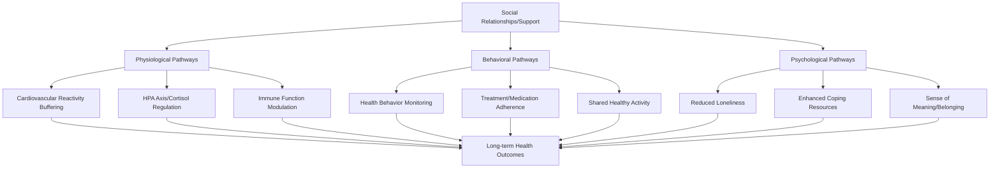

## Social Support and Health Outcomes

### Overview

Social support and health outcomes research examines the well-documented association between social relationships and physical and mental health across the lifespan. This applied social psychology literature spans epidemiological findings on mortality risk, physiological mechanisms linking social relationships to biological stress systems, and theoretical models explaining how, and under what conditions, social connection confers health benefits.

### The Epidemiological Case for Social Support and Health

#### Foundational Findings

**Key Points**

- Large-scale epidemiological studies, beginning with foundational work such as the Alameda County Study in the 1970s, established that individuals with fewer social ties and lower social integration show significantly elevated mortality risk over follow-up periods, even after statistically controlling for baseline health status and other known risk factors.
- A highly influential meta-analysis by Holt-Lunstad and colleagues, synthesizing data across a very large number of prospective studies, found that the mortality risk associated with low social connection was comparable in magnitude to well-established risk factors such as smoking, and exceeded the risk associated with factors such as physical inactivity and obesity.
- [Inference] This body of findings is generally considered among the more robust in social psychology and health research, given its replication across numerous large prospective cohort studies, diverse populations, and multiple decades, though as with all epidemiological research, establishing precise causal mechanisms (as opposed to robust correlational association) requires converging evidence from experimental and physiological research discussed below.

#### Distinguishing Social Integration, Network Size, and Perceived Support

**Key Points**

- **Social integration**: the degree of participation across a broad range of social relationships and roles (e.g., marriage, friendships, organizational memberships, community involvement), typically measured via a composite social network index.
- **Structural social support**: more specific measures of social network size, density, and composition.
- **Functional/perceived social support**: an individual's subjective sense of having available, adequate support if needed, which as noted in the stress and coping material, tends to show stronger and more consistent associations with health and wellbeing outcomes than purely structural network measures.
- [Inference] The relatively stronger predictive power of perceived support over structural network measures suggests that the subjective experience of support availability, rather than support quantity alone, may be a more proximal determinant of health-relevant outcomes, though structural and functional support measures are also correlated with one another and are not fully independent constructs.

### Physiological Mechanisms Linking Social Support and Health

#### Cardiovascular and HPA Axis Pathways

**Key Points**

- Social support has been associated in various experimental and observational studies with more favorable cardiovascular reactivity to acute stressors, including reduced blood pressure and heart rate reactivity during standardized social stress paradigms (such as the Trier Social Stress Test, introduced in the social neuroscience methods material) when support is present relative to when it is absent.
- Cortisol reactivity to social stressors has similarly been associated with social support availability in several studies, with the presence of a supportive companion during a stress task associated with attenuated cortisol response relative to facing the stressor alone, consistent with the broader HPA axis material covered previously.
- [Unverified] The precise boundary conditions determining when social support attenuates versus fails to attenuate physiological stress reactivity (e.g., relationship quality, type of support provided, perceived versus actual availability) remain an active area of refinement within this literature, since not all studies find consistent buffering effects, and the effectiveness of support appears to depend on contextual and relational factors rather than being a uniform effect of mere social presence.

#### Immune Function

**Key Points**

- Social isolation and low perceived social support have been associated in various studies with altered immune function, including in some research reduced antibody response to vaccination and altered inflammatory marker profiles, consistent with a broader psychoneuroimmunology framework linking psychosocial factors to immune system regulation.
- [Inference] These immune-related findings are generally interpreted as one plausible physiological pathway linking chronic social isolation to elevated long-term disease risk, complementing the cardiovascular and HPA axis pathways, though isolating the independent contribution of immune pathways from other correlated physiological and behavioral pathways (discussed below) in explaining overall mortality risk remains methodologically challenging.

#### Health Behavior Pathways

**Key Points**

- Social relationships have been shown in various studies to influence health-relevant behaviors, including medication adherence, engagement in physical activity, smoking and alcohol use, and healthcare-seeking behavior, plausibly through mechanisms including social monitoring, encouragement, shared activity participation, and social norm influence.
- [Inference] This behavioral pathway is generally considered by researchers to be an important, and in some analyses substantial, contributor to the overall social support-health association, operating alongside rather than instead of the more direct physiological pathways described above, since social relationships can plausibly influence health outcomes both through modulating stress physiology directly and through shaping the health behaviors that themselves influence disease risk.

### Theoretical Models

#### Stress-Buffering Versus Main Effect Models

As introduced in the stress and coping material, the stress-buffering model proposes social support is protective particularly under high-stress conditions, while the main effect model proposes broad benefits regardless of current stress level; both models have received empirical support depending on the specific support measure and outcome examined, and are generally treated as complementary rather than mutually exclusive within the health outcomes literature specifically.

#### Loneliness as a Distinct Construct

**Key Points**

- Loneliness, the subjective distress arising from a perceived discrepancy between desired and actual social connection, is conceptually and empirically distinct from objective social isolation; individuals can be objectively socially isolated without feeling lonely, and conversely can feel lonely despite substantial objective social contact.
- Loneliness has been independently associated with elevated mortality risk and adverse cardiovascular, immune, and mental health outcomes in various studies, with some researchers arguing loneliness represents a more proximal psychological risk factor than objective isolation alone, consistent with the broader pattern favoring perceived over structural support measures.
- [Unverified] The relative independent predictive contribution of loneliness versus objective social isolation, when both are measured and modeled simultaneously, varies across specific studies and outcome measures, and the field has not fully resolved the precise degree of overlap versus independence between these two related but distinct constructs.

### Diagram: Pathways from Social Support to Health Outcomes

### Diagram: Isolation vs. Loneliness Distinction (svg_diagram)

<svg xmlns="http://www.w3.org/2000/svg" viewBox="0 0 640 340">
<text x="320" y="26" text-anchor="middle" font-size="16" font-weight="bold" fill="#222">Objective Isolation vs. Subjective Loneliness (svg_diagram)</text>
<line x1="320" y1="60" x2="320" y2="300" stroke="#999" stroke-width="1" stroke-dasharray="4,4" />
<line x1="60" y1="180" x2="580" y2="180" stroke="#999" stroke-width="1" stroke-dasharray="4,4" />

<text x="150" y="55" text-anchor="middle" font-size="11" fill="#555">Low Isolation</text>

<text x="490" y="55" text-anchor="middle" font-size="11" fill="#555">High Isolation</text>

<text x="45" y="120" text-anchor="middle" font-size="11" fill="#555" transform="rotate(-90 45 120)">Low Loneliness</text>

<text x="45" y="270" text-anchor="middle" font-size="11" fill="#555" transform="rotate(-90 45 270)">High Loneliness</text>

<rect x="60" y="60" width="260" height="120" fill="#d5f5e3" stroke="#1e8449" stroke-width="1.5" />
<text x="190" y="125" text-anchor="middle" font-size="12" fill="#186a3b">Well-connected,</text>
<text x="190" y="143" text-anchor="middle" font-size="12" fill="#186a3b">socially satisfied</text>
<rect x="320" y="60" width="260" height="120" fill="#fdebd0" stroke="#b9770e" stroke-width="1.5" />
<text x="450" y="115" text-anchor="middle" font-size="12" fill="#7e5109">Isolated but not</text>
<text x="450" y="133" text-anchor="middle" font-size="12" fill="#7e5109">lonely (content</text>
<text x="450" y="151" text-anchor="middle" font-size="12" fill="#7e5109">with solitude)</text>
<rect x="60" y="180" width="260" height="120" fill="#fadbd8" stroke="#943126" stroke-width="1.5" />
<text x="190" y="235" text-anchor="middle" font-size="12" fill="#78281f">Socially connected</text>
<text x="190" y="253" text-anchor="middle" font-size="12" fill="#78281f">but lonely</text>
<text x="190" y="271" text-anchor="middle" font-size="12" fill="#78281f">(unmet needs)</text>
<rect x="320" y="180" width="260" height="120" fill="#f5b7b1" stroke="#78281f" stroke-width="1.5" />
<text x="450" y="235" text-anchor="middle" font-size="12" fill="#78281f">Isolated and lonely</text>
<text x="450" y="253" text-anchor="middle" font-size="12" fill="#78281f">(highest documented</text>
<text x="450" y="271" text-anchor="middle" font-size="12" fill="#78281f">risk profile)</text>
</svg>

### Special Populations and Contexts

**Key Points**

- Marital and romantic relationship quality has been studied extensively as a specific form of social support relevant to health outcomes, with relationship quality (not merely marital status alone) showing associations with cardiovascular and immune outcomes in various studies, and conflictual or low-quality relationships in some studies associated with worse outcomes than being unpartnered.
- Caregiver populations (e.g., those caring for a chronically ill or cognitively impaired family member) have been studied specifically for the interaction between high chronic stress exposure and social support availability, with caregiver social support access associated with reduced caregiver burden and improved caregiver health outcomes in various studies, directly applying the stress-buffering model to a clinically significant population.
- Older adult populations have received substantial research attention given documented risk of increasing social isolation with age (due to factors such as bereavement, retirement, and mobility limitations), motivating numerous public health and community intervention efforts targeting social connection specifically in aging populations.

### Public Health and Intervention Implications

**Key Points**

- Given the epidemiological magnitude of documented social isolation and loneliness health risks, several public health bodies and researchers have proposed treating social connection as a public health priority comparable to more traditionally recognized risk factors such as smoking or physical inactivity.
- Intervention approaches have included structured social support programs, community-based social engagement initiatives, and, more recently, digital and telehealth-based connection interventions, though [Unverified] the comparative long-term effectiveness of different intervention modalities in producing durable increases in perceived support and downstream health benefits remains an active area of ongoing research rather than a fully settled evidence base.
- [Inference] Given the distinction between objective isolation and subjective loneliness discussed above, researchers increasingly emphasize that interventions should be designed with attention to relationship quality and subjective adequacy of support, rather than focusing solely on increasing objective contact frequency or network size, since simply increasing social contact without addressing its perceived quality or adequacy may be insufficient to produce the psychological and physiological benefits documented in the broader literature.

### Conclusion

Social support and health outcomes research documents a robust, epidemiologically substantial association between social connection and both physical and mental health, with meta-analytic evidence indicating mortality risk from low social connection comparable in magnitude to established risk factors such as smoking. This association is plausibly explained through converging physiological pathways (cardiovascular, HPA axis, and immune function), behavioral pathways (health behavior influence), and psychological pathways (reduced loneliness, enhanced coping), consistent with both stress-buffering and main effect theoretical models depending on the specific support measure and outcome examined. The important distinction between objective social isolation and subjective loneliness underscores that support quality and perceived adequacy, not merely social contact quantity, are central to understanding and intervening on this well-established health determinant.

**Related Topics**

- Loneliness as a distinct psychological and health construct
- Stress-buffering and main effect models of social support (stress and coping topic)
- Psychoneuroimmunology and immune-psychosocial pathways
- Marital quality and cardiovascular health research
- Caregiver burden and psychosocial intervention design
- Alameda County Study and foundational social epidemiology
- Trier Social Stress Test and support-buffered cortisol reactivity
- Social prescribing and community-based health interventions
- Aging, retirement, and late-life social network change
- Digital and telehealth approaches to social connection interventions