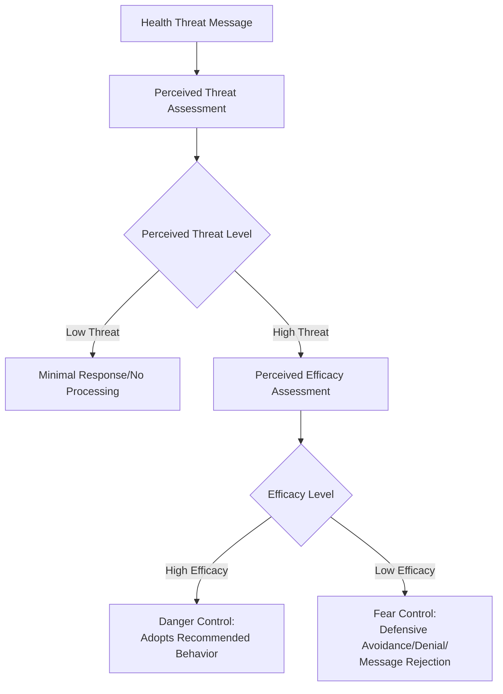

## Health Behavior Change and Persuasion Campaigns

### Overview

Health behavior change and persuasion campaigns apply core social psychological principles of attitude formation, persuasion, and social influence to public health goals such as reducing smoking, increasing vaccination uptake, promoting healthy eating, and encouraging preventive screening. This applied domain draws on established theoretical models of health behavior alongside general persuasion research, while contending with the practical and ethical challenges specific to large-scale public communication.

### Theoretical Models of Health Behavior

#### The Health Belief Model

The Health Belief Model, among the earliest and most widely applied frameworks in this domain, proposes that health-related behavior is a function of several belief dimensions regarding a health threat and the recommended behavior.

**Key Points**

- **Perceived susceptibility**: the individual's belief regarding their personal risk of experiencing the health threat.
- **Perceived severity**: the individual's belief regarding how serious the consequences of the health threat would be.
- **Perceived benefits**: the individual's belief regarding the effectiveness of the recommended action in reducing the threat.
- **Perceived barriers**: the individual's belief regarding the costs, inconvenience, or obstacles associated with taking the recommended action.
- **Cues to action**: external or internal prompts that trigger engagement in the health behavior (e.g., a symptom, a media campaign, a reminder from a healthcare provider).
- **Self-efficacy** (added in later revisions of the model): the individual's confidence in their own ability to successfully perform the recommended behavior.
- [Inference] The Health Belief Model has demonstrated reasonably consistent, though generally modest-to-moderate, predictive validity for health behavior across numerous applied studies, with perceived barriers and self-efficacy often showing somewhat stronger and more consistent associations with actual behavior than perceived susceptibility or severity alone.

#### The Theory of Planned Behavior

**Key Points**

- The Theory of Planned Behavior, extending the earlier Theory of Reasoned Action, proposes that behavioral intention (the most proximal predictor of actual behavior) is determined by three components: **attitude toward the behavior**, **subjective norms** (perceived social pressure to perform or not perform the behavior), and **perceived behavioral control** (perceived ease or difficulty of performing the behavior, conceptually related to self-efficacy).
- This model has been applied extensively across health behavior domains including exercise, dietary behavior, substance use, and screening uptake, generally showing moderate predictive validity for behavioral intention, though the intention-behavior gap (the well-documented finding that stated intentions do not always translate into actual behavior) represents a persistent limitation noted across applications of this model.
- [Inference] The intention-behavior gap has motivated substantial subsequent research into implementation intentions and related strategies (discussed below) specifically designed to help bridge the documented gap between intention formation and behavioral follow-through.

#### The Transtheoretical Model (Stages of Change)

**Key Points**

- The Transtheoretical Model proposes that behavior change unfolds through a sequence of stages: **precontemplation** (no current intention to change), **contemplation** (considering change), **preparation** (intending to act soon, sometimes with initial small steps taken), **action** (actively engaging in the new behavior), and **maintenance** (sustaining the behavior over time), with relapse treated as a common, non-linear part of the process rather than simple failure.
- This model has informed the design of "stage-matched" interventions, which tailor persuasive messaging and support strategies to an individual's current stage rather than applying a uniform message regardless of readiness (e.g., providing information to precontemplators versus providing concrete action-planning support to those in preparation).
- [Unverified] The empirical validity of the Transtheoretical Model's discrete stage structure, as opposed to a more continuous readiness dimension, has been questioned in some methodological critiques, and evidence for the superiority of stage-matched interventions over well-designed non-staged interventions has been mixed across specific studies and health behavior domains.

### Persuasion Principles Applied to Health Messaging

#### Fear Appeals and the Extended Parallel Process Model

**Key Points**

- Fear appeals, messages that emphasize the severity and likelihood of a health threat, have a long history in health campaign design, but research has consistently shown their effectiveness depends critically on whether the message also conveys high perceived efficacy (both response efficacy and self-efficacy) for the recommended action.
- The Extended Parallel Process Model proposes that when perceived threat is high but perceived efficacy is low, individuals are more likely to engage in defensive avoidance, denial, or message rejection (fear control) rather than adopting the recommended behavior (danger control), meaning poorly designed high-fear, low-efficacy messages can backfire relative to no message at all or a more efficacy-focused message.
- [Inference] This finding has substantially shaped contemporary health campaign design practice, generally cautioning against fear-heavy messaging unless paired with clear, actionable, and credible efficacy information, though the precise optimal balance of threat and efficacy content continues to be refined across different health behaviors, populations, and cultural contexts.

#### Message Framing: Gain-Framed Versus Loss-Framed Appeals

**Key Points**

- Gain-framed messages emphasize the benefits of engaging in a health behavior (e.g., "screening can help detect problems early"), while loss-framed messages emphasize the costs of not engaging in the behavior (e.g., "failing to screen can mean missing early detection").
- Research applying prospect theory to health messaging has found that message framing effectiveness varies by behavior type: gain-framed messages have generally shown somewhat greater effectiveness for prevention behaviors (e.g., sunscreen use, exercise), while loss-framed messages have generally shown somewhat greater effectiveness for detection behaviors involving uncertainty (e.g., cancer screening), consistent with the risk-seeking and risk-averse asymmetries predicted by prospect theory under conditions of uncertain versus certain outcomes.
- [Unverified] While this general framing-by-behavior-type pattern has received meta-analytic support, effect sizes are generally modest, and framing effects have shown some inconsistency across specific studies, populations, and cultural contexts, suggesting framing is one contributing factor among several rather than a uniformly powerful lever.

#### Social Norms Messaging

**Key Points**

- Descriptive norm messaging (communicating what most people actually do, e.g., "most students drink less than you might think") has been used extensively in health campaigns, particularly around alcohol use, given research suggesting individuals frequently overestimate the prevalence of risky peer behavior, and correcting this misperception can shift both attitudes and behavior.
- Injunctive norm messaging (communicating what is socially approved or disapproved) has been shown in some studies to be effective, though research, notably by Cialdini and colleagues, has cautioned that poorly designed normative messages highlighting the prevalence of an undesirable behavior (even while condemning it) can inadvertently increase that behavior by conveying that it is common, underscoring the importance of careful message design that avoids unintentionally normalizing the problem behavior.

### Implementation Intentions and Behavioral Follow-Through

**Key Points**

- Implementation intentions, a strategy developed by Peter Gollwitzer, involve forming specific "if-then" plans linking a situational cue to a specific intended action (e.g., "if it is Monday morning, then I will go for a run before work"), designed to help bridge the intention-behavior gap noted above.
- Meta-analytic research has found implementation intentions to produce a reliable, moderate positive effect on behavioral follow-through across numerous health behavior domains, including exercise, healthy eating, and medical screening attendance, making this among the more consistently supported behavior-change techniques within the applied health psychology literature.

### Diagram: Extended Parallel Process Model Logic

### Diagram: Stages of Change Model (svg_diagram)

<svg xmlns="http://www.w3.org/2000/svg" viewBox="0 0 700 300">
<text x="350" y="26" text-anchor="middle" font-size="16" font-weight="bold" fill="#222">Transtheoretical Model - Stages of Change (svg_diagram)</text>
<rect x="20" y="120" width="120" height="70" rx="8" fill="#fadbd8" stroke="#943126" stroke-width="2" />
<text x="80" y="160" text-anchor="middle" font-size="11" fill="#78281f">Precontemplation</text>
<path d="M140,155 L165,155" stroke="#333" stroke-width="2" marker-end="url(#arr)" />
<rect x="170" y="120" width="120" height="70" rx="8" fill="#fdebd0" stroke="#b9770e" stroke-width="2" />
<text x="230" y="160" text-anchor="middle" font-size="11" fill="#7e5109">Contemplation</text>
<path d="M290,155 L315,155" stroke="#333" stroke-width="2" marker-end="url(#arr)" />
<rect x="320" y="120" width="120" height="70" rx="8" fill="#f9e79f" stroke="#7d6608" stroke-width="2" />
<text x="380" y="160" text-anchor="middle" font-size="11" fill="#7d6608">Preparation</text>
<path d="M440,155 L465,155" stroke="#333" stroke-width="2" marker-end="url(#arr)" />
<rect x="470" y="120" width="110" height="70" rx="8" fill="#d5f5e3" stroke="#1e8449" stroke-width="2" />
<text x="525" y="160" text-anchor="middle" font-size="11" fill="#186a3b">Action</text>
<path d="M580,155 L605,155" stroke="#333" stroke-width="2" marker-end="url(#arr)" />
<rect x="610" y="120" width="80" height="70" rx="8" fill="#aed6f1" stroke="#1a5276" stroke-width="2" />
<text x="650" y="160" text-anchor="middle" font-size="10" fill="#1a5276">Maintenance</text>
<path d="M525,190 C525,230 230,230 230,190" stroke="#943126" stroke-width="1.5" stroke-dasharray="4,3" fill="none" marker-end="url(#arr2)" />
<text x="380" y="250" text-anchor="middle" font-size="10" fill="#943126">Relapse: non-linear return to earlier stage</text>
</svg>

### Vaccine Hesitancy as an Applied Case

**Key Points**

- Vaccine hesitancy research has applied several of the frameworks above, including Health Belief Model constructs (perceived susceptibility to and severity of vaccine-preventable disease, perceived benefits and barriers of vaccination) and social norms messaging, alongside research specifically addressing misinformation correction and source credibility.
- Research on misinformation correction in health contexts has documented the challenge of the "continued influence effect," in which corrected misinformation can continue to influence beliefs and behavior even after explicit correction is received and acknowledged, motivating research into more effective correction techniques such as providing an alternative causal explanation rather than simply negating the false claim.
- [Unverified] The relative effectiveness of different vaccine hesitancy intervention approaches (motivational interviewing-based clinical conversations, mass media normative messaging, misinformation correction techniques) varies considerably across specific populations, cultural contexts, and the specific underlying reasons for hesitancy, and no single intervention approach has been established as uniformly superior across all vaccine hesitancy contexts.

### Ethical Considerations in Health Persuasion Campaigns

**Key Points**

- Health persuasion campaigns raise distinct ethical considerations relative to commercial persuasion, including questions about appropriate use of fear-based appeals, the boundary between persuasion and manipulation, respect for individual autonomy in health decision-making, and equity concerns regarding whether campaign messaging and channels reach and resonate across diverse populations rather than disproportionately benefiting already-advantaged groups.
- [Inference] Applied health psychologists and public health communicators generally treat transparency, efficacy-focused (rather than pure fear-based) messaging, and community-informed campaign design as best practices for navigating these ethical considerations, though the field continues to grapple with tensions between persuasive effectiveness and respect for individual autonomy, particularly in politically or culturally contested health behavior domains.

### Conclusion

Health behavior change and persuasion campaigns integrate established social psychological models — the Health Belief Model, Theory of Planned Behavior, and Transtheoretical Model — with core persuasion research on fear appeals, message framing, and social norms to inform the design of public health communication. Implementation intentions represent one of the more consistently supported specific techniques for bridging the well-documented gap between behavioral intention and actual follow-through. Effective campaign design in this domain requires careful attention to pairing threat information with credible efficacy messaging, selecting appropriate message framing for the specific behavior type, and navigating the ethical tensions inherent in large-scale efforts to influence health-related decision-making.

**Related Topics**

- Health Belief Model and its component constructs
- Theory of Planned Behavior and the intention-behavior gap
- Transtheoretical Model and stage-matched intervention design
- Extended Parallel Process Model and fear appeal research
- Prospect theory and gain/loss message framing
- Implementation intentions (Gollwitzer) and behavioral follow-through
- Social norms marketing and misperception correction
- Vaccine hesitancy and misinformation correction research
- Continued influence effect and belief correction techniques
- Persuasion and attitude change (core social psychology foundations)