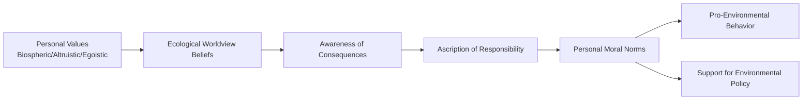

## Pro-Environmental Behavior and Conservation Psychology

### Overview

Pro-environmental behavior and conservation psychology examine the psychological determinants of behaviors that reduce environmental harm and support conservation, along with the design and effectiveness of interventions intended to promote such behaviors. This applied domain draws on core social psychological theory including social norms, attitude-behavior consistency, cognitive dissonance, and behavioral economics, while addressing the distinctive challenges posed by environmental problems: diffuse and delayed consequences, collective action dynamics, and frequent tension between individual convenience and collective benefit.

### The Value-Belief-Norm Theory

#### Theoretical Structure

Value-Belief-Norm (VBN) theory, developed primarily by Paul Stern and colleagues, proposes a causal chain linking relatively stable personal values through beliefs to personal moral norms, which in turn predict pro-environmental behavior and support for environmental policy.

**Key Points**

- The causal chain proceeds from **values** (biospheric, altruistic, or egoistic orientations) through **ecological worldview beliefs** (e.g., acceptance of an ecological paradigm regarding human-environment interdependence) to **awareness of consequences** (belief that environmental conditions threaten valued objects), then to **ascription of responsibility** (belief that one's own action can help reduce the threat), culminating in **personal norms** (felt moral obligation to act), which directly predict behavior.
- **Biospheric values** (concern for the biosphere and ecosystems as inherently important, independent of human benefit) have shown particularly consistent associations with pro-environmental behavior and policy support across numerous studies, generally more strongly than egoistic (self-interest-based) value orientations.
- [Inference] VBN theory is widely regarded as one of the more empirically supported frameworks in environmental psychology, though critics note that the strength of the value-to-behavior pathway, while statistically significant across many studies, still leaves considerable behavioral variance unexplained, consistent with the broader attitude-behavior gap discussed below.

### The Attitude-Behavior Gap in Environmental Contexts

#### Documenting the Gap

**Key Points**

- A consistent finding across environmental psychology is that self-reported pro-environmental attitudes and intentions correlate only modestly with actual pro-environmental behavior, a pattern sometimes termed the "value-action gap" specifically within this literature.
- Structural and contextual barriers, including cost, convenience, habit strength, and infrastructure availability (e.g., recycling facility access, public transit availability), have been identified across numerous studies as significant moderators limiting the translation of positive environmental attitudes into corresponding behavior.
- [Inference] This gap has motivated a broader theoretical shift within conservation psychology away from purely attitude-focused intervention approaches (e.g., information and awareness campaigns alone) toward approaches that also directly target structural barriers, habits, and choice architecture, discussed further below.

### Social Norms and Environmental Behavior

#### Descriptive and Injunctive Norms

Consistent with Cialdini's broader focus theory of normative conduct, introduced elsewhere in social influence research, environmental behavior has been shown to be substantially influenced by both descriptive norms (perceptions of what others actually do) and injunctive norms (perceptions of what others approve or disapprove of).

**Key Points**

- Normative social comparison feedback interventions, most notably home energy reports comparing a household's energy use to that of similar neighboring households, have been shown in large-scale field studies (including work associated with the Opower energy report program) to produce measurable, though generally modest in absolute magnitude, reductions in household energy consumption.
- Research on hotel towel reuse programs has demonstrated that descriptive norm messaging referencing other guests' behavior (e.g., "the majority of guests in this room reuse their towels") produces greater behavioral compliance than generic environmental appeal messaging alone, illustrating the effectiveness of specific, locally relevant descriptive norm framing over general environmental appeals.
- [Inference] A notable methodological caution from this literature, echoing the social norms messaging findings in the health behavior change material, is that normative messages must be carefully designed to avoid inadvertently signaling that an undesirable behavior is common, since doing so, even in a disapproving frame, can risk normalizing rather than reducing the target behavior.

### Cognitive Dissonance and Environmental Behavior Change

**Key Points**

- Cognitive dissonance-based interventions, in which individuals are prompted to publicly advocate for pro-environmental behavior (e.g., signing a pledge or making a public commitment) and are then reminded of instances of their own past non-compliant behavior, have been used to induce dissonance-driven behavior change in several studies, drawing on the classic induced-hypocrisy paradigm from dissonance research.
- Public commitment strategies more broadly, in which individuals make an explicit, often written or verbal, commitment to engage in a pro-environmental behavior, have shown modest but fairly consistent positive effects on subsequent behavior across various studies, consistent with the broader social psychological literature on commitment and consistency effects.

### Behavioral Economics and Choice Architecture Approaches

#### Defaults and Choice Architecture

**Key Points**

- Default option settings have been shown to substantially influence environmental behavior outcomes; for example, studies of green energy program enrollment have found that setting a pro-environmental option (e.g., renewable energy sourcing) as the default, with an opt-out rather than opt-in structure, dramatically increases participation rates relative to opt-in framing, consistent with the broader behavioral economics literature on default effects and status quo bias.
- This approach reflects a "nudge"-based intervention strategy, drawing on behavioral economics principles to design choice environments that make pro-environmental options the path of least resistance, without eliminating individual choice or relying primarily on attitude or value change.
- [Unverified] While default-based nudges have shown some of the larger and more consistent effect sizes within the pro-environmental behavior intervention literature, ethical questions regarding the appropriate use of default-setting to influence behavior, along with questions about the durability of nudge-induced behavior change once a default is altered or removed, remain actively debated within both the academic and policy literature.

#### Feedback and Habit Disruption

**Key Points**

- Real-time or near-real-time feedback on resource consumption (e.g., in-home energy displays, smart water meters) has been shown in various studies to produce measurable reductions in consumption, plausibly by disrupting the habitual, low-awareness nature of much everyday resource use and increasing conscious behavioral monitoring.
- [Inference] Feedback-based interventions are generally understood to be particularly effective for behaviors that are otherwise largely automatic or habitual (e.g., routine appliance use, water use during daily tasks), since increased salience and monitoring can interrupt automatic behavioral scripts in ways that pure attitude-based appeals are less able to achieve.

### The Commons Dilemma and Collective Action

**Key Points**

- Many environmental problems are structured as social dilemmas, specifically resembling the tragedy of the commons, in which individually rational short-term choices (e.g., continued high resource consumption) produce collectively harmful long-term outcomes if widely adopted, creating a structural tension between individual and collective interest.
- Research on commons dilemma resolution, drawing partly on Elinor Ostrom's influential work on collective resource governance, has identified factors including communication among resource users, monitoring and enforcement mechanisms, and the development of shared group identity as supporting more sustainable collective resource management outcomes relative to purely individually incentivized approaches.
- [Inference] This collective action framing is increasingly emphasized within conservation psychology as complementary to individual-behavior-change approaches, on the reasoning that large-scale environmental challenges such as climate change require coordinated collective and policy-level responses in addition to, rather than solely relying upon, aggregated individual behavior change.

### Diagram: Value-Belief-Norm Theory Causal Chain

### Diagram: Intervention Approaches Across the Attitude-Behavior Gap (svg_diagram)

<svg xmlns="http://www.w3.org/2000/svg" viewBox="0 0 700 380">
<text x="350" y="26" text-anchor="middle" font-size="16" font-weight="bold" fill="#222">Closing the Attitude-Behavior Gap (svg_diagram)</text>
<rect x="30" y="60" width="180" height="280" rx="10" fill="#d6eaf8" stroke="#2471a3" stroke-width="2" />
<text x="120" y="90" text-anchor="middle" font-size="13" font-weight="bold" fill="#1a5276">Attitude-Focused</text>
<text x="120" y="130" text-anchor="middle" font-size="11" fill="#333">Information campaigns</text>
<text x="120" y="155" text-anchor="middle" font-size="11" fill="#333">Value appeals</text>
<text x="120" y="180" text-anchor="middle" font-size="11" fill="#333">Awareness raising</text>
<text x="120" y="310" text-anchor="middle" font-size="10" fill="#555">Limited by</text>
<text x="120" y="326" text-anchor="middle" font-size="10" fill="#555">attitude-behavior gap</text>
<rect x="260" y="60" width="180" height="280" rx="10" fill="#d5f5e3" stroke="#1e8449" stroke-width="2" />
<text x="350" y="90" text-anchor="middle" font-size="13" font-weight="bold" fill="#186a3b">Norm-Based</text>
<text x="350" y="130" text-anchor="middle" font-size="11" fill="#333">Descriptive norm</text>
<text x="350" y="150" text-anchor="middle" font-size="11" fill="#333">comparison feedback</text>
<text x="350" y="180" text-anchor="middle" font-size="11" fill="#333">Public commitment</text>
<text x="350" y="200" text-anchor="middle" font-size="11" fill="#333">Dissonance induction</text>
<text x="350" y="310" text-anchor="middle" font-size="10" fill="#555">Modest, consistent</text>
<text x="350" y="326" text-anchor="middle" font-size="10" fill="#555">effects</text>
<rect x="490" y="60" width="180" height="280" rx="10" fill="#fdebd0" stroke="#b9770e" stroke-width="2" />
<text x="580" y="90" text-anchor="middle" font-size="13" font-weight="bold" fill="#7e5109">Structural/Choice</text>
<text x="580" y="110" text-anchor="middle" font-size="13" font-weight="bold" fill="#7e5109">Architecture</text>
<text x="580" y="150" text-anchor="middle" font-size="11" fill="#333">Default option setting</text>
<text x="580" y="175" text-anchor="middle" font-size="11" fill="#333">Real-time feedback</text>
<text x="580" y="200" text-anchor="middle" font-size="11" fill="#333">Infrastructure change</text>
<text x="580" y="310" text-anchor="middle" font-size="10" fill="#555">Often largest</text>
<text x="580" y="326" text-anchor="middle" font-size="10" fill="#555">effect sizes</text>
</svg>

### Climate Change Communication as a Specialized Subdomain

**Key Points**

- Climate change communication research has examined the specific challenges of communicating a threat characterized by psychological distance (perceived as temporally, geographically, or socially remote), probabilistic rather than certain outcomes, and complex scientific evidence, factors that have been argued in various studies to reduce the sense of urgency and personal relevance compared to more immediate, concrete environmental threats.
- Political polarization around climate change has been extensively documented as a significant communication barrier in some national contexts, with research suggesting that message source credibility and alignment with a recipient's existing political and social identity can influence receptivity to climate information independent of the scientific content itself, consistent with broader motivated reasoning and identity-protective cognition research.
- [Unverified] The relative effectiveness of specific climate communication strategies (e.g., emphasizing local/concrete impacts versus global/abstract impacts, using messengers matched to a specific political or social identity group) varies across studies, populations, and national contexts, and no single climate communication strategy has been established as uniformly effective across all audiences and settings.

### Conclusion

Pro-environmental behavior and conservation psychology integrate value-based frameworks such as VBN theory, social norms research, cognitive dissonance and commitment strategies, and behavioral economics-informed choice architecture approaches to understand and promote environmentally beneficial behavior. A persistent theme across this literature is the attitude-behavior gap, which has driven a broader shift in intervention design from purely informational and attitude-focused campaigns toward approaches that directly address structural barriers, habitual behavior, and default choice settings, often yielding more consistent and substantial behavioral effects. Given the collective-action structure of many environmental problems, conservation psychology increasingly emphasizes the complementary importance of policy-level and collective interventions alongside individual behavior change efforts.

**Related Topics**

- Value-Belief-Norm theory and biospheric value orientations
- Tragedy of the commons and Ostrom's collective resource governance research
- Focus theory of normative conduct (Cialdini) applied to conservation
- Nudge theory and default-option choice architecture
- Cognitive dissonance and induced-hypocrisy behavior change paradigms
- Climate change communication and psychological distance
- Motivated reasoning and identity-protective cognition in science communication
- Habit formation and disruption in everyday resource consumption
- Opower-style normative home energy report interventions
- Health behavior change and persuasion campaigns (related applied topic)