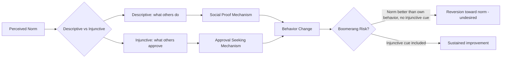

## Social Norms Interventions for Health and Sustainability

### Overview

Social norms interventions are behavior-change strategies that leverage people's perceptions of what others do (descriptive norms) or approve of (injunctive norms) to shift health and environmental behaviors. Rooted in social psychology research on conformity, social proof, and normative influence, these interventions correct misperceived norms or make existing positive norms more salient, rather than relying primarily on information, persuasion, or incentives.

### Theoretical Foundations

**Descriptive vs. Injunctive Norms**

- Descriptive norms: perceptions of what most people actually do (e.g., "80% of guests reuse their towels")
- Injunctive norms: perceptions of what most people approve or disapprove of (e.g., "Most people disapprove of littering")
- Cialdini, Reno, and Kallgren's (1990) focus theory of normative conduct established that descriptive and injunctive norms operate through distinct psychological pathways and can conflict; an intervention is most effective when both norms point in the same direction.

**Normative Social Behavior Theory**

Rimal and Real (2005) extended norms theory by incorporating moderators: outcome expectations, group identity, and perceived similarity to the referent group. Norm messages are more persuasive when the reference group is perceived as similar and relevant to the self.

**The Boomerang Effect**

A critical failure mode: presenting a descriptive norm that is *better* than a person's current behavior can inadvertently license worse behavior (e.g., a low-energy-use household increasing consumption after learning their usage is below average). Schultz et al. (2007) demonstrated this and showed it can be neutralized by pairing descriptive norms with an injunctive signal (e.g., an emoticon indicating approval/disapproval).

### Mechanisms of Change

1. **Misperception correction** — People frequently overestimate the prevalence of undesirable behaviors (e.g., binge drinking, energy waste) and underestimate desirable ones. Correcting this gap ("most students drink less than you think") reduces the perceived license to engage in the behavior.
2. **Social proof** — Uncertainty about correct behavior increases reliance on others' actions as a heuristic cue, especially in ambiguous or novel situations.
3. **Identity-relevant norming** — Norms tied to salient in-group identities (e.g., "Californians like you") produce stronger effects than generic or out-group norms.
4. **Dynamic norms** — Communicating that a behavior is *increasing* in prevalence (a trend, not just a static rate) can motivate early adopters and those wary of being outliers, per Sparkman and Walton (2017).

### Domains of Application

**Health**

- Alcohol use on college campuses: social norms marketing campaigns correcting overestimated peer drinking rates
- Binge eating and body image: injunctive norm correction in campus and clinical settings
- Vaccination uptake: provider-delivered norm messages ("most patients like you get vaccinated")
- Smoking cessation and tobacco control campaigns
- Handwashing and infection control in hospitals and public health messaging
- Physical activity promotion using peer comparison

**Sustainability and Environment**

- Home Energy Reports (HERs): the flagship large-scale application, pioneered commercially by Opower, comparing a household's energy use to that of ~100 similar neighbors
- Water conservation during droughts
- Towel/linen reuse in hotels (the original Goldstein, Cialdini & Griskevicius 2008 paradigm)
- Recycling and waste reduction
- Sustainable transportation choices (carpooling, public transit, cycling)
- Food choice and meat consumption reduction

### Case Study: Opower Home Energy Reports

**Key Points**

- Households receive a printed or digital report comparing their electricity/gas use to neighbors of similar home size and heating type
- Include a descriptive comparison ("You used 15% more energy than efficient neighbors") paired with an injunctive emoticon (smiley faces) to avoid the boomerang effect
- Allcott (2011) analyzed data across multiple utilities and found average reductions of approximately 2% in energy consumption, comparable in magnitude to a short-term price increase of 11–20%
- Effects show diminishing returns over repeated reports and some decay after discontinuation, though a persistent residual effect remains — consistent with partial habit formation [Inference: the precise decay/habit-formation split varies by study and utility population]

### Design Principles for Effective Norms Interventions

1. **Align descriptive and injunctive norms** — never present a descriptive norm without an approving/disapproving cue if the norm could be misread as permissive
2. **Specify the reference group** — narrower, more similar reference groups (neighbors, peers, same demographic) outperform vague or distant ones ("people in general")
3. **Make the norm concrete and vivid** — numeric comparisons and visual cues (graphs, emoticons) outperform abstract statements
4. **Avoid reinforcing the undesired norm** — messages like "Too many people still don't recycle" foreground the negative behavior as common, which can backfire; frame around the desired majority instead
5. **Leverage dynamic/trending norms** for behaviors that are not yet majority-adopted
6. **Combine with injunctive appeals from credible in-group sources** (community leaders, similar peers) rather than distant authorities

### Common Pitfalls

- **Boomerang effects** from unqualified descriptive norms
- **Reactance** in individuals who resist perceived social pressure or manipulation, particularly when norm messaging feels coercive
- **Norm fatigue** — repeated exposure diminishing novelty and impact
- **Cultural moderation** — effect sizes vary with individualism/collectivism; norms tend to exert stronger influence in more collectivistic cultural contexts [Inference: based on cross-cultural replications, though moderation strength is not fully settled across all behavior domains]
- **Ethical concerns** — norm interventions can be seen as manipulative if the underlying data is misrepresented or if used to nudge disadvantaged groups without transparency

### Methodological Notes

- Field experiments with randomized control groups are the standard for causal claims (e.g., Opower's staggered-rollout natural experiments)
- Effect sizes in meta-analyses of social norms interventions are generally small-to-moderate (Cohen's $d$ typically in the range of $d \approx 0.10$ to $0.30$ for behavioral outcomes), though highly context-dependent
- Publication and selection biases are a concern in the broader nudge literature; some large-scale replications (particularly in the "nudge" tradition, e.g., Mertens et al. 2022 meta-analysis) find smaller pooled effects than early influential studies suggested [Unverified: exact pooled effect estimates differ across meta-analyses and are still debated]

### Diagram: Normative Influence Pathway (svg_diagram)

### Example

A university sends first-year students a message: "73% of students on this campus have 4 or fewer drinks when they party" (descriptive, specific reference group) alongside "Most students think it's important to drink responsibly" (injunctive). This combination targets both the perceived behavioral norm and the perceived approval norm, reducing the risk that students underestimate peer moderation and overestimate peer approval of heavy drinking.

**Related Topics**

- Nudge theory and choice architecture
- Cognitive dissonance and behavior change
- Theory of planned behavior
- Persuasion and the elaboration likelihood model
- Community-based social marketing (McKenzie-Mohr)
- Field experiment design in applied social psychology
- Cross-cultural variation in conformity and normative influence