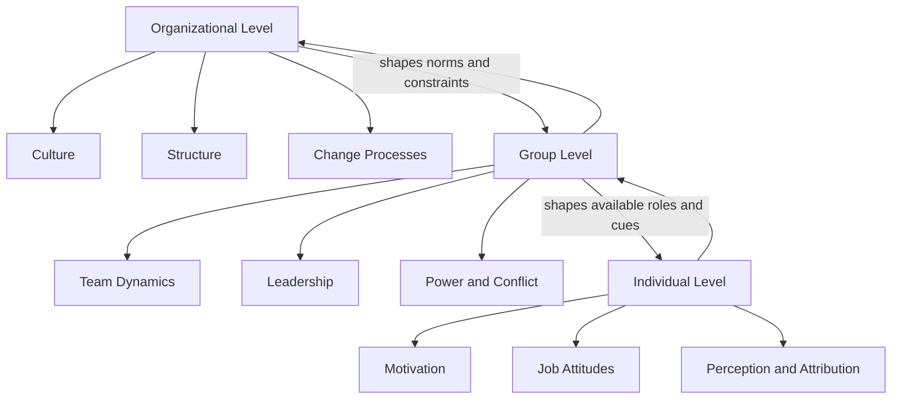

## Organizational Behavior and Workplace Dynamics

### Overview

Organizational behavior (OB) is the interdisciplinary study of how individuals, groups, and structures affect and are affected by behavior within organizations. Applied social psychology contributes theories of social influence, group processes, motivation, and interpersonal perception to explain phenomena such as leadership effectiveness, team performance, organizational culture, and employee well-being.

### Levels of Analysis

1. **Individual level** — personality, perception, attitudes, motivation, decision-making, job satisfaction
2. **Group level** — team dynamics, communication, conflict, power, leadership, group decision-making
3. **Organizational level** — culture, structure, change, organizational climate, systemic processes

### Individual-Level Foundations

**Job Attitudes**

- Job satisfaction: an affective/evaluative response to one's job, historically linked to the Job Descriptive Index and related to constructs like organizational commitment
- Organizational commitment: Meyer and Allen's (1991) three-component model — affective (want to stay), continuance (need to stay), normative (feel obligated to stay)
- Job involvement and psychological empowerment

**Motivation Theories**

- Maslow's hierarchy of needs (largely superseded empirically but retains heuristic value)
- Herzberg's two-factor theory: hygiene factors (prevent dissatisfaction) vs. motivators (drive satisfaction)
- Vroom's expectancy theory: motivation $= \text{Expectancy} \times \text{Instrumentality} \times \text{Valence}$
- Locke and Latham's goal-setting theory: specific, difficult goals produce higher performance than vague or easy goals, given feedback and commitment
- Self-determination theory (Deci & Ryan): intrinsic motivation flourishes when autonomy, competence, and relatedness needs are met

**Perception and Attribution in the Workplace**

- Fundamental attribution error in performance evaluation (overattributing coworker failure to disposition, underweighting situational factors)
- Halo effect and similar-to-me bias in hiring and appraisal
- Person-organization (P-O) fit and person-job (P-J) fit as predictors of retention and satisfaction

### Group-Level Dynamics

**Team Development**

- Tuckman's stages: forming, storming, norming, performing, adjourning
- Team cohesion and its curvilinear relationship with performance (excessive cohesion can produce groupthink)

**Groupthink**

Janis's (1972) model of groupthink identifies antecedent conditions (high cohesion, insulation, directive leadership, high stress) leading to symptoms (illusion of invulnerability, self-censorship, illusion of unanimity) and defective decision-making outcomes. Preventive structures include devil's advocacy, second-chance meetings, and outside expert consultation.

**Social Loafing and Process Losses**

- Social loafing: reduced individual effort in group settings, attenuated by identifiability of individual contribution, task meaningfulness, and group size
- Steiner's (1972) model: actual productivity = potential productivity − process losses (coordination and motivation losses)

**Power and Influence Structures**

- French and Raven's (1959) bases of power: legitimate, reward, coercive, expert, referent (later expanded to include informational power)
- Organizational politics and impression management tactics (ingratiation, self-promotion, exemplification)

**Conflict**

- Task conflict (disagreement over content) vs. relationship conflict (interpersonal friction) vs. process conflict (disagreement over workflow)
- Thomas-Kilmann conflict-handling modes: competing, collaborating, compromising, avoiding, accommodating

### Leadership

- **Trait and behavioral approaches**: Ohio State/Michigan studies distinguishing consideration (relationship-oriented) from initiating structure (task-oriented) behaviors
- **Contingency theories**: Fiedler's contingency model matching leader style to situational favorableness
- **Transformational vs. transactional leadership** (Bass): transformational leaders inspire via idealized influence, inspirational motivation, intellectual stimulation, and individualized consideration; transactional leadership relies on contingent reward and management-by-exception
- **Leader-Member Exchange (LMX) theory**: leaders develop differentiated relationships with subordinates (in-group vs. out-group), with in-group members receiving greater trust, resources, and latitude
- **Authentic and servant leadership**: contemporary models emphasizing self-awareness, ethical behavior, and follower-centered orientation

### Organizational Culture and Climate

- Schein's three-level model: artifacts (visible structures/processes), espoused values, and underlying basic assumptions
- Organizational climate: shared perceptions of policies, practices, and procedures, often measured as a more surface-level, malleable counterpart to the deeper construct of culture
- Person-culture fit and socialization processes (onboarding, mentorship, realistic job previews)

### Organizational Justice

- Distributive justice: perceived fairness of outcomes (often assessed via equity theory — comparing one's outcome/input ratio to a referent other's)
- Procedural justice: perceived fairness of the processes used to reach decisions
- Interactional justice: fairness of interpersonal treatment, subdivided into interpersonal justice (respect, dignity) and informational justice (explanations, transparency)
- Perceived injustice is a robust predictor of counterproductive work behavior, turnover intention, and reduced organizational citizenship behavior

### Organizational Citizenship Behavior (OCB) and Counterproductive Work Behavior (CWB)

- OCB: discretionary behavior benefiting the organization beyond formal role requirements (altruism, conscientiousness, civic virtue, sportsmanship, courtesy — Organ's taxonomy)
- CWB: intentional behavior harmful to the organization or its members (theft, sabotage, withdrawal, abuse toward coworkers)
- Both linked to perceived organizational support (POS) and psychological contract fulfillment/breach

### Stress, Burnout, and Well-Being

- Maslach's three-dimensional burnout model: emotional exhaustion, depersonalization/cynicism, reduced personal accomplishment
- Job Demands-Resources (JD-R) model: strain arises when job demands exceed available resources; resources buffer the demand-strain relationship
- Karasek's demand-control model: high demand combined with low control ("high strain jobs") predicts the greatest psychological and physiological strain

### Organizational Change

- Lewin's three-step model: unfreezing, changing, refreezing
- Kotter's eight-step model: establishing urgency, forming a coalition, developing vision, communicating vision, empowering action, generating short-term wins, consolidating gains, anchoring change in culture
- Resistance to change often stems from uncertainty, perceived threat to status/competence, and disrupted social networks rather than mere obstinacy

### Diagram: Levels of Organizational Behavior Analysis (svg_diagram)

### Example

A manufacturing firm experiencing high turnover conducts an OB diagnostic: employee surveys reveal low procedural justice scores (decisions are made without explanation) and low psychological empowerment. An intervention introducing structured feedback sessions (improving informational justice) and delegated decision authority (improving autonomy, per self-determination theory) is predicted to reduce turnover intention by addressing both justice perceptions and intrinsic motivation deficits.

**Related Topics**

- Organizational justice and psychological contracts
- Leadership styles and follower outcomes
- Groupthink and group decision-making pathologies
- Workplace stress, burnout, and the JD-R model
- Diversity, equity, and inclusion in organizational settings
- Person-environment fit theory
- Change management and resistance to organizational change