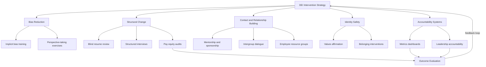

## Diversity, Equity, and Inclusion Interventions

### Overview

Diversity, equity, and inclusion (DEI) interventions are structured organizational and psychological strategies designed to reduce bias, increase representation, and improve outcomes for historically marginalized groups within institutions. Applied social psychology contributes theories of intergroup contact, implicit cognition, stereotype threat, and social identity to both the design and evaluation of these interventions.

### Conceptual Distinctions

- **Diversity**: the presence of variation across social identity dimensions (race, gender, age, disability, sexual orientation, socioeconomic background) within a group or organization
- **Equity**: fairness in processes and outcomes, often requiring differentiated (not identical) treatment to offset structural disadvantage, distinct from formal equality of treatment
- **Inclusion**: the degree to which individuals feel valued, respected, and able to fully participate, regardless of identity — diversity without inclusion can coexist with exclusionary climates

### Theoretical Foundations

**Intergroup Contact Theory**

Allport's (1954) contact hypothesis proposes that intergroup contact reduces prejudice under four conditions: equal status between groups, common goals, intergroup cooperation, and institutional support. Pettigrew and Tropp's (2006) meta-analysis of over 500 studies confirmed a reliable negative relationship between contact and prejudice, generalizing across contexts, though effect sizes are moderated by whether contact conditions are met.

**Social Identity Theory and Self-Categorization**

Tajfel and Turner's framework explains in-group favoritism and out-group bias as arising from the drive for positive social identity via group membership; interventions targeting superordinate/shared identities (recategorization) can reduce intergroup bias by shifting group boundaries.

**Implicit Bias and Dual-Process Models**

- Implicit associations (often measured via the Implicit Association Test) are theorized to reflect automatic, less controllable cognitive associations distinct from explicit, deliberately endorsed attitudes
- The predictive validity and malleability of implicit bias measures, and particularly their link to actual discriminatory behavior, remain actively debated in the literature [Unverified: meta-analytic estimates of the implicit-explicit and implicit-behavior correlations vary substantially across reviews, e.g., Oswald et al. 2013 vs. later re-analyses]

**Stereotype Threat**

Steele and Aronson's (1995) foundational work showed that awareness of a negative stereotype about one's group can impair performance in stereotype-relevant domains via increased cognitive load and anxiety. This has informed interventions such as values-affirmation exercises and reframing evaluative tasks as non-diagnostic of ability.

### Categories of DEI Interventions

**1. Bias-Reduction Training**

- Implicit bias training: workshops aiming to raise awareness of automatic associations
- Perspective-taking exercises: asking participants to imagine experiences from an out-group member's viewpoint
- Empathy-building through narrative and testimonial exposure

**2. Structural and Procedural Interventions**

- Blind/masked resume review to reduce identifiable-demographic bias in hiring screens
- Structured interviews with standardized questions and scoring rubrics (shown to have higher predictive validity and lower bias susceptibility than unstructured interviews)
- Diverse interview panels and diverse slate requirements
- Pay equity audits and transparent compensation bands

**3. Contact-Based Interventions**

- Cross-group mentorship and sponsorship programs
- Structured intergroup dialogue programs
- Employee Resource Groups (ERGs) facilitating both within-group support and cross-group visibility

**4. Identity-Safety Interventions**

- Values-affirmation exercises (Cohen et al. 2006) — brief writing exercises about personally important values shown to reduce achievement gaps linked to stereotype threat in some educational contexts
- Growth-mindset framing of ability and competence
- Belonging interventions normalizing early struggle as common rather than identity-diagnostic (Walton & Cohen, 2011)

**5. Accountability and Organizational Systems**

- Diversity metrics dashboards and public reporting
- Linking DEI outcomes to leadership performance evaluations and compensation
- Formal grievance and reporting mechanisms with protection against retaliation

### Evidence on Effectiveness

**Mixed and Contested Findings**

- Meta-analytic and field evidence on mandatory diversity training is mixed; some studies find negligible or even negative effects on managerial diversity outcomes, particularly for mandatory, one-off, blame-oriented formats
- Dobbin and Kalev's (2016) analysis of U.S. firm data found mentoring programs, diversity task forces, and structured accountability measures were associated with larger increases in managerial diversity than one-shot bias training
- Voluntary, sustained, and engagement-based interventions (e.g., ongoing mentorship, cross-functional task forces) tend to outperform mandatory or purely awareness-based training in observational studies [Inference: causal claims from this literature are complicated by selection effects — organizations adopting robust accountability structures may differ systematically from those that do not]

**Backlash and Unintended Effects**

- Some diversity training framed around blame or compliance can trigger reactance, particularly among majority-group members who perceive the training as accusatory
- "Diversity fatigue" from poorly designed or repetitive programming can reduce engagement over time
- Highlighting group differences without a shared superordinate frame can, in some contexts, increase rather than decrease intergroup salience and tension

### Measurement and Evaluation

- Representation metrics: workforce composition by level, function, and demographic category, tracked over time (pipeline, hiring, promotion, attrition rates)
- Climate surveys: psychological safety, belonging, perceived fairness, and inclusion indices
- Outcome disparities: pay equity analyses, promotion velocity by group, performance rating distributions
- Rigorous evaluation designs (randomized rollout, difference-in-differences, pre/post with control groups) remain relatively rare in applied organizational DEI evaluation compared to academic lab studies, limiting causal certainty about real-world program effectiveness [Inference]

### Diagram: DEI Intervention Framework (svg_diagram)

### Example

An organization observes a persistent promotion gap for a demographic subgroup despite comparable performance ratings. Rather than deploying a one-time awareness training, it implements structured promotion criteria with standardized rubrics (reducing rater discretion, per structured-interview evidence), pairs high-potential employees from underrepresented groups with senior sponsors (contact-based, status-equalizing intervention per Allport's conditions), and ties manager-level promotion equity metrics to leadership performance reviews (accountability structure). Progress is tracked via a pre/post comparison of promotion velocity by group.

**Related Topics**

- Intergroup contact theory and prejudice reduction
- Implicit Association Test: methodology and critiques
- Stereotype threat and academic/workplace performance
- Social identity theory and recategorization strategies
- Organizational justice and equity theory
- Structured vs. unstructured interviews in personnel selection
- Psychological safety and team inclusion climate