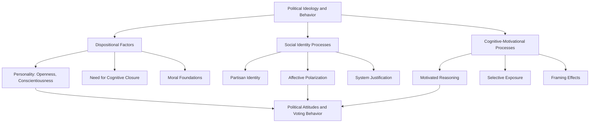

## Political Psychology and Ideology

### Overview

Political psychology is the study of how psychological processes — cognition, emotion, personality, and social identity — shape political attitudes, ideology, and behavior. It draws on social, personality, and cognitive psychology to explain phenomena such as partisan polarization, ideological belief systems, political persuasion, and intergroup conflict in political contexts.

### Defining Ideology

- Political ideology: a relatively coherent set of beliefs and values about the proper organization of society, government, and the economy, commonly organized along a liberal-conservative or left-right dimension in Western democracies
- Converse's (1964) classic work questioned whether most citizens hold ideologically "constrained" belief systems, arguing that mass publics often lack the coherent structuring of attitudes found among political elites
- Contemporary research treats ideological constraint as variable across individuals and issues, with political sophistication and engagement moderating coherence [Inference: the degree of true attitude constraint among ordinary citizens remains actively debated methodologically]

### Psychological Correlates of Ideology

**Personality and Ideology**

- Jost et al.'s (2003) meta-analysis linked political conservatism to psychological motives including intolerance of ambiguity, need for cognitive closure, and death anxiety management, framing conservatism partly as motivated social cognition
- Big Five associations: openness to experience is consistently associated with liberal/progressive orientations; conscientiousness (particularly orderliness) shows a more modest association with conservative orientations across studies
- These associations are correlational and modest in effect size; they do not imply personality determines ideology deterministically [Inference: causal direction and the role of shared underlying dispositions vs. socialization remain unresolved]

**Moral Foundations Theory**

Haidt and Graham's (2007) Moral Foundations Theory proposes that political ideologies differ in their reliance on distinct moral intuitions: care/harm, fairness/cheating, loyalty/betrayal, authority/subversion, and sanctity/degradation (later refined to include liberty/oppression). Liberals are theorized to weight care and fairness more heavily; conservatives draw more evenly across all foundations, including binding foundations (loyalty, authority, sanctity).

**System Justification Theory**

Jost and Banaji's (1994) system justification theory proposes a motivated tendency to defend, bolster, and rationalize existing social, economic, and political arrangements, even among those disadvantaged by them — offering one account of why members of low-status groups sometimes endorse systems that disadvantage them.

### Social Identity and Partisanship

**Partisan Social Identity**

Contemporary political psychology increasingly conceptualizes partisanship less as a policy-preference summary and more as a social identity akin to other group memberships (per social identity theory), producing in-group favoritism toward co-partisans and out-group hostility toward opposing partisans independent of policy content — a phenomenon termed **affective polarization**.

**Affective Polarization**

- Defined as the tendency to view co-partisans warmly and opposing partisans with dislike or distrust, measured via feeling thermometers and related scales
- Distinguished from ideological polarization (actual divergence in policy positions), which some research finds has grown less than affective polarization in absolute terms in certain democracies [Unverified: cross-national and over-time comparisons vary by measurement instrument and country]
- Consequences studied include reduced willingness for cross-party social contact, marriage, and even reduced accuracy in factual/numerical reasoning when politically motivated (motivated numeracy, per Kahan et al.)

### Cognitive and Motivational Processes

**Motivated Reasoning**

- Political information processing is frequently directionally motivated: individuals scrutinize belief-incongruent evidence more critically than belief-congruent evidence, and apply differential standards of evidence based on desired conclusions
- Kahan's "motivated numeracy" studies found that higher numerical/analytical ability was associated with *greater* polarization on politically charged empirical questions, contrary to a simple information-deficit account

**Confirmation Bias and Selective Exposure**

- Preference for information sources and media congruent with existing political beliefs, both online and offline
- Media fragmentation and algorithmic curation are hypothesized to amplify selective exposure, though empirical estimates of "filter bubble" magnitude vary and some research finds cross-cutting exposure is more common than assumed [Inference/Unverified: findings differ by platform, country, and measurement methodology]

**Authoritarianism**

- Right-wing authoritarianism (Altemeyer): a cluster of authoritarian submission, aggression, and conventionalism, predicting punitive attitudes toward perceived deviance
- Social dominance orientation (Pratto, Sidanius): a preference for group-based hierarchy and inequality, predicting support for policies maintaining in-group dominance
- Both constructs are treated as relatively stable individual-difference predictors of prejudice and intergroup attitudes, moderately correlated but conceptually distinct

### Political Persuasion and Attitude Change

- Elaboration Likelihood Model applied to political messaging: central-route persuasion (careful argument evaluation) vs. peripheral-route persuasion (heuristic cues like source credibility, endorsements)
- Framing effects: the same substantive information described in different terms (e.g., "estate tax" vs. "death tax") can shift public support, demonstrating attitude construction sensitivity to linguistic frames
- Inoculation theory: pre-exposing individuals to weakened counterarguments or misinformation techniques can build resistance ("prebunking") to subsequent persuasion attempts or misinformation, with growing applied research in the political misinformation context

### Political Behavior

- Voter turnout: predicted by civic duty norms, social pressure (e.g., "get out the vote" social-comparison mailers based on norms research), political efficacy, and habitual/socialized behavior
- Political participation beyond voting: protest behavior, donation, activism — linked to group identification strength, perceived collective efficacy, and moral outrage
- Elite cue-taking: many citizens form political opinions substantially by following trusted party elite cues rather than independent policy analysis, particularly on complex or low-salience issues

### Diagram: Psychological Drivers of Political Ideology (svg_diagram)

### Example

Two individuals encounter the same statistic on climate policy effectiveness. Motivated reasoning predicts that each will evaluate the statistic's credibility partly based on whether it supports their prior political commitments — the individual whose party opposes the policy will more readily identify methodological flaws in the study, while the individual whose party supports it will accept the findings with less scrutiny, even when analytical ability is held constant (per Kahan's motivated numeracy findings).

**Related Topics**

- Moral Foundations Theory and cross-ideological moral psychology
- Affective polarization and its behavioral consequences
- System justification theory
- Authoritarianism and social dominance orientation
- Misinformation, prebunking, and inoculation theory
- Elite cue-taking and heuristic political decision-making
- Framing effects in public opinion research