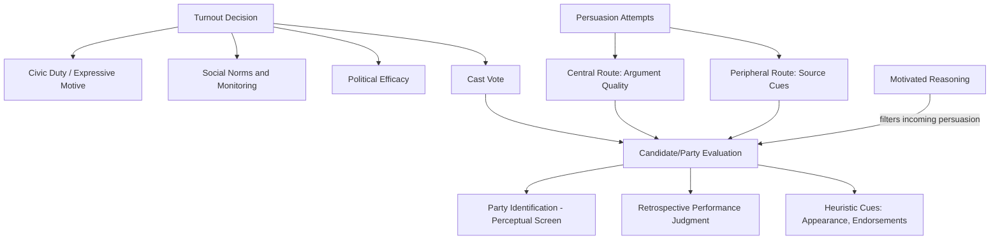

## Voting Behavior and Political Persuasion

### Overview

This topic examines the psychological determinants of whether and how citizens vote, and the processes by which political attitudes are formed, reinforced, or changed. It integrates social psychological theories of attitude, persuasion, social norms, and group identity with political science models of electoral behavior.

### Models of Voting Behavior

**Rational Choice / Spatial Voting**

- Downsian spatial models treat voters as choosing the candidate whose policy position is closest to their own on an ideological dimension
- Critiqued by psychological research for underestimating the role of identity, heuristics, and affect relative to deliberative policy comparison

**Social-Psychological (Michigan) Model**

- The classic Michigan model (Campbell et al., 1960) emphasizes party identification as a stable, early-acquired social identity — often described as a "perceptual screen" through which voters interpret candidates, issues, and events
- Party ID functions similarly to other in-group identities: it shapes information processing and is resistant to short-term revision

**Retrospective Voting**

- Fiorina's retrospective voting model proposes voters use simple performance heuristics (e.g., "is the economy better than four years ago?") rather than exhaustive prospective policy analysis, reducing cognitive demands of the voting decision

### Determinants of Turnout

**Rational and Expressive Motives**

- The "paradox of voting": the individual probability of being decisive is vanishingly small, making purely instrumental/rational-choice turnout difficult to explain; expressive and normative motives (civic duty, social identity expression) are invoked to resolve this
- Riker and Ordeshook's calculus of voting: $R = PB - C + D$, where $P$ = probability of being decisive, $B$ = benefit of preferred outcome, $C$ = cost of voting, $D$ = duty/expressive benefit — $D$ typically does the explanatory work given the near-zero value of $PB$ in large elections

**Social Norms and Turnout**

- Field experiments (notably Gerber, Green, and Larimer's 2008 social-pressure mailer study) found that mailers informing recipients their voting record (and their neighbors') would be shared publicly produced substantially larger turnout increases than standard get-out-the-vote appeals, demonstrating the power of descriptive/injunctive norm and social-monitoring pressure on political participation
- Social network embeddedness and mobilization by personal contacts (door-to-door canvassing) reliably outperform impersonal contact methods (mail, robocalls) in turnout field experiments

**Psychological and Dispositional Predictors**

- Political efficacy (internal: belief in one's own capacity to understand/participate; external: belief that the system is responsive) predicts turnout
- Habitual voting: voting in one election increases the probability of voting in subsequent elections, consistent with habit-formation processes independent of renewed cost-benefit calculation

### Candidate Evaluation and Impression Formation

- Rapid, low-information judgments: research using brief facial exposure (often under one second) finds that snap competence judgments from candidate faces predict real-world electoral outcomes above chance, suggesting heuristic-based impression formation plays a meaningful role in vote choice
- Warmth and competence dimensions (per the Stereotype Content Model) generalize to candidate evaluation, with different electoral contexts weighting these dimensions differently
- Physical attractiveness and vocal cues (e.g., lower pitch judged as more competent/dominant) show measurable, if modest, associations with electoral success in various studies [Inference: effect sizes and generalizability across cultural/electoral contexts vary]

### Political Persuasion

**Persuasion Models**

- Elaboration Likelihood Model (Petty & Cacioppo): central-route processing (careful evaluation of argument quality) occurs under high motivation/ability; peripheral-route processing (heuristic cues — source credibility, endorsements, emotional appeals) dominates under low motivation/ability, which characterizes much everyday political engagement
- Two-step flow of communication (Katz & Lazarsfeld): mass media influence is often mediated through opinion leaders who interpret and relay messages to their social networks, rather than acting directly on all individuals uniformly

**Persuasion Effect Sizes**

- Broockman and Kalla's replicated and corrected work on deep canvassing found that extended, non-judgmental conversations emphasizing perspective-taking could produce durable shifts in attitudes on socially contentious issues, in contrast to the generally small and often short-lived effects of standard campaign persuasion contacts
- Kalla and Broockman's (2018) meta-analysis of general election persuasion field experiments found the average effect of campaign contact on vote choice to be close to zero in general elections, though larger and more detectable in primary/low-information contexts and on ballot initiatives — a notable corrective to earlier assumptions about campaign persuasive power

**Framing and Priming**

- Framing effects: how an issue is described (e.g., emphasizing civil liberties vs. public safety in a policy debate) shifts which considerations voters weight, altering expressed preferences without new factual information
- Priming: media coverage emphasizing certain issues (e.g., the economy vs. foreign policy) shifts which criteria voters use to evaluate incumbents' overall performance

**Motivated Reasoning in Persuasion**

- Belief-congruent political messages are processed with less scrutiny; counter-attitudinal messages trigger compensatory counterarguing, often strengthening the original attitude (an attitude polarization / backfire pattern), though the robustness and prevalence of true "backfire effects" across contexts has been questioned in more recent replications [Unverified: the size and conditions under which backfire (as opposed to simple resistance without reversal) occurs remain contested]

### Misinformation and Correction

- Political misinformation correction faces the "continued influence effect," where corrected misinformation continues to influence downstream judgments even after explicit retraction is accepted
- Prebunking/inoculation approaches (exposing individuals to weakened forms of manipulation techniques before exposure to the real misinformation) show promise in building generalized resistance
- Fact-checking effectiveness is generally found to be positive but modest, and can be undermined by source distrust when the fact-checker is perceived as partisan

### Diagram: Pathways to Vote Choice (svg_diagram)

### Example

A campaign tests two get-out-the-vote messages via field experiment: a standard reminder ("Elections are Tuesday, please vote") versus a social-norm/monitoring message ("Your voting history is a public record; we will mail your neighbors information about who voted"). Consistent with Gerber, Green, and Larimer's findings, the social-pressure message is predicted to produce a substantially larger turnout increase, illustrating how normative and social-monitoring mechanisms often outperform purely informational appeals in political mobilization.

**Related Topics**

- Social norms interventions (descriptive and injunctive norms)
- Political psychology and ideology
- Elaboration Likelihood Model of persuasion
- Motivated reasoning and confirmation bias
- Misinformation correction and inoculation theory
- Party identification as social identity
- Field experiments in political science