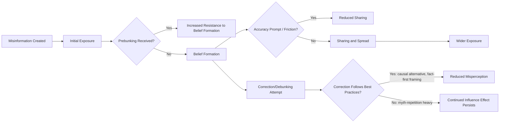

## Social Psychology of Misinformation

### Overview

The social psychology of misinformation examines how false or misleading information spreads, why it is believed, why it persists even after correction, and what psychological interventions can reduce its influence. The field integrates cognitive psychology (memory, reasoning), social psychology (group identity, motivated cognition), and communication science.

### Defining Misinformation and Related Constructs

- **Misinformation**: false or inaccurate information, regardless of intent behind its creation or spread
- **Disinformation**: false information deliberately created or spread with intent to deceive
- **Malinformation**: genuine information shared with intent to cause harm (e.g., private information disclosed maliciously)
- These categories are frequently conflated in casual usage but are analytically distinct for intervention design, since intent-based and content-based countermeasures differ

### Why Misinformation Spreads

**Structural and Platform Factors**

- Algorithmic amplification of emotionally engaging content, which disproportionately includes novel, negative, or morally/emotionally charged material
- Vosoughi, Roy, and Aral's (2018) large-scale Twitter study found false news stories were retweeted significantly more and reached larger audiences faster than true stories, with novelty and stronger emotional (particularly fear, disgust, and surprise) reactions offered as candidate explanations
- Network homophily and echo chamber structures can concentrate exposure to congenial misinformation, though the degree to which real-world exposure is actually siloed is debated [Unverified: empirical estimates of "filter bubble" severity vary by platform, country, and measurement approach]

**Psychological Susceptibility Factors**

- **Illusory truth effect**: repeated exposure to a statement increases its perceived truthfulness independent of actual accuracy or source credibility, via processing fluency — even prior knowledge does not fully inoculate against this effect in some studies
- **Confirmation bias**: preferential acceptance of information congruent with prior beliefs and identity
- **Source credibility heuristics**: perceived expertise, trustworthiness, and in-group status of a source shape uncritical acceptance, particularly under peripheral-route processing conditions
- **Emotional arousal**: heightened emotional states (especially anxiety and anger) are associated with reduced analytical scrutiny and increased sharing propensity

### Cognitive Mechanisms of Belief Persistence

**The Continued Influence Effect**

Even after a piece of misinformation is explicitly and credibly retracted, it continues to influence related inferences and judgments — a robust finding across many experimental paradigms (Johnson & Seifert, 1994, and extensive subsequent replication). Proposed mechanisms include:

- Reliance on an outdated mental model that provides causal coherence, absent a replacement explanation
- Familiarity/fluency from repeated encounters with the original (false) claim, including in some correction formats themselves
- Selective/motivated retrieval favoring identity-congruent information

**The Backfire Effect: A Contested Finding**

Early work (Nyhan & Reifler, 2010) suggested that corrections could sometimes increase belief in the original misinformation among ideologically motivated subgroups ("backfire"). However, larger and more recent replication efforts (e.g., Wood & Porter, 2019) have generally failed to find robust backfire effects across a wide range of issues, instead finding that factual corrections typically at least modestly reduce misperceptions, even if they do not fully eliminate them. The current consensus treats backfire as a real but comparatively rare phenomenon rather than the norm [Inference: the boundary conditions under which backfire does occur are not fully settled].

### Correction and Debunking Strategies

**The Debunking Handbook Framework**

Effective correction (per Lewandowsky et al.'s widely cited Debunking Handbook) generally recommends:

1. Leading with the factual alternative rather than repeating the myth prominently
2. Explicitly warning before mentioning the myth, to avoid unintentionally reinforcing familiarity
3. Providing a causal alternative explanation to fill the gap left by the retracted information (addressing the continued influence effect's reliance on coherent mental models)
4. Avoiding overkill — a small number of clear counterarguments is often more effective than an exhaustive list, which can trigger overkill backfire in some framings

**Prebunking / Inoculation Theory**

- Adapted from McGuire's (1961) classical inoculation theory (originally about resistance to persuasion), prebunking exposes people to a weakened or generalized version of a misleading technique before real-world exposure, building cognitive "antibodies"
- Technique-based inoculation (e.g., games like Bad News or Go Viral! that teach recognition of manipulation tactics such as false dichotomies, scapegoating, and emotional manipulation) has shown improved discernment in controlled studies, with some evidence of effects generalizing across specific claims
- Considered generally more effective and durable than post-hoc debunking, since it intervenes before belief formation rather than attempting to dislodge an established belief

**Friction and Accuracy Nudges**

- Pennycook and Rand's research on accuracy prompts found that simply prompting users to consider the accuracy of a headline before sharing (shifting attention away from social/engagement motives) reduced intentions to share false content, without necessarily requiring extensive fact-checking infrastructure
- This line of work reframes much misinformation sharing as an attention failure (inattention to accuracy in a social-media context optimized for engagement) rather than pure motivated reasoning or ability deficit — sometimes termed the "inattention-based account"

### Source and Media Literacy Interventions

- Lateral reading: training people to verify claims by leaving the source and checking what other sources say about it (a technique associated with professional fact-checkers), contrasted with novices' tendency toward vertical reading (evaluating a site using only cues within that site)
- General media literacy curricula show modest positive effects on discernment in evaluation studies, though transfer to novel, real-world misinformation exposure outside experimental settings is harder to establish definitively [Inference]

### Role of Social Identity and Partisanship

- Partisan identity can function as a filter on both initial belief formation and resistance to correction, particularly for politically charged misinformation, consistent with broader motivated-reasoning findings in political psychology
- Elite cues (trusted in-group political or media figures endorsing or debunking a claim) often exert stronger influence on lay belief than the underlying evidentiary content itself
- Corrections from in-group or otherwise credible-to-the-target sources tend to outperform corrections from out-group or distrusted sources, consistent with source-credibility and identity-protective cognition research

### Diagram: Misinformation Lifecycle and Intervention Points (svg_diagram)

### Example

A false claim about a health treatment circulates on social media. A prebunking intervention delivered beforehand (e.g., a short video explaining the "fake expert" manipulation technique in general terms) is predicted to reduce susceptibility to this and structurally similar future claims. If exposure has already occurred, an effective correction would state the accurate information first, briefly flag the myth as false only once with a clear warning, and provide an alternative causal account (e.g., explaining why the false claim originally seemed plausible) rather than repeatedly restating the myth in detail.

**Related Topics**

- Illusory truth effect and processing fluency
- Continued influence effect and mental model updating
- Inoculation theory and prebunking interventions
- Motivated reasoning in political psychology
- Source credibility and elite cue-taking
- Media literacy and lateral reading techniques
- Social norms and information-sharing behavior online