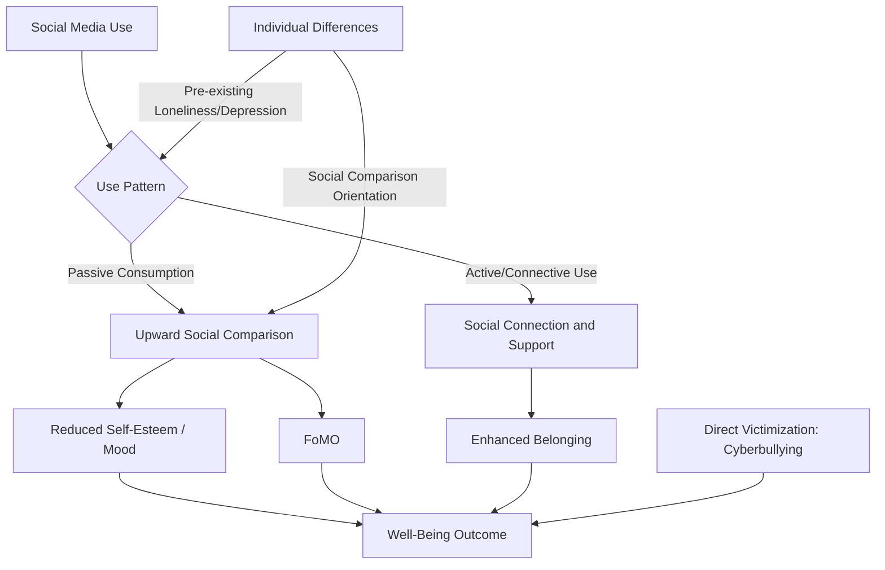

## Social Media Use and Psychological Well-Being

### Overview

This topic examines the relationship between social media use and psychological outcomes including subjective well-being, depression, anxiety, self-esteem, loneliness, and body image. Applied social psychology contributes theories of social comparison, self-presentation, and belonging to explain both risk and protective pathways, situated within a research literature characterized by mixed findings and significant methodological debate.

### Theoretical Frameworks

**Social Comparison Theory**

Festinger's (1954) social comparison theory, extended to digital contexts, proposes that individuals evaluate their own standing by comparing themselves to others. Social media environments are theorized to amplify **upward social comparison** (comparing to seemingly superior others) due to the curated, positively-biased nature of most self-presentation online, potentially depressing self-evaluation and mood.

**Self-Presentation and Impression Management**

- Goffman's dramaturgical framework (front stage/back stage) applied to social media: profiles function as curated "front stage" self-presentations
- Highlight-reel effect: users disproportionately post positive life events, creating a systematic perception gap between others' displayed lives and one's own lived (including mundane/negative) experience

**Uses and Gratifications Theory**

Frames social media engagement as an active choice driven by specific psychological needs — social connection, information seeking, entertainment, identity expression, and status seeking — implying that outcomes depend substantially on the motivation behind use rather than platform exposure alone.

**Displacement Hypothesis vs. Stimulation Hypothesis**

- Displacement hypothesis: time spent on social media displaces time that would otherwise go to face-to-face interaction or other well-being-supporting activities, predicting a negative relationship
- Stimulation/social compensation hypothesis: social media use, particularly for socially anxious or geographically dispersed individuals, can supplement and strengthen social ties, predicting neutral or positive effects for certain subgroups

### The Displacement vs. Enhancement Debate

**Evidence for Negative Associations**

- Cross-sectional and some longitudinal studies find associations between heavy social media use (particularly passive use — scrolling without direct interaction) and elevated depressive symptoms, loneliness, and lower life satisfaction, especially among adolescents
- Passive use is more consistently linked to negative outcomes than active use (posting, direct messaging, commenting) across multiple studies, consistent with a social-comparison-driven mechanism rather than a simple screen-time mechanism

**Evidence for Null or Small Effects**

- Orben and Przybylski's (2019) large-scale specification-curve analysis across multiple national datasets found social media use explained a very small proportion of variance in adolescent well-being (comparable in magnitude to effects such as eating potatoes or wearing glasses), substantially smaller than effects commonly implied in public discourse
- Meta-analyses generally converge on small overall effect sizes (correlations typically in the range of $r \approx -0.10$ to $-0.15$), with considerable heterogeneity across studies, age groups, and measurement approaches [Inference: precise pooled estimates vary by meta-analysis and inclusion criteria]

**Methodological Critiques**

- Most evidence remains correlational; causal inference is limited by reverse causation (individuals already experiencing depression or loneliness may use social media differently or more heavily) and unmeasured confounds
- Reliance on self-reported usage time has been shown to correlate weakly with objectively logged (device-recorded) usage, casting doubt on some self-report-based findings
- Aggregating "social media use" as a single construct obscures substantial heterogeneity across platforms, use patterns (active/passive), and content types

### Specific Mechanisms and Outcomes

**Social Comparison and Body Image**

- Appearance-focused platforms (particularly image-centric ones) show more consistent associations with body dissatisfaction, especially via appearance-based social comparison and internalization of idealized/filtered beauty standards
- Experimental studies manipulating exposure to idealized vs. neutral images show short-term causal effects on body satisfaction, providing stronger causal evidence than the broader well-being literature

**Fear of Missing Out (FoMO)**

Przybylski et al.'s (2013) construct describing the pervasive apprehension that others are having rewarding experiences from which one is absent; associated with compulsive checking behavior and mediates some of the relationship between social media engagement and negative affect.

**Social Comparison Orientation as a Moderator**

Individual differences in dispositional social comparison tendency moderate the impact of social media exposure — individuals higher in trait social comparison orientation show stronger negative associations between upward comparison content and mood/self-esteem than low-comparison-orientation individuals.

**Cyberbullying and Online Harassment**

Distinct from general use effects, direct victimization via online harassment shows more robust and larger associations with depression, anxiety, and suicidality risk than general platform use, representing a different causal pathway (direct social threat rather than passive comparison).

**Loneliness: Bidirectional Pathways**

- Some studies find social media use predicts subsequent loneliness (displacement-consistent)
- Others find loneliness predicts increased (often compensatory) social media use
- Longitudinal and cross-lagged panel designs suggest the relationship may be bidirectional and context-dependent rather than unidirectional [Inference]

### Developmental Considerations

- Adolescence is frequently highlighted as a period of heightened sensitivity to social evaluation and peer comparison, plausibly amplifying social-media-related comparison effects during this developmental window, though the "sensitive period" hypothesis (that early-to-mid adolescence is a uniquely vulnerable window) is still being empirically tested [Unverified: Orben, Przybylski and colleagues' subsequent work on developmental sensitive periods reports mixed and age/gender-specific patterns]
- Concerns specific to adolescent populations include sleep displacement (late-night use associated with reduced sleep quality/duration, itself a well-being risk factor) and identity-formation processes occurring in a publicly visible, permanent-record social context

### Protective and Mitigating Factors

- Active, connection-oriented use (direct messaging with close ties) is more consistently associated with neutral-to-positive outcomes than passive consumption
- Strong offline social support networks appear to buffer against negative associations
- Digital literacy and critical awareness of curated self-presentation (recognizing the "highlight reel" effect) is associated with reduced social-comparison-driven distress in some intervention studies
- Platform design changes (e.g., hiding public like-counts) have been tested as interventions to reduce social-comparison pressure, with mixed and generally modest effects reported

### Diagram: Pathways from Social Media Use to Well-Being (svg_diagram)

### Example

Two adolescents use the same platform for equal amounts of time. One primarily scrolls passively through curated posts from acquaintances (predicting stronger upward comparison and FoMO effects), while the other primarily uses direct messaging to maintain close friendships (predicting neutral-to-positive belonging effects). Under the active/passive use distinction, these two individuals would be expected to show divergent well-being trajectories despite identical raw usage-time metrics — illustrating why aggregate "screen time" measures alone poorly predict psychological outcomes.

**Related Topics**

- Social comparison theory and upward/downward comparison
- Fear of missing out (FoMO) as a psychological construct
- Cyberbullying and online victimization
- Adolescent development and peer evaluation sensitivity
- Self-presentation and impression management theory
- Methodological challenges in social media effects research
- Digital well-being interventions and platform design