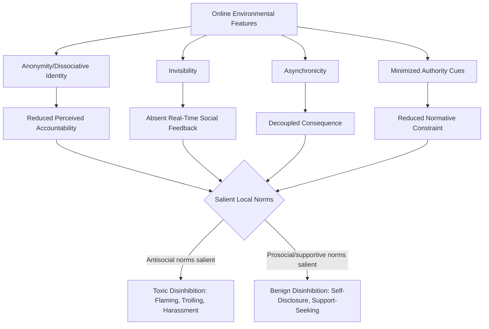

## Online Disinhibition and Cyberbehavior

### Overview

Online disinhibition refers to the tendency for individuals to behave with reduced restraint in online environments compared to face-to-face interaction — manifesting both as increased hostility, aggression, and rule-breaking (toxic disinhibition) and as increased openness, self-disclosure, and generosity (benign disinhibition). The construct draws on deindividuation theory, anonymity research, and computer-mediated communication (CMC) theory.

### Suler's Online Disinhibition Effect

Suler's (2004) foundational framework identifies six interacting factors that reduce online behavioral restraint:

1. **Dissociative anonymity** — "you don't know me": perceived separation between online identity and offline self reduces accountability
2. **Invisibility** — absence of physical presence and visible reactions (facial expression, body language) removes real-time social feedback that normally regulates behavior
3. **Asynchronicity** — non-real-time communication ("hit and run" potential) decouples an utterance from immediate interpersonal consequence
4. **Solipsistic introjection** — absence of face-to-face cues leads individuals to construct imagined characteristics of others, sometimes assimilating the interaction into internal, less socially-constrained mental models
5. **Dissociative imagination** — perceiving the online space as a separate, game-like reality with different rules than offline life
6. **Minimization of authority** — the absence of visible status/authority markers (uniforms, physical dominance cues, institutional settings) reduces the inhibiting effect of perceived hierarchy

### Theoretical Foundations

**Deindividuation Theory**

- Zimbardo's (1969) deindividuation theory proposes that conditions reducing self-awareness and individual accountability (anonymity, group immersion, diffused responsibility) increase the likelihood of normatively-discouraged, often antisocial behavior
- The **SIDE model** (Social Identity model of Deindividuation Effects; Reicher, Spears, & Postmes, 1995) offers a competing account: rather than simply removing all normative constraint, anonymity shifts behavior toward the norms of whatever social identity is salient in that context — anonymity can increase conformity to local group norms (which may be prosocial or antisocial) rather than producing uniform disinhibition
- The SIDE model is generally considered to have stronger empirical support than a simple "anonymity removes all restraint" account, since online anonymity effects are heavily moderated by the salient group/community norms in a given space [Inference: relative empirical support is a matter of ongoing synthesis rather than fully settled consensus]

**Reduced Social Cues Theory**

Early CMC theory (Sproull & Kiesler, 1986) proposed that the absence of nonverbal and status cues in text-based communication systematically reduces normative social influence, predicting more extreme, uninhibited communication ("flaming") — an account partially superseded by SIDE's emphasis on norm-contingent rather than uniform effects.

### Toxic Disinhibition

**Manifestations**

- Flaming: hostile, aggressive, or insulting exchanges disproportionate to offline norms for the same relationship/context
- Trolling: deliberately provocative or disruptive behavior intended to elicit emotional reactions or disrupt discourse, sometimes for the poster's own amusement (associated in research with elevated trait sadism and other Dark Tetrad traits — Buckels, Trapnell & Paulhus, 2014)
- Cyberbullying: repeated, intentional harm directed at a specific target via digital means, showing continuity with offline bullying dynamics (power imbalance, repetition, intent) while adding features like potential anonymity and 24/7 reach
- Cancel culture and online pile-ons: coordinated, often rapidly escalating collective condemnation, which can be analyzed through group polarization and moral outrage contagion frameworks

**Contributing Psychological Mechanisms**

- Reduced empathic cue transmission: absence of real-time distress signals (tone of voice, facial expression) from the target may reduce the inhibitory empathic response that typically curbs aggression in face-to-face interaction
- Moral disengagement mechanisms (per Bandura): online contexts may facilitate dehumanization of targets, diffusion of responsibility (particularly in pile-on dynamics), and displacement of responsibility ("everyone else is saying it too")
- Outrage and moral contagion: research on social media virality finds that moral-emotional language increases content diffusion within (though less so between) ideological networks, contributing to rapid amplification of outrage-driven content

### Benign Disinhibition

- Increased self-disclosure: reduced inhibition can facilitate earlier and deeper self-disclosure in online relationships and support communities (e.g., health support forums, anonymous mental health platforms) compared to typical offline disclosure trajectories
- Reduced social anxiety barriers: individuals high in social anxiety sometimes report easier initial social engagement online, consistent with the social compensation hypothesis
- Identity exploration: reduced real-world identity constraints can facilitate exploration of stigmatized or underdeveloped identity aspects (e.g., sexual orientation, gender identity) in safer, lower-risk online contexts before offline disclosure

### Moderating Factors

**Anonymity Gradient**

- True anonymity (no persistent identifiable handle) vs. pseudonymity (persistent but non-real-name identity) vs. real-name policies show differing disinhibition effects; pseudonymous but persistent identities can retain reputational accountability within a community even without real-name attachment
- Platform-level real-name policies show mixed evidence for reducing toxic behavior; some research finds modest reductions in hostility, but effects are inconsistent and can be confounded with other platform/community moderation factors [Unverified: causal isolation of real-name policy effects independent of concurrent moderation changes is methodologically difficult]

**Community Norms and Moderation**

- Consistent with the SIDE model, visible community moderation and clearly established local norms substantially shape whether disinhibition manifests as toxic or prosocial behavior within a given online space
- "Broken windows" dynamics: visible unmoderated toxicity in a space appears to normatively license further toxic behavior (a descriptive-norm mechanism analogous to offline norms research), while visibly enforced community standards suppress it

**Individual Differences**

- Trait aggression, low agreeableness, and Dark Tetrad traits (narcissism, Machiavellianism, psychopathy, sadism) predict greater engagement in toxic online behaviors, particularly trolling
- Perspective-taking ability and trait empathy show inverse associations with online hostility engagement

### Diagram: Online Disinhibition Effect Model (svg_diagram)

### Example

A user who would never confront a stranger aggressively in person posts a hostile, insulting reply to a stranger's opinion in an anonymous online forum. Under Suler's framework, this reflects the combined influence of dissociative anonymity (no persistent real-world identity attached) and invisibility (no visible distress reaction from the target moderating the exchange in real time). Under the SIDE model, whether this individual behaves this way is also contingent on the local forum's norms: in a heavily moderated, civility-enforcing community, the same anonymous user might instead conform to prosocial community standards rather than defaulting to hostility.

**Related Topics**

- Deindividuation theory and the SIDE model
- Cyberbullying and online victimization
- Moral disengagement and dehumanization
- Trolling and Dark Tetrad personality traits
- Group polarization and online moral outrage contagion
- Social media use and psychological well-being
- Content moderation and community norm enforcement