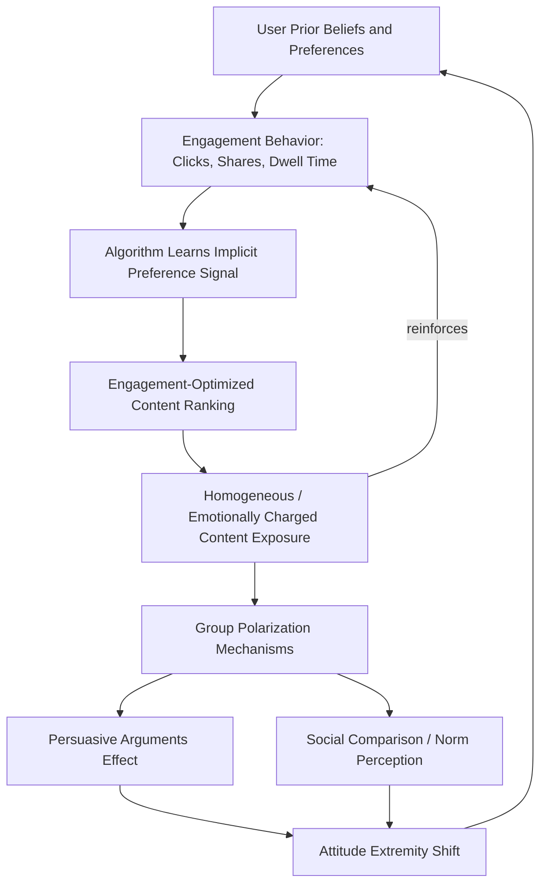

## Algorithmic Curation and Polarization

### Overview

This topic examines how algorithmic content curation systems — recommendation engines, ranking algorithms, and personalization systems on social media and content platforms — interact with psychological processes to shape political and social polarization. It integrates social psychology's group polarization and selective exposure research with computational social science findings on platform architecture.

### Defining Key Constructs

- **Algorithmic curation**: automated selection and ranking of content shown to users, typically optimized for engagement metrics (click-through rate, time-on-platform, interaction rate) rather than accuracy, diversity, or user well-being
- **Filter bubble** (Pariser, 2011): a hypothesized state in which algorithmic personalization increasingly narrows the range of perspectives a user encounters, based on inferred preferences
- **Echo chamber**: a social/communicative structure (which may be user-selected rather than purely algorithm-driven) in which individuals predominantly encounter belief-congruent views and mutually reinforcing social validation
- These two constructs are often conflated but are analytically distinct: filter bubbles emphasize algorithmic/technical narrowing, while echo chambers emphasize social network and self-selection processes — evidence for their relative contribution to polarization differs

### Theoretical Foundations from Social Psychology

**Group Polarization**

Stoner's (1961) and Moscovici and Zavalloni's (1969) foundational work on group polarization found that group discussion tends to shift individual attitudes toward a more extreme version of the group's initial leaning, rather than toward moderation. Two primary mechanisms are proposed:

- **Persuasive arguments theory**: exposure to a preponderance of novel arguments supporting the majority position shifts individual attitudes
- **Social comparison theory**: desire to be perceived favorably relative to the group norm leads individuals to adopt more extreme positions than they privately hold, once they learn the group's general direction

Applied to algorithmically curated online spaces, group polarization dynamics are theorized to be amplified when algorithmic sorting increases the homogeneity of the discourse a user encounters, functionally replicating the "like-minded group discussion" conditions under which polarization is strongest.

**Selective Exposure**

Festinger's cognitive dissonance-derived selective exposure hypothesis proposes that individuals prefer information congruent with existing beliefs to avoid dissonance. Algorithmic systems that optimize for engagement can systematically amplify this pre-existing psychological tendency, since congruent content reliably generates higher engagement (clicks, shares, dwell time) than incongruent content — creating a feedback loop between human psychological preference and machine optimization.

### Mechanisms of Algorithmic Amplification

**Engagement-Optimization and Emotional Content**

- Content evoking high-arousal emotions (particularly moral outrage, anger, and fear) reliably generates higher engagement metrics, and engagement-optimized ranking algorithms consequently tend to amplify such content, independent of any explicit ideological objective in the algorithm's design
- Brady et al.'s research on moral-emotional language in political social media content found such language increased diffusion (retransmission) especially within ideologically like-minded networks, suggesting an interaction between algorithmic amplification and audience-level polarization dynamics

**Homophily-Driven Recommendation**

- Recommendation systems (e.g., "similar users also liked," friend/follow suggestions) are typically built on collaborative filtering or embedding-similarity methods that reinforce existing behavioral and preference patterns, structurally tending toward homogeneous rather than diversifying content streams
- This is a direct computational analog of social homophily (the tendency to associate with similar others), potentially compounding rather than counteracting pre-existing social sorting

**Feedback Loops**

- User engagement behavior trains the algorithm (via implicit feedback signals), which then shapes subsequent exposure, which shapes subsequent engagement behavior — a recursive loop that can progressively narrow the effective information diet over time, though the empirical rate and extent of such narrowing in real-world systems is difficult to establish independently of proprietary platform data [Inference: much of the precise mechanics are inferred from limited platform transparency rather than direct empirical measurement across systems]

### Empirical Evidence and Contested Findings

**Evidence Questioning Filter Bubble Severity**

- Several empirical studies using browsing data (e.g., Flaxman, Goel, & Rao, 2016; Guess et al.) find that most users' actual media diets include a substantial share of ideologically cross-cutting content, and that algorithmically curated feeds (e.g., search, social referral) sometimes show *more* ideological diversity than users' direct, self-selected browsing
- Bakshy, Messing, and Adamic's (2015) large-scale Facebook study found that algorithmic ranking modestly reduced exposure to cross-cutting content relative to a purely chronological feed, but that individual choice (what to click on among available content) had a larger effect on exposure diversity than the algorithm itself

**Evidence Supporting Meaningful Algorithmic Effects**

- Field experiments and platform-collaboration studies (e.g., the 2020 U.S. election Facebook/Instagram research collaborations) have found that algorithmic feed ranking does measurably shape exposure composition and time spent with ideologically congenial content, even if it does not fully determine attitude extremity
- Cross-national and cross-platform heterogeneity is substantial: effects documented on one platform/algorithm/time period do not necessarily generalize to others, given differing algorithmic architectures and user bases [Unverified: findings are platform- and period-specific, and rapidly evolving algorithmic systems limit generalizability of older studies]

**Overall Assessment**

The current empirical consensus leans toward algorithmic curation being a real but not singularly dominant contributor to polarization, operating alongside (and interacting with) pre-existing human selective-exposure preferences, social network homophily, and elite/media polarization dynamics, rather than being a sufficient standalone explanation [Inference: this synthesis reflects the general direction of the evidence rather than a single definitive meta-analytic consensus, since the literature remains actively contested and platform-dependent].

### Downstream Psychological and Social Consequences

- **Affective polarization amplification**: repeated exposure to homogeneous in-group content and out-group-critical content may reinforce negative affect toward political out-groups, independent of actual policy disagreement
- **False consensus and perceived norm distortion**: algorithmically curated homogeneous exposure can distort perceptions of how common one's own views are within the broader population, a mechanism connecting algorithmic curation to social-norms misperception research
- **Radicalization pathways**: case studies and some platform-audit research (e.g., on YouTube recommendation trajectories) have raised concerns about progressive recommendation toward more extreme content, though rigorous causal evidence isolating the algorithm's independent contribution (versus user-driven search behavior) remains an active and disputed research area

### Proposed Interventions

- **Algorithmic transparency and auditing**: independent researcher access to platform data and ranking logic, to enable rigorous causal study of curation effects (a persistent methodological bottleneck given proprietary system opacity)
- **Diversity-aware ranking**: deliberately incorporating viewpoint or source diversity as an explicit ranking objective alongside engagement metrics
- **Friction and deliberate interruption**: interface changes introducing brief pauses or prompts before sharing/engaging (related to accuracy-nudge interventions from the misinformation literature)
- **Chronological or user-controlled feed options**: reducing algorithmic curation's influence by offering non-personalized or user-adjustable ranking, allowing empirical comparison of algorithmic vs. non-algorithmic exposure effects

### Diagram: Algorithmic Curation and Polarization Feedback Loop (svg_diagram)

### Example

A user who engages positively with moderately partisan political content begins receiving increasingly homogeneous and emotionally charged recommendations, since the engagement-optimizing algorithm has learned that such content reliably generates clicks and watch time from this user profile. Per group polarization theory, repeated exposure to a preponderance of one-sided arguments (persuasive arguments mechanism) combined with perceived validation from similarly-engaging users (social comparison mechanism) is predicted to shift the user's attitudes toward a more extreme version of their original position — illustrating how an engagement-neutral optimization objective can produce ideologically consequential downstream effects without the algorithm having any explicit political design intent.

**Related Topics**

- Group polarization theory and mechanisms
- Selective exposure and confirmation bias
- Affective polarization and partisan identity
- Social norms misperception (false consensus effect)
- Social psychology of misinformation
- Online disinhibition and cyberbehavior
- Platform accountability and algorithmic transparency research