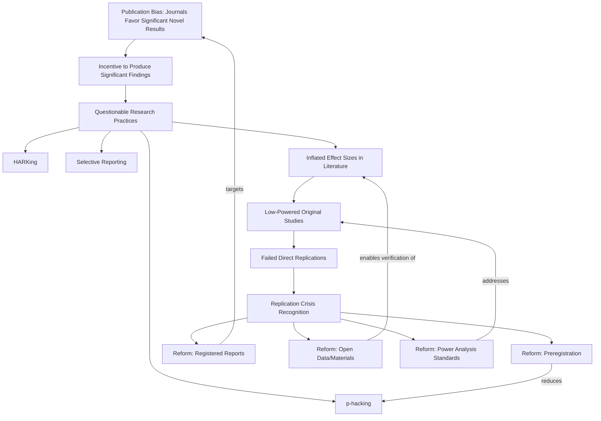

## Causes and Reforms Following the Replication Crisis

### Overview

The replication crisis refers to the widespread finding, beginning to surface prominently around 2011–2015, that a substantial proportion of published psychological findings — including many classic and influential social psychology effects — failed to replicate under direct or close replication attempts. This precipitated major methodological reform across psychology and adjacent fields, with direct implications for how social psychology's canonical findings should be interpreted and taught.

### Precipitating Events

**Early Warning Signs**

- Bem's (2011) publication of studies purporting to demonstrate precognition ("feeling the future") in a top psychology journal, using standard methods and statistical practices of the time, prompted widespread concern that if such methods could produce apparently significant evidence for an implausible phenomenon, they might be systematically generating false positives more broadly
- Stapel fraud case (2011): discovery that prominent Dutch social psychologist Diederik Stapel had fabricated data across dozens of publications, prompting broader scrutiny of verification and data-sharing norms in the field

**The Open Science Collaboration Reproducibility Project**

The Open Science Collaboration's (2015) large-scale effort to directly replicate 100 studies published in three major psychology journals found that only a minority of replications produced statistically significant effects matching the original direction and significance, and that effect sizes in successful replications were, on average, roughly half the magnitude of the original published effects. This project is widely regarded as the pivotal large-scale empirical documentation of the crisis's scope.

**Many Labs Projects**

Subsequent "Many Labs" collaborative replication projects (coordinated attempts to replicate specific effects across dozens of independent labs and samples) found substantial heterogeneity in replication success across different classic effects, with some robustly replicating and others showing little to no evidence of the original effect.

### Root Causes

**Questionable Research Practices (QRPs)**

- **p-hacking**: exploiting researcher degrees of freedom (flexible choices in data collection, exclusion criteria, variable operationalization, and statistical analysis) to obtain statistically significant results, often without conscious intent to deceive
- **HARKing** (Hypothesizing After Results are Known): presenting post-hoc, data-derived hypotheses as if they were predicted a priori, obscuring the exploratory nature of the analysis
- **Optional stopping**: continuing or halting data collection contingent on interim significance testing results, inflating false-positive rates beyond nominal significance thresholds
- **Selective reporting**: presenting only significant outcomes from a larger set of measured variables or analyses

**Structural and Incentive Factors**

- **Publication bias**: academic journals' historical preference for novel, statistically significant, positive findings over null results creates a systemic incentive toward practices that increase apparent significance, and discourages publication of failed replications
- **The "file drawer problem"** (Rosenthal, 1979): null results disproportionately remain unpublished, biasing the visible literature toward overestimated effect sizes
- Career incentive structures (tenure, grant funding, and prestige tied heavily to publication quantity and novelty) historically rewarded practices that maximized publishable "positive" results over methodological rigor or direct replication work
- Historically low statistical power in much social psychology research, often due to small sample sizes, compounds false-positive risk and produces inflated effect-size estimates in the (frequently underpowered) published literature — a phenomenon related to the "winner's curse"

**Statistical and Methodological Contributing Factors**

- Over-reliance on null-hypothesis significance testing (NHST) with a fixed $p < .05$ threshold, without adequate attention to effect size, confidence intervals, or prior plausibility
- Simmons, Nelson, and Simonsohn's (2011) demonstration ("false-positive psychology") that a combination of common, individually defensible researcher degrees of freedom could produce statistically significant support for a false hypothesis at unacceptably high rates, formalizing the QRP concern quantitatively

### Affected Findings in Social Psychology

Several widely taught social psychology effects have faced significant replication challenges or substantial effect-size reductions in large-scale replication attempts, including (with varying degrees of contested status):

- Ego depletion / limited willpower resource model: a large-scale multi-lab Registered Replication Report found effects close to zero
- Power posing (embodied cognition effects on hormones/behavior): the original author later publicly acknowledged the evidence did not support the initially claimed hormonal effects
- Facial feedback hypothesis: a large Registered Replication Report of the classic pen-in-mouth paradigm found a substantially attenuated effect relative to the original study
- Several priming effects: various subtle behavioral priming findings faced reduced or non-significant results in high-powered replications

It is important to note that failure to replicate in a single attempt does not definitively disprove an effect, and replication outcomes exist on a spectrum influenced by moderators, sample differences, and methodological fidelity to the original study — wholesale dismissal of a failed-to-replicate finding is itself a form of overreach [Inference: appropriate epistemic response to any single replication failure or success is a matter of ongoing methodological discussion, particularly regarding moderator analysis and "hidden" boundary conditions].

### Methodological Reforms

**Preregistration**

- Publicly registering hypotheses, sample size, and analysis plan before data collection, distinguishing confirmatory (a priori) from exploratory (post hoc) analysis and substantially reducing the researcher-degrees-of-freedom problem
- Registered Reports: a publication format where study design and analysis plan undergo peer review and in-principle acceptance *before* data collection, with publication guaranteed regardless of outcome (significant or null) — directly targeting publication bias at its structural source

**Statistical Reform**

- Increased emphasis on effect sizes and confidence intervals alongside (or instead of) binary significance thresholds
- Power analysis as a standard expectation for sample size justification, addressing chronic underpowering
- Increased use of Bayesian methods in some subfields, offering an alternative framework to NHST for evidence quantification

**Transparency and Open Science Practices**

- Open data and open materials: sharing raw data, stimuli, and analysis code to enable independent verification and reanalysis
- The Transparency and Openness Promotion (TOP) Guidelines, developed collaboratively across journals and funders, established tiered standards for data sharing, preregistration, and replication policies now adopted by many major psychology journals

**Institutional and Journal-Level Changes**

- Growth of dedicated replication-focused journals and sections explicitly welcoming null/replication results
- Some journals adopting mandatory or incentivized preregistration and open-data badges
- Funding agencies increasingly supporting large-scale, multi-lab collaborative replication efforts (e.g., the Psychological Science Accelerator, a global distributed laboratory network for large-sample collaborative studies)

**Meta-Scientific and Educational Changes**

- Increased graduate training emphasis on open science practices, statistical power, and questionable research practice awareness
- Growth of "meta-science" as a formal area of study, examining the practices and incentive structures of science itself

### Ongoing Debates and Limitations of Reform

- Preregistration and Registered Reports remain unevenly adopted across subfields and are more common in some areas of social/cognitive psychology than others
- Debate continues over appropriate interpretation of "failed" replications: whether they indicate the original effect was a false positive, or reflect unaccounted-for moderators, sample/cultural differences, or fidelity issues in the replication attempt itself
- Incentive structures (tenure, funding, prestige) have shifted but not been fully realigned with open-science ideals in many institutions, meaning structural pressure toward QRPs has been reduced but not eliminated [Inference]

### Diagram: Replication Crisis Causal Chain and Reform Points (svg_diagram)

### Example

A researcher runs an experiment testing whether a subtle situational manipulation affects helping behavior, measuring five different outcome variables and testing several subgroup breakdowns. Only one variable in one subgroup reaches $p < .05$. Under pre-reform norms, this single significant result might be reported as the study's primary finding without disclosing the other four non-significant tests (a QRP: selective reporting). Under a preregistration framework, the researcher would have specified in advance which single outcome and analysis constituted the confirmatory test, making this kind of after-the-fact selective emphasis transparent and reducing the false-positive rate in the published literature.

**Related Topics**

- Questionable research practices and p-hacking
- Preregistration and Registered Reports
- Statistical power and effect size estimation
- Open science and the Transparency and Openness Promotion guidelines
- Specific contested effects: ego depletion, power posing, priming
- Meta-science and the study of scientific practices
- Publication bias and the file-drawer problem