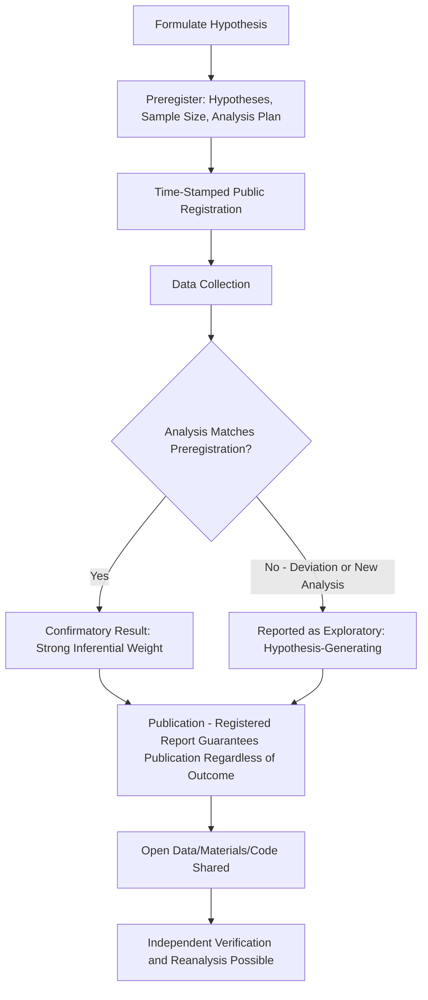

## Open Science and Preregistration Practices

### Overview

Open science refers to a cluster of practices aimed at increasing the transparency, verifiability, and accessibility of the scientific research process — including data, materials, analysis code, and the hypotheses/analysis plans themselves. Preregistration, a specific and central open science practice, involves publicly time-stamping a study's hypotheses, methods, and analysis plan before data collection or analysis begins. These practices emerged substantially in response to the replication crisis as structural remedies to questionable research practices and publication bias.

### Core Open Science Practices

**Preregistration**

- A formal, time-stamped document specifying research hypotheses, sample size determination, planned exclusion criteria, and the primary statistical analysis plan, submitted to a public registry before data collection (or before data analysis, in cases using pre-existing data)
- Distinguishes **confirmatory analysis** (a priori, hypothesis-testing, held to strict inferential standards) from **exploratory analysis** (data-driven, hypothesis-generating, appropriately reported as such rather than presented with confirmatory-level certainty)
- Common platforms include the Open Science Framework (OSF), AsPredicted, and ClinicalTrials.gov (in biomedical contexts)

**Registered Reports**

- A publication format in which the introduction, hypotheses, and methods/analysis plan undergo peer review *before* data collection
- Following in-principle acceptance, the journal commits to publishing the completed study regardless of whether results are significant or null, provided the registered protocol was followed
- Directly targets publication bias at its structural source, since publication decisions are decoupled from outcome direction/significance
- Adopted by an increasing number of journals across psychology and related fields since the format's introduction (championed prominently by Chambers and colleagues at Cortex from 2013 onward)

**Open Data and Open Materials**

- Open data: sharing raw (typically de-identified) datasets, enabling independent verification, reanalysis, and secondary research use
- Open materials: sharing stimuli, questionnaires, experimental scripts, and procedural details sufficient for independent replication attempts
- Open code: sharing analysis scripts (e.g., R, Python) to allow exact reproduction of reported statistical results from the raw data

**The TOP Guidelines**

The Transparency and Openness Promotion (TOP) Guidelines, developed through a collaborative effort involving journals, funders, and professional societies, established a standardized, tiered framework (typically Levels 0–3) across several practice categories (data citation, data transparency, code transparency, materials transparency, design/analysis transparency, preregistration, and replication policy), allowing journals to adopt graduated openness standards rather than an all-or-nothing approach.

### Rationale and Theoretical Basis

**Addressing Researcher Degrees of Freedom**

Simmons, Nelson, and Simonsohn's (2011) "false-positive psychology" demonstration showed that flexible, defensible-seeming analytic choices (which variables to include, which exclusion criteria to apply, when to stop data collection) could combine to produce statistically significant support for false hypotheses at rates far exceeding the nominal 5% threshold. Preregistration constrains these degrees of freedom by fixing analytic decisions before outcomes are known.

**Addressing Publication Bias**

Since journals have historically favored significant, novel findings, and since Registered Reports decouple publication from outcome, this reform targets the structural incentive gradient that has driven both selective reporting (file-drawer problem) and, indirectly, some questionable research practices aimed at achieving significance.

**Distinguishing Confirmatory from Exploratory Science**

Both approaches are scientifically valuable, but conflating them — presenting exploratory, data-derived findings with the inferential confidence appropriate only to confirmatory hypothesis tests (HARKing: Hypothesizing After Results are Known) — inflates the apparent reliability of a given finding. Preregistration provides a clear, externally verifiable boundary between the two modes.

### Empirical Evidence on Preregistration's Effects

- Comparative analyses of preregistered vs. non-preregistered studies have found preregistered studies report substantially lower rates of statistically significant results for primary hypotheses on average, consistent with the interpretation that preregistration constrains inflation of false-positive rates present in non-preregistered work [Inference: this comparison is complicated by potential differences in the underlying population of researchers/studies that choose to preregister versus those that do not, a possible selection confound]
- Some methodologists have noted that not all preregistrations are followed faithfully in the final published report, and auditing studies have found meaningful rates of undisclosed deviation from the registered plan, indicating preregistration's benefits depend on compliance and enforcement rather than registration alone [Unverified: deviation rates vary substantially across audits and journal policies]

### Practical Implementation Considerations

**What a Preregistration Should Specify**

1. Research questions and directional (or non-directional) hypotheses
2. Sample size and stopping rule, ideally justified via a priori power analysis
3. Key variables, including operationalization of measures and manipulations
4. Planned exclusion criteria (e.g., attention checks, outlier handling)
5. The specific primary statistical test(s) corresponding to each hypothesis
6. Explicit designation of any additional exploratory analyses as such

**Common Critiques and Limitations**

- Preregistration can be perceived as overly restrictive for genuinely exploratory or discovery-oriented research, which remains a legitimate and valuable mode of scientific inquiry when properly labeled
- "Preregistration ≠ guarantee of quality": a poorly designed study can be preregistered and still yield uninformative results; preregistration constrains analytic flexibility but does not validate underlying study design or measurement quality
- Some fields and methodologies (e.g., certain qualitative research traditions, purely exploratory data mining) are less naturally suited to rigid a priori preregistration, prompting adapted formats (e.g., "exploratory preregistration" specifying an analysis plan for hypothesis-generating work)

### Complementary Statistical Reforms

- Increased standard expectation for a priori power analysis and justified sample sizes, addressing the chronic underpowering that historically compounded false-positive risk in social psychology
- Greater emphasis on effect sizes and confidence intervals as primary reported quantities, rather than binary significance decisions alone
- Growth of Bayesian statistical approaches in some psychology subfields as an alternative or complement to null-hypothesis significance testing, offering different tools for quantifying evidence strength

### Institutional Infrastructure

- The Center for Open Science (COS), founded in 2013, developed and maintains the Open Science Framework (OSF), a widely used platform for preregistration, project management, and data/materials sharing
- The Psychological Science Accelerator: a distributed network of laboratories worldwide enabling large-scale, high-powered, preregistered collaborative studies, addressing both statistical power and generalizability (sample diversity) concerns simultaneously
- Many journals now offer "open science badges" (preregistration, open data, open materials) as visible article-level indicators of adopted practices, intended to incentivize adoption through reputational/visibility benefits

### Diagram: Preregistration in the Research Pipeline (svg_diagram)

### Example

A researcher plans to test whether a values-affirmation intervention reduces stereotype-threat-related performance gaps. Before running the study, they preregister on the OSF: the primary hypothesis (affirmation condition will show smaller performance gap than control), the target sample size derived from a power analysis for detecting a small-to-medium effect, the specific exclusion criteria (e.g., failed attention checks), and the primary statistical test (an ANCOVA comparing condition by group). If, after data collection, the researcher also notices an unexpected effect on a secondary mood measure, they can report this — but must explicitly label it as exploratory and unregistered, distinguishing it clearly from the primary confirmatory test in the write-up.

**Related Topics**

- Causes and reforms following the replication crisis
- Questionable research practices and p-hacking
- Statistical power and effect size estimation
- Registered Reports as a publication format
- Bayesian statistics in psychological research
- The Open Science Framework and research infrastructure
- HARKing and the confirmatory/exploratory distinction