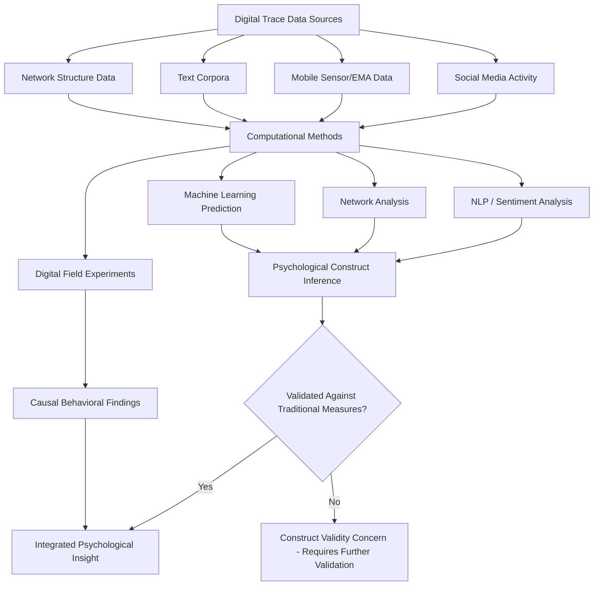

## Big Data and Computational Social Science

### Overview

Computational social science applies large-scale data collection, computational methods, and algorithmic analysis to social and psychological phenomena, complementing traditional experimental and survey-based social psychology. It draws on digital trace data (social media activity, search behavior, mobile sensor data), natural language processing, network analysis, and machine learning to study behavior at scales and in naturalistic settings not accessible to conventional lab-based methods.

### Defining Characteristics

- **Big data** in this context is typically characterized by volume (large N, often millions of observations), velocity (real-time or near-real-time generation), and variety (heterogeneous data types — text, network structure, geolocation, behavioral logs) rather than a strict size threshold
- **Computational social science** (Lazer et al., 2009, in a foundational Science article) was proposed as an emerging interdisciplinary field combining social science theory with computational methods to study human behavior via digital traces at unprecedented scale and granularity

### Data Sources

**Digital Trace Data**

- Social media activity: posts, likes, shares, follower networks, engagement timestamps
- Search engine query data (e.g., used in studies of collective attention, public health surveillance via search trends)
- E-commerce and financial transaction data (with appropriate access agreements)
- Mobile sensor data: GPS location traces, accelerometer data, call/text metadata (with informed consent and privacy protections)

**Experience Sampling and Ecological Momentary Assessment (EMA)**

- Smartphone-based repeated momentary self-report, enabling high-frequency, naturalistic measurement of mood, behavior, and context across the day, addressing recall bias inherent in retrospective single-timepoint surveys
- Often combined with passive sensor data streams for richer contextual measurement

**Administrative and Institutional Records**

- Linked administrative data (educational records, health records, employment data) offers large-N, long-term outcome tracking, though typically requires stringent data-use and privacy agreements

**Text as Data**

- Large corpora of naturally occurring text (social media posts, product reviews, transcribed speech, historical archives) analyzed via natural language processing to infer psychological constructs (sentiment, moral framing, linguistic markers of psychological states)

### Core Computational Methods

**Natural Language Processing (NLP)**

- Sentiment analysis: classifying text valence (positive/negative/neutral), used to study collective mood, political sentiment, and emotional contagion at scale
- Linguistic Inquiry and Word Count (LIWC): a widely used dictionary-based method mapping word usage onto psychologically meaningful categories (emotion words, cognitive process words, social words), used extensively in personality and social psychological text analysis
- Topic modeling (e.g., Latent Dirichlet Allocation): unsupervised discovery of latent thematic structure across large text corpora
- Transformer-based language models (e.g., BERT-family and large language model embeddings) increasingly used for more nuanced semantic and psychological construct extraction from text, representing a more recent methodological shift from earlier dictionary-based approaches

**Network Analysis**

- Social network analysis applied at scale: measuring structural properties (centrality, clustering, community detection) across networks with potentially millions of nodes
- Used to study diffusion processes (information/behavior spread), homophily, and structural predictors of influence
- Methods include graph-based centrality measures, community detection algorithms (e.g., modularity-based clustering), and diffusion/cascade modeling

**Machine Learning for Prediction and Measurement**

- Supervised learning applied to predict psychological outcomes (e.g., personality, mental health indicators) from digital footprint data (e.g., Kosinski, Stillwell, & Graepel's 2013 demonstration that Facebook "Likes" could predict a range of personal attributes with notable accuracy)
- Unsupervised and dimensionality-reduction methods for discovering latent behavioral or psychological patterns without a priori category specification

**Digital Field Experiments**

- Large-scale randomized experiments conducted directly on digital platforms (A/B testing infrastructure adapted for behavioral science questions), enabling causal inference at scales far exceeding traditional lab studies
- Notable examples include large-scale social influence and voting mobilization experiments conducted via platform partnerships (e.g., Facebook's 61-million-person voter mobilization experiment, Bond et al., 2012)

### Methodological Advantages

- **Ecological validity**: behavior measured in naturalistic settings rather than artificial lab environments, addressing external validity concerns common in traditional experimental social psychology
- **Statistical power**: very large sample sizes enable detection of small effect sizes and fine-grained subgroup/moderator analysis that would be infeasible with typical lab sample sizes
- **Temporal resolution**: high-frequency longitudinal data (e.g., daily or momentary measurement) enables study of within-person dynamics and temporal sequencing not observable in single-timepoint designs
- **Access to rare or sensitive behaviors**: digital traces can capture naturally occurring instances of behaviors difficult to elicit or observe ethically in controlled settings

### Methodological Challenges and Critiques

**Sample Representativeness**

- Digital trace data is frequently drawn from specific platform user populations that are not representative of the general population (skewed by age, socioeconomic status, geography, and platform-specific selection into use), limiting generalizability despite large absolute sample sizes — a distinction sometimes summarized as "big data, biased data"
- This constitutes a validity concern distinct from statistical power: a very large non-representative sample does not resolve generalizability limitations the way a large representative sample would

**Measurement Validity**

- Digital trace measures (e.g., inferring emotional state from word choice, or personality from "Likes") are often proxy measures whose construct validity relative to traditional, validated psychological instruments requires separate empirical verification rather than assumption
- The relationship between online behavioral traces and offline psychological states/behaviors is not always straightforward or stable across contexts and time

**Privacy and Ethics**

- Use of personal digital trace data raises substantial privacy concerns, particularly regarding informed consent (many platform Terms of Service-based data use does not constitute research-grade informed consent), data re-identification risk even from "anonymized" datasets, and downstream uses beyond original research purposes
- The 2014 Facebook emotional contagion study (Kramer, Guillory, & Hancock) — which manipulated news feed emotional content for ~700,000 users without traditional informed consent — generated substantial ethical controversy and prompted broader field discussion of appropriate consent and IRB oversight standards for platform-embedded research

**Reproducibility and Data Access**

- Much computational social science research depends on proprietary platform data or APIs, which can be modified, restricted, or discontinued by platform owners (a well-documented issue following various platform API policy changes), threatening both initial data access and long-term reproducibility/reanalysis
- Limited independent researcher access to platform-internal data (versus what companies choose to share or collaborate on) constrains the field's ability to conduct fully independent verification

**Algorithmic and Model Opacity**

- Machine learning models used for prediction or measurement (particularly complex models such as deep neural networks) can function as "black boxes," complicating psychological interpretation of what constructs are actually being captured versus spurious correlational patterns
- Explainable AI methods are an active area of methodological development aimed at addressing this interpretability gap [Inference: the maturity and adoption of these methods specifically within computational social science, as opposed to machine learning generally, is still developing]

### Integration with Traditional Social Psychology

- Computational methods are increasingly used as a complement to, rather than replacement for, traditional experimental methods: large-scale observational/computational findings generate hypotheses that are then tested via controlled experimentation, and experimental findings can be validated for real-world relevance using naturalistic digital trace data
- Mixed-methods designs combining EMA/sensor data with traditional validated psychological instruments help address the measurement-validity concerns noted above, anchoring novel digital measures to established constructs

### Diagram: Computational Social Science Research Pipeline (svg_diagram)

### Example

A research team wants to study collective emotional response to a major news event. Using computational social science methods, they collect millions of social media posts in the days surrounding the event, apply a validated sentiment/emotion-classification NLP model to each post, and track aggregate emotional trajectories over time at a temporal resolution (hourly) far finer than any feasible lab or survey study could achieve. To address representativeness concerns, they compare demographic patterns of the platform's user base against census data, and to address construct validity concerns, they validate their NLP classifier's output against a subsample manually coded by trained human raters using an established emotion coding scheme before drawing substantive psychological conclusions.

**Related Topics**

- Algorithmic curation and polarization
- Social psychology of misinformation
- Ecological momentary assessment and experience sampling methods
- Natural language processing methods in psychology (LIWC, topic modeling)
- Research ethics and informed consent in digital research contexts
- Causes and reforms following the replication crisis
- Social network analysis and diffusion modeling