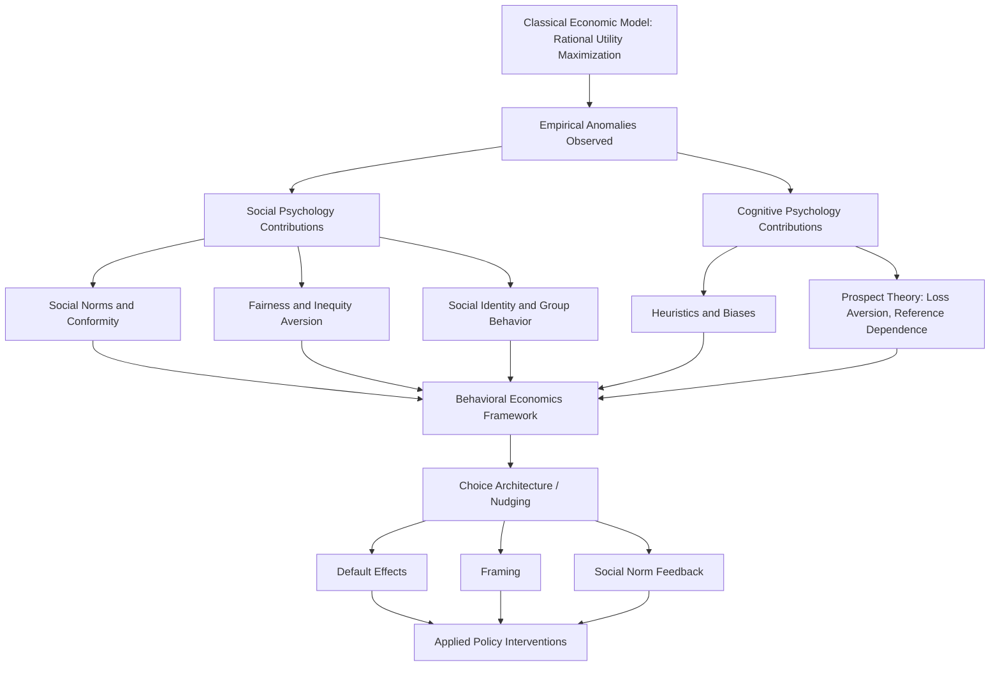

## Integration with Behavioral Economics

### Overview

Behavioral economics integrates psychological insight into economic modeling of decision-making, challenging the classical rational-agent assumption with empirically grounded accounts of systematic, predictable deviations from normative rationality. Social psychology and behavioral economics share substantial theoretical and methodological overlap, particularly around heuristics, biases, social preferences, and choice architecture, making this an area of deep cross-disciplinary integration relevant to applied social psychology.

### Historical and Theoretical Foundations

**Bounded Rationality**

Simon's (1955) concept of bounded rationality — the idea that human decision-making is constrained by limited cognitive resources, information, and time, leading to satisficing (choosing an adequate option) rather than optimizing — provided an early conceptual bridge between psychology and economics, challenging the classical homo economicus assumption of unlimited computational rationality.

**Heuristics and Biases Program**

Kahneman and Tversky's heuristics and biases research program (from the early 1970s onward) systematically documented predictable, replicable deviations from normative rational choice models, providing the core empirical foundation on which behavioral economics was subsequently built. Key contributions directly relevant to economic decision-making include:

- **Availability heuristic**: judging probability/frequency based on ease of mental retrieval of relevant instances
- **Representativeness heuristic**: judging probability based on similarity to a prototype, often neglecting base rates
- **Anchoring and adjustment**: insufficient adjustment away from an initial reference value when making numerical estimates

**Prospect Theory**

Kahneman and Tversky's (1979) prospect theory is the central formal model underlying much of behavioral economics, proposing that:

- Value is assessed relative to a reference point (gains and losses), not absolute wealth states
- **Loss aversion**: losses loom psychologically larger than equivalent gains (empirically estimated loss-aversion coefficients frequently cited in the range of roughly 1.5–2.5, though estimates vary considerably by domain and methodology)
- **Diminishing sensitivity**: the psychological impact of a given change diminishes as one moves further from the reference point, in both the gain and loss domains (producing risk-averse behavior for gains and risk-seeking behavior for losses of comparable magnitude — the classic "reflection effect")
- **Probability weighting**: people tend to overweight small probabilities and underweight large/moderate probabilities relative to their objective values, captured in a nonlinear probability weighting function

### Social-Psychological Contributions to Behavioral Economics

**Social Preferences and Fairness**

- Experimental economics paradigms such as the Ultimatum Game (where a proposer offers a division of a resource and a responder can accept or reject, with rejection resulting in both parties receiving nothing) robustly demonstrate that people reject unfair-but-payoff-positive offers, contradicting a pure self-interest-maximization model and demonstrating a preference for fairness/reciprocity
- Fehr and Schmidt's (1999) inequity aversion model formalized social-comparison-based utility, incorporating disutility from both disadvantageous inequity (envy) and advantageous inequity (guilt) — directly incorporating social comparison theory's psychological content into formal economic utility functions
- Reciprocity and trust: Berg, Dickhaut, and McCabe's (1995) Trust Game demonstrates that both trust extension and reciprocal trustworthy behavior exceed levels predicted by pure self-interest models, connecting to social psychology's literature on interpersonal trust

**Social Norms in Economic Behavior**

- Norm-based explanations for behaviors that deviate from pure incentive-maximization, such as costly punishment of norm violators even at a net personal cost to the punisher (altruistic punishment), connecting economic game behavior directly to social psychology's norm-enforcement and third-party sanctioning research
- Field applications directly borrow social-norms-intervention methodology from social psychology (e.g., descriptive/injunctive norm messaging in tax compliance and energy-conservation economic field experiments)

**Identity and Economic Behavior**

Akerlof and Kranton's identity economics framework incorporates social identity theory directly into utility functions, proposing that behavior consistent with one's social identity/group norms carries independent utility value, providing an economic formalization of social identity theory's behavioral predictions.

### Choice Architecture and Nudging

**Libertarian Paternalism**

Thaler and Sunstein's (2008) *Nudge* popularized the concept of choice architecture: the design of decision environments that predictably influence choices (leveraging heuristics and biases) while preserving formal freedom of choice — termed "libertarian paternalism."

**Common Nudge Mechanisms**

- **Default effects**: setting a default option that most people passively accept due to status quo bias and effort minimization — extensively applied to retirement savings (automatic enrollment) with well-documented, large effects on participation rates
- **Framing effects**: presenting logically equivalent choices in different terms (e.g., "90% survival rate" vs. "10% mortality rate") shifts preferences, directly drawing on prospect theory's reference-dependence
- **Social norm feedback**: descriptive/injunctive norm messaging (directly imported from social psychology, per the social-norms-interventions literature) applied to economic behaviors including energy consumption, tax compliance, and retirement saving
- **Simplification and salience**: reducing complexity and making relevant information more perceptually salient at the point of decision

**Evidence on Nudge Effectiveness**

- Meta-analyses of nudge interventions find generally positive but heterogeneous effects, with default-effect nudges among the most consistently large in magnitude, while other nudge types (e.g., simplification, social norm messaging) show more variable, context-dependent effect sizes
- Some large-scale replication and meta-analytic efforts (e.g., Mertens et al., 2022 meta-analysis, and subsequent registered-replication-style critiques) have found more modest pooled effect sizes than earlier, more influential individual studies suggested, echoing broader replication-crisis-era recalibration of effect size expectations across the behavioral sciences [Unverified: pooled estimates and the degree of publication-bias correction needed remain actively debated across competing meta-analyses]

### Methodological Cross-Pollination

- Experimental economics' emphasis on incentive-compatible designs (real monetary stakes tied to decisions) versus social psychology's more frequent reliance on hypothetical scenarios has prompted methodological cross-fertilization, with increased attention in social psychology to whether hypothetical-choice findings replicate under real-incentive conditions
- Game-theoretic paradigms (Ultimatum Game, Trust Game, Public Goods Game, Dictator Game) have become standard tools across both fields for studying social preferences, cooperation, and fairness under controlled, quantifiable conditions
- Field experiments, historically more central to applied economics, have become increasingly adopted within applied social psychology (e.g., social-norms energy-conservation field trials), reflecting convergent methodological standards around real-world behavioral outcome measurement

### Applications at the Intersection

- **Retirement savings and default enrollment**: combining loss aversion, status quo bias, and self-control/present-bias research to explain and improve low voluntary savings rates
- **Health behavior economics**: applying present-bias/hyperbolic discounting models (over-weighting immediate costs/rewards relative to delayed ones) to explain gaps between stated health intentions and behavior (e.g., smoking, exercise, medication adherence)
- **Tax compliance**: combining deterrence-based economic models with social-norms messaging (descriptive norm: "most people in your area pay their taxes on time") shown in field experiments (e.g., UK tax authority trials) to increase compliance beyond standard deterrence-only messaging
- **Public policy "nudge units"**: government behavioral insights teams (e.g., the UK's Behavioural Insights Team, and analogous units in other countries) institutionalizing behavioral-economics/social-psychology-informed policy design and testing via randomized field trials

### Diagram: Behavioral Economics as an Integration of Psychology and Economics (svg_diagram)

### Example

A retirement savings program faces low voluntary enrollment despite employees stating they intend to save more. Behavioral economics, integrating social psychology's status quo bias and loss aversion research, predicts that switching the default from opt-in to automatic enrollment (with an opt-out option preserving formal choice) will substantially increase participation — not because underlying preferences changed, but because default-acceptance and effort-minimization tendencies dominate passive decision-making. Adding a social-norm message ("87% of your coworkers are enrolled") — directly imported from social psychology's norms-intervention literature — can further increase enrollment by correcting misperceived descriptive norms about typical coworker behavior.

**Related Topics**

- Prospect theory and loss aversion
- Social norms interventions for health and sustainability
- Heuristics and biases in judgment and decision-making
- Choice architecture and libertarian paternalism
- Social identity theory and economic behavior
- Game-theoretic paradigms: Ultimatum Game, Trust Game
- Causes and reforms following the replication crisis (nudge effect size recalibration)