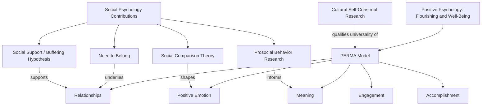

## Positive Psychology Intersections

### Overview

Positive psychology is the scientific study of the conditions, processes, and traits that enable individuals and communities to flourish, complementing psychology's traditional emphasis on dysfunction and pathology. Its intersection with social psychology examines how interpersonal relationships, group membership, social comparison, and social context shape well-being, meaning, and flourishing — situating positive outcomes within inherently social frameworks rather than purely individual ones.

### Founding Framework

**Seligman's Formulation**

Martin Seligman, widely credited with formally launching positive psychology as an organized subfield (notably in his 1998 American Psychological Association presidential address), proposed shifting research emphasis toward positive subjective experience, positive individual traits, and positive institutions, alongside — not replacing — the field's traditional study of mental illness and dysfunction.

**PERMA Model**

Seligman's later PERMA model identifies five core elements of well-being, several of which are explicitly social in nature:

- **P**ositive emotion
- **E**ngagement (flow states)
- **R**elationships (positive social connections — explicitly social-psychological in content)
- **M**eaning (belonging to and serving something larger than oneself, often social/collective in nature)
- **A**ccomplishment

### Core Constructs at the Social Psychology Intersection

**Subjective Well-Being and Social Comparison**

- Diener's tripartite model of subjective well-being (life satisfaction, positive affect, negative affect) is substantially shaped by social comparison processes, consistent with Festinger's social comparison theory — relative standing (income, achievement) relative to a reference group often predicts well-being more strongly than absolute standing, a pattern sometimes termed the Easterlin paradox in the income-happiness literature
- Social comparison direction matters: downward comparisons (to worse-off others) tend to boost well-being, while upward comparisons tend to depress it, though this is moderated by comparison domain relevance and individual differences in social comparison orientation

**Belongingness as a Fundamental Need**

Baumeister and Leary's (1995) "need to belong" thesis proposes that the need for frequent, positive, stable interpersonal relationships is a fundamental human motivation with wide-ranging effects on cognition, emotion, and behavior — providing a direct theoretical bridge between positive psychology's flourishing agenda and social psychology's relationship and belonging research.

**Social Support and Well-Being**

- Extensive social psychological literature links perceived and received social support to both psychological well-being and physical health outcomes, with perceived (rather than merely objectively available) support support showing particularly robust associations
- Buffering hypothesis: social support is theorized to buffer the negative well-being and health impact of stressors, with effects most pronounced under high-stress conditions

**Gratitude and Prosocial Behavior**

- Gratitude interventions (e.g., gratitude journaling, gratitude letters) show generally positive, if modest and sometimes short-lived, effects on well-being in intervention studies
- Gratitude is theorized to function partly through strengthening social bonds and reciprocal prosocial exchange (the "find-remind-and-bind" theory — Algoe, 2012), directly linking positive emotion research to social-relational psychological processes

**Prosocial Spending and Giving**

Dunn, Aknin, and Norton's (2008) research found that spending money on others (prosocial spending) produced greater increases in happiness than spending an equivalent amount on oneself, across both correlational and experimental (random assignment) designs, with subsequent research extending this finding cross-culturally with some moderation by cultural and economic context [Inference: cross-cultural generalizability and boundary conditions remain an active area of ongoing research].

### Flow and Optimal Experience

Csikszentmihalyi's flow construct — a state of complete absorption in an activity characterized by a balance of perceived challenge and skill — while originally conceptualized at the individual/task level, has been extended to social and group contexts ("social flow," collective absorption in shared group activities), connecting individual optimal-experience research to group cohesion and team-performance literatures in organizational and social psychology.

### Character Strengths and Virtues

- Peterson and Seligman's (2004) VIA Classification of Character Strengths and Virtues catalogued 24 strengths organized under six broader virtue categories, several explicitly interpersonal/social (e.g., kindness, fairness, teamwork, leadership), situating positive-psychology's trait-focused agenda within an inherently social framework
- Strength-use interventions (identifying and deliberately applying one's signature strengths) show modest positive associations with well-being outcomes in intervention research

### Positive Institutions and Group-Level Flourishing

- Positive psychology's "positive institutions" pillar (alongside positive traits and positive subjective experience) directly imports organizational and group-level social psychology, examining how workplace climate, leadership style, and organizational culture (topics central to organizational behavior) foster or inhibit collective flourishing
- Psychological safety in teams (Edmondson's construct — a shared belief that a team is safe for interpersonal risk-taking) links positive-psychology-adjacent flourishing outcomes to group-process research central to organizational social psychology

### Critiques and Complications

**Individualism Bias**

Early positive psychology has been critiqued for a Western, individualist framing of flourishing (self-actualization, personal happiness) that may inadequately capture more collectivist or relationally embedded conceptions of well-being prevalent in other cultural contexts — an important qualification given social psychology's own attention to cultural variation in self-construal (independent vs. interdependent self, per Markus and Kitayama's influential framework).

**The "Tyranny of Positivity" Critique**

Some scholars have critiqued excessive emphasis on positive emotion and optimism as potentially pathologizing negative emotion, and have argued for more nuanced models recognizing the functional, context-appropriate value of negative affect (e.g., appropriate grief, justified anger) — a critique with direct relevance to social psychological research on emotion regulation and social functionality of negative emotions.

**Empirical Rigor Concerns**

Positive psychology intervention research has faced some of the same methodological critiques (small samples, underpowered designs, publication bias favoring positive findings) documented in the broader replication crisis literature, with growing calls for open-science practices (preregistration, larger samples) specifically within positive-psychology intervention research [Inference: the extent to which this subfield's replication rate specifically has been the subject of dedicated large-scale replication projects, as opposed to broader psychology overall, is less thoroughly documented in publicly available sources].

### Applied Intersections

- **Workplace flourishing**: applying PERMA and strengths-based frameworks to organizational behavior interventions (employee engagement, job crafting to align tasks with signature strengths)
- **Community and civic well-being**: applying belongingness and social capital research (Putnam's social capital framework) to community-level flourishing interventions
- **Health psychology**: positive affect and optimism research intersecting with health behavior and illness-coping literatures, connecting to broader applied health psychology
- **Positive interventions in educational and organizational settings**: gratitude exercises, strength-spotting, and social-connection-building programs adapted from lab-based positive psychology findings into applied institutional contexts

### Diagram: Social Psychology's Contribution to Positive Psychology Constructs (svg_diagram)

### Example

A workplace well-being program based purely on individual-level positive psychology might teach employees personal gratitude journaling. An integration with social psychology would additionally target relational and belongingness mechanisms — for instance, structuring peer-recognition programs (leveraging need-to-belong and social-support research) alongside individual gratitude practice, and assessing team psychological safety (a group-level construct) as a contextual moderator of whether individual-level positive interventions actually translate into sustained workplace flourishing.

**Related Topics**

- Social comparison theory and subjective well-being
- Need to belong and interpersonal attachment
- Social support and the buffering hypothesis
- Prosocial behavior and spending research
- Organizational behavior and workplace dynamics
- Cultural self-construal (independent vs. interdependent self)
- Causes and reforms following the replication crisis (applied to positive psychology intervention research)