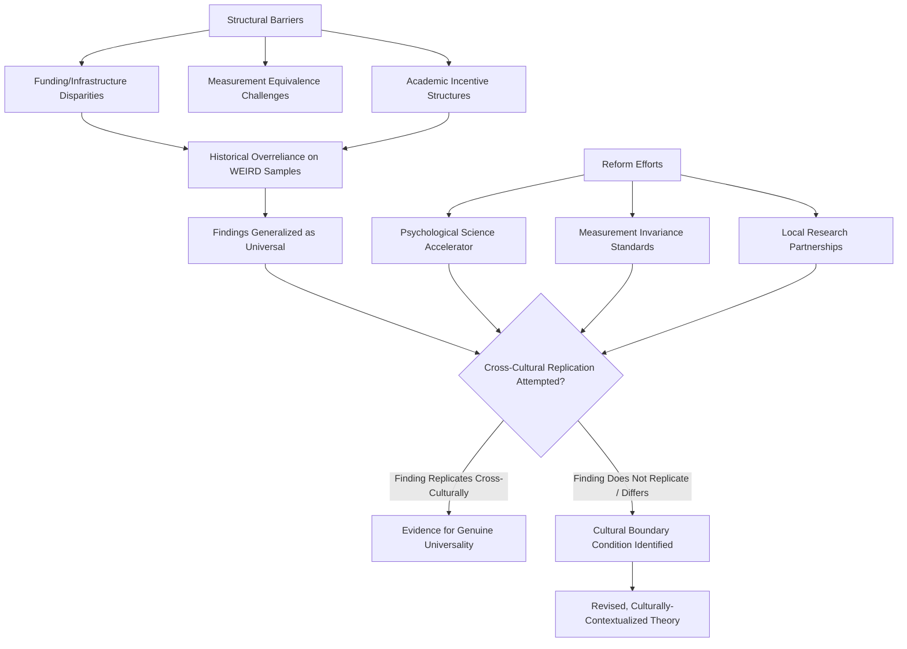

## Diversifying Samples Beyond WEIRD Populations

### Overview

This topic addresses a major methodological and validity concern in social psychology: the field's historical overreliance on Western, Educated, Industrialized, Rich, and Democratic (WEIRD) samples, and the resulting uncertainty about how well documented psychological findings generalize to the broader, far more culturally and demographically diverse global population. It has become a central concern in contemporary methodological reform, alongside (and interacting with) the replication crisis.

### The WEIRD Critique

**Origin of the Term**

Henrich, Heine, and Norenzayan's (2010) influential paper "The weirdest people in the world?" coined the WEIRD acronym and systematically documented that the overwhelming majority of psychological research participants were drawn from Western, Educated, Industrialized, Rich, and Democratic societies — a narrow and, on numerous measured psychological dimensions, statistically unusual slice of the global population — while research conclusions were routinely generalized as if reflecting universal human psychology.

**Empirical Documentation of Non-Representativeness**

Henrich et al. reviewed evidence across multiple domains (visual perception, e.g., susceptibility to certain optical illusions; fairness and cooperation, e.g., behavior in the Ultimatum Game; self-concept, e.g., independent vs. interdependent self-construal; moral reasoning; and more) showing that WEIRD populations often score at or near the extreme end of global distributions rather than representing a "typical" or modal human psychological profile — directly undermining the implicit assumption that WEIRD-sample findings reflect species-general, universal cognitive and social processes.

**Scope of the Sampling Problem**

- Meta-scientific audits of major psychology journals have repeatedly found that the substantial majority of published studies draw samples predominantly or exclusively from North American and Western European (frequently undergraduate university) populations
- Within WEIRD samples specifically, further overreliance on university undergraduate participants (a "captive," convenience-sampled population for many academic researchers) compounds the representativeness problem even within already-narrow WEIRD populations

### Theoretical Implications for Social Psychology

**Cultural Variation in Core Constructs**

- **Self-construal**: Markus and Kitayama's (1991) influential distinction between independent self-construal (self as bounded, autonomous, defined by internal attributes — more prevalent in individualist Western contexts) and interdependent self-construal (self as fundamentally relational, defined by social context and role — more prevalent in many East Asian, and various other, cultural contexts) demonstrates that even the basic psychological unit of analysis (the "self") is not culturally invariant
- **Individualism-collectivism**: Hofstede's and subsequent cross-cultural dimensions research documents systematic cross-national variation in the degree to which individual versus group-oriented values and cognition predominate, with downstream implications for numerous social psychological phenomena (conformity rates, attribution styles, motivation)
- **Attribution styles**: some cross-cultural research finds the fundamental attribution error, while present across cultures, shows systematic variation in magnitude, with some studies finding more pronounced situational attribution among individuals from more collectivist/interdependent cultural contexts relative to WEIRD samples — though the precise robustness and boundary conditions of this cross-cultural difference remain subject to ongoing empirical refinement [Unverified: cross-cultural attribution findings show some inconsistency across different measurement paradigms and specific study populations]

**Reexamining "Classic" Findings**

A number of foundational social psychology findings, originally established and long generalized from WEIRD (often North American) samples, have shown meaningfully different patterns, effect sizes, or even reversed directions when tested cross-culturally — reinforcing that cultural context is frequently not merely a minor moderator but can be central to a phenomenon's actual structure.

### Methodological and Structural Barriers to Diversification

**Resource and Infrastructure Disparities**

- Research funding, institutional infrastructure, and publication access remain heavily concentrated in wealthy, Western academic institutions, creating structural barriers to research being conducted by, and appropriately representing, researchers and populations from the Global South and other underrepresented regions
- Language barriers in both study materials/measures and publication (with English dominance in major journals) can constrain both participant access and researcher participation from non-English-speaking regions

**Measurement Equivalence Challenges**

- Translated psychological instruments do not automatically retain equivalent construct validity, reliability, or measurement properties across cultural and linguistic contexts — a concern formally addressed through measurement invariance testing, which is not uniformly applied across cross-cultural psychology research
- Some psychological constructs themselves may not translate cleanly across cultural frameworks (construct non-equivalence), requiring more than linguistic translation to achieve genuine cross-cultural comparability

**Academic Incentive Structures**

- Historical academic incentive and infrastructure patterns have made convenience sampling from local (frequently WEIRD, frequently undergraduate) populations the path of least resistance for many researchers, a structural inertia that diversification efforts must actively counteract rather than assume will self-correct

### Emerging Solutions and Reform Efforts

**Large-Scale Collaborative Networks**

- The **Psychological Science Accelerator**, a distributed global network of psychology laboratories, was explicitly founded in part to address the WEIRD-sample problem by enabling coordinated, large-scale, genuinely cross-national and cross-cultural data collection for hypothesis testing, pooling infrastructure that individual labs and regions could not achieve independently
- Similar large-scale international collaborative consortia (e.g., in specific subfields) have emerged with comparable explicit goals of sample diversification

**Methodological Standards**

- Growing expectation (though not yet universal) in journal review and funding processes for explicit sample description, justification of generalizability claims, and appropriate qualification of findings drawn from narrow (e.g., single-culture, single-university) samples
- Increased methodological emphasis on measurement invariance testing when comparing constructs across cultural groups, rather than assuming automatic equivalence of translated instruments

**Online and Platform-Based Data Collection**

- Online participant recruitment platforms (e.g., crowdsourced research panels) have expanded access to somewhat more geographically and demographically varied samples than traditional in-person university-lab recruitment, though these platforms carry their own distinct representativeness limitations (e.g., skewing toward populations with reliable internet access and platform-specific participant demographics) and do not fully resolve the underlying WEIRD-sample concern
- Mobile-based and low-infrastructure-requirement data collection methods are being developed to reduce technological barriers to studying populations in lower-resource settings

**Indigenous and Local Research Partnerships**

- Increased emphasis on genuine collaborative partnership with local researchers and communities (rather than extractive "parachute research" models where external researchers collect data without meaningful local involvement or benefit-sharing) as both an ethical and methodological improvement, since local researchers bring essential contextual and measurement-validity expertise

### Relationship to the Broader Replication Crisis

- The WEIRD-sample critique is conceptually distinct from, but methodologically intertwined with, the replication crisis: a finding can be a "true," replicable effect within WEIRD populations specifically while still being inappropriately over-generalized as a universal human psychological phenomenon
- Some replication failures for "classic" effects may partly reflect unacknowledged cultural boundary conditions in the original WEIRD-sample research, rather than the original finding being a pure statistical false positive — highlighting that sample diversification and standard replication are complementary, not redundant, reform priorities [Inference: the relative contribution of cultural boundary conditions versus original false-positive status varies by specific finding and is generally established through subsequent cross-cultural replication attempts]

### Diagram: The WEIRD Sample Problem and Reform Pathways (svg_diagram)

### Example

A classic conformity study establishing baseline conformity rates was originally conducted exclusively with WEIRD (American undergraduate) participants. A subsequent cross-cultural replication effort, coordinated through a large-scale collaborative network to ensure measurement equivalence via careful translation and invariance testing, finds meaningfully different conformity rates in a more collectivist cultural context. Under the WEIRD-diversification framework, this outcome would not be interpreted as the original finding being a "failed replication" in the pure statistical false-positive sense, but rather as evidence that cultural self-construal functions as a previously unacknowledged boundary condition — prompting a revised, culturally-contextualized theoretical account of conformity rather than outright rejection of the original finding.

**Related Topics**

- Cultural self-construal: independent vs. interdependent self
- Individualism-collectivism as a cross-cultural dimension
- Causes and reforms following the replication crisis
- Measurement invariance in cross-cultural research
- The Psychological Science Accelerator and large-scale collaboration
- Fundamental attribution error and cross-cultural variation
- Research ethics in cross-cultural and international research partnerships