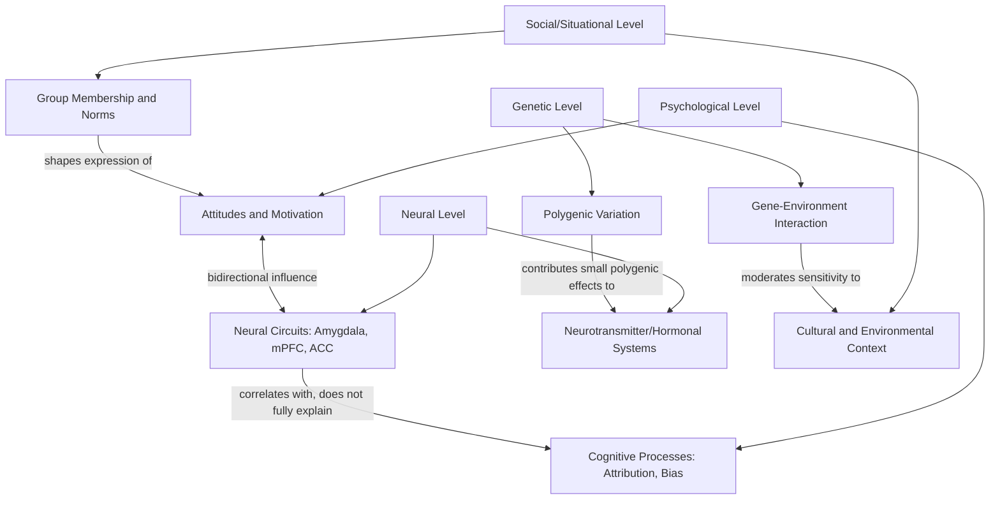

## Interdisciplinary Integration with Genetics and Neuroscience

### Overview

This topic examines the growing integration of social psychology with behavioral genetics and social/affective neuroscience, situating social psychological phenomena (attitudes, prejudice, prosocial behavior, group processes) within broader biological and neurocognitive frameworks. This integration has produced both substantial methodological advances and significant conceptual debates about levels of explanation and interpretive overreach.

### Social Neuroscience

**Defining the Field**

Social neuroscience, an interdisciplinary field emerging prominently from the 1990s onward (with Cacioppo and Berntson among its foundational figures), applies neuroscience methods — primarily functional magnetic resonance imaging (fMRI), electroencephalography (EEG), and related techniques — to study the neural mechanisms underlying social cognition and behavior.

**Key Domains of Investigation**

*Social Cognition and Theory of Mind*

- Neural correlates of mentalizing/theory of mind (inferring others' mental states), consistently associated with activity in the medial prefrontal cortex, temporoparietal junction, and posterior superior temporal sulcus across neuroimaging studies
- Mirror neuron system research, originally identified in macaque motor cortex and extended (with considerable ongoing debate about the human homolog's exact properties and functional role) to human action understanding and, more speculatively, empathy and imitation

*Intergroup Bias and Prejudice*

- Amygdala activity has been associated with automatic evaluative/threat-related responses to out-group faces in some neuroimaging studies, though the specificity of this response to prejudice per se (versus general novelty, uncertainty, or threat-detection processing) is contested, and amygdala activation should not be interpreted as a direct or exclusive "prejudice signature" [Inference: interpretive caution here reflects a broader methodological consensus in social neuroscience against simplistic reverse-inference from single regions to complex social constructs]
- Neuroimaging studies of intergroup empathy have found reduced neural empathic response (e.g., in anterior insula/anterior cingulate regions associated with pain-empathy) to out-group members' pain relative to in-group members' pain in some paradigms, offering a candidate neural correlate of the well-documented behavioral in-group empathy bias

*Social Pain and Rejection*

Eisenberger and Lieberman's influential (though since somewhat qualified) work proposed that social rejection/exclusion activates neural regions overlapping with physical pain processing (notably the anterior cingulate cortex), suggesting a shared neural substrate for social and physical pain — a finding that generated substantial subsequent debate and partial reinterpretation regarding the specificity of this overlap.

*Self-Referential Processing and Persuasion*

Medial prefrontal cortex activity during self-referential processing has been used in some studies to predict subsequent real-world behavior change (e.g., health message persuasion effects) beyond what self-report alone predicts, an application area sometimes termed "neuroforecasting."

### Methodological Considerations in Social Neuroscience

**The Reverse Inference Problem**

A central methodological caution in the field: inferring the presence of a specific psychological state or process from observed brain activation ("if region X is active, then process Y must be occurring") is logically weak unless that region is highly selectively associated with that process — a concern raised prominently by Poldrack (2006) — since most brain regions are implicated across many different psychological processes, undermining simplistic one-to-one activation-to-construct mappings often implied in popular science coverage of the field.

**Statistical and Sample Size Concerns**

- fMRI studies have historically often used small sample sizes (driven partly by high per-participant cost), raising power concerns paralleling broader replication-crisis issues in the behavioral literature
- Multiple-comparisons correction challenges (given the very large number of voxels tested) require careful statistical handling; historically inconsistent correction practices across the field prompted methodological reform efforts (e.g., following high-profile critiques of inadequate statistical correction methods)

**Convergent Validity with Behavioral Measures**

Best practice in the field increasingly emphasizes multi-method convergence — corroborating neural findings with behavioral, self-report, and (where feasible) real-world outcome measures — rather than treating neural data as an inherently more "objective" or privileged level of explanation relative to well-validated behavioral measures.

### Behavioral Genetics

**Twin and Family Study Designs**

- Classical twin study methodology (comparing trait similarity in monozygotic vs. dizygotic twins) has been applied to numerous social psychological constructs, including political orientation, prosocial tendencies, and personality traits with strong social-behavioral relevance
- Twin studies of political attitudes and ideology (e.g., Alford, Funk, & Hibbing, 2005) have reported meaningful heritability estimates for political orientation, prompting reconsideration of purely socialization-based accounts of ideological transmission — though these findings do not imply direct genetic determination of specific political positions, and heritability estimates describe population-level variance decomposition rather than individual-level causal determinism

**Molecular Genetics and Candidate Gene Studies**

- Earlier candidate-gene approaches (examining specific genes hypothesized a priori to relate to social behavior, e.g., oxytocin receptor gene variants and prosocial/trust behavior) have faced substantial replication difficulties, consistent with broader methodological concerns about underpowered candidate-gene designs across behavioral genetics generally
- Genome-wide association study (GWAS) approaches, requiring very large samples and examining genetic variation across the entire genome without a priori candidate selection, have become the field's methodological standard, generally finding that social-behavioral traits (like most complex behavioral traits) are highly polygenic — influenced by very large numbers of individual genetic variants each with very small individual effect sizes, rather than by single "genes for" specific social behaviors

**Gene-Environment Interaction**

- Increasing emphasis on gene-environment interaction (GxE) models, proposing that genetic predispositions moderate sensitivity to environmental/social influences rather than operating as independent, additive causal pathways — conceptually important for integrating behavioral genetics with social psychology's traditional emphasis on situational and contextual determinants of behavior
- Differential susceptibility models (an evolution of earlier "diathesis-stress" framings) propose that some genetic variants confer heightened sensitivity to *both* negative and positive environmental conditions, rather than simple vulnerability to adversity alone

### Interpretive and Ethical Considerations

**Levels-of-Explanation Concerns**

- A recurring conceptual concern in this interdisciplinary integration is maintaining appropriate levels of explanation: genetic and neural findings describe biological substrates and correlates of social behavior but do not, by themselves, negate or replace psychological/social-level explanatory frameworks (situational influence, socialization, culture) — these levels of analysis are generally understood as complementary rather than competing
- Popular science communication of both neuroscience and genetics findings has faced documented critique for overstating deterministic or reductionist interpretations relative to what the underlying (typically small-effect, probabilistic, interactive) findings actually support ("neuro-hype" and "genohype" critiques)

**Risk of Biological Essentialism**

- Particular caution is warranted when genetic or neural findings intersect with socially sensitive constructs (e.g., group differences, prejudice, aggression), given historical and ongoing risks of biological essentialism being used to naturalize or justify social inequality — a concern requiring active methodological and communicative vigilance rather than passive acknowledgment
- Behavioral genetics findings regarding heritability of traits with social significance require particularly careful interpretation, since heritability estimates are population- and context-specific statistics that do not translate straightforwardly into claims about between-group differences or immutability

### Integration with Core Social Psychological Theory

- Social neuroscience findings have been used to provide converging, multi-level evidence for established social psychological theories (e.g., neural correlates of cognitive dissonance processes, or of self-affirmation's stress-buffering effects), generally functioning as complementary validation rather than replacement of behavioral-level theory
- Behavioral genetics findings on the heritability of traits like extraversion and empathy have informed more nuanced models of individual differences in social behavior, moving beyond purely socialization-based accounts toward integrated bio-social developmental models

### Diagram: Levels of Analysis in Integrated Social Psychology (svg_diagram)

### Example

A researcher finds that individuals show greater amygdala activation when viewing out-group faces compared to in-group faces. A methodologically careful interpretation would avoid the reverse-inference error of concluding this single finding definitively demonstrates "the neural basis of prejudice," since amygdala activation is implicated in many non-prejudice-specific processes (general novelty detection, uncertainty, arousal). Instead, appropriate interpretation would treat this as one convergent piece of evidence, to be considered alongside behavioral prejudice measures, situational moderators (e.g., contact history, per intergroup contact theory), and gene-environment interaction research, within an integrated multi-level explanatory framework rather than as a standalone biological "explanation" of prejudice.

**Related Topics**

- Diversity, equity, and inclusion interventions
- Social identity theory and intergroup bias
- Twin studies and heritability estimation methodology
- The reverse inference problem in neuroimaging
- Causes and reforms following the replication crisis (fMRI power and statistics)
- Differential susceptibility and gene-environment interaction models
- Political psychology and ideology (heritability of political orientation)