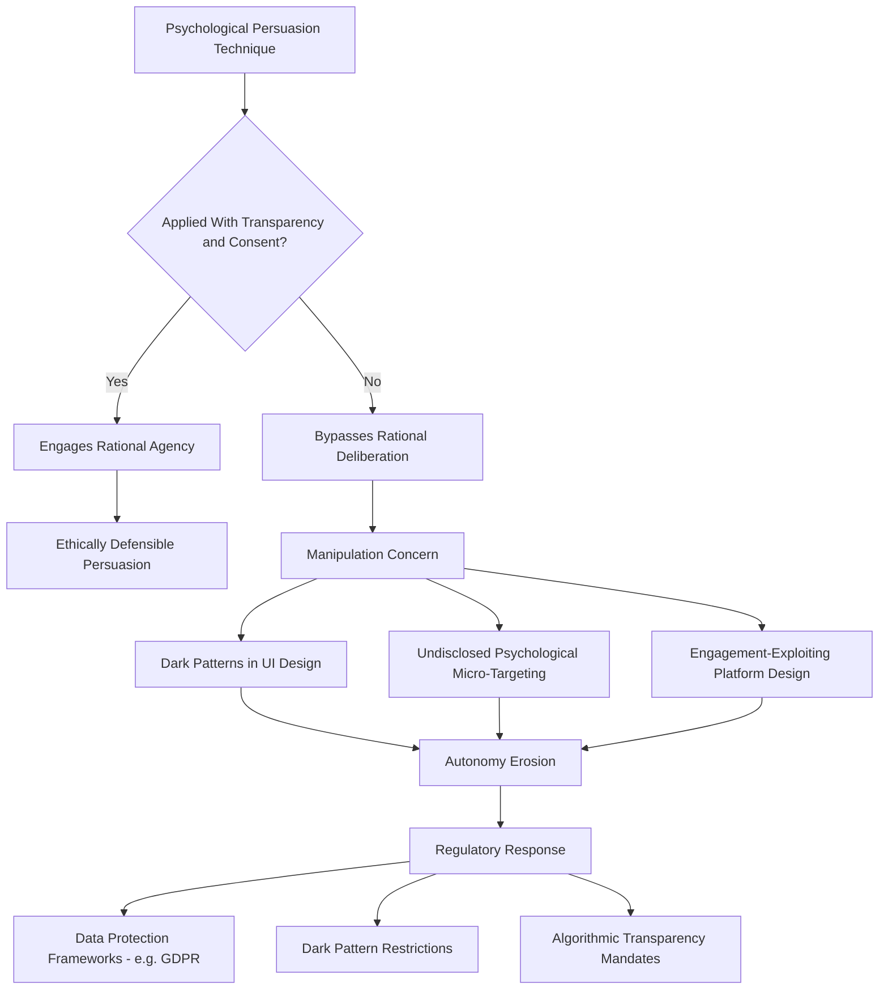

## Ethical Challenges of Persuasion Technology and Surveillance

### Overview

This topic examines the ethical issues arising from technologies that apply social psychological principles of influence, persuasion, and behavioral prediction at scale — particularly in digital advertising, platform design, political campaigning, and surveillance systems. It synthesizes classic social psychology persuasion theory with contemporary concerns about consent, autonomy, manipulation, and asymmetries of psychological knowledge and power.

### Foundational Ethical Concepts

**Persuasion vs. Manipulation**

- A core distinction in applied ethics: legitimate persuasion engages a target's rational agency (providing genuine reasons, information, or appeals the target can consciously evaluate and accept or reject), while manipulation exploits psychological vulnerabilities or biases to bypass rational deliberation, achieving influence the target would not endorse if fully aware of the mechanism being used
- This distinction is philosophically contested at the margins — heuristic-based persuasion techniques (e.g., framing, social proof) can occupy ambiguous territory between the two categories, since virtually all persuasion leverages some psychological mechanism rather than pure logical argumentation [Inference: precise philosophical boundary-drawing between acceptable persuasion and manipulation remains an active area of applied ethics scholarship without full consensus]

**Autonomy and Informed Consent**

- Classical research ethics frameworks (e.g., the Belmont Report's principle of respect for persons) require informed consent for psychological research manipulation; commercial and political applications of the same underlying psychological techniques typically operate outside formal research ethics oversight, creating a significant regulatory and ethical gap
- Digital platforms' Terms of Service agreements are widely critiqued as inadequate substitutes for genuine informed consent, given their length, complexity, and the practical reality that few users meaningfully read or understand what data use and psychological targeting they are consenting to

### Persuasion Technology in Digital Advertising

**Psychological Targeting**

- Research (e.g., Kosinski, Stillwell, & Graepel, 2013; Matz et al., 2017) demonstrated that digital footprint data (e.g., social media activity) can be used to infer psychological traits (personality dimensions, among others) with notable accuracy, and that advertising messages tailored to match inferred psychological profiles can increase persuasive effectiveness relative to non-tailored messaging
- This capability raises the ethical concern that individuals can be persuaded via psychologically tailored messaging without their awareness that such tailoring is occurring, differing qualitatively from traditional demographic-based advertising targeting in its exploitation of specific, often non-consciously-accessible psychological vulnerabilities

**Dark Patterns**

- User interface and choice-architecture designs deliberately engineered to exploit cognitive biases (e.g., default effects, artificial urgency/scarcity cues, deliberately confusing cancellation processes, pre-checked opt-in boxes) to produce outcomes favoring the platform/business over the user's likely genuine preference
- Directly inverts the "nudge for good" framing of libertarian paternalism from behavioral economics, applying identical psychological mechanisms (default effects, framing, social proof) toward outcomes that may not serve, and may actively work against, user welfare — raising the question of whether choice-architecture techniques are ethically neutral tools or carry an inherent risk profile requiring specific safeguards

**Engagement-Optimization and Attention Exploitation**

- Platform design (variable-ratio reward schedules in notification/feed design, infinite scroll, autoplay) has been critiqued for deliberately engineering compulsive engagement patterns using psychological principles derived from operant conditioning research, raising concerns about exploitation of attentional and self-control vulnerabilities, particularly for younger or more psychologically vulnerable users

### Political Micro-Targeting and Persuasion

**Case Study Concerns: Cambridge Analytica**

The 2018 Cambridge Analytica controversy — involving the unauthorized harvesting of Facebook user data (including data from users' friend networks who had not themselves consented) for alleged psychological profiling and politically targeted persuasion — became a widely cited case study crystallizing public and regulatory concern about psychological micro-targeting in political contexts, though the actual persuasive efficacy of the specific psychographic targeting methods used has been separately questioned and debated by researchers examining the underlying claims [Unverified: the precise causal impact of the specific psychographic-targeting techniques employed, as distinct from the data-privacy violations involved, remains contested in subsequent academic analysis].

**Concerns Specific to Political Persuasion**

- Political micro-targeting raises distinct concerns beyond commercial advertising: potential for different (even contradictory) messages to different micro-segments of an electorate, undermining shared public deliberation and the possibility of collective democratic accountability for a candidate's stated positions
- Reduced transparency: unlike traditional mass political advertising (visible to the broader public and press), highly targeted digital political messaging may be seen by only small, specifically selected audiences, complicating fact-checking, journalistic scrutiny, and public accountability

### Surveillance and Behavioral Prediction

**Surveillance Capitalism**

- Zuboff's (2019) influential (and contested) "surveillance capitalism" framework describes an economic logic in which human behavioral data is extracted, analyzed, and monetized — often without meaningful individual awareness or control — to produce increasingly refined behavioral prediction and modification products sold to third parties
- Critics of this framework have raised both empirical questions (about the actual predictive/persuasive power claimed) and conceptual questions (about whether "surveillance capitalism" represents a genuinely novel economic logic or an intensification of long-standing advertising and data-collection practices) [Unverified: the framework has generated substantial academic debate regarding its explanatory scope and precision]

**Workplace and Government Surveillance**

- Algorithmic workplace monitoring (productivity tracking, keystroke logging, sentiment analysis of employee communications) raises analogous psychological autonomy concerns in employment contexts, with documented associations between surveillance awareness and reduced trust, increased stress, and altered (sometimes performative rather than genuine) work behavior
- Government surveillance applications of behavioral prediction technology raise distinct civil-liberties concerns beyond the commercial/political persuasion context, particularly regarding predictive policing and social-credit-style behavioral scoring systems, which carry additional risks of embedding and amplifying existing societal biases present in training data

### Regulatory and Policy Responses

**Data Protection Frameworks**

- The European Union's General Data Protection Regulation (GDPR), effective 2018, established stronger consent, data-minimization, and purpose-limitation requirements for personal data processing, including specific provisions relevant to profiling and automated decision-making
- Subsequent and evolving regulatory frameworks in various jurisdictions (varying substantially in scope and enforcement mechanisms) reflect ongoing, still-developing policy responses to psychological-targeting and surveillance concerns, with significant cross-national variation in regulatory approach and stringency [Inference: the regulatory landscape is actively evolving and any specific current-state summary requires verification against up-to-date sources given the pace of policy change]

**Platform Design Accountability Proposals**

- Proposed regulatory approaches include mandated transparency for algorithmic targeting/curation systems, restrictions on specific dark-pattern design techniques, age-appropriate design requirements for platforms used by minors, and researcher data-access mandates to enable independent auditing of psychological-targeting claims and effects

### Ethical Frameworks for Evaluation

**Autonomy-Preservation Criteria**

Proposed ethical evaluation frameworks for persuasive technology commonly emphasize: (1) transparency of persuasive intent and mechanism, (2) preservation of the target's capacity for reflective, rational evaluation rather than pure exploitation of automatic/heuristic processing, (3) alignment (or at minimum non-conflict) between the persuasive outcome and the target's own authentic, reflectively-endorsed interests, and (4) meaningful, genuinely informed consent to the persuasive/data-collection process.

**Professional and Research Ethics Extension**

- Growing calls within applied social psychology for professional ethical guidelines specifically addressing psychologists' and behavioral scientists' involvement in commercial and political applications of persuasion research, extending beyond traditional human-subjects research ethics (which governs the original research) to the downstream deployment of resulting psychological knowledge

### Diagram: Ethical Dimensions of Persuasion Technology (svg_diagram)

### Example

A social media platform uses inferred personality data (derived from user behavioral traces) to select which of several psychologically tailored versions of a political advertisement each user sees, without disclosing that such tailoring is occurring or what psychological profile is being targeted. Applying the persuasion-versus-manipulation framework, this practice raises ethical concern not because psychological appeals are used (virtually all advertising does this) but because of the combined lack of transparency about the targeting mechanism and the exploitation of non-consciously-accessible personality inferences the user did not know were being used to shape the specific message they received — differing from traditional, more transparent demographic-based advertising in both mechanism and the user's capacity for informed awareness.

**Related Topics**

- Algorithmic curation and polarization
- Integration with behavioral economics (choice architecture and nudging)
- Big data and computational social science (data collection methods)
- Elaboration Likelihood Model and central/peripheral persuasion routes
- Research ethics and informed consent standards
- Social psychology of misinformation
- Data protection regulation and platform accountability policy