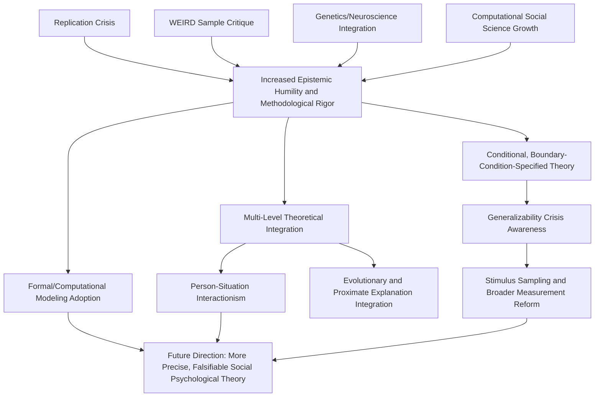

## Emerging Theoretical Integrations and Unresolved Debates

### Overview

This closing topic surveys the major cross-cutting theoretical integration efforts currently reshaping social psychology, alongside the field's significant unresolved conceptual and empirical debates. It synthesizes threads from across the discipline — methodology, biology, culture, technology — into a forward-looking assessment of where the field's theoretical frameworks are converging, fragmenting, or remaining contested.

### Major Integrative Movements

**The Person-Situation Integration**

- Social psychology's traditional situationist emphasis (demonstrated classically by findings like Milgram's obedience studies and the Stanford Prison Experiment, showing powerful situational influence over individual disposition) has increasingly integrated with personality psychology's trait-based, person-centered approaches, moving away from an earlier "person vs. situation" framing toward interactionist models
- Contemporary frameworks (e.g., Mischel's Cognitive-Affective Personality System, and subsequent trait-activation theories) propose that stable individual differences manifest as characteristic *patterns* of situation-contingent behavior (if-then behavioral signatures) rather than as context-independent global traits, offering a more empirically nuanced integration than either pure situationism or pure trait theory alone

**Levels-of-Analysis Integration**

- A recurring theme across contemporary social psychology (evident in the genetics/neuroscience integration, computational social science, and behavioral economics intersections) is explicit multi-level theorizing — connecting genetic, neural, psychological, interpersonal, and cultural/structural levels of explanation within unified frameworks rather than treating them as competing or mutually exclusive
- This integrative trend requires ongoing methodological development (e.g., statistical models capable of jointly modeling multi-level data) and continued vigilance against reductionist overreach at any single level (a concern raised specifically in the neuroscience-integration and behavioral-genetics contexts)

**Evolutionary Social Psychology**

- Evolutionary psychology's application to social behavior (mate selection, cooperation, status hierarchies, in-group/out-group psychology) offers ultimate (why did this psychological mechanism evolve) explanations that some researchers argue usefully complement proximate (how does this mechanism operate) explanations more traditionally central to social psychology
- This integration remains contested: critics raise concerns about the falsifiability of some evolutionary-adaptive narrative explanations (the "just-so story" critique), the field's own historical WEIRD-sample limitations undermining claims of species-universal adaptations, and the risk of naturalistic-fallacy-adjacent reasoning when evolutionary explanations are invoked in socially sensitive domains (e.g., gender differences, aggression) [Inference: the appropriate scope and rigor standards for evolutionary explanation in social psychology remain an actively contested methodological and philosophical question rather than a settled matter]

**Dual-Process and Beyond**

- Classic dual-process models (automatic/heuristic vs. controlled/deliberative processing, instantiated across attitude formation, persuasion, moral judgment, and stereotyping research) remain foundational but face increasing theoretical refinement and critique
- Some contemporary theorists argue the strict automatic/controlled dichotomy oversimplifies a more continuous or multiply-determined processing reality, and propose integrative frameworks incorporating context-dependent processing intensity, motivated processing shifts, and the substantial role of processing goals in determining which "mode" predominates in a given instance

### Persistent Unresolved Debates

**The Generalizability Crisis (Beyond Replication)**

- Beyond the narrower statistical replication crisis, a broader "generalizability crisis" concern (raised prominently by Yarkoni, 2020) questions whether even successfully replicated findings, typically demonstrated using specific stimuli, measures, and populations, can be confidently generalized to the broader conceptual constructs researchers intend to study, given that statistical inference is technically bound to the specific stimulus/item sample used unless formally modeled otherwise
- This has prompted methodological calls for stimulus sampling designs (using multiple, randomly-sampled stimuli rather than a single fixed stimulus set) and more conservative interpretation of single-study, single-stimulus-set findings

**Construct Proliferation and Jangle/Jingle Fallacies**

- The field continues to grapple with construct proliferation: highly overlapping psychological constructs given different names by different research traditions (the "jingle fallacy" — assuming same-named constructs are identical when they are not, and conversely the "jangle fallacy" — assuming differently-named constructs are distinct when they substantially overlap), complicating cumulative theory-building and meta-analytic synthesis across research traditions

**Theoretical Fragmentation vs. Unification**

- Ongoing tension between calls for greater theoretical unification/formalization (e.g., proposals for more formal, mathematically specified psychological theories enabling more precise, falsifiable predictions — a critique associated prominently with Meehl's earlier writings and revived in contemporary "theory crisis" discussions) and the field's continued proliferation of numerous mid-level, domain-specific theories with limited cross-theory integration
- Formal/computational modeling approaches (borrowing from cognitive science's more mathematically formalized modeling traditions) are increasingly proposed as one path toward greater theoretical precision, though adoption within mainstream social psychology remains at an early and uneven stage [Inference: the pace and ultimate extent of this methodological shift is not yet established]

**The Replication-Generalization-Boundary Condition Triad**

- A persistent interpretive challenge across the topics surveyed in this chapter: when a finding fails to replicate, or replicates with a different effect size in a different population, the field lacks fully standardized criteria for distinguishing among (a) the original finding being a statistical false positive, (b) an unacknowledged boundary condition/moderator (cultural, situational, or otherwise) being present, and (c) genuine measurement or methodological non-equivalence between the original and replication attempt — this ambiguity remains a live methodological and theoretical challenge rather than a resolved matter

**Ethics and Application Pacing**

- The rapid pace of applied technological deployment of social psychological principles (persuasion technology, algorithmic curation, computational social science methods) has generally outpaced the development of corresponding ethical, regulatory, and professional-guideline frameworks, an emerging and unresolved tension likely to remain a central concern for the field's near-term future

### Emerging Methodological Frontiers

- **Integrative data analysis**: pooling and jointly (re)analyzing raw data across multiple independent studies (rather than relying solely on summary-statistic meta-analysis) to increase statistical power and enable more rigorous moderator and boundary-condition testing
- **Machine learning integration**: growing use of machine learning methods not only for prediction (as in computational social science applications) but for theory-development purposes, including data-driven discovery of previously unrecognized moderators or subgroups within existing datasets — while requiring corresponding methodological caution against overfitting and false-discovery risk analogous to earlier p-hacking concerns in a new computational form
- **Formal and computational modeling**: increasing (if still limited) adoption of formal mathematical and computational models of specific social psychological processes (e.g., attitude dynamics, social influence spread), offering more precise, quantitatively falsifiable theoretical predictions than traditional verbal-conceptual theorizing

### A Synthesis Perspective

Social psychology's trajectory reflects a field in active, ongoing methodological and theoretical self-correction: the replication crisis catalyzed statistical and transparency reforms; the WEIRD-sample critique catalyzed sampling and generalizability reforms; and technological and biological integration efforts are catalyzing multi-level theoretical reforms. These movements share a common underlying thread — increased epistemic humility about the boundary conditions, generalizability limits, and appropriate levels of explanation for social psychological claims, replacing earlier tendencies toward confident, broadly generalized assertions with more conditional, context-specified, and empirically cautious theoretical frameworks [Inference: this synthesis represents an interpretive characterization of directional trends across the surveyed literatures rather than a single citable consensus statement].

### Diagram: Convergent Reform Pressures Shaping Contemporary Social Psychology (svg_diagram)

### Example

A researcher studying stereotype threat effects on academic performance encounters a nuanced pattern across the literature: original demonstrations, several successful replications, some failed replications, and evidence of cross-cultural variation in effect magnitude. Rather than concluding simply "the effect is real" or "the effect was a false positive," contemporary integrative practice would apply the replication-generalization-boundary-condition framework: examining whether failed replications differ systematically in population (WEIRD-sample considerations), stimulus/measure specifics (generalizability-crisis considerations), or reveal a genuine, theoretically specifiable moderator (e.g., domain identification strength) — producing a more conditionally specified, empirically calibrated theoretical account rather than a binary real/not-real verdict.

**Related Topics**

- Causes and reforms following the replication crisis
- Diversifying samples beyond WEIRD populations
- Interdisciplinary integration with genetics and neuroscience
- Big data and computational social science
- Person-situation debate and trait-activation theory
- Formal and computational modeling in psychological theory
- Ethical challenges of persuasion technology and surveillance