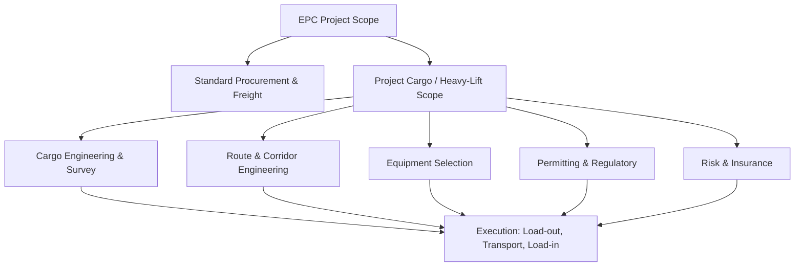

## Definition and Scope of Heavy-Lift and Specialized Logistics

### Definition

Heavy-lift logistics is the branch of freight transportation concerned with cargo that exceeds the weight, dimensional, or handling limits of standard containerized or break-bulk shipping methods. Specialized logistics extends this concept to cargo that, regardless of weight, requires non-standard handling due to value, fragility, hazard classification, configuration, or project-specific sequencing.

The two terms are often used together ("heavy-lift and specialized logistics" or HLSL) because in practice the same project cargo — a reactor vessel, a wind turbine nacelle, a gas turbine, a bridge girder — typically triggers both categories simultaneously: it is too heavy/oversized for conventional handling (heavy-lift) **and** requires engineered planning, permits, and bespoke equipment (specialized).

**Key Points**

- No single universal weight/dimension threshold exists; thresholds are defined by mode (ocean, road, rail, air), jurisdiction, and equipment capacity, not by a fixed global standard.
- Heavy-lift is a subset of the broader field known as "project cargo" or "project logistics."
- Classification triggers logistics complexity, not just physical handling: engineering surveys, route studies, permits, and specialized insurance are all downstream of classification.

### Common Classification Thresholds

While no single body sets a universal cutoff, several widely referenced operational thresholds are used across the industry:

| Criterion | Typical Threshold (Industry Convention) | [Unverified]/Context |
| --- | --- | --- |
| Ocean break-bulk "heavy-lift" | Single piece > 100 metric tons (MT) | Common carrier operational convention, not regulatory law |
| Road transport (US) | Gross vehicle weight > 80,000 lbs (36.3 MT) or width > 8.5 ft | Federal Bridge Formula / FHWA oversize threshold; [Unverified] varies by state |
| Road transport (EU) | Varies by member state; commonly > 44 MT gross or > 3.0 m width | [Unverified] — national road authorities set exact figures |
| Crane lift classification | "Heavy lift crane" often denotes capacity > 300–500 MT | Industry convention among crane operators, not a fixed standard |
| Air freight (chartered heavy) | Single piece > 40–50 MT (AN-124 class) | Determined by aircraft payload capacity, e.g., Antonov An-124 |

[Inference] These figures should be treated as operational conventions rather than codified international law, since heavy-lift classification is primarily driven by the physical capacity limits of available equipment (cranes, trailers, vessels) rather than by a treaty or regulatory definition.

### Scope of the Discipline

Heavy-lift and specialized logistics as a discipline covers a chain of interdependent functions, not a single service:

#### 1. Cargo Engineering and Survey

- Weight and center-of-gravity (CoG) determination
- Lifting point and lashing point verification (often requiring OEM structural drawings)
- Load-out and load-in engineering (ramps, skidding, jacking)

#### 2. Route and Corridor Engineering

- Swept-path analysis for oversized road convoys
- Bridge, culvert, and overhead clearance surveys
- Underground utility and overhead line clearance checks

#### 3. Equipment Selection

- Self-Propelled Modular Transporters (SPMT)
- Multi-axle hydraulic trailers (goldhofer, Nicolas, Scheuerle-type platforms)
- Heavy-lift cranes (crawler, mobile, ringer)
- Barges, semi-submersible vessels, and heavy-lift ships (e.g., Dockwise-type float-on/float-off vessels)
- Chartered outsized aircraft (An-124, C-17 class)

#### 4. Regulatory and Permitting

- Oversize/overweight (OS/OW) permits per jurisdiction
- Police/pilot car escort coordination
- Port and vessel stability approvals

#### 5. Risk and Insurance

- Marine cargo insurance for high-value single lots
- Rigging and lift-plan third-party engineering certification
- Delay-in-start-up (DSU) coverage for project-critical items

**Example**

A single gas turbine generator (GTG) module weighing 320 MT and measuring 12m x 5m x 6m being moved from a fabrication yard to a power plant site would require: (1) a lift/rigging engineering study, (2) SPMT or hydraulic trailer selection based on axle load limits, (3) a swept-path route survey from port to site, (4) OS/OW permits from multiple local government units along the corridor, (5) police escort scheduling, and (6) marine or inland transit insurance — each function performed by a different specialist but coordinated as one project logistics scope.

### Scope Boundaries: What Is Excluded

To scope the discipline correctly, it is useful to distinguish what falls *outside* heavy-lift/specialized logistics even though adjacent:

- **Standard containerized freight** (FCL/LCL) — handled through conventional intermodal systems, not project logistics.
- **Break-bulk cargo within crane/trailer standard capacity** — e.g., machinery under 25 MT moved via standard flatbeds, generally falls under conventional freight forwarding.
- **Bulk commodities** (grain, ore, liquid bulk) — a different discipline (bulk shipping) despite sometimes involving large tonnages, because bulk cargo has no discrete lift/engineering requirement per unit.
- **Hazmat-only shipments without oversize/overweight characteristics** — governed by dangerous goods regulations (IMDG, ADR, IATA DGR) rather than heavy-lift engineering, though the two frequently overlap in project cargo (e.g., a reactor with radiological classification).

### Relationship to Project Cargo and EPC Projects

Heavy-lift and specialized logistics is most commonly embedded within larger **Engineering, Procurement, and Construction (EPC)** projects — refineries, power plants, offshore platforms, infrastructure (bridges, dams), and renewable energy installations (wind turbine components, especially nacelles and blades which are oversized by length rather than weight).

### Industry Terminology Distinctions

| Term | Scope |
| --- | --- |
| **Heavy-lift** | Refers specifically to weight-driven handling challenges (cranes, vessels rated by tonnage) |
| **Oversized/OOG (Out-of-Gauge)** | Refers to dimensional challenges (exceeds standard container/trailer envelope) regardless of weight |
| **Project cargo** | Umbrella term covering any shipment requiring project-specific engineering and planning, whether driven by weight, size, value, or sequencing |
| **Breakbulk** | Non-containerized cargo loaded/discharged as individual units; heavy-lift is a subset of breakbulk when weight exceeds standard handling limits |

[Inference] These terms are frequently used interchangeably in commercial practice, but technically precise usage (as shown above) matters in contract scopes, insurance policies, and carrier tariffs, since a shipment can be oversized without being heavy, or heavy without being oversized (e.g., a small, dense forging).

### Illustrative Scope Diagram (svg_diagram)

<svg xmlns="http://www.w3.org/2000/svg" viewBox="0 0 760 420">
<text x="380" y="30" text-anchor="middle" font-size="18" font-weight="bold" fill="#1a1a1a">Heavy-Lift &amp; Specialized Logistics Scope (svg_diagram)</text>
<rect x="40" y="60" width="680" height="60" rx="6" fill="#e8f0fe" stroke="#4a72c4" stroke-width="1.5" />
<text x="380" y="95" text-anchor="middle" font-size="14" fill="#1a1a1a">Project Cargo (Umbrella Discipline)</text>
<rect x="60" y="150" width="200" height="80" rx="6" fill="#fef3e0" stroke="#d68a1e" stroke-width="1.5" />
<text x="160" y="180" text-anchor="middle" font-size="13" font-weight="bold">Heavy-Lift</text>
<text x="160" y="200" text-anchor="middle" font-size="11">Weight-driven</text>
<text x="160" y="216" text-anchor="middle" font-size="11">(cranes, vessel tonnage)</text>
<rect x="290" y="150" width="200" height="80" rx="6" fill="#e6f4ea" stroke="#2e7d46" stroke-width="1.5" />
<text x="390" y="180" text-anchor="middle" font-size="13" font-weight="bold">Oversized / OOG</text>
<text x="390" y="200" text-anchor="middle" font-size="11">Dimension-driven</text>
<text x="390" y="216" text-anchor="middle" font-size="11">(width, height, length)</text>
<rect x="520" y="150" width="200" height="80" rx="6" fill="#fce8e6" stroke="#c5372f" stroke-width="1.5" />
<text x="620" y="180" text-anchor="middle" font-size="13" font-weight="bold">Specialized Handling</text>
<text x="620" y="200" text-anchor="middle" font-size="11">Value / fragility / hazard</text>
<text x="620" y="216" text-anchor="middle" font-size="11">(sequencing-driven)</text>
<line x1="160" y1="120" x2="160" y2="150" stroke="#4a72c4" stroke-width="1.5" />
<line x1="390" y1="120" x2="390" y2="150" stroke="#4a72c4" stroke-width="1.5" />
<line x1="620" y1="120" x2="620" y2="150" stroke="#4a72c4" stroke-width="1.5" />
<rect x="150" y="280" width="460" height="110" rx="6" fill="#f3f0fa" stroke="#7a5cbf" stroke-width="1.5" />
<text x="380" y="305" text-anchor="middle" font-size="13" font-weight="bold">Execution Chain</text>
<text x="380" y="328" text-anchor="middle" font-size="11">Engineering Survey → Route Study → Equipment Selection</text>
<text x="380" y="348" text-anchor="middle" font-size="11">→ Permitting → Insurance → Load-out/Transport/Load-in</text>
<line x1="160" y1="230" x2="250" y2="280" stroke="#7a5cbf" stroke-width="1.2" />
<line x1="390" y1="230" x2="390" y2="280" stroke="#7a5cbf" stroke-width="1.2" />
<line x1="620" y1="230" x2="510" y2="280" stroke="#7a5cbf" stroke-width="1.2" />
</svg>

### Conclusion

Heavy-lift and specialized logistics is best understood not as a single service line but as a coordination discipline spanning cargo engineering, route planning, equipment provisioning, regulatory compliance, and risk management for freight that falls outside standard containerized or break-bulk handling capacity. Its scope is defined operationally — by the practical limits of available cranes, trailers, vessels, and permits in a given jurisdiction — rather than by one fixed global weight or dimension threshold.

**Related Topics**

- Industry Standards and Regulatory Bodies (IMO, AASHTO, national OS/OW permit regimes)
- Cargo Classification Systems (breakbulk vs. RoRo vs. heavy-lift vessel categories)
- Key Stakeholders in Heavy-Lift Projects (shippers, freight forwarders, EPC contractors, surveyors)
- Weight and Dimension Thresholds by Transport Mode (road, rail, ocean, air)
- Engineering Surveys and Route Studies (swept-path analysis, clearance surveys)
- Equipment Overview: SPMTs, Hydraulic Trailers, and Heavy-Lift Cranes