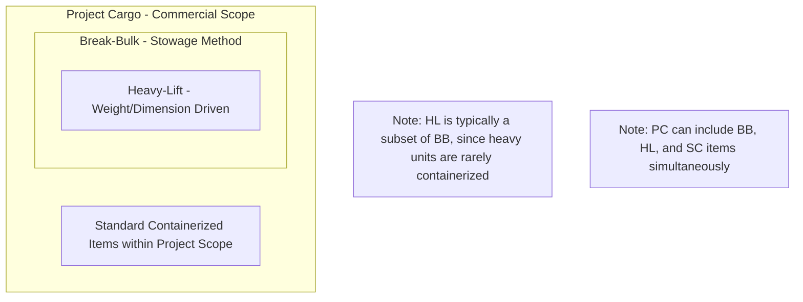

## Heavy-Lift Cargo versus Project Cargo versus Break-Bulk Cargo

### Overview

These three terms are frequently used interchangeably in commercial conversation, but each describes a distinct classification axis: break-bulk describes a **stowage/handling method**, heavy-lift describes a **weight/dimension characteristic**, and project cargo describes a **commercial/organizational framework**. A single physical shipment can belong to all three categories simultaneously, or to only one, depending on which axis is being evaluated.

**Key Points**

- Break-bulk = *how* cargo is stowed (unitized, non-containerized).
- Heavy-lift = *what* the cargo weighs/measures relative to standard handling limits.
- Project cargo = *why* the cargo is being moved (as part of a coordinated, engineered project scope).
- The three categories overlap heavily but are not synonymous; a shipment can be break-bulk without being heavy-lift, and project cargo without being either.

### Break-Bulk Cargo

**Definition**: Break-bulk refers to general cargo that is loaded, stowed, and discharged as individual units (crates, bags, bundles, drums, or pallets) rather than in intermodal containers or in bulk (loose, unpackaged commodity form).

**Characteristics**:

- Handled piece-by-piece using cranes, forklifts, or conveyors
- Historically the dominant ocean freight method prior to containerization (pre-1960s)
- Still used where cargo dimensions exceed container envelopes, or where port infrastructure lacks container handling equipment
- Includes items like steel coils, timber, machinery parts, bagged cement, and vehicles (when not RoRo)

**Example**: A shipment of 500 bagged cement sacks and 20 steel coils loaded loose into a vessel's hold, secured with dunnage and lashings, is break-bulk cargo — regardless of whether any single unit is heavy or oversized.

### Heavy-Lift Cargo

**Definition**: Heavy-lift cargo is any single piece or unit whose weight, dimensions, or handling requirements exceed conventional crane, trailer, or vessel gear capacity, necessitating specialized lifting or transport equipment.

**Characteristics**:

- Defined by physical/engineering limits, not by commercial framework
- Typically requires certified lift plans, rigging engineering, and CoG (center of gravity) documentation
- May be shipped via break-bulk vessels with heavy-lift cranes, semi-submersible vessels, or RoRo/float-on-float-off methods
- Common cargo types: transformers, reactors, turbine generators, bridge sections, mining equipment, offshore modules

**Example**: A 450 MT power transformer requiring a heavy-lift crane vessel and shore-based gantry crane for load-out is heavy-lift cargo. It is also, by definition, break-bulk (since it isn't containerized), but it is not automatically "project cargo" unless it is part of a coordinated multi-shipment project scope.

### Project Cargo

**Definition**: Project cargo refers to shipments — of any size or weight — that are planned, engineered, and executed as part of a defined capital project (e.g., an EPC contract), typically involving multiple interdependent shipments, coordinated scheduling, and centralized logistics management tied to a construction or installation timeline.

**Characteristics**:

- Defined by commercial/contractual context, not physical characteristics
- Often includes a mix of cargo types: some heavy-lift, some standard containerized, some break-bulk
- Requires logistics coordination against a construction critical path (just-in-time delivery to avoid site storage costs or schedule delays)
- Frequently governed by a single freight forwarder or project logistics contractor managing the entire multi-modal scope

**Example**: An EPC contractor building a combined-cycle power plant may have a "project cargo" scope covering the turbine (heavy-lift, break-bulk), structural steel (break-bulk, not heavy-lift), control room electronics (standard containerized, neither break-bulk nor heavy-lift), and consumables (standard container freight). All of these ship under one coordinated project logistics plan, making the *entire scope* project cargo even though only part of it is heavy-lift or break-bulk.

### Comparative Table

| Attribute | Break-Bulk | Heavy-Lift | Project Cargo |
| --- | --- | --- | --- |
| Classification basis | Stowage method | Weight/dimension | Commercial/project framework |
| Containerized? | No (by definition) | Sometimes (rare, only for smaller heavy units) | Can include containerized items |
| Requires special equipment? | Sometimes | Almost always | Sometimes, varies by shipment |
| Defined by single shipment or whole scope? | Single shipment/unit | Single shipment/unit | Whole project scope (multiple shipments) |
| Governing concern | Cargo handling method | Physical/engineering limits | Schedule coordination, contract management |
| Example | Bagged cement, timber bundles | 450 MT transformer | Full EPC plant logistics package |

### Venn Relationship

[Inference] The diagram above reflects common industry practice, where heavy-lift units are almost always handled as break-bulk (since standard containers cannot accommodate their weight/dimensions), while project cargo scopes typically span all three categories because a single capital project generates a mix of cargo types.

### Illustrative Overlap Diagram (svg_diagram)

<svg xmlns="http://www.w3.org/2000/svg" viewBox="0 0 700 460">
<text x="350" y="30" text-anchor="middle" font-size="18" font-weight="bold" fill="#1a1a1a">Cargo Classification Overlap (svg_diagram)</text>
<ellipse cx="350" cy="260" rx="300" ry="170" fill="#e8f0fe" stroke="#4a72c4" stroke-width="1.5" opacity="0.6" />
<text x="350" y="110" text-anchor="middle" font-size="14" font-weight="bold" fill="#1a1a1a">Project Cargo</text>
<text x="350" y="128" text-anchor="middle" font-size="11" fill="#333">(commercial/project scope)</text>
<ellipse cx="300" cy="290" rx="200" ry="120" fill="#fef3e0" stroke="#d68a1e" stroke-width="1.5" opacity="0.7" />
<text x="220" y="200" text-anchor="middle" font-size="13" font-weight="bold" fill="#1a1a1a">Break-Bulk</text>
<text x="220" y="216" text-anchor="middle" font-size="10" fill="#333">(stowage method)</text>
<ellipse cx="330" cy="320" rx="110" ry="70" fill="#fce8e6" stroke="#c5372f" stroke-width="1.5" opacity="0.85" />
<text x="330" y="315" text-anchor="middle" font-size="12" font-weight="bold" fill="#1a1a1a">Heavy-Lift</text>
<text x="330" y="332" text-anchor="middle" font-size="10" fill="#333">(weight/dim)</text>
<circle cx="530" cy="240" r="45" fill="#e6f4ea" stroke="#2e7d46" stroke-width="1.5" opacity="0.85" />
<text x="530" y="238" text-anchor="middle" font-size="11" font-weight="bold" fill="#1a1a1a">Standard</text>
<text x="530" y="253" text-anchor="middle" font-size="10" fill="#1a1a1a">Container</text>

<text x="350" y="420" text-anchor="middle" font-size="11" fill="#555">All three cargo types can coexist under one Project Cargo scope</text>

</svg>

### Common Misconceptions

- **"Heavy-lift and project cargo are the same thing."** False — a small, high-value satellite component moved via air charter as part of a phased launch project is project cargo but not heavy-lift.
- **"Break-bulk always means heavy or oversized."** False — bagged, palletized, or crated general cargo can be break-bulk while being well within standard crane and forklift capacity.
- **"Project cargo is always ocean freight."** False — project cargo scopes frequently combine ocean, road, rail, barge, and air legs within a single coordinated plan.

**Example (Combined Scenario)**

An offshore wind farm installation project ships: (1) monopile foundations (break-bulk, heavy-lift — 1,200 MT each), (2) nacelles (break-bulk, heavy-lift by dimension though lighter by weight), (3) tower sections (break-bulk, not always heavy-lift depending on segment weight), and (4) SCADA control cabinets (standard containerized, neither break-bulk nor heavy-lift). The entire installation logistics package is managed as one **project cargo** contract, demonstrating how all three classifications can coexist within a single capital project.

### Conclusion

Distinguishing these three terms by their classification axis — stowage method (break-bulk), physical characteristics (heavy-lift), and commercial framework (project cargo) — prevents scope confusion in contracts, insurance policies, and carrier tariffs. In practice, most real-world heavy industrial shipments sit at the intersection of all three, but precise terminology matters when negotiating freight contracts, since rates, insurance terms, and liability structures differ significantly across the three classifications.

**Related Topics**

- RoRo (Roll-on/Roll-off) and Fo/Fo (Float-on/Float-off) Shipping Methods
- Containerized vs. Non-Containerized Freight Economics
- EPC Contract Structures and Logistics Scope Definition
- Cargo Insurance Distinctions by Classification Type
- Vessel Types for Break-Bulk and Heavy-Lift Shipping