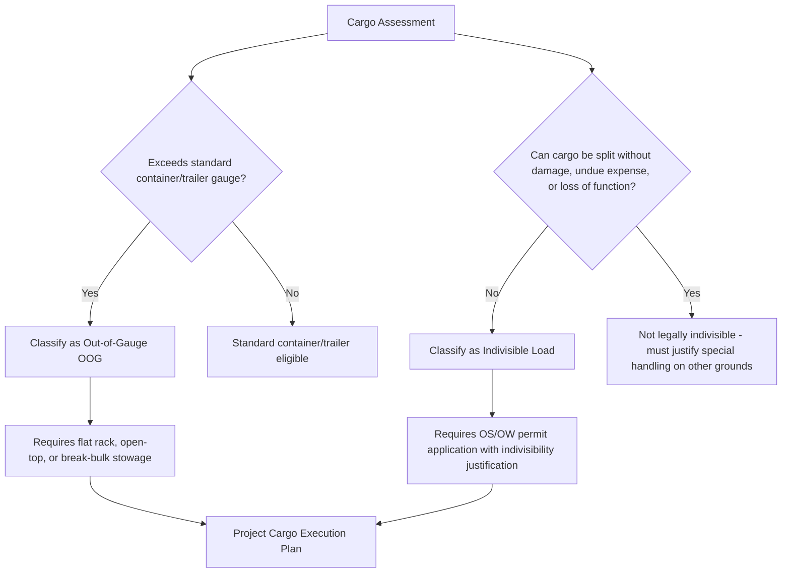

## Out-of-Gauge and Indivisible Load Concepts

### Definition

**Out-of-Gauge (OOG)** cargo refers to freight whose dimensions — length, width, or height — exceed the standard envelope of a shipping container or standard trailer, requiring it to protrude beyond the normal loading gauge even if its weight is unremarkable. **Indivisible load** (also called "abnormal indivisible load" or AIL in UK/EU regulatory language) refers to a load that cannot be broken down into two or more smaller loads for the purpose of transport without: (a) undue expense, (b) risk of damage, or (c) loss of the item's function/integrity.

Both concepts exist to answer the same underlying regulatory question: *why can't this cargo simply be split into standard-sized, standard-weight units for shipping?* OOG addresses the dimensional answer; indivisibility addresses the structural/functional answer, and the two frequently apply to the same cargo simultaneously.

**Key Points**

- OOG is a dimensional classification tied to container/trailer gauge standards.
- Indivisibility is a legal/regulatory classification tied to permitting frameworks (especially in road transport law).
- A load can be OOG without being indivisible (theoretically splittable but shipped oversized for cost/schedule reasons is rare but possible), and indivisible without being OOG (a load that fits within gauge but cannot be split due to structural integrity, e.g., a single-piece casting within container dimensions but too heavy to divide).
- Indivisibility is often the *legal justification* required to obtain oversize/overweight (OS/OW) transport permits.

### Out-of-Gauge (OOG) Cargo

**Sub-Categories** (Standard Ocean Freight Terminology):

| Term | Description |
| --- | --- |
| **OOG (general)** | Cargo exceeding standard container dimensions in any axis |
| **Overheight** | Exceeds standard container height (typically > 2.69 m internal height for a standard 40' HC container) |
| **Overwidth** | Exceeds standard container width (typically > 2.35 m internal width) |
| **Overlength** | Exceeds standard container length (requires flat rack or open-top with overhang) |
| **Overweight** | Exceeds standard container payload rating (typically 26–30 MT depending on container type and carrier) |

**Handling Equipment for OOG Ocean Cargo**:

- **Flat rack containers**: no side walls or roof, allowing overwidth and overheight cargo, cargo is lashed directly to the flat rack base
- **Open-top containers**: no roof, allowing overheight cargo loaded from above by crane, side walls remain
- **Platform/skeletal flat racks**: used for extreme overwidth/overlength cargo, often paired end-to-end for extra-long items
- **Break-bulk vessel space**: for cargo too large for any flat rack configuration, requiring vessel hold or deck stowage

**Example**: A wind turbine blade measuring 65m in length cannot fit any standard container or flat rack combination and is shipped as project break-bulk cargo, typically on a specialized blade trailer/dolly system rather than via container at all. A smaller item — a 14m-long pressure vessel exceeding the 40 ft (12.2m) standard container length — would be shipped OOG on a flat rack with overhang, secured with engineered lashing at both ends.

### Indivisible Load Concept

**Regulatory Basis** (illustrative, jurisdiction-dependent):

Most road transport regulatory frameworks define an "abnormal indivisible load" using tests similar to:

1. The load cannot be divided into two or more loads for transport without undue expense or risk of damage, **and**
2. Dividing it would compromise its intended use or function

[Unverified] Exact statutory thresholds and definitions vary significantly by country — e.g., UK STGO (Special Types General Order) categories, US state-by-state permit rules, and EU member-state road codes each define indivisibility slightly differently. Practitioners must verify the specific jurisdiction's legal test before relying on an indivisibility claim to obtain permits.

**Why Indivisibility Matters**:

- Regulatory bodies generally require shippers to prove indivisibility before granting oversize/overweight (OS/OW) road permits, because permits exist as an *exception* to standard weight/dimension limits, not a default option.
- Without demonstrating indivisibility, an authority may require the shipper to break the cargo down into standard truckloads instead of issuing a special permit — this is a common point of regulatory friction on project cargo tenders.
- Indivisibility documentation (engineering justification, OEM drawings, structural analysis) is typically a required annex in the permit application package.

**Example**: A single-cast steel mill roll weighing 90 MT is inherently indivisible — cutting it would destroy its function. This is a straightforward indivisibility case. Contrast this with modular data center equipment that is normally shipped disassembled: if a shipper instead wants to move it pre-assembled as one oversized unit (for schedule reasons), they may need to justify indivisibility to the permitting authority, since the cargo is not *inherently* indivisible even though disassembly may be costly or introduce commissioning risk.

### Interaction Between OOG and Indivisibility

### Practical Documentation Requirements

When classifying cargo as OOG and/or indivisible, project logistics teams typically compile:

1. **Dimensional data sheet**: length, width, height, weight, and center of gravity (CoG)
2. **OEM/manufacturer confirmation of indivisibility**: a letter or technical note from the equipment manufacturer confirming the item cannot be disassembled without compromising function or voiding warranty
3. **Structural/rigging drawings**: identifying lift points, sling angles, and load distribution
4. **Route feasibility pre-check**: confirming that OOG dimensions are physically passable along the intended corridor (bridge clearances, road width, turning radii) before committing to a transport method

**Example**

For a 6.2m-wide transformer (exceeding most single-lane road width limits), the logistics team would compile a dimensional data sheet, obtain an OEM letter confirming the transformer cannot be split into smaller components without damaging internal windings, and commission a swept-path route survey identifying every point along the route where the 6.2m width might conflict with barriers, signage, or oncoming traffic lanes — before applying for the OS/OW permit with the relevant road authority.

### Illustrative Gauge Comparison (svg_diagram)

<svg xmlns="http://www.w3.org/2000/svg" viewBox="0 0 700 380">
<text x="350" y="30" text-anchor="middle" font-size="18" font-weight="bold" fill="#1a1a1a">Standard Gauge vs. Out-of-Gauge Cargo (svg_diagram)</text>
<rect x="80" y="80" width="180" height="100" fill="none" stroke="#4a72c4" stroke-width="2" stroke-dasharray="4,4" />
<text x="170" y="70" text-anchor="middle" font-size="12" fill="#333">Standard Container Envelope</text>
<rect x="95" y="95" width="150" height="70" fill="#e8f0fe" stroke="#4a72c4" stroke-width="1.5" />
<text x="170" y="135" text-anchor="middle" font-size="11" fill="#1a1a1a">Fits within gauge</text>
<rect x="380" y="80" width="180" height="100" fill="none" stroke="#c5372f" stroke-width="2" stroke-dasharray="4,4" />
<text x="470" y="70" text-anchor="middle" font-size="12" fill="#333">Standard Container Envelope</text>
<polygon points="365,60 590,60 610,200 345,200" fill="#fce8e6" stroke="#c5372f" stroke-width="1.5" opacity="0.7" />
<text x="470" y="135" text-anchor="middle" font-size="11" fill="#1a1a1a">Exceeds gauge (OOG)</text>
<text x="470" y="215" text-anchor="middle" font-size="11" fill="#c5372f">Protrudes beyond standard envelope</text>
<line x1="80" y1="260" x2="260" y2="260" stroke="#2e7d46" stroke-width="3" />
<line x1="380" y1="260" x2="560" y2="260" stroke="#2e7d46" stroke-width="3" />
<circle cx="470" cy="260" r="6" fill="#2e7d46" />
<text x="470" y="245" text-anchor="middle" font-size="10" fill="#2e7d46">CoG marker</text>

<text x="350" y="320" text-anchor="middle" font-size="12" font-weight="bold" fill="`#1a1a1a`">Indivisibility Test</text>

<text x="350" y="345" text-anchor="middle" font-size="11" fill="#333">Can this item be split without damage or loss of function?</text>

<text x="350" y="363" text-anchor="middle" font-size="11" fill="#333">No -&gt; Indivisible Load -&gt; Requires OS/OW Permit Justification</text>

</svg>

### Conclusion

Out-of-gauge and indivisible load are related but analytically distinct concepts: OOG is a dimensional/physical classification governing which stowage and transport equipment can be used, while indivisibility is a legal/regulatory classification governing whether a shipper is entitled to an oversize/overweight transport exemption. Both concepts routinely apply together on the same cargo item, and both require dedicated documentation — dimensional data sheets for OOG, and OEM indivisibility justification for permits — as standard components of any heavy-lift project logistics package.

**Related Topics**

- Oversize/Overweight (OS/OW) Permit Application Processes by Jurisdiction
- Flat Rack and Open-Top Container Stowage Techniques
- Swept-Path Analysis and Route Survey Methodology
- Rigging Engineering and Lift Point Certification
- Regulatory Frameworks: UK STGO, US State OS/OW Rules, EU Abnormal Load Directives