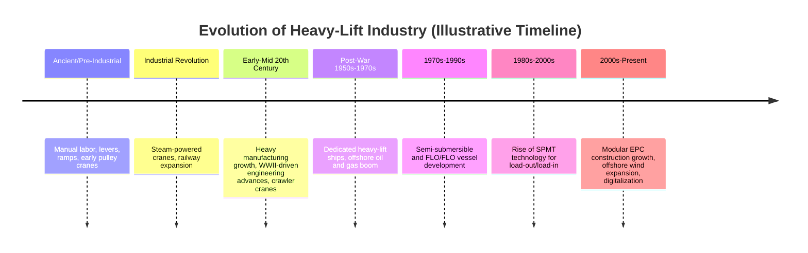

## History and Evolution of the Heavy-Lift Industry

### Overview

The heavy-lift industry evolved from ancient manual and mechanical lifting techniques into a highly engineered, multi-modal global discipline. Its development tracks closely with three parallel forces: advances in crane and rigging engineering, the industrialization of energy and infrastructure projects (which created demand for oversized single-piece equipment), and the maturation of specialized maritime and road transport equipment. [Inference] The following timeline synthesizes widely documented industry milestones; exact dates for early historical periods should be treated as approximate given the scarcity of precise primary-source records for ancient and medieval lifting techniques.

**Key Points**

- Heavy-lift as an industry (distinct from lifting as a construction technique) emerged primarily in the 20th century, driven by industrialization and energy infrastructure.
- Maritime heavy-lift shipping developed largely post-WWII, accelerating with the offshore oil and gas boom of the 1960s-1980s.
- Modern SPMT (Self-Propelled Modular Transporter) technology, a defining tool of the modern era, emerged in the late 20th century and transformed load-out/load-in operations.
- Renewable energy (particularly offshore wind) is the primary driver of industry innovation and fleet investment in the current era.

### Timeline of Major Developments

#### Ancient and Pre-Industrial Era

- Lifting of massive stone structures (pyramids, temples, monoliths) relied on manual labor, levers, ramps, and rudimentary pulley systems. [Unverified] The precise engineering methods used in ancient monumental construction (e.g., Egyptian pyramids, Stonehenge) remain subjects of ongoing archaeological debate rather than settled fact.
- Roman engineering introduced more systematic use of cranes (the *polyspastos*, a multi-pulley treadwheel crane) for construction of temples, aqueducts, and public works.

#### Industrial Revolution (18th–19th Century)

- Steam-powered cranes and hoists replaced manual and animal-powered lifting for the first time, enabling significantly larger single lifts.
- Railway expansion drove development of heavier rolling stock and specialized rail-mounted cranes for bridge and locomotive assembly.
- Early dockside cranes at major ports began handling larger break-bulk cargo as steamship trade expanded.

#### Early-to-Mid 20th Century

- Growth of heavy manufacturing (shipbuilding, steel production, power generation) created demand for moving large single-piece equipment — boilers, generators, turbines — between fabrication yards and installation sites.
- World War II significantly accelerated crane and rigging engineering due to wartime shipbuilding and infrastructure demands, and left behind a surplus of military transport equipment later adapted for civilian heavy-haul use.
- Crawler cranes began to emerge as a distinct heavy-lift equipment category, offering greater stability on uneven ground than wheeled mobile cranes.

#### Post-War Maritime Heavy-Lift Expansion (1950s–1970s)

- Dedicated heavy-lift ships began to emerge as a distinct vessel category, equipped with high-capacity onboard cranes for handling break-bulk cargo without reliance on shore infrastructure.
- The global offshore oil and gas boom (beginning in the 1960s-70s, particularly in the North Sea, Gulf of Mexico, and Middle East) created massive demand for moving offshore platform modules, jackets, and topsides — cargo often in the thousands of metric tons.

#### Semi-Submersible and Float-On/Float-Off (FLO/FLO) Vessel Development (1970s–1990s)

- Semi-submersible heavy-lift vessels were developed to transport entire offshore platforms, drilling rigs, and other vessels by partially submerging the carrier vessel, floating the cargo into position, then de-ballasting to lift it clear of the water.
- This technology enabled transport of cargo far exceeding the capacity of any onboard or shore crane, since the vessel itself becomes the "lifting" mechanism via buoyancy rather than mechanical hoisting.
- [Inference] Companies specializing in this vessel type (several of which consolidated over subsequent decades through mergers) became central players in the modern heavy-lift shipping market, though the sector has seen significant corporate consolidation since the 1990s.

#### Rise of Self-Propelled Modular Transporters — SPMT (1980s–2000s)

- Hydraulic multi-axle platform trailers evolved into computer-controlled, self-propelled units capable of independent steering, height adjustment, and load distribution across dozens of axle lines.
- SPMTs revolutionized load-out and load-in operations (moving cargo on/off vessels, and moving assembled modules across construction sites) by replacing older skidding and jacking methods with faster, more controllable transport.
- [Inference] This technology is now standard across major module fabrication yards and heavy industrial construction sites globally, though adoption timelines and specific vendor market share vary by region and are not comprehensively documented in public sources.

#### Modern Era: Diversification and Specialization (2000s–Present)

- Growth of modular construction in refining, petrochemical, and LNG sectors drove demand for larger and heavier prefabricated modules shipped as single units to reduce on-site construction time and labor costs.
- Renewable energy, particularly offshore wind, became a dominant growth driver: wind turbine components (nacelles, towers, blades) present unique logistics challenges due to extreme length (blades exceeding 100m in the largest modern turbine classes) rather than extreme weight, requiring purpose-built vessels and installation equipment distinct from traditional oil & gas heavy-lift assets.
- Digitalization of route surveys, lift planning, and structural engineering (3D scanning, simulation software, digital twin modeling) has become standard practice for reducing risk on complex heavy-lift projects.

### Drivers of Industry Evolution

| Era | Primary Demand Driver | Key Technology Introduced |
| --- | --- | --- |
| Pre-industrial | Monumental/religious construction | Manual leverage, ramps, pulleys |
| Industrial Revolution | Railway and dockside infrastructure | Steam-powered cranes |
| Early-mid 20th century | Heavy manufacturing, wartime production | Crawler cranes, surplus military transport equipment |
| Post-war | Offshore oil and gas exploration | Dedicated heavy-lift ships |
| 1970s-1990s | Offshore platform installation at scale | Semi-submersible/FLO-FLO vessels |
| 1980s-2000s | Module fabrication yard efficiency | SPMT technology |
| 2000s-present | Modular EPC construction, renewable energy | Digital lift planning, purpose-built wind installation vessels |

**Example**

The shift from oil & gas-driven to renewable-driven heavy-lift demand is illustrated by vessel design: a traditional heavy-lift vessel optimized for compact, extremely dense cargo (e.g., a subsea manifold) is poorly suited to modern wind turbine blades, which are extremely long (100m+) but comparatively light per linear meter. This mismatch has driven fleet owners since roughly the 2010s to invest in purpose-built wind turbine installation vessels (WTIVs) and specialized blade-handling trailers, rather than repurposing traditional oil & gas heavy-lift tonnage.

### Illustrative Industry Evolution Diagram (svg_diagram)

<svg xmlns="http://www.w3.org/2000/svg" viewBox="0 0 760 340">
<text x="380" y="30" text-anchor="middle" font-size="18" font-weight="bold" fill="#1a1a1a">Heavy-Lift Industry Evolution (svg_diagram)</text>
<line x1="60" y1="180" x2="700" y2="180" stroke="#4a72c4" stroke-width="3" />
<circle cx="100" cy="180" r="8" fill="#4a72c4" />
<text x="100" y="160" text-anchor="middle" font-size="10" fill="#333">Pre-Industrial</text>
<text x="100" y="205" text-anchor="middle" font-size="9" fill="#555">Manual lifting</text>
<circle cx="230" cy="180" r="8" fill="#4a72c4" />
<text x="230" y="160" text-anchor="middle" font-size="10" fill="#333">Industrial Rev.</text>
<text x="230" y="205" text-anchor="middle" font-size="9" fill="#555">Steam cranes</text>
<circle cx="360" cy="180" r="8" fill="#d68a1e" />
<text x="360" y="160" text-anchor="middle" font-size="10" fill="#333">Post-WWII</text>
<text x="360" y="205" text-anchor="middle" font-size="9" fill="#555">Heavy-lift ships, O&amp;G boom</text>
<circle cx="480" cy="180" r="8" fill="#d68a1e" />
<text x="480" y="160" text-anchor="middle" font-size="10" fill="#333">1970s-90s</text>
<text x="480" y="205" text-anchor="middle" font-size="9" fill="#555">Semi-sub / FLO-FLO vessels</text>
<circle cx="600" cy="180" r="8" fill="#2e7d46" />
<text x="600" y="160" text-anchor="middle" font-size="10" fill="#333">1980s-2000s</text>
<text x="600" y="205" text-anchor="middle" font-size="9" fill="#555">SPMT technology</text>
<circle cx="700" cy="180" r="8" fill="#2e7d46" />
<text x="700" y="160" text-anchor="middle" font-size="10" fill="#333">2000s-Present</text>
<text x="700" y="230" text-anchor="middle" font-size="9" fill="#555">Modular EPC,</text>
<text x="700" y="245" text-anchor="middle" font-size="9" fill="#555">offshore wind,</text>
<text x="700" y="260" text-anchor="middle" font-size="9" fill="#555">digitalization</text>
</svg>

### Conclusion

The heavy-lift industry's evolution reflects a continuous response to the scale of industrial ambition — from monumental construction to industrial-era manufacturing to offshore energy extraction and, most recently, renewable energy infrastructure. Each era introduced technology (steam cranes, semi-submersible vessels, SPMTs, digital planning tools) that expanded the practical envelope of what could be moved as a single indivisible unit, and current industry investment patterns suggest offshore wind and modular EPC construction will continue to be the dominant drivers of fleet and equipment innovation going forward.

**Related Topics**

- Semi-Submersible and FLO/FLO Vessel Operating Principles
- SPMT (Self-Propelled Modular Transporter) Technology and Applications
- Offshore Wind Logistics: WTIVs and Blade Handling Equipment
- Evolution of Crane Technology: Crawler, Mobile, and Ringer Cranes
- Modularization Trends in EPC Construction Projects