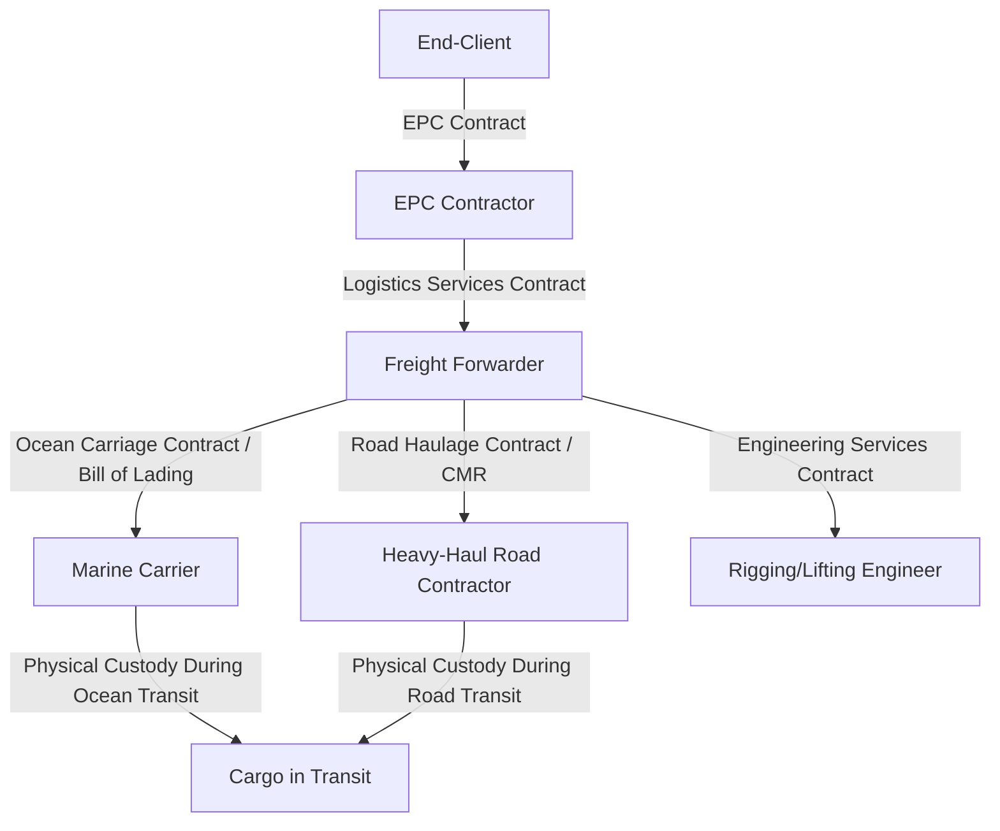

## Roles of Freight Forwarders, EPC Contractors, and Carriers

### Overview

Freight forwarders, EPC contractors, and carriers occupy structurally distinct positions in the project cargo value chain, distinguished primarily by contractual liability, physical possession of cargo, and commercial risk exposure. Understanding these distinctions is essential for correctly allocating responsibility, interpreting bills of lading and transport contracts, and identifying who bears liability at each stage of a heavy-lift move.

**Key Points**

- The EPC contractor is the ultimate commercial owner of project outcomes and typically the cargo owner (shipper) or the party acting on the shipper's behalf.
- The freight forwarder is an intermediary/coordinator that arranges transport but does not necessarily take physical possession of cargo or own transport assets.
- The carrier is the party that physically transports the cargo and takes possession of it, bearing carrier liability under the applicable transport contract (bill of lading, CMR, etc.).
- These roles can legally and commercially overlap — some large forwarders own vessel or trailer assets and act as carriers (NVOCC-type or asset-based project forwarders), while some EPC contractors self-perform logistics coordination without an external forwarder.

### EPC Contractor

**Definition**: The Engineering, Procurement, and Construction contractor holds overall responsibility for delivering a capital project (e.g., a power plant, refinery, or infrastructure asset) to the end-client, including procurement of major equipment and — critically for this discussion — the logistics required to deliver that equipment to site.

**Core Responsibilities Relevant to Logistics**:

- Defining the overall project cargo scope (which equipment items require heavy-lift/OOG handling)
- Setting delivery schedule requirements aligned to construction sequencing
- Selecting and contracting a freight forwarder or project logistics contractor (or self-performing this function with an in-house logistics team)
- Bearing ultimate commercial and schedule risk if cargo delivery fails or is delayed, since construction milestones and liquidated damages clauses are typically tied to the EPC contractor's overall project delivery date

**Example**: An EPC contractor building a petrochemical plant defines that the main reactor vessel (400 MT, fabricated overseas) must arrive at site no later than a specific date to avoid delaying the installation crane mobilization, which is itself booked on a tight schedule shared with other projects. The EPC contractor then either manages this logistics scope directly or delegates it to a specialized freight forwarder, but remains accountable to the end-client for the consequence of any delay.

### Freight Forwarder / Project Logistics Contractor

**Definition**: An intermediary that arranges and coordinates transport on behalf of the cargo owner (shipper), typically without owning the transport assets (vessels, trailers, cranes) itself, instead subcontracting specialized carriers and service providers while managing the overall logistics plan, documentation, and schedule.

**Core Responsibilities**:

- Route planning and multi-modal transport plan development
- Subcontracting carriers (marine, road, rail, air) and specialized service providers (rigging engineers, surveyors)
- Customs documentation and regulatory compliance coordination
- Cargo insurance arrangement (or coordination with the shipper's insurance broker)
- Acting as a single point of contact and project management interface for the shipper

**Types of Forwarders in Project Cargo**:

| Type | Characteristics |
| --- | --- |
| Asset-based project forwarder | Owns some transport equipment (e.g., SPMT fleet, trailers) in addition to coordination services |
| Non-asset-based forwarder | Pure coordination/arrangement role, subcontracts 100% of physical transport |
| NVOCC (Non-Vessel Operating Common Carrier) | Issues its own bills of lading and takes on carrier-like contractual liability despite not owning vessels — [Unverified] the precise liability regime depends on the specific contract terms and applicable jurisdiction's carriage law |

**Example**: A project forwarder engaged by an EPC contractor develops the full multi-modal transport plan for a reactor vessel — selecting a heavy-lift vessel carrier for the ocean leg, subcontracting a heavy-haul road contractor for inland transport at both ends, arranging marine cargo insurance, and managing customs clearance — while itself owning none of the physical transport equipment used.

### Carrier

**Definition**: The party that physically transports the cargo and takes contractual/legal possession of it during transit, issuing a transport document (bill of lading for ocean, CMR consignment note for European road transport, airway bill for air freight) that establishes the carrier's liability terms.

**Core Responsibilities**:

- Physical execution of the transport leg (loading, transit, discharge)
- Compliance with applicable carriage liability conventions (e.g., Hague-Visby Rules, Hamburg Rules, or Rotterdam Rules for ocean; CMR Convention for European road transport)
- Cargo custody and care during the period the cargo is in the carrier's possession

**Categories in Heavy-Lift Context**:

- **Ocean carriers**: break-bulk vessel operators, heavy-lift vessel operators, semi-submersible/FLO-FLO vessel operators
- **Road carriers**: heavy-haul trucking companies operating SPMTs and multi-axle trailers
- **Rail carriers**: specialized heavy-haul rail operators (for cargo within rail gauge/weight limits)
- **Air carriers**: chartered outsized aircraft operators (e.g., An-124 operators)

**Example**: The heavy-lift vessel operator contracted for the ocean leg of the reactor vessel shipment is the ocean carrier — it issues a bill of lading, takes physical custody of the cargo once loaded, and bears carrier liability under the applicable carriage convention for the duration of the voyage, distinct from the forwarder who arranged the booking but never took physical possession.

### Comparative Role Table

| Attribute | EPC Contractor | Freight Forwarder | Carrier |
| --- | --- | --- | --- |
| Owns cargo? | Yes (or acts for owner) | No | No (custody only during transit) |
| Owns transport assets? | No (typically) | Sometimes (asset-based forwarders) | Yes |
| Takes physical possession of cargo? | Before/after transport | Rarely | Yes, during transit |
| Issues transport documents (BoL, CMR)? | No | Sometimes (as NVOCC) | Yes |
| Bears construction schedule risk? | Yes (ultimate) | Indirectly (contractual penalties) | Limited to transit period |
| Primary contractual relationship | With end-client | With EPC contractor/shipper | With forwarder or shipper directly |

### Liability and Contractual Chain

**Example (Combined Scenario)**

When a reactor vessel is damaged during ocean transit, the liability chain typically flows: the EPC contractor is contractually accountable to the end-client for the delay/damage under the EPC contract; the EPC contractor in turn pursues its freight forwarder under the logistics services agreement; the freight forwarder in turn pursues the ocean carrier under the bill of lading terms and applicable carriage convention (subject to any liability limitations, such as per-package or per-kg caps common under international carriage conventions). [Inference] This layered liability structure is standard commercial practice, though the specific limitation amounts and exclusions vary significantly by contract terms and the carriage convention applicable in the relevant jurisdiction, and should not be assumed uniform across projects.

### Overlap and Hybrid Arrangements

- **Design-Build EPC with in-house logistics**: Some large EPC contractors maintain internal project logistics departments, effectively performing the freight forwarder function without an external intermediary.
- **Turnkey logistics contracts**: Some project forwarders offer "one-stop" contracts that include asset-based carriage (owning SPMT fleets or chartering dedicated vessels), blurring the forwarder/carrier distinction.
- **Vertically integrated heavy-lift operators**: A small number of large heavy-lift shipping companies offer combined forwarding, marine carriage, and engineering services under one corporate umbrella, though [Unverified] the degree of vertical integration varies significantly by company and region.

### Conclusion

While freight forwarders, EPC contractors, and carriers frequently work together seamlessly on a single project cargo movement, their legal and commercial roles are structurally distinct: the EPC contractor bears ultimate project delivery risk, the freight forwarder coordinates and arranges the logistics plan without typically taking physical cargo custody, and the carrier physically transports the cargo and bears carriage liability during transit. Correctly understanding this distinction is essential when interpreting contracts, allocating risk, and determining recourse in the event of cargo damage or delay.

**Related Topics**

- Bill of Lading Types and Carrier Liability Conventions (Hague-Visby, Hamburg, Rotterdam Rules)
- CMR Convention and European Road Haulage Liability
- NVOCC Structures in Project Cargo Forwarding
- Contractual Risk Allocation in EPC Logistics Scopes
- Incoterms Selection for Heavy-Lift Project Cargo