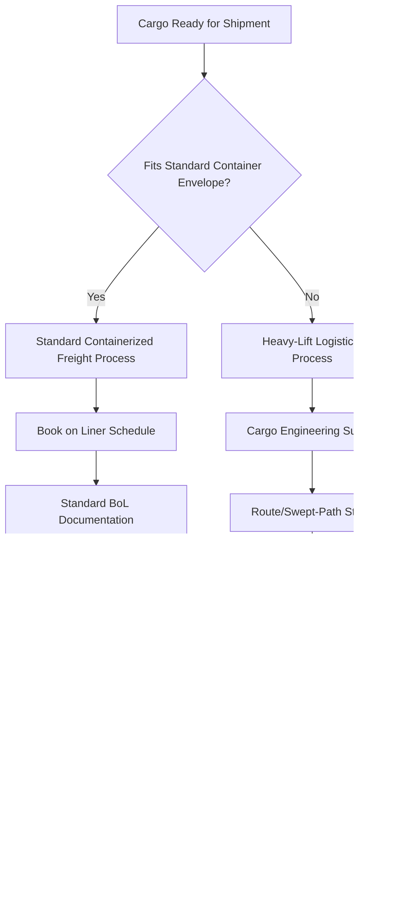

## How Heavy-Lift Logistics Differs from Standard Containerized Freight

### Overview

Standard containerized freight and heavy-lift logistics represent fundamentally different operating models, not merely different weight classes of the same process. Containerized freight is built around standardization, repeatability, and asset interchangeability; heavy-lift logistics is built around engineering customization, single-shipment risk management, and non-repeatable route/equipment planning. The differences cascade across every functional area: planning, equipment, documentation, insurance, and commercial structure.

**Key Points**

- Containerized freight optimizes for throughput and interchangeability; heavy-lift optimizes for engineering integrity and risk mitigation on a per-shipment basis.
- Containerized freight rates are largely published/tariff-based; heavy-lift pricing is quote-based and project-specific.
- Containerized freight uses standardized equipment (20'/40' containers) across any carrier; heavy-lift equipment is frequently custom-configured per shipment.
- Insurance, liability, and regulatory frameworks differ substantially between the two models.

### Fundamental Structural Differences

#### Standardization vs. Customization

Containerized freight relies on ISO-standard container dimensions (20ft, 40ft, 40ft HC) that are interchangeable across virtually any vessel, port, truck chassis, or rail wagon worldwide. Heavy-lift cargo, by definition, does not fit this standard envelope — every shipment requires individualized engineering assessment (weight, CoG, lift points, structural integrity) before a transport method can even be selected.

#### Planning Horizon and Process

- **Containerized freight**: booking typically occurs days to a few weeks in advance; routing follows established liner shipping schedules; minimal shipment-specific engineering is required.
- **Heavy-lift**: planning typically begins months in advance and includes route surveys, lift plan engineering, permit applications (which themselves can take weeks to months depending on jurisdiction), and vessel/equipment booking against limited specialized fleet availability.

#### Equipment and Fleet Characteristics

- **Containerized freight**: served by a large, globally interchangeable fleet of container vessels, chassis, and cranes; equipment substitution is straightforward if one unit is unavailable.
- **Heavy-lift**: served by a comparatively small global fleet of heavy-lift/semi-submersible vessels, specialized SPMT fleets, and high-capacity cranes; equipment substitution options are limited, and booking lead times for specialized vessels can be extensive during high-demand periods (e.g., offshore wind installation seasons).

### Comparative Table

| Dimension | Standard Containerized Freight | Heavy-Lift Logistics |
| --- | --- | --- |
| Cargo unit | Standardized ISO container | Custom-engineered single unit |
| Planning lead time | Days to weeks | Months |
| Pricing model | Published tariff/spot rate | Project-specific quotation |
| Equipment interchangeability | High (globally standardized) | Low (specialized, limited fleet) |
| Route planning | Established liner schedules | Bespoke route/swept-path survey |
| Regulatory framework | Standard customs/trade compliance | Standard compliance + OS/OW permits, indivisibility justification |
| Insurance structure | Standard marine cargo policy | Often requires marine warranty survey (MWS) and bespoke policy terms |
| Documentation | Standard bill of lading | Bill of lading + lift plan, rigging certification, route survey report |
| Failure/delay recourse | Re-book on next available vessel/container | Often no substitute equipment readily available; delay directly impacts project critical path |
| Typical stakeholders | Shipper, forwarder, carrier | Shipper, forwarder, carrier, rigging engineer, surveyor, permit authority, EPC contractor |

### Engineering and Risk Profile Differences

**Containerized freight** treats cargo largely as a "black box" from a transport perspective — the carrier is responsible for safe carriage of the container, but rarely needs detailed knowledge of the cargo's internal structural properties.

**Heavy-lift logistics** requires deep engineering visibility into the cargo itself:

- Center of gravity (CoG) documentation is mandatory for safe lift planning
- Structural drawings identifying certified lift points are typically required from the OEM/manufacturer
- Lashing and securing calculations are shipment-specific rather than standardized
- A single engineering error (e.g., miscalculated CoG) can result in catastrophic loss of an indivisible, high-value, schedule-critical asset — a risk profile with no equivalent in standard containerized freight, where a single container's loss, while costly, rarely threatens an entire project's schedule.

### Commercial and Insurance Differences

- **Rate structure**: Container freight rates are largely published (or accessible via freight rate indices) and relatively transparent across carriers for a given trade lane. Heavy-lift rates are individually quoted based on cargo-specific engineering requirements, equipment availability, and route complexity, making direct rate comparison across projects difficult.
- **Insurance**: Standard marine cargo insurance for containerized goods typically follows standard institute cargo clauses with relatively predictable premium structures. Heavy-lift cargo insurance frequently requires an independent marine warranty surveyor (MWS) to review and approve the lift plan, vessel selection, and lashing/securing arrangements *before* coverage is bound — a technical underwriting step with no equivalent in standard container freight insurance.
- **Liability caps**: Standard carriage liability conventions (Hague-Visby, etc.) apply per-package or per-kg limits that may be commercially inadequate for extremely high-value heavy-lift cargo, often necessitating supplemental declared-value insurance arrangements.

**Example**

Shipping 500 pallets of packaged consumer goods via standard 40ft containers involves booking space on a scheduled liner service, using standard bills of lading, and relying on standard cargo insurance — if one container is delayed, the shipper simply tracks it and receives it a few days late with minimal cascading impact. In contrast, shipping a single 380 MT gas turbine generator for a power plant requires months of advance engineering and route planning, a marine warranty survey approval, a bespoke insurance policy, and coordination with a limited pool of heavy-lift vessel operators — and if that vessel or equipment becomes unavailable, there is frequently no readily substitutable alternative, directly threatening the plant's commissioning schedule.

### Why the Distinction Matters Operationally

Understanding this distinction shapes how logistics professionals approach planning:

1. **Lead time discipline**: Heavy-lift projects require locking in vessel/equipment bookings and permit applications far earlier than container freight professionals may instinctively assume.
2. **Contingency planning**: Because heavy-lift equipment substitution options are limited, contingency and risk mitigation planning (backup routes, alternative equipment, schedule buffers) is a core project logistics function with no direct equivalent in routine container freight management.
3. **Stakeholder coordination overhead**: The larger stakeholder network in heavy-lift logistics (rigging engineers, surveyors, permit authorities) requires more intensive project management than the comparatively streamlined container freight booking process.

### Illustrative Comparison Diagram (svg_diagram)

<svg xmlns="http://www.w3.org/2000/svg" viewBox="0 0 760 380">
<text x="380" y="30" text-anchor="middle" font-size="18" font-weight="bold" fill="#1a1a1a">Container Freight vs. Heavy-Lift Logistics (svg_diagram)</text>
<rect x="40" y="70" width="320" height="280" rx="8" fill="#e8f0fe" stroke="#4a72c4" stroke-width="1.5" />
<text x="200" y="100" text-anchor="middle" font-size="14" font-weight="bold" fill="#1a1a1a">Standard Containerized</text>
<text x="200" y="130" text-anchor="middle" font-size="11" fill="#333">Standardized equipment</text>
<text x="200" y="155" text-anchor="middle" font-size="11" fill="#333">Days-to-weeks planning</text>
<text x="200" y="180" text-anchor="middle" font-size="11" fill="#333">Published tariff rates</text>
<text x="200" y="205" text-anchor="middle" font-size="11" fill="#333">Interchangeable fleet</text>
<text x="200" y="230" text-anchor="middle" font-size="11" fill="#333">Standard cargo insurance</text>
<text x="200" y="255" text-anchor="middle" font-size="11" fill="#333">Easy substitution on delay</text>
<rect x="400" y="70" width="320" height="280" rx="8" fill="#fce8e6" stroke="#c5372f" stroke-width="1.5" />
<text x="560" y="100" text-anchor="middle" font-size="14" font-weight="bold" fill="#1a1a1a">Heavy-Lift Logistics</text>
<text x="560" y="130" text-anchor="middle" font-size="11" fill="#333">Custom-engineered per shipment</text>
<text x="560" y="155" text-anchor="middle" font-size="11" fill="#333">Months of planning</text>
<text x="560" y="180" text-anchor="middle" font-size="11" fill="#333">Project-specific quotation</text>
<text x="560" y="205" text-anchor="middle" font-size="11" fill="#333">Limited specialized fleet</text>
<text x="560" y="230" text-anchor="middle" font-size="11" fill="#333">Marine warranty survey required</text>
<text x="560" y="255" text-anchor="middle" font-size="11" fill="#333">No easy substitution on delay</text>

<text x="380" y="365" text-anchor="middle" font-size="11" fill="#555">Same physical corridor, structurally different logistics models</text>

</svg>

### Conclusion

Heavy-lift logistics differs from standard containerized freight not simply in degree (bigger, heavier cargo) but in kind — it operates on a fundamentally different planning horizon, equipment model, engineering risk profile, and commercial structure. Professionals moving from container freight into project/heavy-lift logistics must adjust their operating assumptions accordingly, particularly around lead time discipline, contingency planning, and the expanded stakeholder network required to safely execute a single indivisible, high-value shipment.

**Related Topics**

- Marine Warranty Survey (MWS) Process and Requirements
- Liner Shipping Schedules vs. Project Cargo Vessel Chartering
- Cargo Insurance Structures: Standard vs. Heavy-Lift Policies
- Contingency and Risk Mitigation Planning for Heavy-Lift Projects
- Rate Formation: Tariff-Based vs. Quotation-Based Freight Pricing