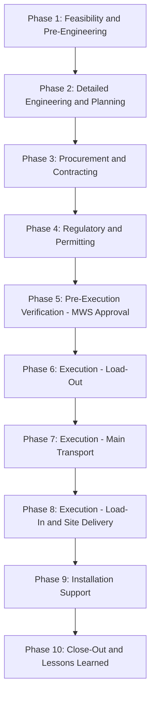

## Overview of the End-to-End Project Cargo Lifecycle

### Overview

The project cargo lifecycle describes the complete sequence of phases a heavy-lift or specialized shipment passes through, from initial feasibility assessment through final site installation and project close-out. Unlike standard freight, which follows a relatively linear book-ship-deliver process, the project cargo lifecycle is iterative and engineering-intensive at multiple stages, with each phase gating the next through formal approvals, surveys, and permits.

**Key Points**

- The lifecycle is typically organized into pre-execution (engineering, planning, procurement of services), execution (physical transport), and post-execution (close-out, claims, lessons learned) phases.
- Multiple phases can run in parallel across different cargo items within the same project (e.g., permit applications for one module while another is already in ocean transit).
- Each phase transition is typically gated by a formal deliverable or approval (e.g., lift plan sign-off, MWS approval, permit issuance) rather than simply elapsing time.

### Phase 1: Feasibility and Pre-Engineering

**Activities**:

- Initial cargo characteristics assessment (dimensions, weight, indivisibility justification)
- Preliminary route feasibility screening (identifying obvious showstoppers — e.g., bridge weight limits, tunnel height restrictions)
- High-level transport mode selection (ocean vs. rail vs. road-only vs. multi-modal)
- Rough-order-of-magnitude (ROM) cost and schedule estimation

**Typical Output**: A feasibility report confirming the cargo can theoretically be moved via at least one viable corridor and mode combination, used to support the EPC contractor's overall project bid or execution plan.

### Phase 2: Detailed Engineering and Planning

**Activities**:

- Detailed cargo engineering: CoG determination, lift point certification, structural drawings review
- Full route survey: swept-path analysis, bridge/culvert clearance verification, overhead utility clearance checks
- Equipment selection: specific vessel type, SPMT configuration, crane capacity determination
- Lift plan development and internal engineering review

**Typical Output**: A detailed transport method statement and certified lift plan, ready for submission to regulatory authorities and insurance underwriters.

### Phase 3: Procurement and Contracting

**Activities**:

- Tendering/booking of carrier services (vessel charter or space booking, heavy-haul contractor engagement)
- Contracting of specialized service providers (rigging engineers, surveyors, escort services)
- Insurance placement, including marine warranty survey (MWS) engagement where required

**Typical Output**: Signed transport and service contracts, insurance binder, MWS engagement confirmation.

### Phase 4: Regulatory and Permitting

**Activities**:

- OS/OW permit application submission to relevant road/bridge authorities
- Port and vessel stability approvals
- Customs pre-clearance documentation preparation
- Police/pilot escort scheduling coordination

**Typical Output**: Issued transport permits and escort confirmations, often with specific validity windows requiring tight coordination with the execution schedule.

[Unverified] Permit lead times vary substantially by jurisdiction — some authorities process routine OS/OW permits within days, while others (particularly for multi-jurisdictional routes) may require weeks to months; project schedules should not assume a universal processing timeline.

### Phase 5: Pre-Execution Verification

**Activities**:

- Marine warranty surveyor review and approval of final lift plan and lashing/securing arrangements
- Final route condition verification (confirming no new obstructions since the original survey)
- Equipment mobilization to origin site

**Typical Output**: MWS sign-off certificate, final go/no-go confirmation for execution.

### Phase 6: Execution — Load-Out

**Activities**:

- Physical lift/load-out of cargo from fabrication yard or origin facility using certified lift plan
- Loading onto primary transport equipment (SPMT, trailer, or direct vessel loading)
- Securing and lashing per approved engineering plan

**Typical Output**: Load-out completion certificate, photographic/video documentation for insurance and quality records.

### Phase 7: Execution — Main Transport

**Activities**:

- Inland transport to port/terminal (if applicable)
- Main transport leg execution (ocean voyage, rail movement, or direct road haul)
- Real-time tracking and condition monitoring where applicable (shock/tilt sensors for sensitive cargo)

**Typical Output**: Transit completion, arrival notification, condition report at destination.

### Phase 8: Execution — Load-In and Site Delivery

**Activities**:

- Discharge at destination port/terminal
- Final inland transport leg to project site
- Site delivery and handoff to EPC contractor/installation team

**Typical Output**: Proof of delivery, site handoff documentation, final condition inspection report.

### Phase 9: Installation Support (Where Applicable)

**Activities**:

- On-site lift/positioning support (if the logistics contractor's scope extends to final installation)
- Coordination with EPC contractor's site crane and construction schedule

**Typical Output**: Installation completion confirmation.

### Phase 10: Close-Out and Lessons Learned

**Activities**:

- Final documentation compilation (all certificates, permits, surveys, photographic records)
- Claims processing if any damage or delay occurred during transit
- Post-project review and lessons-learned documentation for future project reference

**Typical Output**: Project close-out report, archived documentation package.

### Lifecycle Summary Table

| Phase | Primary Gate/Approval Required | Key Risk if Skipped or Rushed |
| --- | --- | --- |
| 1. Feasibility | Route feasibility confirmation | Committing to an impossible route/mode |
| 2. Detailed Engineering | Certified lift plan | Structural failure during lift |
| 3. Procurement | Signed contracts, insurance placement | Uninsured or uncontracted execution |
| 4. Regulatory/Permitting | Issued OS/OW permits | Illegal movement, fines, seizure |
| 5. Pre-Execution Verification | MWS sign-off | Uninsured loss, invalid claim |
| 6. Load-Out | Load-out completion certificate | Cargo damage during initial lift |
| 7. Main Transport | Transit completion/arrival notice | Transit damage, schedule slippage |
| 8. Load-In/Site Delivery | Proof of delivery | Site readiness mismatch |
| 9. Installation Support | Installation completion confirmation | Construction schedule disruption |
| 10. Close-Out | Final documentation archive | Unresolved claims, lost institutional knowledge |

**Example**

A power transformer project cargo lifecycle: Phase 1 confirms the transformer can move via a combination of ocean vessel and inland SPMT transport; Phase 2 produces the detailed lift plan and identifies a bridge along the inland route requiring a temporary reinforcement or alternate detour; Phase 3 contracts the heavy-lift vessel and SPMT provider; Phase 4 secures OS/OW permits from three separate local government jurisdictions along the inland route; Phase 5 obtains MWS approval of the final lashing plan; Phases 6-8 execute the physical load-out, ocean transit, and inland delivery to the substation site; Phase 9 supports the final crane placement onto the foundation; and Phase 10 compiles the full documentation package and closes out any minor transit damage claims.

### Parallel and Iterative Nature of the Lifecycle

While presented sequentially, in practice the lifecycle is often non-linear:

- **Parallel processing across cargo items**: On a multi-module project, different cargo items may be in different lifecycle phases simultaneously (one module in Phase 4 permitting while another is already in Phase 7 transit).
- **Iterative engineering refinement**: Phase 2 engineering may need to loop back and revise the transport method if Phase 4 permitting reveals an unanticipated route restriction.
- **Contingency triggers**: A failed Phase 5 verification (e.g., MWS raises a concern about lashing adequacy) can send the project back to Phase 2 for re-engineering before execution can proceed.

### Illustrative Lifecycle Diagram (svg_diagram)

<svg xmlns="http://www.w3.org/2000/svg" viewBox="0 0 780 380">
<text x="390" y="30" text-anchor="middle" font-size="18" font-weight="bold" fill="#1a1a1a">Project Cargo Lifecycle (svg_diagram)</text>
<rect x="20" y="70" width="140" height="60" rx="6" fill="#e8f0fe" stroke="#4a72c4" stroke-width="1.5" />
<text x="90" y="95" text-anchor="middle" font-size="10" font-weight="bold">Feasibility &amp;</text>
<text x="90" y="110" text-anchor="middle" font-size="10" font-weight="bold">Pre-Engineering</text>
<rect x="180" y="70" width="140" height="60" rx="6" fill="#e8f0fe" stroke="#4a72c4" stroke-width="1.5" />
<text x="250" y="95" text-anchor="middle" font-size="10" font-weight="bold">Detailed</text>
<text x="250" y="110" text-anchor="middle" font-size="10" font-weight="bold">Engineering</text>
<rect x="340" y="70" width="140" height="60" rx="6" fill="#fef3e0" stroke="#d68a1e" stroke-width="1.5" />
<text x="410" y="95" text-anchor="middle" font-size="10" font-weight="bold">Procurement &amp;</text>
<text x="410" y="110" text-anchor="middle" font-size="10" font-weight="bold">Contracting</text>
<rect x="500" y="70" width="140" height="60" rx="6" fill="#fef3e0" stroke="#d68a1e" stroke-width="1.5" />
<text x="570" y="95" text-anchor="middle" font-size="10" font-weight="bold">Regulatory &amp;</text>
<text x="570" y="110" text-anchor="middle" font-size="10" font-weight="bold">Permitting</text>
<rect x="660" y="70" width="100" height="60" rx="6" fill="#fef3e0" stroke="#d68a1e" stroke-width="1.5" />
<text x="710" y="95" text-anchor="middle" font-size="9" font-weight="bold">Pre-Exec</text>
<text x="710" y="110" text-anchor="middle" font-size="9" font-weight="bold">Verification</text>
<rect x="20" y="220" width="140" height="60" rx="6" fill="#e6f4ea" stroke="#2e7d46" stroke-width="1.5" />
<text x="90" y="255" text-anchor="middle" font-size="10" font-weight="bold">Load-Out</text>
<rect x="180" y="220" width="140" height="60" rx="6" fill="#e6f4ea" stroke="#2e7d46" stroke-width="1.5" />
<text x="250" y="255" text-anchor="middle" font-size="10" font-weight="bold">Main Transport</text>
<rect x="340" y="220" width="140" height="60" rx="6" fill="#e6f4ea" stroke="#2e7d46" stroke-width="1.5" />
<text x="410" y="245" text-anchor="middle" font-size="10" font-weight="bold">Load-In &amp;</text>
<text x="410" y="260" text-anchor="middle" font-size="10" font-weight="bold">Site Delivery</text>
<rect x="500" y="220" width="140" height="60" rx="6" fill="#fce8e6" stroke="#c5372f" stroke-width="1.5" />
<text x="570" y="255" text-anchor="middle" font-size="10" font-weight="bold">Installation Support</text>
<rect x="660" y="220" width="100" height="60" rx="6" fill="#fce8e6" stroke="#c5372f" stroke-width="1.5" />
<text x="710" y="245" text-anchor="middle" font-size="9" font-weight="bold">Close-Out</text>
<text x="710" y="260" text-anchor="middle" font-size="9" font-weight="bold">&amp; Lessons</text>
<line x1="160" y1="100" x2="180" y2="100" stroke="#333" stroke-width="1.5" marker-end="url(#arrow)" />
<line x1="320" y1="100" x2="340" y2="100" stroke="#333" stroke-width="1.5" />
<line x1="480" y1="100" x2="500" y2="100" stroke="#333" stroke-width="1.5" />
<line x1="640" y1="100" x2="660" y2="100" stroke="#333" stroke-width="1.5" />
<line x1="710" y1="130" x2="90" y2="220" stroke="#333" stroke-width="1.5" />
<line x1="160" y1="250" x2="180" y2="250" stroke="#333" stroke-width="1.5" />
<line x1="320" y1="250" x2="340" y2="250" stroke="#333" stroke-width="1.5" />
<line x1="480" y1="250" x2="500" y2="250" stroke="#333" stroke-width="1.5" />
<line x1="640" y1="250" x2="660" y2="250" stroke="#333" stroke-width="1.5" />

<text x="390" y="340" text-anchor="middle" font-size="11" fill="#555">Ten sequential phases, each gated by formal approval or certification</text>

</svg>

### Conclusion

The end-to-end project cargo lifecycle is a ten-phase, gate-driven process spanning feasibility assessment through close-out, distinguished from standard freight processes by the extensive engineering, regulatory, and verification steps required before physical execution can begin. Understanding each phase's specific gating deliverable — from the certified lift plan in Phase 2 to the MWS sign-off in Phase 5 — enables logistics professionals to correctly sequence project cargo planning and avoid the schedule risk created by skipping or compressing any single phase.

**Related Topics**

- Detailed Cargo Engineering: CoG, Lift Points, and Structural Certification
- OS/OW Permit Lead Times and Multi-Jurisdictional Coordination
- Marine Warranty Survey (MWS) Scope and Process
- Load-Out and Load-In Methods: SPMT, Skidding, and Direct Crane Lift
- Project Close-Out Documentation and Claims Management