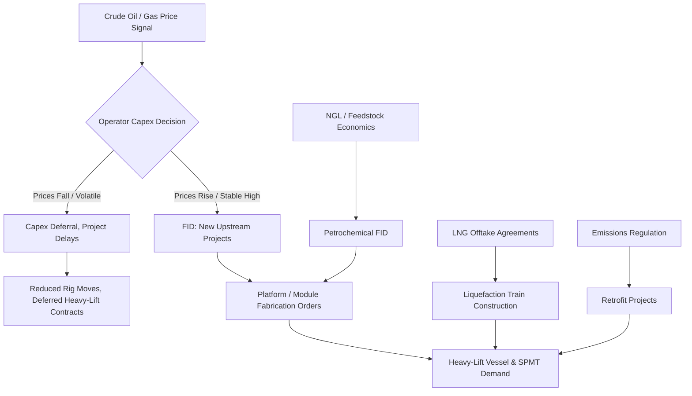

## Oil, Gas, and Petrochemical Sector Demand Drivers

### Overview and Sector Role Within Heavy-Lift Logistics

The oil, gas, and petrochemical (OGP) sector is one of the largest and most consistent sources of demand for heavy-lift and specialized transport services worldwide. Unlike general project cargo, OGP demand is driven by capital-intensive, engineering-led projects — upstream production facilities, midstream pipeline and terminal infrastructure, and downstream refining and petrochemical plants — where individual cargo items routinely exceed standard trucking, crane, or vessel limits. This creates structural, recurring demand for specialized carriers, SPMT (self-propelled modular transporter) fleets, heavy-lift crane vessels, and engineered heavy-haul routes.

Because OGP capital projects are large, long-lead-time, and geographically concentrated (Gulf Coast, Middle East, West Africa, Southeast Asia, and increasingly LNG-exporting regions), heavy-lift providers often build entire business units or regional strategies around this single sector.

### Upstream Demand Drivers

**Key Points**

- Offshore platform modules (topsides, jackets, living quarters) routinely weigh from a few hundred tons to over 20,000 tons, requiring heavy-lift vessels or float-over installation methods.
- Onshore drilling and production equipment (rigs, mud systems, separators, compressor packages) drives frequent moves of oversized, high-value modular skids.
- Subsea infrastructure (manifolds, risers, umbilicals) requires specialized marine logistics rather than land heavy-haul, but still falls under the same project logistics umbrella.
- Exploration activity is highly cyclical and tied to crude oil price expectations, rig count, and capital expenditure guidance from operators.

Upstream demand is the most price-sensitive segment of the three. When crude prices are depressed, exploration and development capex contracts sharply, and heavy-lift providers see rig moves and platform fabrication logistics dry up first. Conversely, sustained high prices trigger a wave of new offshore development, especially deepwater and ultra-deepwater projects requiring the largest lift capacities in the industry.

### Midstream Demand Drivers

**Key Points**

- Large-diameter line pipe, pipeline valves, and pump/compressor station equipment for cross-country pipelines.
- LNG liquefaction trains and associated cryogenic equipment (cold boxes, main cryogenic heat exchangers) — among the single heaviest and most schedule-critical lifts in the industry.
- Storage tank components (pre-fabricated tank shells, floating roofs) for terminal expansions.
- Compressor stations and metering skids along transmission corridors.

Midstream demand is somewhat less commodity-price-sensitive than upstream, since pipeline and storage infrastructure investment is often driven by production growth in adjacent basins (e.g., Permian Basin takeaway capacity) rather than spot price alone. LNG export infrastructure has become a particularly significant midstream/downstream-adjacent driver, with liquefaction trains and modules frequently exceeding 2,000–5,000 metric tons per lift, requiring purpose-built module transporters and dedicated heavy-lift shipping.

### Downstream and Petrochemical Demand Drivers

**Key Points**

- Refinery expansion and modernization projects (reactors, fractionation columns, coker units) involve some of the largest single-piece cargo in industrial logistics — reactor vessels can exceed 2,000 tons and require multi-week heavy-haul route surveys.
- Petrochemical plant construction (ethylene crackers, polyethylene/polypropylene units, methanol plants) drives demand for both single large columns/reactors and high-volume modular construction (pipe racks, structural steel modules).
- Modularization trends — fabricating entire process units offshore in low-cost fabrication yards (e.g., South Korea, China, Southeast Asia) and shipping them fully assembled — have significantly increased average cargo size and heavy-lift vessel utilization.
- Petrochemical demand correlates with feedstock economics (natural gas liquids pricing, particularly ethane) more than with crude oil price directly, especially in the U.S. Gulf Coast, where cheap shale gas liquids drove a multi-year petrochemical capacity buildout.

### Macro and Structural Demand Drivers

**Key Points**

- **Commodity price cycles**: Crude oil and natural gas prices remain the dominant lagging/leading indicator for upstream and, to a lesser extent, midstream/downstream investment decisions.
- **Energy transition dynamics**: Investment patterns are shifting — traditional refining capacity additions have slowed in mature markets (North America, Europe), while LNG, petrochemicals, and low-carbon adjacent infrastructure (blue hydrogen, carbon capture equipment) are emerging as new heavy-lift demand sources. [Inference] The pace and durability of this shift varies significantly by region and remains sensitive to policy changes.
- **Geographic shift of capacity**: Refining and petrochemical capacity growth has concentrated in Asia-Pacific (China, India) and the Middle East, reshaping global heavy-lift trade lanes away from traditional Western fabrication and consumption centers.
- **Fabrication yard modularization**: The trend toward fabricating larger, more complete modules in low-labor-cost countries and shipping them to project sites has structurally increased both the size and the total tonnage of individual heavy-lift shipments.
- **National oil company (NOC) and sovereign investment cycles**: State-driven capital programs (Saudi Aramco, ADNOC, QatarEnergy, Petrobras) can decouple regional demand from pure commodity price signals due to long-term strategic planning horizons.
- **Regulatory and environmental compliance**: Emissions regulations sometimes force retrofit or replacement projects (e.g., flue gas desulfurization units, tail gas treatment units) that generate discrete heavy-lift demand independent of new capacity growth.

### Demand Cyclicality Pattern

### Example: Deepwater Platform Topside Transport

A 12,000-ton deepwater platform topside fabricated in a Southeast Asian yard for installation in the U.S. Gulf of Mexico illustrates the compounding of these demand drivers: the project's Final Investment Decision (FID) depended on sustained crude prices above the operator's offshore breakeven threshold; the fabrication location reflects the geographic shift toward lower-cost Asian yards; and the transport method — load-out onto a heavy-lift semi-submersible vessel followed by offshore float-over installation — represents the upper bound of heavy-lift vessel capability, engaging only a small pool of qualified carriers globally.

### Related Topics

- Renewable Energy and Wind Power Logistics Demand Drivers
- Power Generation and Utility Sector Demand Drivers
- Mining and Minerals Sector Demand Drivers
- Fabrication Yard Economics and Global Sourcing Shifts
- LNG Value Chain Infrastructure and Module Transport
- Commodity Price Cycles and Capital Expenditure Forecasting
- Float-Over Installation Methods for Offshore Platforms
- Modularization Strategies in EPC Project Execution