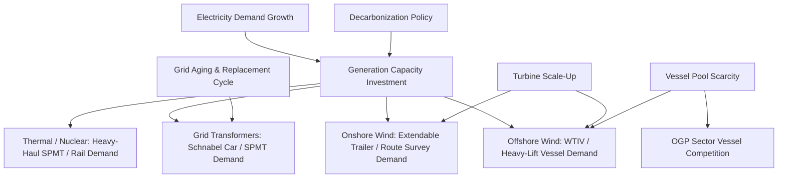

## Power Generation and Renewable Energy Sector Demand

### Overview and Sector Role Within Heavy-Lift Logistics

The power generation sector — spanning conventional thermal generation, nuclear, and renewables (wind, solar, and increasingly battery storage) — is a major and structurally growing source of heavy-lift and specialized transport demand. Unlike the oil and gas sector, where demand is tightly coupled to commodity price cycles, power generation demand is driven primarily by electricity demand growth, decarbonization policy, and grid infrastructure investment, giving it a somewhat different and often counter-cyclical demand profile relative to OGP.

Within this sector, wind power — particularly offshore wind — has become one of the single largest drivers of new heavy-lift vessel and specialized transport capacity investment globally, due to the extreme dimensions and weights of turbine components.

### Conventional and Thermal Power Generation Demand Drivers

**Key Points**

- Gas turbine generators (GTGs) for combined-cycle gas turbine (CCGT) plants are among the heaviest single-piece industrial cargo, with modern large-frame turbines exceeding 400–500 tons and requiring specialized rail or heavy-haul trailer transport with escort and route engineering.
- Heat recovery steam generators (HRSGs), boiler drums, and generator stators for both gas and coal plants require oversized flatbed, SPMT, or barge transport depending on inland waterway access.
- Nuclear plant construction (new builds and life-extension retrofits) involves some of the largest single components in all of industry — reactor pressure vessels, steam generators, and turbine rotors can each exceed 300–500 tons and require dedicated heavy-lift ships and purpose-engineered transport corridors.
- Coal and legacy thermal plant demand has declined structurally in mature markets due to retirements, though retrofit projects (emissions control equipment, turbine upgrades) continue to generate discrete heavy-lift demand.

### Offshore Wind Demand Drivers

**Key Points**

- Wind turbine generator (WTG) components — nacelles, hubs, and increasingly long single-piece blades (exceeding 100 meters for the largest offshore turbines) — dominate global heavy-lift newbuild vessel investment.
- Monopile and jacket foundations for offshore wind, often exceeding 2,000 tons for deeper-water sites, require specialized installation vessels with heavy-lift cranes and dynamic positioning capability.
- Offshore substation topsides (transforming and transmitting power to shore) resemble oil and gas platform topsides in engineering complexity and lift requirements, often creating direct competition for the same specialized vessel pool.
- Turbine scale-up trends (14–15+ MW turbines becoming standard) have driven component dimensions beyond the capability of older heavy-lift fleets, spurring a wave of purpose-built wind turbine installation vessels (WTIVs).
- Port infrastructure limitations (quay load-bearing capacity, laydown area, air draft under bridges) frequently constrain which ports can serve as marshaling hubs, creating localized demand for specialized port and staging logistics.

### Onshore Wind and Solar Demand Drivers

**Key Points**

- Onshore wind blade transport is uniquely challenging for land logistics due to extreme length (blades commonly 60–80+ meters) rather than weight, requiring specialized extendable trailers and route surveys for turning radius, overhead clearance, and road curvature — a fundamentally different engineering problem than the weight-dominated challenges typical of OGP cargo.
- Wind turbine towers, shipped in cylindrical sections, require careful route planning for width and height restrictions, especially on rural roads not originally engineered for oversized loads.
- Utility-scale solar demand is comparatively lower-intensity for heavy-lift providers, since photovoltaic modules and racking are modular and containerizable; the main specialized-logistics demand comes from step-up transformers and inverter skids.
- Battery energy storage system (BESS) deployment is an emerging demand driver, primarily for large modular battery enclosures and grid-scale transformer equipment, though individual unit weights remain modest compared to turbine or thermal generation equipment.

### Grid and Transmission Infrastructure Demand Drivers

**Key Points**

- Large power transformers (LPTs), particularly extra-high-voltage units, are among the most logistically demanding cargo in the grid sector — some units exceed 400 tons and require rail flatcars (Schnabel cars) or heavy SPMT convoys with extensive route and bridge-loading analysis.
- HVDC (high-voltage direct current) converter station equipment, used increasingly for long-distance transmission and offshore wind interconnection, drives demand for oversized valve hall components and converter transformers.
- Aging grid infrastructure in mature markets (North America, Europe) is driving a multi-decade replacement and upgrade cycle for transformers and substation equipment, providing a relatively stable, policy-independent demand baseline.

### Macro and Structural Demand Drivers

**Key Points**

- **Decarbonization policy**: Renewable portfolio standards, carbon pricing, and national net-zero commitments are primary demand drivers for wind and grid infrastructure investment, making this sector more policy-sensitive than commodity-price-sensitive. [Inference] The durability of specific policy support (subsidies, tax credits, offshore leasing schedules) varies by jurisdiction and is subject to political change.
- **Electrification and demand growth**: Rising electricity demand from data centers, EV charging, and industrial electrification is accelerating investment across generation types, including gas-fired peaking capacity as a bridge alongside renewables.
- **Turbine and equipment scale-up**: Continuous increases in wind turbine size and power transformer capacity push individual components beyond existing fleet and infrastructure capabilities, creating recurring demand for new heavy-lift vessels, specialized trailers, and port upgrades.
- **Supply chain localization requirements**: Local content rules (e.g., in offshore wind auctions) sometimes mandate regional fabrication and assembly, reshaping trade lanes and creating demand for feeder vessel and local port logistics solutions distinct from long-haul heavy-lift shipping.
- **Vessel and equipment scarcity**: A finite global pool of heavy-lift and specialized installation vessels creates competition for capacity between offshore wind, oil and gas, and other sectors, occasionally causing project schedule risk and rate volatility.

### Demand Driver Comparison: Power Generation Segments

### Example: Offshore Wind Foundation Installation

A 2,200-ton monopile foundation destined for a North Sea offshore wind farm illustrates the sector's distinct logistics profile: the foundation is fabricated at a specialized steel works, transported by heavy-lift barge to a marshaling port with sufficient quay load capacity, then installed using a jack-up or floating installation vessel equipped with a heavy-lift crane — a process that competes directly with oil and gas platform installation vessels for the same limited global fleet, illustrating the cross-sector interdependence in specialized vessel availability.

### Related Topics

- Oil, Gas, and Petrochemical Sector Demand Drivers
- Mining and Minerals Sector Demand Drivers
- Offshore Wind Installation Vessel (WTIV) Fleet Economics
- Wind Turbine Blade and Tower Route Engineering
- Large Power Transformer Transport and Schnabel Rail Cars
- Nuclear New-Build Logistics and Component Transport
- Port Infrastructure Constraints for Renewable Energy Staging
- Policy and Subsidy Cycles in Renewable Energy Capital Investment