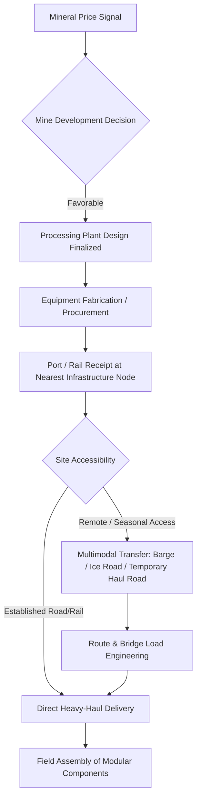

## Mining and Heavy Industrial Equipment Movements

### Overview and Sector Role Within Heavy-Lift Logistics

The mining and heavy industrial equipment segment generates some of the most physically extreme cargo challenges in specialized logistics, distinguished less by single-item weight records (though those occur) than by the combination of remote, undeveloped destination sites, poor or nonexistent road infrastructure, and equipment that is often shipped fully or semi-assembled to avoid costly field reassembly. Demand spans greenfield mine development, processing plant construction, and equipment replacement/expansion at operating mines, as well as adjacent heavy industrial sectors such as steel, cement, and smelting.

Unlike oil and gas or power generation, where destination infrastructure (ports, highways, rail) is often reasonably developed, mining projects frequently require heavy-lift providers to engineer entirely new haul roads, temporary bridges, or river crossings as part of the logistics scope itself.

### Mining Equipment Categories Driving Demand

**Key Points**

- **Mineral processing equipment**: SAG (semi-autogenous grinding) mills and ball mills are among the heaviest single components in mining, with mill shells for large operations exceeding 400–500 tons and requiring dedicated SPMT convoys or heavy-haul trailers engineered specifically for the load.
- **Haul trucks and mobile mining equipment**: Ultra-class mining haul trucks (200+ ton payload capacity) are frequently shipped disassembled into major sub-components (frame, box, wheel motors) due to both weight and the impracticality of moving a fully assembled unit over long distances, then reassembled on site.
- **Draglines and shovels**: Large excavation equipment such as walking draglines is sometimes transported in modular sections and reassembled in the field, since the fully assembled equipment would exceed both weight and dimensional limits for any practical transport method.
- **Crushing and conveying systems**: Primary and secondary crushers, along with long-distance overland conveyor system components, add sustained volume demand beyond the few extreme single-piece lifts.
- **Smelting and refining equipment**: Furnace shells, converters, and related processing vessels in copper, nickel, and steel operations present similar heavy-lift profiles to mineral processing equipment.

### Remote Site Access and Route Engineering Challenges

**Key Points**

- Many mine sites are located far from established road or rail networks, requiring heavy-lift providers to conduct extensive route surveys, sometimes constructing or upgrading haul roads specifically for project cargo delivery.
- Seasonal access windows are a defining constraint: mines in northern latitudes or monsoon-affected regions often depend on ice roads, dry-season-only routes, or barge transport during limited navigable water windows, compressing delivery schedules into narrow annual periods.
- Multimodal transitions (ocean vessel to river barge to heavy-haul trailer) are common for landlocked or interior mine sites, each transition point adding handling risk and requiring specialized lifting equipment at intermediate transfer points.
- Bridge and culvert load-bearing assessments are frequently the limiting factor on route selection, sometimes requiring temporary reinforcement structures for a single heavy move.

### Steel, Cement, and Adjacent Heavy Industry Demand Drivers

**Key Points**

- Steel industry demand includes blast furnace components, continuous casting equipment, and rolling mill stands, which share similar tonnage and routing challenges with mining processing equipment.
- Cement plant construction drives demand for large kiln sections, which are cylindrical and present transport challenges similar to wind turbine tower sections but at substantially greater weight.
- These adjacent industries often compete for the same specialized carrier fleets and heavy-haul trailer configurations used in mining logistics, particularly in regions where mining and steel/cement production are geographically co-located (e.g., resource-rich developing economies building integrated industrial corridors).

### Macro and Structural Demand Drivers

**Key Points**

- **Commodity price cycles**: Mining capex, like upstream oil and gas, is strongly correlated with metal and mineral prices (copper, iron ore, lithium, nickel, gold), with major expansion decisions typically requiring sustained price signals to justify multi-year capital commitments.
- **Energy transition mineral demand**: Growing demand for battery and electrification-critical minerals (lithium, cobalt, nickel, copper, rare earths) is driving a wave of new mine development in previously underexplored or underdeveloped regions, often with limited existing infrastructure — increasing the relative share of route-engineering-intensive logistics work.
- **Ore grade decline**: As easily accessible high-grade deposits are depleted, new projects increasingly target lower-grade, more remote, or deeper deposits, requiring larger processing plants (and therefore larger equipment) to achieve economic throughput.
- **Resource nationalism and local content requirements**: Some jurisdictions mandate local fabrication or assembly of certain equipment, reshaping which components require international heavy-lift shipping versus regional transport.
- **Infrastructure investment bundling**: Large mining projects sometimes include dedicated rail lines or port facilities as part of the overall project scope, which itself becomes an additional source of heavy-lift and specialized logistics demand (rail cars, port cranes, conveyor bridges).

### Mining Project Logistics Flow

### Example: SAG Mill Shell Delivery to a Remote Copper Mine

A 450-ton SAG mill shell manufactured overseas and destined for a new copper mine in a landlocked, mountainous region illustrates the compounded logistics challenge: after ocean transport to the nearest port, the shell moves by rail to an inland transfer point, then by specialized SPMT convoy over a purpose-upgraded haul road with temporary bridge reinforcement, timed to coincide with the dry season to avoid washouts — a sequence that can take longer to plan and execute than the shell's original manufacturing lead time.

### Related Topics

- Oil, Gas, and Petrochemical Sector Demand Drivers
- Power Generation and Renewable Energy Sector Demand
- Route Survey and Haul Road Engineering for Remote Sites
- Multimodal Transfer Logistics for Landlocked Projects
- Commodity Price Cycles and Mining Capital Expenditure
- SPMT (Self-Propelled Modular Transporter) Fleet Operations
- Critical Mineral Supply Chains and New Mine Development
- Bridge and Culvert Load-Bearing Assessment for Heavy Haul