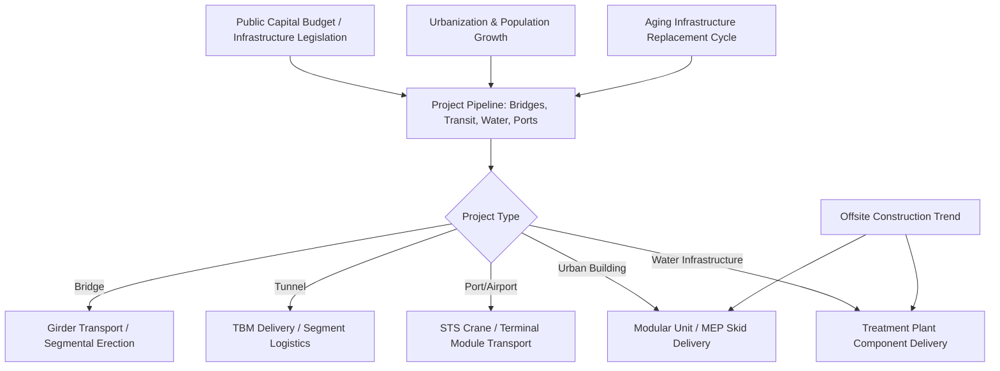

## Infrastructure, Construction, and Civil Engineering Projects

### Overview and Sector Role Within Heavy-Lift Logistics

The infrastructure and civil construction sector encompasses bridges, tunnels, ports, airports, water/wastewater treatment plants, and large public and commercial buildings. It differs from the resource-extraction and energy sectors in a key structural way: demand is driven primarily by public capital budgets, urbanization trends, and population growth rather than commodity prices, giving it a comparatively stable, if slower-growing, demand baseline. It is also unique among the sectors covered so far in that heavy-lift work is frequently performed in dense urban environments, introducing constraints (traffic management, overhead utilities, limited staging space) largely absent from remote industrial or offshore projects.

### Bridge Construction and Girder Transport

**Key Points**

- Precast concrete and steel bridge girders are among the highest-volume heavy-haul cargo categories globally, characterized less by extreme weight per unit (though large box girders can exceed 100 tons) than by extreme length (commonly 30–60 meters), creating turning-radius and swing-clearance challenges distinct from the weight-dominated problems typical of industrial cargo.
- Segmental bridge construction techniques reduce single-lift weights by using an erection gantry or launching girder to place precast segments incrementally, shifting demand from heavy-haul road transport toward specialized on-site erection equipment.
- Cable-stayed and suspension bridge tower sections and cable systems require both heavy-lift crane capacity for tower erection and precision-controlled transport for cable reels.
- Bridge replacement and rehabilitation in mature markets (particularly North America and Europe, where much bridge infrastructure dates to the mid-20th century) provides a structurally recurring, policy-independent demand baseline.

### Tunnel Boring and Underground Infrastructure

**Key Points**

- Tunnel boring machines (TBMs) are transported in large disassembled sections — cutterhead, shield, and trailing gear — due to both weight (individual sections can exceed 500 tons for large-diameter machines) and the impracticality of assembled transport, then reassembled at the tunnel portal.
- TBM logistics often require close coordination with the tunneling contractor's schedule, since machine delivery is typically on the critical path for project completion.
- Precast tunnel lining segments, while individually modest in weight, generate high-volume, just-in-time delivery demand throughout the boring operation.

### Port, Airport, and Maritime Infrastructure

**Key Points**

- Container and ship-to-shore (STS) cranes are among the largest single structures moved in specialized logistics — fully assembled STS cranes can exceed 60–70 meters in height and 1,500–2,000 tons, typically requiring dedicated heavy-lift vessel transport with the crane shipped in one piece to avoid costly on-site erection.
- Floating dry docks and caisson structures for port and coastal defense projects require marine-specific heavy-lift and towing logistics rather than land transport.
- Airport infrastructure demand includes jet bridges, baggage handling system modules, and, for major expansions, prefabricated terminal structural elements.

### Urban Construction and Building Logistics

**Key Points**

- Tower cranes themselves require specialized transport and rigging logistics for delivery, erection, and eventual dismantling at height, particularly in dense urban cores with limited street access.
- Prefabricated modular building construction (volumetric modules for hotels, student housing, and residential towers) has grown as a heavy-lift demand driver, with entire room modules transported and craned into position.
- Mechanical, electrical, and plumbing (MEP) skid-mounted systems for large commercial and institutional buildings are increasingly factory-assembled and delivered as oversized modules to reduce on-site labor costs.
- Urban environments impose distinct logistics constraints — nighttime delivery windows, police escort requirements, and overhead utility conflicts — that are less pronounced in industrial or remote-site projects.

### Water, Wastewater, and Environmental Infrastructure

**Key Points**

- Large-diameter water and wastewater treatment plant components (clarifier mechanisms, digester tanks, membrane bioreactor skids) generate steady, moderate-scale heavy-lift demand tied to municipal capital improvement cycles.
- Desalination plant construction, growing in water-stressed regions, drives demand for large reverse osmosis skid modules and high-pressure pump equipment.
- Flood control and coastal resilience infrastructure (storm surge barriers, pumping stations) has become an increasingly significant demand category as climate adaptation investment grows. [Inference] The pace of this growth is likely to remain closely tied to public funding cycles and climate policy priorities, which vary considerably by jurisdiction.

### Macro and Structural Demand Drivers

**Key Points**

- **Public capital budgets and infrastructure legislation**: Large-scale national infrastructure funding packages directly drive multi-year demand pipelines for bridges, transit, and water infrastructure.
- **Urbanization and population growth**: Continued urban population growth, particularly in Asia-Pacific and parts of Africa, sustains long-term demand for new ports, transit systems, and urban construction independent of shorter economic cycles.
- **Aging infrastructure replacement cycles**: Mature-market infrastructure built in the mid-20th century is reaching the end of its design life, creating a relatively stable, demographically driven replacement demand baseline.
- **Modularization and offsite construction trends**: A broader construction-industry shift toward offsite fabrication (to address labor shortages and reduce schedule risk) is increasing the average size and frequency of oversized module deliveries to urban construction sites.
- **Climate resilience investment**: Growing recognition of climate-related infrastructure vulnerability is driving new categories of demand (flood barriers, resilient port infrastructure) that are largely distinct from traditional growth-driven infrastructure investment.

### Sector Demand Flow

### Example: Ship-to-Shore Crane Delivery to a Port Expansion

A newly manufactured STS crane, fully assembled at an overseas shipyard-adjacent fabrication facility, illustrates the sector's logistics profile: the crane is loaded fully erect onto a heavy-lift or purpose-built crane-carrying vessel (avoiding disassembly and costly on-site erection), transported across open ocean, and then positioned directly onto quay rails at the destination port using the vessel's own ballast and skidding systems — a delivery method that has become the industry standard specifically because reassembling a crane of this scale on site would be substantially more expensive and schedule-risky than shipping it whole.

### Related Topics

- Oil, Gas, and Petrochemical Sector Demand Drivers
- Power Generation and Renewable Energy Sector Demand
- Mining and Heavy Industrial Equipment Movements
- Tunnel Boring Machine Logistics and Critical Path Scheduling
- Modular and Offsite Construction Logistics Trends
- Urban Heavy-Haul Permitting and Traffic Management
- Port Crane Manufacturing and Vessel Delivery Methods
- Climate Resilience Infrastructure Investment Trends