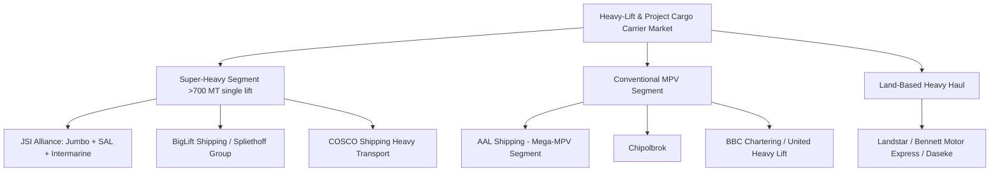

## Major Global Heavy-Lift and Project Cargo Carriers

### Overview and Market Structure

The global heavy-lift and project cargo shipping market is a specialized subset of the broader maritime shipping industry, distinct from container liner shipping in both vessel design and commercial model. Rather than fixed-route container services, heavy-lift carriers typically operate a mix of scheduled semi-liner services and bespoke tramp chartering, engineering each voyage around specific project cargo requirements. The market is considerably more concentrated than general breakbulk shipping, with a relatively small number of carriers controlling the majority of vessels capable of handling cargo above roughly 700 metric tons per lift — the segment industry analysts generally distinguish as "super-heavy" lift capability versus conventional multipurpose vessel (MPV) capacity.

### Major Independent Heavy-Lift Carriers

**Key Points**

- **BigLift Shipping** (part of the Spliethoff Group, Netherlands) operates a modern fleet of four heavy transport vessels and 21 heavy lift vessels, including the Spliethoff P8-Type and P14-Type heavy lift vessels and the Chung Yang CY-Type heavy transport vessels. Its heavy lift vessels carry lifting capacities up to 2,200 metric tons, with some offering ro-ro capability for loads up to 2,500 metric tons, while the heavy transport vessels can handle individual ro-ro cargoes of approximately 16,000 metric tons each. The company has continued to expand capacity, ordering a new heavy-lift vessel — a sister ship to its vessel Happy Star — to be built by Dalian Shipbuilding Offshore in China, featuring two 1,100-ton heavy-lift mast cranes supplied by Huisman. [BigLift Shipping | Spliethoff Group +3](https://www.spliethoffgroup.com/companies/biglift-shipping/)
- **The JSI Alliance** — combining **Jumbo Shipping**, **SAL Heavy Lift**, and **Intermarine** — represents one of the largest coordinated heavy-lift fleets globally. The combined alliance fleet is recognized as a global leader in project and heavy lift logistics, offering lifting capacities of up to 3,000 tonnes. SAL Heavy Lift, headquartered in Hamburg, Germany, has continued expanding its semi-submersible deck carrier capacity, having acquired two semi-submersible deck carriers from former owner Pan Ocean of Korea, scheduled for delivery in Europe between October 2025 and April 2026, doubling its capacity in that specialized segment. [Sal-heavylift](https://sal-heavylift.com/news/latest-news)[Sal-heavylift](https://sal-heavylift.com/news/latest-news)
- **COSCO Shipping Specialized Carriers**, a subsidiary of China Ocean Shipping Company, operates a large fleet of specialized vessels for project cargo and heavy-lift transportation and is a major player in Asian routes with a growing global presence. Its affiliate, **COSCO Shipping Heavy Transport (Americas)**, is widely recognized as a leader in the semi-submersible market, handling high-value heavy cargoes with safe, reliable, and fast transport. [Global Trade Magazine](https://www.globaltrademag.com/10-ocean-carrier-experts-for-project-cargo-and-heavy-lift/)[Global Trade Magazine](https://www.globaltrademag.com/10-ocean-carrier-experts-for-project-cargo-and-heavy-lift/)
- **AAL Shipping** has built a position around the largest end of the multipurpose vessel segment. Having served the global breakbulk and heavy lift project cargo sector for 25 years, AAL is recognized as one of the largest and most trusted multipurpose carriers, serving major industries including energy, oil and gas, mining, infrastructure, and forestry. The company offers three distinct service models — bespoke tramp chartering, scheduled liner services between Asia, Oceania, and the Middle East, and semi-liner services combining fixed routes with port call flexibility — and its fleet spearheads the "mega-mpv" (30,000+ dwt) segment. [Heavyliftpfi](https://www.heavyliftpfi.com/awards/2026/08/18/shortlist-spotlight-2026-project-logistics-provider-of-the-year/)[Heavyliftpfi](https://www.heavyliftpfi.com/awards/2026/08/18/shortlist-spotlight-2026-project-logistics-provider-of-the-year/)
- **Roll Group** positions itself for end-to-end delivery across multiple sectors. The company operates a fleet of 10 specialized vessels, including semi-submersibles and module carriers, enabling factory-to-foundation logistics for clients across renewable energy, oil and gas, petrochemical, and power sectors, and reported a fleet utilization rate of 98.7 percent in recent operations, which included the complex delivery of two 1,160-tonne cutter suction dredgers from the Netherlands to a remote mine site in Mozambique. [Heavyliftpfi](https://www.heavyliftpfi.com/awards/2026/08/27/shortlist-spotlight-2026-ship-operator-of-the-year-heavy-lift-project-cargo/)[Heavyliftpfi](https://www.heavyliftpfi.com/awards/2026/08/27/shortlist-spotlight-2026-ship-operator-of-the-year-heavy-lift-project-cargo/)
- **Chipolbrok** (China-Poland Joint Stock Shipping Company) has been actively growing capacity aligned with energy-sector demand, scaling up its heavy-lift multipurpose fleet with new ship orders to meet growing demand for wind and energy storage system cargoes. [Journal of Commerce](https://www.joc.com/article/energy-related-transport-metals-and-mining-to-lift-project-cargo-sector-in-2026-6146518)
- Other notable players include **United Heavy Lift (UHL)** and **BBC Chartering**, both active participants in industry-wide safety and technical standards initiatives alongside the carriers above.

### Land-Based Heavy Haul Carriers (North America Focus)

**Key Points**

- Land-based heavy haul trucking is a structurally distinct market from ocean heavy-lift shipping, dominated by regional and national specialized carriers rather than a small global oligopoly. Top performers such as Landstar Transportation Logistics, Bennett Motor Express, and Daseke Inc. have set high standards for quality and reliability in this segment, though smaller specialized carriers often provide more personalized service and flexibility. [Loyalty Logistics](https://www.whyloyalty.com/blog/top-heavy-haul-trucking-companies-for-your-freight-needs/)
- Heavy haul trucking refers to the transport of freight exceeding standard legal weight and size limits — in the United States, typically loads over 80,000 pounds gross vehicle weight or dimensions exceeding roughly 8.5 feet wide and standard state height/length limits. [Loyalty Logistics](https://www.whyloyalty.com/blog/top-heavy-haul-trucking-companies-for-your-freight-needs/)
- These shipments require specialized trailers, permits, and often escort vehicles, and the sector serves critical industries including construction, energy, mining, manufacturing, and infrastructure development, commonly moving transformers, generators, turbines, excavators, cranes, bridge beams, and prefabricated buildings. [Loyalty Logistics](https://www.whyloyalty.com/blog/top-heavy-haul-trucking-companies-for-your-freight-needs/)

### Industry Collaboration and Standards Bodies

**Key Points**

- The Heavy Lift Exchange Forum, initiated by DNV, released a "Guidance on Stability of Lifts" document — a comprehensive operational guideline aimed at improving safety and stability in heavy lift operations by addressing complex cargo shapes where established procedures were previously unclear. [Sal-heavylift](https://sal-heavylift.com/news/latest-news)
- This guidance was the product of collaboration among leading heavy lift shipping companies including BBC Chartering, BigLift Shipping, DNV, Heerema Marine Contractors, Jumbo, SAL Engineering, and United Heavy Lift, reflecting the sector's relatively cooperative approach to safety standards despite competitive fleet operations. [Sal-heavylift](https://sal-heavylift.com/news/latest-news)
- Industry recognition events such as the Heavy Lift Awards (organized by Heavy Lift & Project Forwarding International) serve as an informal barometer of competitive positioning, with categories such as Ship Operator of the Year and Project Logistics Provider of the Year regularly shortlisting the carriers named above.

### Market Outlook

**Key Points**

- Energy-related transport along with metals and mining activity are expected to lift the project cargo sector's overall volumes, reflecting the sector's continued dependence on the demand drivers covered in earlier chapter items (oil and gas, power generation, mining). [Journal of Commerce](https://www.joc.com/article/energy-related-transport-metals-and-mining-to-lift-project-cargo-sector-in-2026-6146518)
- Fleet expansion announcements across BigLift, SAL/Jumbo, and Chipolbrok in the same period indicate carriers are positioning for sustained multi-year demand growth rather than reacting to a short-term cyclical upswing, though [Inference] the degree to which this reflects durable structural growth versus a cyclical peak tied to current energy and mining capex levels would require longer-term fleet utilization data to assess with confidence.
- Consolidation trends — exemplified by the SAL/Jumbo/Intermarine JSI Alliance structure — suggest the super-heavy lift segment (above 700 MT single-lift capacity) may continue trending toward fewer, larger coordinated fleets rather than fragmenting among new entrants, given the high capital cost of purpose-built heavy-lift tonnage.

### Carrier Landscape by Capability Tier

### Example: Vessel Selection for a Semi-Submersible Cargo Move

A 1,200-tonne floating cargo unit (such as a jacket structure or dredger, as in Roll Group's Mozambique delivery) requiring semi-submersible transport illustrates the carrier selection process: the shipper evaluates carriers based on available semi-submersible deck carrier capacity (a specialized vessel class held by relatively few operators such as SAL, COSCO Shipping Heavy Transport, and Roll Group), deck loading strength, submerged draught capability at the load-out and discharge ports, and current fleet utilization — with carriers reporting utilization rates near 98–99% during peak demand periods, as seen in recent Roll Group operations, indicating limited spare capacity and the need for early vessel booking on time-sensitive projects.

### Related Topics

- Oil, Gas, and Petrochemical Sector Demand Drivers
- Power Generation and Renewable Energy Sector Demand
- Mining and Heavy Industrial Equipment Movements
- Semi-Submersible Vessel Types and Float-On/Float-Off Operations
- Heavy-Lift Vessel Fleet Economics and Newbuild Investment Cycles
- Multipurpose Vessel (MPV) versus Heavy-Lift Vessel Classifications
- Land-Based Heavy Haul Trucking Regulations and Permitting
- Industry Safety Standards and the DNV Heavy Lift Exchange Forum