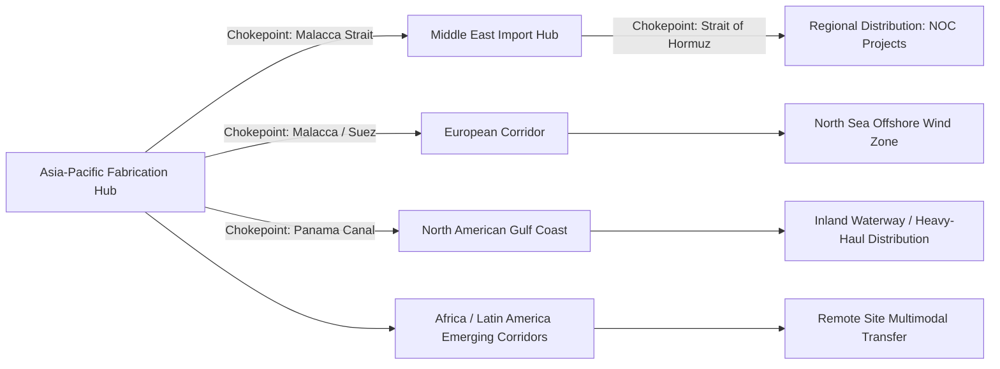

## Regional Market Dynamics and Trade Corridors

### Overview and Framing

Heavy-lift and project cargo trade flows do not follow uniform global patterns; they concentrate along specific corridors shaped by where fabrication capacity, raw material sources, and end-user project sites are located. Because a large share of oversized and heavy cargo is fabricated in a handful of low-cost, high-capability yards and then shipped to project sites across the globe, regional trade corridor analysis is central to fleet positioning, freight rate formation, and route planning within the industry.

### Asia-Pacific Fabrication and Export Corridor

**Key Points**

- China, South Korea, and, to a lesser extent, Southeast Asia (Vietnam, Thailand, Indonesia) have become the dominant global fabrication base for modularized process equipment, wind turbine components, and structural steel modules, driven by lower labor costs and mature heavy industrial fabrication ecosystems.
- Outbound trade lanes from this region serve virtually every other sector covered in this chapter — Middle East and West African oil and gas projects, European and North American offshore wind farms, and global mining and infrastructure projects all increasingly source heavy equipment from Asian yards.
- Port infrastructure in this region (particularly in China and South Korea) has been purpose-built or upgraded to handle the largest fabricated modules, including dedicated heavy-lift quays with reinforced load-bearing capacity.
- Rising domestic demand within Asia-Pacific itself — particularly China's continued industrial buildout and India's growing refining, petrochemical, and infrastructure investment — is increasing intra-regional heavy-lift volume alongside the traditional export-oriented flow.

### Middle East Import and Regional Hub Corridor

**Key Points**

- The Middle East, led by Saudi Arabia, the UAE, and Qatar, functions primarily as a high-volume import destination for heavy-lift cargo, driven by sustained national oil company (NOC) capital programs in oil, gas, and petrochemicals, alongside large-scale infrastructure and giga-project development.
- The region's strategic maritime chokepoints — particularly the Strait of Hormuz — introduce a distinct geopolitical risk factor uncommon in most other trade corridors; regional tensions have periodically disrupted or threatened to disrupt shipping through this corridor, with direct implications for heavy-lift vessel routing and freight insurance costs.
- Regional ports (Jebel Ali, King Abdullah Port, Hamad Port) have developed as transshipment and staging hubs, allowing heavy-lift cargo destined for inland project sites to be received, temporarily stored, and forwarded via specialized inland heavy-haul transport.
- Local content requirements in some Gulf states are gradually increasing in-region fabrication capacity, which may over time shift a portion of demand from an import corridor model toward a more balanced regional fabrication and consumption pattern. [Inference] The pace of this shift depends on continued government investment in domestic fabrication capability and is not yet a dominant pattern as of current industry reporting.

### North American Corridor

**Key Points**

- The U.S. Gulf Coast (Houston, Beaumont, New Orleans corridor) serves a dual role as both a fabrication and import hub, supporting the region's dense concentration of refining, petrochemical, and LNG export infrastructure, and benefiting from established inland waterway (Mississippi River system) connectivity for heavy-haul barge transport.
- Cross-border heavy-haul logistics between the U.S., Canada, and Mexico are shaped by differing state, provincial, and federal permitting regimes, requiring specialized route engineering and permitting expertise distinct from single-jurisdiction moves.
- The U.S. offshore wind buildout along the Atlantic Coast has created new demand for specialized port marshaling facilities in a region historically less developed for heavy-lift infrastructure compared to the Gulf Coast, driving significant new port investment.
- Domestic heavy-haul trucking (covered by carriers such as Landstar, Bennett Motor Express, and Daseke) forms a distinct but interconnected layer of the corridor, handling final inland delivery from ports and rail terminals to project sites.

### European Corridor

**Key Points**

- Northern European ports (Rotterdam, Antwerp, Hamburg, Amsterdam) serve as major heavy-lift hubs, benefiting from deep-water access, established heavy industrial fabrication clusters, and proximity to the North Sea offshore wind development zone.
- The North Sea offshore wind corridor has become one of the most active heavy-lift shipping lanes in the world, with foundation, turbine, and substation components moving frequently between fabrication sites, marshaling ports, and offshore installation sites.
- European heavy-haul road transport is constrained by a dense, historically developed road and bridge network not originally engineered for the scale of modern oversized cargo, requiring extensive route surveys and, in some cases, infrastructure reinforcement for individual moves.
- The Spliethoff Group (BigLift Shipping) and SAL Heavy Lift, both headquartered in the Netherlands and Germany respectively, reflect the region's position as a historic base for heavy-lift shipping expertise and fleet ownership, independent of where cargo ultimately originates or terminates.

### Africa and Latin America Emerging Corridors

**Key Points**

- West Africa (Nigeria, Angola, Mozambique) generates heavy-lift import demand tied to offshore oil and gas development and, increasingly, LNG projects, but faces persistent port and inland infrastructure limitations that require specialized multimodal logistics solutions.
- Remote mining project logistics in Africa (as referenced in the mining sector chapter item) frequently require heavy-lift providers to coordinate ocean, rail, and purpose-built haul road transport in regions with minimal pre-existing infrastructure.
- Latin America's corridor demand centers on Brazil's offshore pre-salt oil development and, further south, Chile and Peru's mining sector, with Panama Canal transit representing a key strategic chokepoint for heavy-lift cargo moving between Asia-Pacific fabrication and Atlantic-facing destinations.
- These emerging corridors generally carry higher logistics complexity and cost per shipment than established corridors, reflecting the added engineering burden of limited existing infrastructure.

### Strategic Chokepoints and Route Risk

**Key Points**

- Global heavy-lift trade is disproportionately exposed to a small number of maritime chokepoints — the Strait of Hormuz, the Suez Canal, the Panama Canal, and the Strait of Malacca — where disruption (geopolitical conflict, grounding incidents, drought-driven transit restrictions) can significantly affect global routing and transit times for heavy-lift vessels, which often have fewer alternative routing options than container vessels due to their specialized voyage planning.
- Regional geopolitical tensions in the Middle East have continued to disrupt global shipping patterns, directly affecting Gulf-origin and Gulf-destined heavy-lift trade flows and requiring carriers to factor rerouting risk into voyage planning and freight rates.
- Panama Canal transit constraints (historically driven by water-level-dependent draft restrictions) illustrate how climate variability can directly affect a strategic heavy-lift corridor, sometimes forcing alternate, longer routings for large vessels.

### Global Trade Corridor Map (Conceptual Flow)

### Example: Fabrication-to-Site Corridor for a Middle East LNG Module

A liquefaction train module fabricated in a South Korean shipyard-adjacent facility and destined for a Qatari LNG expansion project illustrates a representative corridor flow: the module transits from the Asia-Pacific fabrication hub through the Strait of Malacca, continues across the Indian Ocean, and enters the Persian Gulf through the Strait of Hormuz — a route whose viability and cost are directly sensitive to regional geopolitical conditions at the single chokepoint through which nearly all Gulf-bound heavy-lift cargo must pass, illustrating the corridor-level concentration risk distinct from the diversified routing options available to general container trade.

### Related Topics

- Major Global Heavy-Lift and Project Cargo Carriers
- Oil, Gas, and Petrochemical Sector Demand Drivers
- Power Generation and Renewable Energy Sector Demand
- Mining and Heavy Industrial Equipment Movements
- Maritime Chokepoint Risk and Voyage Planning
- Port Infrastructure Investment for Heavy-Lift Staging
- Cross-Border Heavy-Haul Permitting in North America
- Geopolitical Risk Assessment in Project Logistics