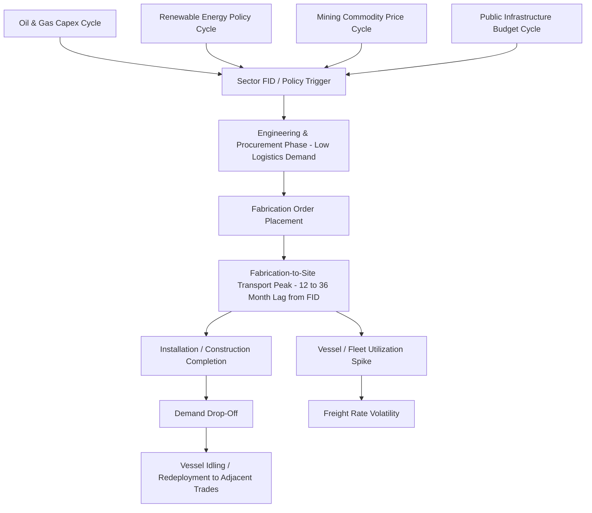

## Market Cyclicality and Project-Driven Demand Patterns

### Overview and Distinguishing Feature of Project-Driven Demand

Unlike container shipping or general freight, where demand is relatively continuous and correlated with broad trade and consumer activity, heavy-lift and project cargo demand is fundamentally lumpy — it arrives in large, discrete bursts tied to individual capital projects rather than steady flows. This distinction is the single most important structural feature of the market: a heavy-lift carrier's near-term revenue outlook depends less on macroeconomic indicators broadly and more on the timing of a relatively small number of Final Investment Decisions (FIDs) across the sectors covered earlier in this chapter (oil and gas, power generation, mining, infrastructure, aerospace/defense).

### The Project Lifecycle and Its Logistics Demand Curve

**Key Points**

- Capital projects generate heavy-lift demand unevenly across their lifecycle: minimal activity during early engineering and design phases, a sharp ramp during procurement and fabrication as equipment orders are placed, a peak during the fabrication-to-site transport and installation phase, and a rapid drop-off once construction is substantially complete.
- This creates a lag between commodity price signals (or policy announcements) and actual heavy-lift demand materializing — typically 12 to 36 months between an FID and the corresponding peak logistics activity, depending on project complexity and fabrication lead times.
- Because heavy-lift vessels and specialized transport assets cannot be quickly built or decommissioned in response to short-term demand shifts (a purpose-built heavy-lift vessel newbuild order can take two to four years to deliver), the supply side of the market responds to demand cycles with considerable lag, amplifying rate volatility during both upswings and downswings.

### Sources of Demand Lumpiness

**Key Points**

- **Mega-project concentration**: A small number of very large projects (LNG megaprojects, giant offshore platforms, major refinery expansions) can represent a disproportionate share of a given year's total heavy-lift tonnage, meaning the timing of just a handful of FIDs can materially swing global market conditions.
- **Sector-specific investment cycles overlapping or diverging**: Because oil and gas, mining, power generation, and infrastructure investment cycles are driven by different underlying factors (commodity prices, policy, public budgets), they do not always move in sync — a downturn in oil and gas capex can sometimes be partially offset by a simultaneous upswing in offshore wind or infrastructure investment, though [Inference] the degree of offsetting varies by period and is not a reliable hedge that carriers can count on in every cycle.
- **Fabrication yard queuing effects**: When multiple large projects reach the fabrication and shipping stage simultaneously, competition for limited fabrication yard capacity and heavy-lift vessel slots can compress an already lumpy demand pattern into an even shorter, more intense window, further amplifying rate spikes.
- **Weather and seasonal windows**: Certain project logistics (Arctic and sub-Arctic mining sites, monsoon-affected regions, ice-road-dependent routes) are constrained to narrow seasonal delivery windows, concentrating demand into specific calendar periods regardless of underlying project economics.

### Freight Rate and Charter Market Behavior

**Key Points**

- Heavy-lift charter rates tend to exhibit greater volatility than container or bulk shipping rates precisely because of demand lumpiness combined with an inelastic, slow-to-adjust vessel supply.
- During demand troughs, carriers often idle vessels, redeploy them into adjacent conventional breakbulk trades, or lay up tonnage rather than scrap it, preserving flexibility to redeploy quickly once a new project wave begins.
- Long-term charter and contract-of-affreightment arrangements with major EPC (engineering, procurement, and construction) contractors or project owners provide a partial hedge against spot market volatility for both carriers and shippers, though the specialized nature of much heavy-lift cargo limits the liquidity of any true spot market compared to commodity shipping.
- Fleet utilization rates reported by major carriers (in the high-90s percent range during strong demand periods, as referenced for some operators in the prior chapter item on major carriers) are a useful leading indicator of tightening capacity and potential rate increases.

### Forecasting and Demand Visibility Tools

**Key Points**

- Industry participants commonly track FID announcements, engineering contract awards, and EPC contractor project pipelines as leading indicators of future heavy-lift demand, given the multi-year lag between project sanction and peak logistics activity.
- Trade publications and market analysts (covering project cargo and breakbulk shipping specifically) provide sector-level demand forecasting distinct from general shipping market analysis, reflecting the specialized nature of demand drivers in this market.
- Because project-driven demand is inherently lumpier and harder to forecast than consumer-driven freight demand, carriers and logistics providers often maintain diversified sector exposure (serving oil and gas, renewables, mining, and infrastructure simultaneously) as a structural hedge against any single sector's cyclicality.

### Cyclicality Pattern Across Sectors

### Example: Overlapping Project Waves and Rate Behavior

A scenario in which several large LNG projects in the Middle East and Gulf Coast reach peak fabrication-to-site logistics activity within the same 18-month window, coinciding with a simultaneous surge in North Sea offshore wind foundation installations, illustrates how demand lumpiness compounds: carriers with semi-submersible and heavy-lift vessel capacity suitable for both LNG modules and wind foundations face simultaneous demand from otherwise unrelated sectors, tightening available capacity and pushing charter rates upward — a dynamic that can reverse just as sharply once both project waves move past their peak logistics phase and into installation completion.

### Related Topics

- Oil, Gas, and Petrochemical Sector Demand Drivers
- Power Generation and Renewable Energy Sector Demand
- Mining and Heavy Industrial Equipment Movements
- Major Global Heavy-Lift and Project Cargo Carriers
- Regional Market Dynamics and Trade Corridors
- Heavy-Lift Vessel Newbuild Investment and Fleet Supply Response
- EPC Contractor Project Pipelines as Demand Indicators
- Freight Rate Formation in Specialized and Charter Markets