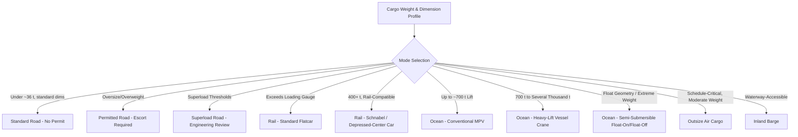

## Weight, Dimension, and Gauge Thresholds by Transport Mode

### Overview and Classification Purpose

Heavy-lift and oversized cargo classification exists because each transport mode — road, rail, ocean vessel, barge, and air — has physically and regulatorily distinct thresholds beyond which standard equipment, permitting, and handling procedures no longer apply. Understanding these thresholds is foundational to route and mode selection: a shipment's weight and dimensions determine not just which mode is feasible, but which specific equipment configuration, permit category, and engineering study requirements apply within that mode. [Unverified] The specific numeric thresholds below reflect commonly cited industry norms and representative regulatory frameworks (particularly U.S. federal/state and general international practice); actual legal limits vary by country, state/province, and even individual route, and must be confirmed against the specific jurisdiction and carrier equipment for any real shipment.

### Road Transport Thresholds

**Key Points**

- **Standard legal limits (U.S. reference)**: Gross vehicle weight is commonly capped around 80,000 pounds (36.3 metric tons) on U.S. interstate highways without a special permit, with standard width limits around 8.5 feet (2.6 m), height around 13.5–14 feet (4.1–4.3 m), and length varying by configuration and state.
- **Oversize/overweight (OSOW) permit thresholds**: Cargo exceeding these standard limits requires state-issued permits, and beyond certain thresholds (commonly cited around 12–16 feet wide or several hundred thousand pounds, varying significantly by state), escort vehicles, route surveys, and sometimes police escort become mandatory.
- **Superload thresholds**: The largest road shipments — often exceeding 200,000–400,000 pounds gross weight or extreme width/height combinations — are typically classified as "superloads," triggering the most intensive engineering review, including bridge load analysis, utility clearance verification, and often multi-state route coordination for interstate moves.
- International road limits vary substantially by country; European road transport, for example, generally operates under stricter standard dimensional limits than the U.S. due to older road and bridge infrastructure, making the oversize threshold trigger at correspondingly lower dimensions in many cases.

### Rail Transport Thresholds (Gauge and Clearance)

**Key Points**

- **Loading gauge**: Rail transport is fundamentally constrained by the "loading gauge" — the maximum cross-sectional profile (width and height) that can safely clear tunnels, bridges, platforms, and adjacent track structures along a given route — which varies significantly by country and even by specific rail corridor.
- **Track gauge versus loading gauge**: Track gauge (the distance between the rails, e.g., standard gauge at 1,435 mm) is distinct from loading gauge (the cargo clearance envelope); a shipment can fit within the loading gauge of one route but exceed it on another route of the same track gauge due to differing tunnel and structure clearances.
- **Schnabel cars and depressed-center flatcars**: For rail cargo exceeding standard flatcar capacity (commonly several hundred tons), specialized car types such as Schnabel cars — which cradle the cargo itself as part of the structural load path, effectively using the cargo as part of the railcar's frame — allow transport of single components exceeding 400–600 tons, as referenced in the earlier chapter item on power generation and grid infrastructure logistics.
- **Weight per axle and per-foot distribution limits**: Rail bridges and track structures impose limits on weight distributed per axle and per linear foot of railcar, requiring specialized multi-axle railcar configurations (sometimes 20+ axles) to distribute extreme loads within structural limits.

### Ocean and Marine Transport Thresholds

**Key Points**

- **Conventional MPV versus heavy-lift vessel threshold**: As referenced in the prior chapter item on major carriers, the industry commonly distinguishes conventional multipurpose vessels (handling individual lifts up to roughly 700 metric tons using onboard cranes) from dedicated heavy-lift vessels (700+ metric tons up to several thousand tons per lift using heavier-capacity cranes or semi-submersible deck-loading methods).
- **Deck strength and load distribution**: Vessel deck loading capacity, typically expressed in tonnes per square meter, determines whether a given cargo footprint can be accommodated even if the vessel's crane capacity is technically sufficient — a large but low-density cargo item can be deck-strength-limited rather than crane-capacity-limited.
- **Semi-submersible float-on/float-off thresholds**: Cargo exceeding practical crane-lift capacity (commonly above 2,000–3,000 tons, or cargo with an impractical lifting geometry such as a floating platform or dredger) is typically transported via semi-submersible vessels using float-on/float-off methods rather than crane lifting.
- **Air draft and channel draft constraints**: Port and waterway access for heavy-lift vessels is constrained by both air draft (vertical clearance under bridges and cranes) and channel/berth draft (water depth), which can exclude certain vessels or cargo configurations from otherwise capable ports.

### Air Transport Thresholds

**Key Points**

- Outsize air cargo capability is limited to a small number of specialized aircraft types, with typical maximum single-item payloads in the range of 40–120+ metric tons depending on aircraft type, substantially lower than ocean or even rail capacity but valued for speed on schedule-critical moves such as those referenced in the aerospace and defense chapter item.
- Cargo hold dimensional constraints (door width and height, fuselage cross-section) are frequently the binding limit for air transport rather than weight, particularly for cylindrical or irregularly shaped industrial components.
- Air transport of heavy-lift cargo is typically reserved for schedule-critical, high-value-density shipments (aircraft manufacturing components, satellite payloads, emergency replacement parts) given the substantial cost premium relative to ocean or road transport for comparable tonnage.

### Barge and Inland Waterway Thresholds

**Key Points**

- Inland waterway barge transport typically offers the highest weight capacity per unit of transport cost among all modes for cargo that can access a navigable waterway, with individual barge capacities often exceeding 1,000–3,000 tons depending on barge type and waterway depth restrictions.
- Lock and dam dimensional constraints on managed waterway systems (such as the U.S. inland waterway system) impose hard limits on barge tow length and width independent of the cargo's own weight or dimensions.
- Seasonal water level variability, as referenced in the earlier chapter item on regional trade corridors, can constrain barge draft capacity and therefore effective cargo weight limits at different times of year.

### Cross-Mode Threshold Comparison

### Example: Mode Selection for a 550-Ton Reactor Vessel

A 550-ton refinery reactor vessel with a 6-meter diameter illustrates the cross-mode threshold decision process: road transport would require superload permitting and extensive bridge/route engineering across every jurisdiction traversed; rail transport would require a Schnabel or depressed-center car and verification against the loading gauge of every tunnel and structure on the route; ocean transport would place the vessel just above the conventional MPV threshold, likely requiring a heavy-lift vessel with sufficient crane capacity or deck strength — with the final mode decision typically driven by the combination of origin/destination infrastructure access, total route distance, and relative cost rather than any single threshold factor in isolation.

### Related Topics

- Major Global Heavy-Lift and Project Cargo Carriers
- Superload Permitting and Route Survey Engineering
- Schnabel Cars and Specialized Rail Equipment
- Semi-Submersible Vessels and Float-On/Float-Off Methods
- Outsize Air Cargo Aircraft Capabilities
- Bridge and Culvert Load-Bearing Assessment for Heavy Haul
- Inland Waterway Systems and Seasonal Draft Constraints
- Multimodal Transfer Point Engineering