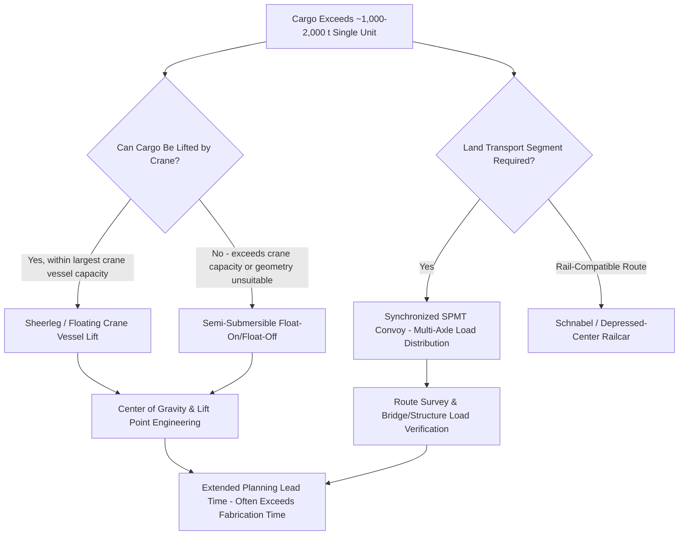

## Superheavy Lift and Ultra-Heavy Cargo Categories

### Overview and Definitional Boundaries

Superheavy lift and ultra-heavy cargo represent the extreme upper tier of the weight thresholds introduced in the prior chapter item, encompassing single-piece cargo that pushes against — or exceeds — the practical limits of existing transport equipment across every mode. While the industry does not apply a single universally standardized numeric definition, cargo in this category is commonly understood to begin around 1,000–2,000 metric tons for a single lift or transport unit, with the most extreme examples reaching 15,000–20,000+ metric tons for items such as complete offshore platform topsides. What distinguishes this category is not just weight itself, but the fact that only a small, specialized subset of global equipment and expertise is capable of handling it at all.

### Defining Characteristics of Superheavy Cargo

**Key Points**

- **Structural self-support limitations**: Many superheavy items cannot be lifted using conventional slinging or rigging methods because the cargo's own structure would be damaged or fail under the concentrated stress of lift points designed for smaller loads, requiring engineered lift point analysis, spreader frames, or specialized cradles.
- **Indivisibility**: A defining feature of most superheavy cargo is that it cannot be practically disassembled into smaller shippable sections without incurring substantial cost, schedule delay, or engineering risk (for example, re-certification of welds or structural joints), which is precisely why shippers pay the premium required to move it as a single unit.
- **Route and infrastructure dependency**: Superheavy cargo transport is rarely a matter of simply selecting a large enough vessel or trailer; it typically requires the origin and destination to have (or be engineered to have) infrastructure specifically capable of handling the load, from quay bearing capacity to specialized SPMT trailer configurations.
- **Limited redundancy**: Because so few pieces of equipment globally can handle the largest superheavy cargo, a mechanical failure, weather delay, or scheduling conflict involving the one available vessel or crane can have outsized project schedule consequences compared to more standard cargo categories.

### Ultra-Heavy Categories by Cargo Type

**Key Points**

- **Offshore platform topsides and jackets**: As referenced in the oil, gas, and petrochemical sector chapter item, complete platform topsides can exceed 20,000 metric tons, typically requiring either heavy-lift semi-submersible vessel transport with float-over installation, or, for somewhat smaller units, the largest crane vessels in the world equipped with revolving or fixed heavy-lift cranes.
- **Reactor vessels and pressure vessels**: Large refinery and petrochemical reactors, hydrocrackers, and similar pressure vessels can exceed 2,000–2,500 metric tons for the largest modern units, combining extreme weight with precision handling requirements due to the vessel's internal metallurgy and welded construction.
- **SAG mills and large rotating equipment**: As referenced in the mining sector chapter item, mill shells for major copper and gold operations can exceed 400–500 metric tons individually, with complete mill assemblies (including drive systems) representing a multi-piece superheavy logistics challenge even when no single component reaches the very top of the weight scale.
- **Ship-to-shore cranes and port equipment**: Fully assembled container cranes, as referenced in the infrastructure chapter item, can exceed 1,500–2,000 metric tons combined with extreme height (60–70+ meters), representing a category where dimensional extremity compounds weight-based handling challenges.
- **Nuclear reactor components**: Reactor pressure vessels, steam generators, and turbine rotors for nuclear power plants represent some of the most demanding superheavy cargo due to the combination of extreme weight, precision tolerances, and often unique national security or regulatory handling requirements.

### Specialized Equipment for Superheavy Handling

**Key Points**

- **Semi-submersible heavy-lift vessels**: Capable of submerging their deck to float cargo on and off (float-on/float-off), these vessels bypass crane lift capacity limitations entirely, making them the preferred method for the very largest and heaviest single items, including complete platforms and large floating structures.
- **Sheerleg and floating crane vessels**: The largest floating crane vessels in the world offer single-lift capacities exceeding 10,000–14,000 metric tons in the most extreme cases, used primarily for offshore platform installation and removal where float-over methods are not suitable.
- **High-capacity SPMT (self-propelled modular transporter) convoys**: Multiple SPMT units can be electronically linked and synchronized to distribute loads exceeding 10,000–20,000 metric tons across hundreds of axle lines, used for the largest land-based moves such as complete process modules or very large reactor vessels.
- **Schnabel and heavy-duty depressed-center railcars**: As referenced in the prior chapter item, these specialized railcars extend rail capability into the several-hundred-ton range by using the cargo itself as part of the load-bearing structure.

### Engineering and Risk Considerations Specific to Superheavy Cargo

**Key Points**

- **Center of gravity and stability analysis**: Superheavy cargo requires precise center-of-gravity calculation and verification, since even small deviations from the engineered lift or transport plan can create dangerous instability during lifting, load-out, or transport operations.
- **Dynamic and environmental loading**: Marine transport of superheavy cargo must account for vessel motion (pitch, roll, heave) under various sea states, since dynamic forces during a voyage can substantially exceed the static weight of the cargo itself in terms of structural load on lashings and securing systems.
- **Insurance and risk allocation complexity**: Given the extreme value concentration in a single shipment and the limited pool of qualified carriers and equipment, superheavy lift projects typically involve specialized marine cargo insurance arrangements and detailed contractual risk allocation between shipper, carrier, and engineering contractors.
- **Extended planning and engineering lead times**: Route surveys, lift plan engineering, and regulatory approvals for superheavy cargo moves often take many months to over a year, frequently exceeding the manufacturing lead time of the cargo itself, making early logistics engagement in project planning essential rather than optional.

### Superheavy Cargo Handling Decision Framework

### Example: Float-Over Installation of a 15,000-Ton Platform Topside

A 15,000-ton offshore platform topside destined for installation in a deepwater field illustrates the superheavy category in practice: the topside is constructed at a fabrication yard with load-out facilities specifically engineered for this weight class, loaded onto a semi-submersible heavy-lift vessel using ballasting rather than crane lifting, transported to the field location, and installed via a float-over operation in which the vessel's ballast system precisely lowers the topside onto the jacket structure — a technique developed specifically because no crane vessel in the world could reliably lift a unit of this size as a single crane operation.

### Related Topics

- Weight, Dimension, and Gauge Thresholds by Transport Mode
- Oil, Gas, and Petrochemical Sector Demand Drivers
- Major Global Heavy-Lift and Project Cargo Carriers
- Semi-Submersible Vessels and Float-On/Float-Off Methods
- SPMT Convoy Synchronization and Axle Load Distribution
- Center of Gravity and Lift Point Engineering
- Marine Cargo Insurance for High-Value Superheavy Shipments
- Float-Over Installation Methods for Offshore Platforms