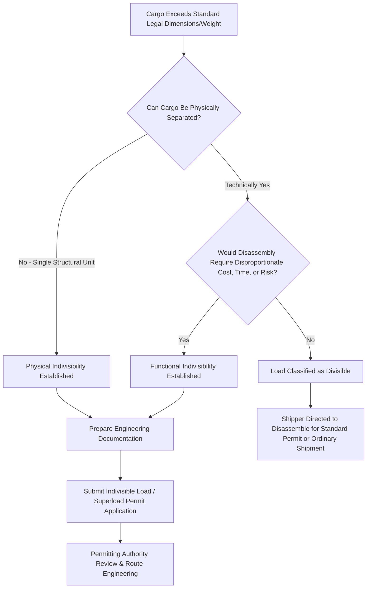

## Indivisible Load Determination Criteria

### Overview and Regulatory Significance

Indivisible load determination is a foundational regulatory and engineering concept in heavy-lift logistics: it establishes whether a piece of cargo legally and practically qualifies for oversize/overweight permitting as a single unit, or whether the shipper is expected to disassemble or reconfigure it into smaller, standard-compliant sections. The determination carries substantial commercial weight, since it directly affects permitting pathways, routing options, and — in many regulatory regimes — the fee and liability structure applied to a given move. [Unverified] Because indivisible load criteria are defined at the level of national and sometimes state/provincial regulation, the specific thresholds and tests referenced below reflect common regulatory patterns (with particular reference to U.S. federal and state frameworks) and should be verified against the specific jurisdiction governing any given shipment.

### Core Definitional Tests

**Key Points**

- **Physical indivisibility**: The most fundamental test asks whether the load can be separated into two or more smaller loads without requiring more time, cost, or specialized equipment than transporting it as a single unit would otherwise require — a load that could be broken down using ordinary means is generally not considered indivisible for regulatory purposes.
- **Functional indivisibility**: Some regulatory frameworks extend the concept beyond pure physical inseparability to include cargo that could technically be disassembled but only at the cost of significant engineering rework, loss of structural integrity, warranty voidance, or re-certification requirements — a test that captures cases like large pressure vessels or reactor components where field disassembly, while theoretically possible, is commercially and technically impractical.
- **Economic and time reasonableness threshold**: Many regulatory definitions incorporate an explicit reasonableness standard — the load cannot be divided into smaller loads without substantially increasing cost or time, or without risk of damage to the cargo — placing the determination on a case-by-case commercial and engineering judgment rather than a purely binary physical test.

### Common Regulatory Frameworks Referencing Indivisibility

**Key Points**

- **U.S. federal and state highway regulation**: Indivisible load status is central to U.S. state permitting frameworks, which generally require the shipper or carrier to demonstrate that a given oversize/overweight load meets the state's indivisibility test before a special permit will be issued, since permits for divisible loads are typically far more restricted or unavailable.
- **Cost and reasonableness documentation**: In practice, demonstrating indivisibility to a permitting authority often requires engineering documentation showing that disassembly would materially increase project cost, extend schedule, or compromise the cargo's structural or functional integrity — placing a practical documentation burden on the shipper or their logistics provider.
- **International variation**: Other jurisdictions apply broadly similar reasonableness-based indivisibility concepts within their own oversize/overweight permitting regimes, though specific documentation requirements, permitted weight thresholds, and the regulatory body responsible for making the determination vary by country.

### Engineering Factors Considered in Indivisibility Assessments

**Key Points**

- **Structural integrity risk**: Whether disassembly would require cutting or unwelding load-bearing structural elements, which could compromise the certified structural capacity of the finished equipment and require costly re-inspection or re-certification before the equipment could be placed into service.
- **Manufacturing and warranty implications**: Equipment manufacturers frequently specify that field disassembly and reassembly voids warranty coverage or requires manufacturer-supervised reassembly, which logistics providers cite as supporting evidence for indivisibility.
- **Precision and calibration sensitivity**: Equipment with tight internal tolerances (turbines, precision-machined components, certain pressure vessel internals) may be functionally compromised by disassembly and reassembly even if physically possible, supporting a functional indivisibility argument.
- **Cost-benefit comparison**: A formal cost comparison between disassembly-transport-reassembly versus single-unit heavy-haul transport is often prepared as supporting documentation, since the reasonableness standard in most frameworks is inherently comparative rather than absolute.

### Practical Implications for Route and Mode Selection

**Key Points**

- Indivisible load status generally unlocks a distinct permitting pathway (often called a superload or indivisible load permit) that, while requiring more extensive engineering review and route survey, allows movement of cargo that would otherwise be legally prohibited from road transport in its assembled state.
- Some jurisdictions apply different weight or dimension fee structures to indivisible load permits compared to standard oversize/overweight permits, reflecting the additional route engineering and bridge/infrastructure analysis typically required.
- Early indivisibility determination is a standard part of pre-project logistics engineering, since the answer materially affects mode selection (as covered in the prior chapter item) — cargo confirmed as indivisible and exceeding road-feasible dimensions may be redirected toward rail, barge, or ocean transport instead.
- Disputes over indivisibility determination between shippers and permitting authorities can introduce significant project schedule risk, making early engagement with permitting authorities and thorough engineering documentation a standard risk mitigation practice in the industry.

### Indivisible Load Determination Process

### Example: Indivisibility Determination for a Gas Turbine Generator

A 450-ton gas turbine generator destined for a combined-cycle power plant illustrates the determination process: while the turbine casing could theoretically be separated from its baseplate and auxiliary systems, doing so would require the manufacturer's field service team to recalibrate precision internal clearances upon reassembly, void portions of the equipment warranty, and add several weeks to the installation schedule — engineering and commercial documentation of these consequences typically forms the basis for a successful indivisible load determination, supporting a superload road permit or, where road transport remains infeasible, redirection to rail or barge transport as covered in the prior chapter items.

### Related Topics

- Weight, Dimension, and Gauge Thresholds by Transport Mode
- Superheavy Lift and Ultra-Heavy Cargo Categories
- Superload Permitting and Route Survey Engineering
- Major Global Heavy-Lift and Project Cargo Carriers
- Power Generation and Renewable Energy Sector Demand
- Bridge and Culvert Load-Bearing Assessment for Heavy Haul
- Cost-Benefit Analysis in Mode and Route Selection
- Manufacturer Warranty Considerations in Field Disassembly