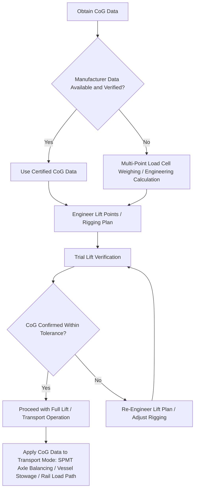

## Center of Gravity and Weight Distribution Analysis

### Overview and Engineering Significance

Center of gravity (CoG) and weight distribution analysis is one of the most safety-critical engineering disciplines in heavy-lift logistics, underpinning nearly every mode-specific operation covered in this chapter — from indivisible load permitting to superheavy float-over installation. An inaccurately determined or poorly managed center of gravity is among the leading contributing factors in heavy-lift incidents, since transport, lifting, and load-securing systems are all engineered around an assumed CoG location; deviations from that assumption can produce forces the system was never designed to handle.

### Fundamental Concepts

**Key Points**

- **Center of gravity (CoG)** is the single point at which an object's entire weight can be considered to act for purposes of static and dynamic force analysis; for irregular, asymmetric industrial cargo (reactors with internal components, machinery with offset drive systems), the CoG rarely coincides with the geometric center of the item.
- **Weight distribution** describes how an item's total weight is spread across its physical footprint or support points, which — independent of CoG location — determines how much load each individual lift point, axle line, or support structure must bear.
- **Static versus dynamic loading**: Static CoG analysis addresses the cargo at rest, while dynamic analysis accounts for the additional forces introduced by acceleration, deceleration, vessel motion, or lifting operations, which can transiently shift effective load distribution well beyond static values.
- **Longitudinal, transverse, and vertical CoG**: A complete CoG determination requires locating the center of gravity in all three spatial dimensions, since an error in any single axis can produce instability — longitudinal and transverse CoG errors primarily affect tipping and load-point overstress risk, while vertical CoG height directly affects overall stability margins during lifting and transport.

### Determination Methods

**Key Points**

- **Manufacturer-supplied data**: For factory-built equipment, the original equipment manufacturer typically provides certified CoG data as part of the equipment's technical documentation, which is the preferred and most reliable source when available.
- **Physical weighing and calculation methods**: Where manufacturer data is unavailable or unverified, CoG can be determined empirically using multi-point load cell weighing (measuring the weight borne at several support points simultaneously and back-calculating CoG location) or, for simpler geometries, standard engineering calculation from detailed drawings and material density data.
- **Trial lift verification**: For high-value or high-risk lifts, a trial lift — raising the cargo a small distance while closely monitoring rigging angles, load cell readings, and any list or tilt — is a standard practice to verify the calculated CoG before proceeding with the full lift or transport operation.
- **Tilt table and pendulum testing**: For cargo where precise CoG verification is critical (certain marine and aerospace applications), specialized tilt table or pendulum-based testing methods can directly measure CoG height with high precision.

### Application to Lift Point and Rigging Engineering

**Key Points**

- Lift point placement is engineered specifically around the verified CoG location, ensuring that the resultant of all lifting forces passes through (or very near) the vertical line through the CoG to prevent uncontrolled tilting during the lift.
- Sling and rigging angle calculations must account for CoG position when lift points are asymmetrically arranged relative to the cargo's geometric center, since unequal sling angles from an off-center CoG can produce significantly different tension loads on individual slings even when the rigging appears visually symmetric.
- Spreader frames and lift beams are frequently engineered specifically to redistribute lift point loads for cargo with an unfavorable or difficult-to-access CoG location, allowing a more favorable and evenly distributed set of effective lift points.

### Application to Transport and Load Securing

**Key Points**

- **SPMT axle load balancing**: As referenced in the prior chapter items on superheavy cargo, self-propelled modular transporter systems use CoG data to electronically balance load distribution across all engaged axle lines, since an unbalanced load could overstress individual axles even while the aggregate weight remains within the convoy's total rated capacity.
- **Vessel stowage and stability**: Marine transport stowage planning incorporates cargo CoG data into the vessel's overall stability calculations, since an improperly positioned heavy cargo item can shift the vessel's own metacentric height and stability characteristics, particularly for semi-submersible and heavy-lift vessels carrying cargo representing a large fraction of total vessel displacement.
- **Rail car weight distribution**: As referenced in the prior chapter item on gauge thresholds, Schnabel and depressed-center railcars are specifically engineered around the cargo's CoG, since these car types use the cargo itself as a structural element of the load path, making accurate CoG data essential rather than merely advisory for safe operation.
- **Securing and lashing calculations**: Weight distribution data informs the design and placement of lashings, chocks, and securing systems, ensuring that dynamic forces during transport (braking, cornering, vessel motion) are adequately restrained at each securing point relative to its share of the cargo's total weight.

### Consequences of CoG Miscalculation

**Key Points**

- **Lift instability and tipping risk**: An inaccurate CoG assumption during a crane lift can cause the load to tilt unexpectedly as it clears its support, potentially resulting in dropped cargo, structural damage, or personnel injury.
- **Structural overload of individual lift points or axles**: Even when the total weight capacity of a lifting or transport system is sufficient, an unaccounted-for CoG offset can overload individual lift points, slings, or axle lines beyond their rated capacity while the system's total capacity indicator shows no warning.
- **Vessel or vehicle stability compromise**: Significant CoG error in marine or SPMT transport can affect overall platform stability, a risk that compounds with the dynamic loading factors discussed above (sea state, road grade, cornering forces).
- **Schedule and cost impact of late discovery**: CoG errors discovered only during a trial lift or initial transport movement typically require re-engineering of the lift or transport plan, introducing schedule delays that are especially costly for time-critical moves such as those referenced in the aerospace and space sector chapter item.

### CoG Analysis Workflow

### Example: CoG Verification for an Offset-Weight Compressor Skid

A compressor skid with a heavy driver motor mounted asymmetrically on one end illustrates the practical CoG determination process: initial engineering drawings suggest a geometric center-of-gravity estimate, but multi-point load cell weighing during a trial lift reveals the actual CoG is offset by nearly a meter toward the motor end — a discrepancy that, if undetected, would have caused uneven sling tension and a dangerous tilt during the main lift, but which instead prompts rigging engineers to reposition the lift points and add a spreader frame before proceeding with the full lifting operation.

### Related Topics

- Weight, Dimension, and Gauge Thresholds by Transport Mode
- Superheavy Lift and Ultra-Heavy Cargo Categories
- Indivisible Load Determination Criteria
- SPMT Convoy Synchronization and Axle Load Distribution
- Semi-Submersible Vessels and Float-On/Float-Off Methods
- Marine Cargo Insurance for High-Value Superheavy Shipments
- Rigging Engineering and Spreader Frame Design
- Trial Lift Procedures and Verification Protocols