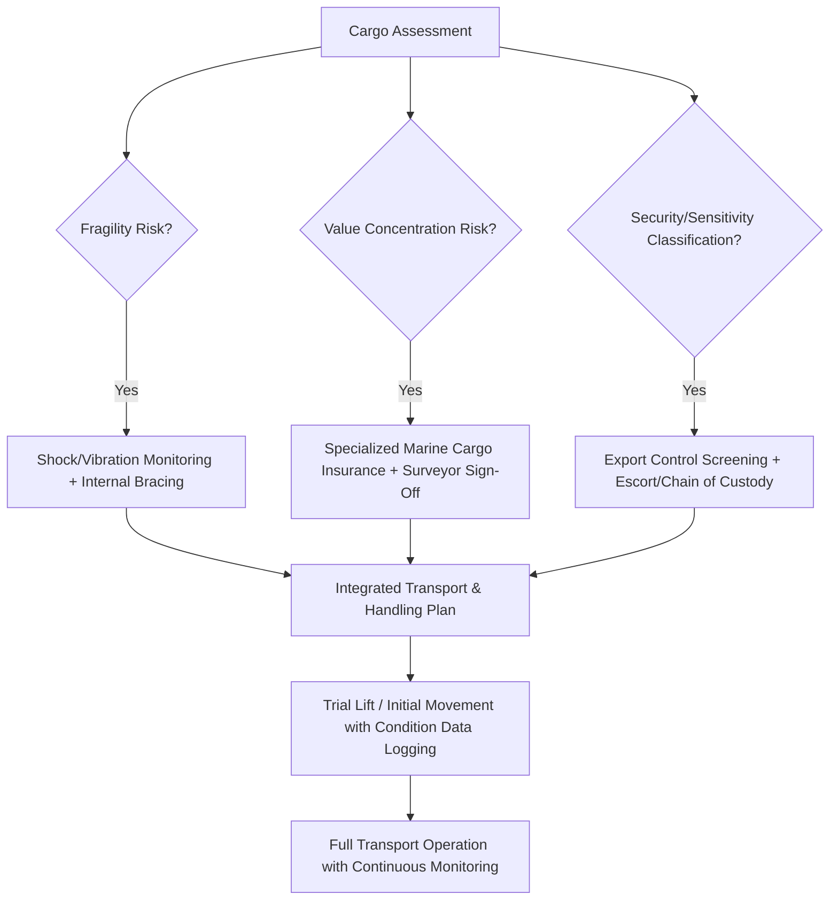

## Fragile, High-Value, and Sensitive Cargo Considerations

### Overview and Distinguishing Framing

While the preceding chapter items focused primarily on weight, dimension, and structural handling of heavy cargo, this item addresses a cross-cutting set of considerations that apply regardless of a shipment's size category: fragility, extreme value concentration, and environmental or security sensitivity. These factors often layer on top of the weight and dimension challenges already discussed — a superheavy reactor vessel, for example, may also carry internal precision components that are simultaneously fragile and high-value, requiring logistics planning that addresses both dimensions of complexity at once.

### Fragility Considerations

**Key Points**

- **Vibration and shock sensitivity**: Precision-machined equipment (turbines, compressors, certain pressure vessel internals) can suffer functional degradation from vibration or shock loads well below the threshold that would cause visible structural damage, requiring continuous vibration monitoring and shock-indicator devices throughout transit rather than simple visual inspection at delivery.
- **Metallurgical and welded joint sensitivity**: Large fabricated structures with critical welded joints (as referenced in the indivisible load chapter item) can be sensitive to stress concentrations introduced by improper lifting or transport securing, even when the item appears robust, making engineered lift point and load path design essential to avoid latent structural damage.
- **Environmental exposure sensitivity**: Certain cargo, particularly electronics, sensitive instrumentation, and specialized coatings or linings, requires protection from temperature extremes, humidity, and salt air exposure during transit — considerations that become particularly acute for long ocean voyages through varied climate zones.
- **Internal component protection**: Large assembled equipment shipped as a single unit (rather than disassembled) often has vulnerable internal components — bearings, seals, electronic control systems, catalyst beds — that require internal bracing, desiccant packages, or nitrogen purging to prevent damage during transport, independent of the external structural handling already addressed through CoG and rigging engineering.

### High-Value Cargo Considerations

**Key Points**

- **Value concentration risk**: As noted in the superheavy lift chapter item, a single heavy-lift shipment can represent a value concentration far exceeding typical container or bulk cargo shipments, sometimes tens or hundreds of millions of dollars in a single transport unit, fundamentally changing the risk calculus applied to route selection, carrier vetting, and insurance structuring.
- **Specialized marine cargo insurance**: High-value heavy-lift shipments typically require bespoke marine cargo insurance arrangements rather than standard policies, often involving detailed engineering review by insurer surveyors as a condition of coverage, and sometimes requiring the shipper to demonstrate compliance with specific lift and transport engineering standards.
- **Contractual risk allocation**: Given the value concentration, contracts for high-value heavy-lift moves typically include detailed liability caps, force majeure provisions, and sometimes named third-party marine warranty surveyor sign-off requirements before a lift or transport operation may proceed.
- **Chain of custody and verification documentation**: High-value cargo movements often require more extensive documentation and verification checkpoints throughout the logistics chain than lower-value shipments, both for insurance compliance and for the shipper's own asset tracking and financial reporting purposes.

### Sensitive Cargo Considerations

**Key Points**

- **Security-classified and export-controlled cargo**: As referenced in the aerospace and defense chapter item, certain cargo is subject to export control regulations and security clearance requirements, restricting which logistics providers and personnel may handle it and requiring controlled routing and documentation procedures distinct from commercial cargo.
- **Cleanroom and contamination-sensitive cargo**: Satellite components, certain semiconductor manufacturing equipment, and precision optical systems require cleanroom-adjacent handling standards throughout transit, with particulate contamination control measures extending well beyond standard weatherproofing.
- **Hazardous material co-location restrictions**: Some sensitive cargo, particularly items with electronic or magnetic sensitivity, requires isolation from other cargo types during transport (avoiding proximity to certain hazardous materials, strong magnetic fields, or vibration-generating equipment) that would be irrelevant considerations for standard industrial cargo.
- **Political and strategic sensitivity**: Cargo destined for or originating from politically sensitive regions may face additional documentation, sanctions-compliance screening, and routing restrictions independent of the cargo's physical characteristics, requiring close coordination between logistics providers and legal/compliance functions.

### Monitoring and Handling Technology

**Key Points**

- **Shock and tilt data loggers**: Electronic monitoring devices attached directly to fragile or high-value cargo record shock events, tilt angles, temperature, and humidity throughout transit, providing both real-time alerting capability and post-delivery verification documentation for insurance and warranty purposes.
- **Real-time GPS and condition tracking**: High-value and sensitive shipments increasingly incorporate real-time tracking that combines location data with condition monitoring, allowing logistics providers and shippers to respond quickly to any detected anomaly during a multi-week transit.
- **Environmental control systems**: Climate-controlled containers, nitrogen-purged enclosures, and specialized packaging systems are deployed for cargo requiring active environmental management rather than passive protection alone.
- **Escort and surveillance requirements**: Particularly for security-sensitive cargo, physical escort (armed or unarmed depending on classification level) and continuous surveillance during transit and at staging points add a further layer of handling protocol beyond standard cargo security practices.

### Interaction With Weight and Structural Considerations

**Key Points**

- Fragility and value sensitivity do not diminish as cargo weight increases — in many cases, the largest and heaviest shipments (offshore platform topsides, nuclear reactor components) simultaneously carry the highest value concentration and the greatest fragility sensitivity for internal components, meaning the engineering disciplines covered across this chapter (weight/dimension thresholds, indivisibility, CoG analysis) must be integrated with, rather than treated separately from, fragility and value-driven handling protocols.
- Trial lift verification, as covered in the prior chapter item, often serves double duty for fragile high-value cargo, allowing shock and vibration monitoring data to be collected during the initial controlled lift before committing to the full transport operation.

### Fragile/High-Value/Sensitive Cargo Handling Decision Framework

### Example: Satellite Payload Transport to a Launch Site

A commercial communications satellite illustrates the intersection of all three considerations covered in this item: the payload requires cleanroom-standard handling and vibration-isolated transport (fragility), represents a value concentration potentially exceeding the launch vehicle itself (high value), and is subject to export control screening and continuous security escort throughout ground transport (sensitivity) — a combination of requirements that, as referenced in the aerospace and space sector chapter item, places this cargo category among the most logistically demanding in the industry despite its comparatively modest weight relative to the superheavy industrial cargo discussed elsewhere in this chapter.

### Related Topics

- Center of Gravity and Weight Distribution Analysis
- Superheavy Lift and Ultra-Heavy Cargo Categories
- Aerospace, Defense, and Space Sector Logistics
- Marine Cargo Insurance for High-Value Superheavy Shipments
- Export Control Compliance in Specialized Logistics
- Environmentally Controlled Transport for High-Value Payloads
- Trial Lift Procedures and Verification Protocols
- Chain of Custody and Security Escort Protocols