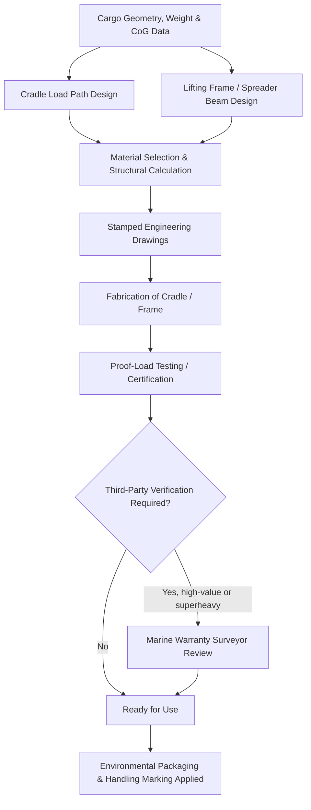

## Cargo Packaging, Cradling, and Lifting Frame Design

### Overview and Role in the Logistics Chain

Cargo packaging, cradling, and lifting frame design translate the engineering analyses covered earlier in this chapter — weight and dimension thresholds, CoG determination, and fragility/value considerations — into physical hardware that makes safe handling and transport possible. While standard cargo relies on generic packaging (crates, pallets, containers), heavy-lift and oversized cargo typically requires custom-engineered structures designed around the specific geometry, weight distribution, and vulnerability profile of an individual item, making this discipline as much a bespoke engineering exercise as a logistics function.

### Cradling Design Principles

**Key Points**

- **Load path engineering**: A cradle's primary function is to establish a controlled, engineered load path from the cargo's support points down to the transport vehicle or vessel deck, distributing weight in a manner consistent with the cargo's structural capacity and the CoG data established through the analysis covered in the prior chapter item.
- **Cylindrical and irregular geometry cradles**: Cylindrical cargo (pressure vessels, wind turbine tower sections, pipe spools) commonly uses saddle-type cradles conforming to the item's curvature, distributing contact pressure over a wide surface area to avoid point-loading stress on the cargo's shell.
- **Multi-point versus continuous support**: Depending on the cargo's structural stiffness, cradling may use either multiple discrete support points (for rigid, self-supporting structures) or continuous support along the cargo's length (for items vulnerable to sagging or deflection between support points, such as long, slender shafts or beams).
- **Material selection for cradle construction**: Cradles are typically constructed from structural steel, engineered to the specific load case, though timber dunnage and composite padding materials are commonly used at the cargo-cradle interface to distribute contact pressure and prevent surface damage to coated or machined cargo surfaces.

### Lifting Frame and Spreader Beam Design

**Key Points**

- **Purpose and function**: As introduced in the CoG chapter item, spreader frames and lift beams redistribute lift point loads to achieve a more favorable rigging geometry, converting a small number of difficult-to-access or asymmetric cargo lift points into a standardized, symmetric set of crane connection points.
- **Sling angle optimization**: A well-designed lifting frame reduces sling angles from horizontal to closer to vertical, which — due to the trigonometric relationship between sling angle and sling tension — can substantially reduce the load carried by each individual sling compared to a wide-angle rigging configuration lifting the cargo directly.
- **Engineered lift lugs and trunnions**: For cargo that will be lifted multiple times throughout its logistics chain (fabrication yard, port load-out, destination offload), permanently engineered and certified lift lugs, trunnions, or padeyes are frequently welded directly onto the cargo structure during fabrication, rather than relying on temporary rigging attachment points for each lift.
- **Certification and proof testing**: Custom lifting frames and spreader beams are subject to engineering certification and proof-load testing (typically at a percentage above the frame's rated capacity) before first use, following recognized lifting equipment standards, to verify the frame performs as designed under the specific load case.

### Packaging for Environmental and Handling Protection

**Key Points**

- **Weatherproofing and corrosion protection**: Cargo destined for extended ocean transit or long-duration outdoor storage commonly receives protective wrapping, shrink-wrap systems, or temporary coatings to prevent corrosion and weather damage during the logistics chain, particularly for machined surfaces and exposed metal components.
- **Vibration dampening and internal bracing**: As referenced in the fragility chapter item, internal components vulnerable to shock and vibration are frequently secured with custom internal bracing systems designed to prevent movement during transport while allowing controlled disassembly upon arrival for inspection and commissioning.
- **Desiccant and environmental control packaging**: Sensitive internal components (bearings, electronic control systems, certain catalysts) may require desiccant packages, nitrogen purging, or sealed environmental enclosures to control humidity and prevent degradation during extended transit periods.
- **Handling instruction marking**: Custom-packaged heavy cargo requires clear, durable, and often multi-language handling instructions and center-of-gravity markings physically affixed to the cargo or its packaging, ensuring handling personnel at every stage of the logistics chain have immediate access to critical rigging and handling information.

### Engineering Documentation and Standards

**Key Points**

- Cradle and lifting frame design typically requires formal engineering calculations and stamped drawings from a qualified structural or lifting engineer, particularly for superheavy cargo where failure consequences are severe, as referenced in the superheavy lift chapter item.
- Design documentation commonly includes load case analysis covering not just static lifting loads but also dynamic loading scenarios anticipated during transport (vessel motion, road/rail dynamic loads), ensuring the cradle or frame performs safely across the entire logistics chain rather than only during the initial lift.
- Third-party verification, such as review by a marine warranty surveyor for ocean-transported cargo, is a common requirement for high-value shipments, echoing the insurance and risk allocation considerations discussed in the prior chapter item.

### Custom Engineering Workflow

### Example: Custom Cradle for a Wind Turbine Nacelle

A wind turbine nacelle, an irregularly shaped assembly housing the generator, gearbox, and control systems, illustrates the custom cradling process: rather than relying on generic supports, engineers design a cradle conforming to the nacelle's specific mounting points and weight distribution (informed by manufacturer CoG data as referenced in the prior chapter item), incorporating vibration-dampening supports for the internal gearbox and generator components, weatherproof covering for the multi-week ocean transit referenced in the power generation sector chapter item, and pre-installed lift points allowing the same cradle to be used consistently from factory load-out through final offshore installation without repeated re-rigging.

### Related Topics

- Center of Gravity and Weight Distribution Analysis
- Fragile, High-Value, and Sensitive Cargo Considerations
- Superheavy Lift and Ultra-Heavy Cargo Categories
- Power Generation and Renewable Energy Sector Demand
- Rigging Engineering and Spreader Frame Design
- Trial Lift Procedures and Verification Protocols
- Marine Cargo Insurance for High-Value Superheavy Shipments
- Proof-Load Testing Standards for Lifting Equipment