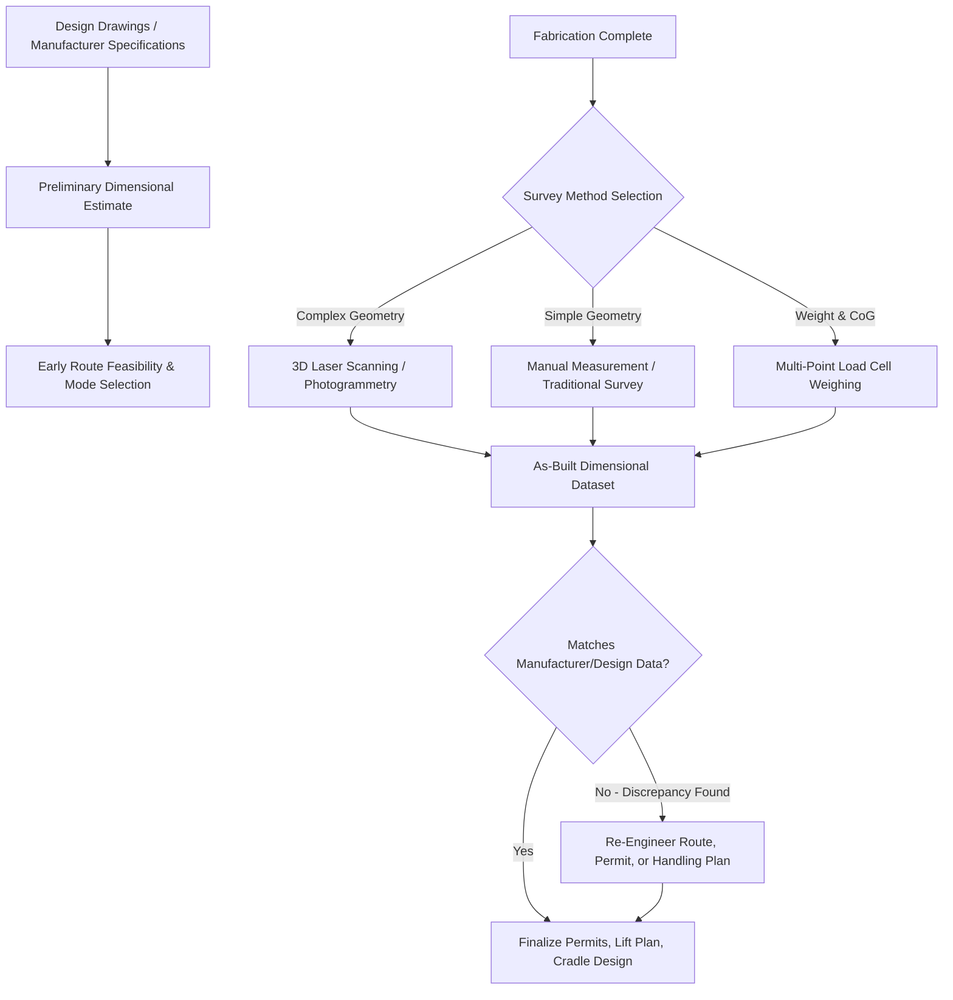

## Dimensional Data Collection and Load Surveys

### Overview and Foundational Role

Dimensional data collection and load surveys represent the empirical starting point for nearly every engineering discipline covered elsewhere in this chapter — accurate weight, dimension, and geometry data is the prerequisite input for CoG analysis, cradling and lifting frame design, indivisible load determination, and mode/route selection. Errors or gaps in this foundational data collection stage propagate downstream into every subsequent engineering decision, making rigorous survey methodology a critical, if often underappreciated, discipline in heavy-lift logistics.

### Core Data Categories Collected

**Key Points**

- **Overall dimensions**: Length, width, and height (or diameter, for cylindrical cargo) form the baseline dataset against which the transport mode thresholds discussed earlier in this chapter are evaluated, typically measured at the cargo's maximum extent in each axis including any permanently attached appurtenances.
- **Gross and net weight**: Total shipping weight (including any packaging, cradling, or temporary bracing) versus the bare equipment weight, both of which are relevant at different points in the logistics chain — permitting authorities typically require gross transport weight, while installation engineering may require net equipment weight.
- **Center of gravity location**: As covered extensively in the prior chapter item, longitudinal, transverse, and vertical CoG position is core survey data, whether obtained from manufacturer certification or empirical measurement.
- **Lift point and support point locations**: Precise coordinates of engineered lift points, trunnions, or support surfaces relative to the cargo's overall geometry and CoG, essential input for rigging and cradle design.
- **Protrusions and appendages**: Documentation of any items extending beyond the main structural envelope (piping stubs, instrumentation, access platforms) that may affect dimensional classification even if the main body would otherwise fall within a lower threshold category.

### Survey Methods and Technology

**Key Points**

- **Manual measurement and traditional surveying**: Tape measures, laser distance meters, and conventional surveying equipment remain standard for straightforward dimensional verification, particularly for cargo with simple, well-documented geometry.
- **3D laser scanning and photogrammetry**: For complex or irregular cargo, 3D laser scanning generates a precise digital point-cloud model of the item's actual as-built geometry, which is increasingly preferred over reliance on original design drawings alone, since fabricated equipment can deviate from design dimensions in ways that matter for tight-clearance transport planning.
- **Load cell weighing systems**: As referenced in the CoG chapter item, multi-point load cell weighing provides both total weight verification and, through comparative readings across support points, empirical CoG calculation, serving a dual survey purpose.
- **Route and infrastructure survey integration**: Cargo dimensional data is typically combined with independently collected route survey data (bridge clearances, road curvature, overhead utility heights) to assess transport feasibility, since the cargo survey alone does not determine whether a given route can accommodate the shipment.

### Verification Against Design Documentation

**Key Points**

- **As-built versus as-designed discrepancies**: Fabricated heavy equipment frequently differs from original design drawings due to field modifications, manufacturing tolerances, or accumulated fabrication variance, making physical verification through survey essential rather than relying solely on drawing-based dimensions for critical transport planning decisions.
- **Manufacturer certification cross-checks**: Where manufacturer-supplied weight and CoG data exists, independent survey verification (particularly through load cell weighing) serves as a quality check, catching discrepancies before they propagate into rigging or route engineering that assumes the manufacturer's figures are correct.
- **Tolerance stack-up awareness**: In multi-component assemblies, small individual dimensional tolerances can accumulate into a meaningful cumulative deviation from nominal dimensions, a consideration particularly relevant for cargo approaching a critical transport threshold where even modest dimensional error could shift the item into a more restrictive permitting or mode category.

### Documentation and Data Management

**Key Points**

- **Survey report standardization**: Formal survey reports typically compile dimensional data, weight and CoG figures, photographic documentation, and any identified anomalies into a standardized format usable by downstream engineering teams (rigging, route planning, permitting) without requiring re-collection of raw data.
- **Digital model integration**: 3D scan data and dimensional surveys are increasingly integrated into broader digital project models, allowing route and clearance simulations to be run against the cargo's actual verified geometry rather than nominal design dimensions.
- **Chain of data custody**: For high-value or safety-critical shipments, maintaining a clear record of who performed each measurement, with what equipment, and when, supports both engineering confidence and, where disputes arise, contractual and insurance documentation needs referenced in the fragile/high-value cargo chapter item.

### Timing Within the Project Logistics Lifecycle

**Key Points**

- Preliminary dimensional estimates are typically used during early route feasibility studies and mode selection, well before final fabrication is complete, based on design drawings and manufacturer specifications.
- Final, verified survey data — collected as close to actual shipment as practical — is required before finalizing permits, lift plans, and cradle/frame fabrication, since these downstream engineering products must be based on the cargo's actual as-built condition rather than preliminary estimates alone.
- Discrepancies discovered late in this process (for example, a final survey revealing dimensions exceeding earlier estimates) can trigger significant schedule risk, echoing the extended planning lead time considerations discussed in the superheavy lift chapter item, since permits, route surveys, and equipment bookings may all require revision.

### Dimensional Survey Workflow

### Example: Late-Stage Dimensional Discrepancy on a Fabricated Skid

A fabricated compressor skid, initially estimated at 3.9 meters in width based on design drawings and cleared for a specific road route under that assumption, illustrates the risk this discipline is designed to catch: a final 3D laser scan survey conducted shortly before shipment reveals the as-built width is actually 4.15 meters due to accumulated welding and fabrication tolerance, a discrepancy that pushes the shipment past a critical permitting threshold on the originally planned route — triggering last-minute route re-engineering that, had the final survey been conducted earlier in the schedule, could have been resolved without the compressed timeline that ultimately results.

### Related Topics

- Center of Gravity and Weight Distribution Analysis
- Weight, Dimension, and Gauge Thresholds by Transport Mode
- Indivisible Load Determination Criteria
- Cargo Packaging, Cradling, and Lifting Frame Design
- Superheavy Lift and Ultra-Heavy Cargo Categories
- Bridge and Culvert Load-Bearing Assessment for Heavy Haul
- Route Survey and Haul Road Engineering for Remote Sites
- Digital Twin and 3D Modeling in Project Logistics Planning