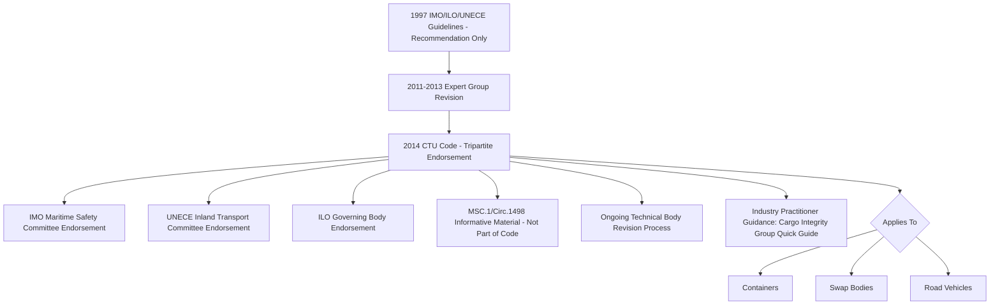

## Cargo Transport Units and the CTU Code

### Overview and Regulatory Origin

The CTU Code — formally the IMO/ILO/UNECE Code of Practice for Packing of Cargo Transport Units — is the primary international reference document governing the safe packing, securing, and handling of cargo transport units (CTUs) for transport by sea and land. Jointly developed by the International Maritime Organization (IMO), the International Labour Organization (ILO), and the United Nations Economic Commission for Europe (UNECE), the Code represents a rare instance of coordinated tripartite international guidance spanning maritime safety, labor protection, and inland transport regulation simultaneously. The 2014 CTU Code addresses concerns around cargo transport unit handling and packing through a non-mandatory global code of practice for transportation by sea and land. [International Maritime Organization](https://www.imo.org/en/ourwork/safety/pages/ctu-code.aspx)

### Historical Development

**Key Points**

- The CTU Code is an update of the 1997 IMO/ILO/UNECE Guidelines for Packing of Cargo Transport Units. [International Labour Organization](https://www.ilo.org/sites/default/files/wcmsp5/groups/public/@ed_dialogue/@sector/documents/publication/wcms_492710.pdf)
- Many incidents in transport are attributed to poor practices in the packing of cargo transport units, including inadequate securing of cargo, overloading, and incorrect declaration of contents — a concern of particular significance because the affected parties may be members of the general public or transport and supply chain workers who typically have no control over how a given unit was originally packed. [UNECE](https://unece.org/transport/intermodal-transport/imoilounece-code-practice-packing-cargo-transport-units-ctu-code)
- The revision process that produced the current CTU Code took place from 2011 to 2013 under the auspices of a group of experts, and the resulting document was endorsed by the UNECE Inland Transport Committee, the IMO Maritime Safety Committee, and the ILO Governing Body, all in 2014.
- The earlier 1997 guidelines were considerably shorter and carried recommendation-only status, limiting their practical enforceability and reference value in legal or contractual disputes; the 2014 revision substantially expanded and formalized the content in response to this gap.
- A further revision process has been underway, with sponsoring organizations including the World Shipping Council closely involved in reviewing and finalizing updated and expanded provisions, reflecting the Code's status as a living document subject to periodic technical updates through a coordinated multi-body approval process. [Unverified] The precise status, scope, and effective date of this ongoing revision should be confirmed against the latest IMO Sub-Committee on Carriage of Cargoes and Containers (CCC) session outputs, since Claude's information may not reflect the most current approval stage.

### Scope and Applicability to Heavy-Lift and Project Cargo

**Key Points**

- Innovations and developments in the types of cargoes carried in freight containers have allowed heavy, bulky items which were traditionally loaded directly into ships' holds to be carried in cargo transport units instead — directly relevant to the heavy-lift sector, since project cargo increasingly moves in flat-rack, open-top, and other specialized container types rather than exclusively via conventional breakbulk or heavy-lift vessel deck cargo. [Sterlingbookhouse](https://www.sterlingbookhouse.com/books/marine-and-nautical/maritime/imo-ilo-unece-code-of-practice-for-packing-of-cargo-transport-units-ctu-code/)
- The term "cargo transport unit" in the Code's scope covers containers, swap bodies, and road vehicles, not shipping containers alone — a scope relevant to heavy-lift logistics given the frequent use of flat-rack containers, specialized trailers, and other non-standard CTU types for oversized components that do not require full breakbulk or heavy-lift vessel handling. [HZ CONTAINERS](https://hz-containers.com/en/news/shipping-containers-and-the-international-unece-ctu-regulation/)
- The Code's stated aim is to give advice on the safe packing of cargo transport units to those responsible for packing and securing cargo, as well as to those tasked with training personnel to pack such units, while also outlining theoretical packing and securing principles and practical measures for safe packing. [International Labour Organization](https://www.ilo.org/resource/imoilounece-code-practice-packing-cargo-transport-units)
- The Code additionally provides guidance for all parties across the supply chain, extending through to those involved in unpacking the CTU at destination — not packing personnel alone.
- The CTU Code is explicitly not intended to conflict with, replace, or supersede existing national or international regulations addressing the packing and securing of cargo in CTUs, including mode-specific regulations that may apply to a single transport mode.

### Relationship to Heavy-Lift Engineering Disciplines Covered Elsewhere in This Chapter

**Key Points**

- The CTU Code's securing and load-distribution guidance intersects directly with the cradling and lifting frame design principles covered in the prior chapter item, since cargo packed into or onto a CTU for a portion of its logistics chain still requires the same underlying load path and CoG-informed securing engineering.
- Approximately 65% of all container incidents are attributed to incorrect packing or insufficient securing of cargo, with annual damage from poor CTU packing practices reported to exceed 6 billion US dollars — figures that underscore why dimensional and weight data accuracy, as covered in the prior chapter item, is treated as safety-critical rather than merely administrative within CTU-based transport. [HZ CONTAINERS](https://hz-containers.com/en/news/shipping-containers-and-the-international-unece-ctu-regulation/)
- For heavy-lift project cargo moved via flat-rack or open-top containers rather than as direct breakbulk cargo, CTU Code securing principles supplement (rather than replace) the mode-specific weight and dimension thresholds discussed earlier in this chapter, since a CTU-packed heavy item is still subject to the underlying vessel, road, or rail limits of its transport mode.
- Industry practitioner guidance, such as the CTU Code Quick Guide published by the Cargo Integrity Group, translates the full Code into more accessible operational guidance, covering stakeholder responsibilities throughout the supply chain from initial planning through final delivery, including CTU condition checks, dangerous goods handling, and securing techniques for multimodal transport. [TT Club](https://www.ttclub.com/news-and-resources/publications/article/ctu-code-a-quick-guide/)

### Supplementary and Informative Material

**Key Points**

- Informative Material related to the CTU Code (MSC.1/Circ.1498) provides practical guidance and background information on the packing of cargo transport units, finalized by the IMO Sub-Committee on Carriage of Cargoes and Containers.
- This informative material, although referenced within the CTU Code itself, does not form part of the Code and therefore does not require separate endorsement by the governing bodies of UNECE and ILO — an important distinction for practitioners citing the Code in a compliance or contractual context, since only the core Code text carries the tripartite-endorsed status.
- Regional supplementary guidance, such as European best-practice cargo securing guidelines for road transport, exists alongside the CTU Code and is sometimes referenced in conjunction with it for mode-specific application within particular jurisdictions.

### CTU Code Structure Within the Broader Regulatory Landscape

### Example: Flat-Rack Container Shipment of an Oversized Skid

A moderately oversized equipment skid, too large for a standard dry container but suitable for a flat-rack or open-top container rather than requiring full breakbulk heavy-lift vessel handling, illustrates the CTU Code's practical relevance: packing personnel apply CTU Code securing principles — informed by the skid's weight distribution and CoG data as covered in the prior chapter items — to lash and brace the cargo within the CTU's structural boundaries, while the underlying vessel and port handling of the flat-rack itself remains governed by the mode-specific weight and dimension thresholds discussed earlier in this chapter, illustrating how CTU-level and vessel-level regulatory frameworks operate as complementary rather than substitute layers of safety governance.

### Related Topics

- Weight, Dimension, and Gauge Thresholds by Transport Mode
- Cargo Packaging, Cradling, and Lifting Frame Design
- Center of Gravity and Weight Distribution Analysis
- Dimensional Data Collection and Load Surveys
- Major Global Heavy-Lift and Project Cargo Carriers
- Marine Cargo Insurance for High-Value Superheavy Shipments
- Dangerous Goods Handling in Multimodal Transport
- International Maritime Regulatory Bodies and Standards Coordination