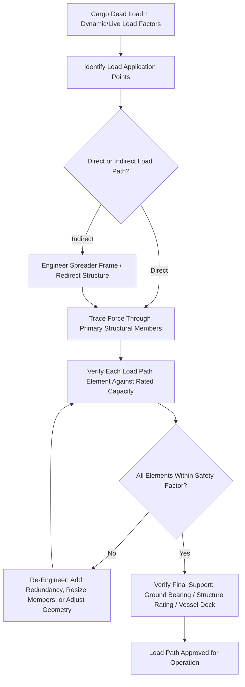

## Structural Load Paths and Load Calculations

### Overview and Conceptual Foundation

A load path is the route through which force travels from its point of application down to a stable foundation or support structure, and understanding load paths is the central organizing concept behind virtually every engineering discipline introduced in the previous chapter — cradling, lifting frame design, CoG analysis, and dimensional surveys all exist to support accurate load path engineering. In heavy-lift operations, load path analysis extends beyond the cargo itself to encompass the entire chain of structural elements involved in a lift or transport operation: rigging, spreader frames, crane structures, transport vehicles, and ultimately the ground or vessel deck bearing the final load.

### Fundamental Load Path Principles

**Key Points**

- **Continuity of load path**: Every point along a load path must be capable of transferring the applied force to the next element without exceeding that element's structural capacity; a single undersized or misidentified link in the chain — a weld, a pin connection, a support beam — can constitute the limiting factor for the entire system regardless of the capacity of every other component.
- **Load path redundancy**: Well-engineered lifting and transport systems often incorporate redundant load paths (multiple independent structural routes capable of carrying the load) so that failure of a single element does not result in catastrophic load path interruption, though the degree of redundancy required varies by application and risk tolerance.
- **Direct versus indirect load paths**: A direct load path transfers force through the shortest, most structurally efficient route between load application and support; indirect load paths, often necessitated by cargo geometry or lift point placement constraints, introduce additional structural elements (spreader frames, as covered in the prior chapter item) specifically to redirect force along a more manageable path.
- **Static determinacy and indeterminacy**: Statically determinate load paths can be fully analyzed using basic equilibrium equations alone, while statically indeterminate systems (common in complex rigging arrangements with multiple support points) require more advanced structural analysis methods to determine how load is actually distributed among the available paths.

### Load Calculation Fundamentals

**Key Points**

- **Dead load and live load distinction**: Dead load refers to the static weight of the cargo and any permanently attached rigging or cradling, while live load in a lifting context typically refers to dynamic forces introduced during the lift itself (acceleration, deceleration, wind, and other transient effects) that add to the baseline static weight.
- **Load factor and safety factor application**: Engineering calculations apply safety factors — multipliers applied to calculated loads to account for uncertainty in load estimation, material properties, and unforeseen dynamic effects — with heavy-lift rigging and structural components typically designed to standards specifying minimum safety factors well above the nominal calculated load.
- **Sling tension calculation**: As introduced in the CoG chapter item, sling tension in a multi-point lift depends on both the total load and the geometry of the rigging arrangement — specifically, sling angle from vertical — with tension increasing non-linearly as sling angle from vertical increases (shallower, more horizontal slings carry disproportionately higher tension for the same vertical load component).
- **Distributed versus point loading**: Load calculations must distinguish between loads applied at discrete points (lift points, wheel/axle contact patches) and loads distributed across an area or length (deck loading, cradle support along a cylindrical shell), since the resulting stress concentration and structural response differ substantially between the two loading types.

### Application to Crane and Lifting Equipment

**Key Points**

- **Crane load charts and radius-dependent capacity**: Crane lifting capacity is not a single fixed number but varies with boom radius, boom angle, and configuration, requiring load calculations to be cross-checked against the specific crane's load chart for the actual planned lift geometry rather than assuming maximum rated capacity applies universally.
- **Ground bearing pressure analysis**: For mobile and crawler cranes, the load path extends beyond the crane structure itself into the ground bearing capacity beneath crane mats or outriggers, requiring geotechnical load-bearing verification as part of the overall load path analysis, particularly for the largest cranes used in superheavy lifts.
- **Multi-crane lift load sharing**: When a single lift requires two or more cranes operating in tandem, load calculations must account for how load is shared between cranes as their relative position and boom angle change throughout the lift sequence, since uneven load sharing can overstress one crane while the other operates well under capacity.

### Application to Transport Structures

**Key Points**

- **SPMT axle load path**: As referenced in prior chapter items, self-propelled modular transporter systems distribute cargo load through a hydraulically linked suspension system down through each axle line to the ground, with the load path calculation determining how many axle lines and what configuration are required to keep per-axle loading within both the SPMT's rated capacity and the underlying pavement or structure's bearing capacity.
- **Bridge and structure load rating verification**: As referenced in the earlier chapter items on infrastructure and mining logistics, the load path for a heavy-haul route extending across a bridge or culvert must be verified against that structure's rated load capacity, often requiring specialized structural engineering analysis distinct from the cargo's own lifting or cradling engineering.
- **Vessel deck and hull load path**: Marine transport requires the cargo's load path to be traced through deck plating, supporting structural members, and ultimately the vessel's hull girder strength, with heavy-lift vessel operators maintaining detailed deck loading diagrams specifying maximum allowable loading at different points across the vessel's structure.

### Load Path Analysis Workflow

### Example: Load Path Analysis for a Dual-Crane Tandem Lift

A large horizontal vessel requiring simultaneous lifting by two mobile cranes at opposite ends illustrates load path complexity in practice: engineers must calculate how the vessel's total weight and CoG (as covered in the prior chapter item) divide between the two crane lift points based on their respective distances from the CoG, verify each crane's load chart capacity at its specific operating radius throughout the lift sequence (since the vessel's orientation and each crane's boom angle change as the lift progresses), and confirm ground bearing capacity beneath each crane's outrigger mats — with particular attention to the fact that any deviation from the planned lift sequence could shift load distribution unevenly between the two cranes, a risk that dual-crane lift procedures are specifically engineered to prevent through synchronized, closely coordinated crane operation.

### Related Topics

- Center of Gravity and Weight Distribution Analysis
- Cargo Packaging, Cradling, and Lifting Frame Design
- Superheavy Lift and Ultra-Heavy Cargo Categories
- Bridge and Culvert Load-Bearing Assessment for Heavy Haul
- SPMT Convoy Synchronization and Axle Load Distribution
- Crane Load Charts and Radius-Dependent Capacity Analysis
- Multi-Crane Tandem Lift Coordination and Synchronization
- Ground Bearing Pressure and Geotechnical Verification for Cranes