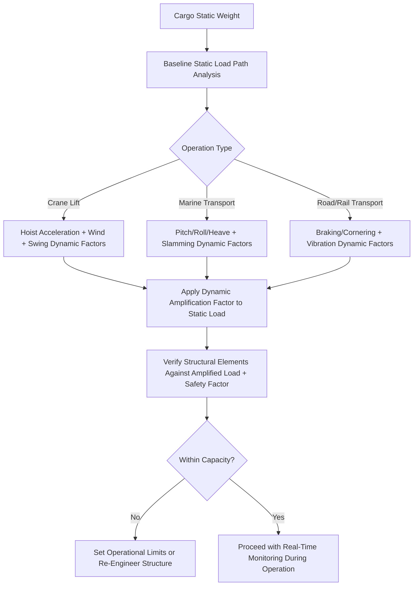

## Static and Dynamic Load Considerations

### Overview and Distinction From Prior Chapter Item

While the previous chapter item introduced dead load and live load as a basic categorical distinction, this item expands on the deeper engineering treatment of static versus dynamic loading — a distinction that fundamentally shapes how heavy-lift structures, rigging, and transport systems are designed and verified. Static loads are readily calculated using basic equilibrium principles, but dynamic loads introduce time-varying forces that can substantially exceed static values, and failing to properly account for them is a recurring root cause of heavy-lift incidents across lifting, marine transport, and road/rail operations alike.

### Static Load Fundamentals

**Key Points**

- **Static load definition**: A static load is one applied gradually and held constant, allowing the structure to reach equilibrium without significant acceleration or velocity-dependent effects — the baseline weight of cargo at rest represents the purest static load case.
- **Static load path verification**: As covered in the prior chapter item, static load analysis traces the load path from application point to final support, verifying that each structural element can bear the calculated static force within its rated capacity and applicable safety factor.
- **Limitations of static-only analysis**: While static analysis is the necessary starting point for any load calculation, relying on static values alone systematically underestimates the actual forces a structure will experience during real-world lifting or transport operations, since virtually no heavy-lift operation involves purely static conditions from start to finish.

### Dynamic Load Sources in Lifting Operations

**Key Points**

- **Acceleration and deceleration during hoisting**: As a crane accelerates a load upward or decelerates it to a stop, the load experiences additional inertial force beyond its static weight — commonly approximated using a dynamic amplification factor applied to the static load, with typical factors depending on hoist speed and control system characteristics.
- **Snap loading and sudden load transfer**: If slack develops in a lifting system (for example, from an improperly tensioned secondary sling) and is then suddenly taken up, the resulting impact or "snap" load can substantially exceed the static weight of the cargo, representing one of the more hazardous dynamic loading scenarios in rigging operations.
- **Wind loading during lifts**: Wind exerts a dynamic, variable force on suspended loads, particularly large-surface-area cargo such as wind turbine blades or platform modules, requiring lift plans to specify maximum allowable wind speed thresholds beyond which lifting operations must be suspended.
- **Pendulum and swing effects**: A suspended load is inherently a pendulum system, and any horizontal movement of the crane or unintended load rotation can introduce swing dynamics that add lateral force components not present in a purely vertical static lift scenario.

### Dynamic Load Sources in Marine Transport

**Key Points**

- **Vessel motion — pitch, roll, and heave**: As referenced in the superheavy lift chapter item, marine transport of heavy cargo must account for the vessel's six degrees of freedom motion in varying sea states, with pitch and roll introducing significant additional dynamic force on cargo securing systems beyond the cargo's static weight.
- **Sea state and voyage routing implications**: Dynamic loading calculations for marine transport are typically based on a design sea state appropriate to the intended voyage route and season, with more severe anticipated sea states requiring more robust securing and lashing system design.
- **Slamming and green water loading**: In severe sea conditions, wave impact (slamming) on deck cargo or green water (wave water breaking over the deck) can introduce sudden, severe dynamic loading distinct from the more gradual cyclic loading of ordinary vessel motion, a consideration particularly relevant for deck cargo without full weather protection.
- **Resonance considerations**: Where a cargo item's own natural structural frequency coincides with the vessel's typical motion frequency in a given sea state, resonance effects can amplify dynamic stress beyond what simple motion-based calculations alone would predict, requiring more detailed dynamic structural analysis for sensitive cargo.

### Dynamic Load Sources in Road and Rail Transport

**Key Points**

- **Braking and cornering forces**: As referenced in the cradling and packaging chapter item, road and rail transport introduces dynamic forces from acceleration, braking, and cornering, which securing and lashing systems must be engineered to restrain in addition to the cargo's static weight.
- **Road surface irregularities and vibration**: Sustained vibration from road surface conditions, particularly over long-distance heavy-haul routes, can introduce cyclic dynamic loading that, while individually modest, may contribute to fatigue-related structural concerns for sensitive cargo over an extended transport duration.
- **SPMT dynamic load compensation**: Modern SPMT systems, as referenced in the prior chapter item, use hydraulic suspension systems capable of actively compensating for road surface irregularities, helping to minimize dynamic load transfer to the cargo compared to older, more rigid transport equipment.

### Engineering Approaches to Dynamic Load Management

**Key Points**

- **Dynamic amplification factors**: Rather than performing full dynamic simulation for every lift or transport scenario, many engineering standards apply simplified dynamic amplification factors — multipliers applied to static load values — calibrated to represent typical worst-case dynamic effects for a given operation type, balancing engineering rigor with practical calculation efficiency.
- **Operational limits as a dynamic load control**: Many dynamic load risks (wind loading, sea state effects) are managed not purely through structural over-design but through operational limits — maximum wind speed for lifting, maximum sea state for a given voyage segment — that constrain when an operation may proceed rather than attempting to engineer for unlimited conditions.
- **Real-time monitoring during operations**: As referenced in the fragile/high-value cargo chapter item, shock and vibration monitoring devices provide real-time or post-operation verification that actual dynamic loading remained within the values assumed during engineering design, supporting both safety management and documentation needs.
- **Fatigue analysis for repeated dynamic loading**: For cargo or equipment subject to repeated dynamic loading cycles (such as reusable lifting frames used across many operations, as referenced in the packaging chapter item), fatigue analysis assesses cumulative structural degradation from repeated dynamic stress rather than treating each operation as an isolated static case.

### Static Versus Dynamic Load Analysis Framework

### Example: Dynamic Load Assessment for an Offshore Module Lift in Marginal Weather

A platform module lift scheduled during a period of marginal but within-limit wind conditions illustrates the interplay of static and dynamic considerations: the static weight and CoG data (established per the earlier chapter item) form the baseline load calculation, but the lift plan additionally specifies a maximum allowable wind speed based on the module's large surface area and susceptibility to wind-induced swing, requires continuous wind speed monitoring throughout the lift, and includes a predetermined abort criterion — illustrating how dynamic load management in practice combines engineering calculation (dynamic amplification factors applied during design) with operational controls (real-time monitoring and go/no-go decision criteria) rather than relying on structural over-design alone to address an inherently variable dynamic risk.

### Related Topics

- Structural Load Paths and Load Calculations
- Center of Gravity and Weight Distribution Analysis
- Fragile, High-Value, and Sensitive Cargo Considerations
- Cargo Packaging, Cradling, and Lifting Frame Design
- Superheavy Lift and Ultra-Heavy Cargo Categories
- Crane Load Charts and Radius-Dependent Capacity Analysis
- Marine Vessel Motion Analysis and Sea State Design Criteria
- Fatigue Analysis for Reusable Lifting Equipment