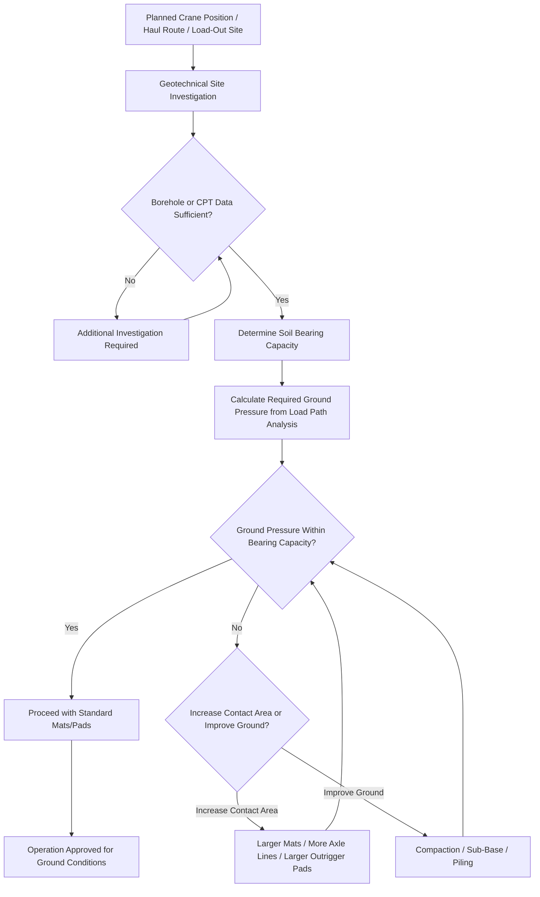

## Ground Bearing Pressure and Soil Analysis

### Overview and Position in the Load Path Chain

Ground bearing pressure and soil analysis addresses the final link in the structural load path introduced two chapter items prior: after tracing force through cargo, rigging, crane, or transport structure, the load must ultimately be transferred safely into the ground itself. This discipline is frequently the limiting factor in heavy-lift operations — a crane or SPMT convoy may have ample rated structural capacity, yet still be unable to operate safely at a given location if the underlying soil cannot bear the resulting pressure without excessive settlement or failure.

### Fundamental Soil Mechanics Concepts

**Key Points**

- **Bearing capacity**: The maximum pressure a soil can support without shear failure, determined through geotechnical analysis that accounts for soil type, density, moisture content, and depth of the bearing surface — expressed typically in units of pressure (kPa or psi) rather than total load, since bearing capacity is fundamentally about pressure distributed over a contact area.
- **Soil bearing capacity variation by type**: Different soil types exhibit dramatically different bearing capacities — dense, well-compacted granular soils and bedrock typically offer high bearing capacity, while soft clays, organic soils, and saturated or poorly compacted fill material can have bearing capacities an order of magnitude lower, making soil investigation essential rather than assumable for any significant heavy-lift ground load.
- **Settlement versus bearing failure**: Two distinct soil failure modes are relevant to heavy-lift operations — sudden shear (bearing) failure, where the soil abruptly loses capacity to support the load, and gradual settlement, where the load slowly sinks into the soil over time; both can compromise a lift or transport operation, though settlement is generally more gradual and potentially more manageable if detected early through monitoring.
- **Effective contact area and pressure distribution**: Ground bearing pressure is calculated as load divided by effective contact area, meaning that spreading a given load over a larger footprint (via crane mats, larger outrigger pads, or additional SPMT axle lines) directly reduces the resulting ground pressure even without changing the total load itself.

### Site Investigation Methods

**Key Points**

- **Geotechnical borehole investigation**: Standard practice for significant heavy-lift operations involves drilling boreholes at planned crane or transport positions to directly sample and test soil conditions at depth, providing the most reliable site-specific bearing capacity data.
- **Cone penetration testing (CPT)**: A faster, less invasive investigation method that measures soil resistance to a penetrating cone as it is pushed into the ground, providing a continuous profile of soil strength with depth, often used to supplement or, for lower-risk operations, substitute for borehole sampling.
- **Historical and desktop geotechnical data**: For preliminary planning, existing geotechnical reports from prior construction at or near a site can inform initial feasibility assessment, though site-specific investigation is generally still required before finalizing a heavy-lift plan given the potential for localized soil variation.
- **Groundwater level assessment**: Soil bearing capacity is often significantly affected by groundwater level, since saturated soils generally exhibit reduced bearing capacity compared to the same soil type in a drier condition, making seasonal groundwater variation a relevant planning consideration, particularly for projects timed around wet or dry seasons as referenced in the mining sector chapter item.

### Engineering Solutions for Inadequate Bearing Capacity

**Key Points**

- **Crane mats and load distribution mats**: Timber, steel, or composite mats placed beneath crane outriggers or crawler tracks spread the load over a larger area, directly reducing ground bearing pressure to within acceptable limits for the underlying soil.
- **Ground improvement techniques**: For sites with persistently inadequate bearing capacity, techniques such as soil compaction, aggregate sub-base construction, or, for more severe cases, deep soil mixing or piling can improve effective bearing capacity, though these approaches add cost and schedule time to a project.
- **Temporary working platforms**: For extended-duration heavy-lift operations (such as a crane remaining in position for several weeks during a modular construction project), engineered temporary working platforms — combining compacted aggregate, geotextile fabric, and load-distribution matting — provide a more robust solution than mats alone.
- **Load redistribution through equipment selection**: As referenced in the prior chapter item on SPMT axle load paths, selecting transport equipment with a greater number of axle lines or larger crane outrigger footprint directly reduces per-unit-area ground pressure, sometimes eliminating the need for ground improvement altogether.

### Application to Different Heavy-Lift Contexts

**Key Points**

- **Crane pad and outrigger design**: Mobile and crawler crane operations require site-specific outrigger pad or crawler track bearing pressure verification against the geotechnically determined soil capacity at each planned crane position, particularly critical for the largest cranes used in superheavy lifts as referenced in earlier chapter items.
- **SPMT route bearing verification**: As referenced in the mining sector and infrastructure chapter items, heavy-haul routes crossing unpaved or marginally engineered ground require bearing capacity verification along the entire route, not just at a single point, since soil conditions can vary significantly over even short distances.
- **Temporary haul road construction**: For remote mining or industrial sites lacking existing infrastructure, as covered in the mining sector chapter item, purpose-built haul roads are engineered specifically around the bearing capacity of local soil conditions, often requiring imported aggregate sub-base material where native soil is inadequate.
- **Port and quay bearing capacity**: As referenced in the infrastructure chapter item on port and maritime infrastructure, quay and berth structures have specific, often published, bearing capacity ratings that must be verified against planned cargo loading, particularly for the heaviest modules and crane equipment discussed in the superheavy lift chapter item.

### Ground Bearing Verification Workflow

### Example: Crane Pad Design for a Superheavy Module Lift on Soft Ground

A large crawler crane required to lift a 1,200-ton module at a site with underlying soft clay soil illustrates the discipline in practice: geotechnical borehole investigation reveals a bearing capacity substantially below what the crane's standard crawler track footprint would require at full load, prompting engineers to design an engineered temporary working platform combining a compacted aggregate sub-base, geotextile separation fabric, and heavy timber matting beneath the crawler tracks — distributing the load over a sufficiently large area to bring the resulting ground pressure within the site's verified bearing capacity, a solution reached only after the initial site assessment revealed that standard mats alone would have been insufficient for this particular soil condition.

### Related Topics

- Structural Load Paths and Load Calculations
- Static and Dynamic Load Considerations
- Superheavy Lift and Ultra-Heavy Cargo Categories
- Mining and Heavy Industrial Equipment Movements
- Bridge and Culvert Load-Bearing Assessment for Heavy Haul
- Route Survey and Haul Road Engineering for Remote Sites
- SPMT Convoy Synchronization and Axle Load Distribution
- Port Infrastructure Investment for Heavy-Lift Staging