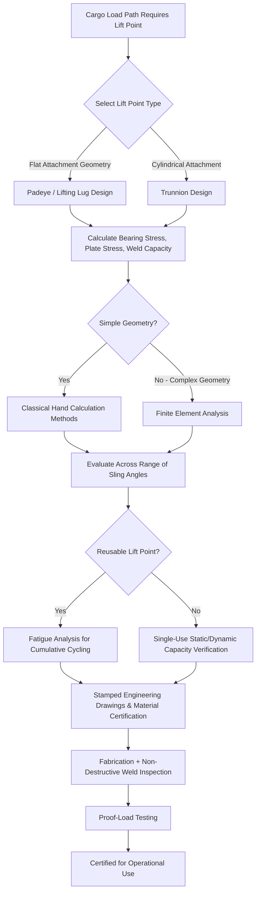

## Stress Analysis for Lifting Points and Trunnions

### Overview and Position Within the Load Path

Lifting points and trunnions represent the critical interface where the load path introduced earlier in this chapter transitions from the cargo's own structure into the rigging system — as such, they are frequently the location of highest stress concentration in an entire lifting operation, since force from a distributed cargo weight is funneled through a relatively small, discrete attachment area. Detailed stress analysis of these components is a distinct and specialized engineering discipline, sitting at the intersection of the cradling/lifting frame design and structural load path principles covered in the two preceding chapter items.

### Lift Point Types and Configurations

**Key Points**

- **Padeyes**: Flat, typically circular or teardrop-shaped steel plates welded to the cargo structure with a hole through which a shackle or lifting pin is inserted, among the most common lift point types due to their relative simplicity of fabrication and inspection.
- **Trunnions**: Cylindrical projections, typically welded to the cargo structure and extending outward, around which a sling or lifting strap can be looped, commonly used where a padeye's flat plate geometry is less suitable for the cargo's structural configuration or where a rolling/rotating lift point interface is preferred.
- **Lifting lugs and clevises**: Variations on the padeye concept using different plate geometries and hole configurations, selected based on the specific rigging hardware to be used and the anticipated loading direction and angle.
- **Integrated versus temporary lift points**: As referenced in the cradling chapter item, some cargo receives permanently engineered and certified lift points welded on during fabrication for repeated use throughout the logistics chain, while other cargo relies on temporary rigging attachment engineered for a single operation.

### Stress Concentration and Failure Modes

**Key Points**

- **Stress concentration at geometric discontinuities**: Any hole, weld toe, or sharp geometric transition in a lift point creates a local stress concentration significantly higher than the nominal average stress across the component's cross-section, requiring stress analysis to account for these localized peaks rather than relying on simplified average-stress calculations alone.
- **Weld failure modes**: Since lift points are typically attached to cargo via welding, weld quality and geometry directly affect the load path's structural integrity — weld toe cracking, incomplete penetration, and heat-affected zone embrittlement represent common failure modes requiring both design-stage stress analysis and post-fabrication inspection (commonly non-destructive testing methods such as ultrasonic or magnetic particle inspection).
- **Bearing stress at pin and hole interfaces**: The contact area between a lifting pin or shackle and the padeye hole experiences concentrated bearing stress, requiring verification that hole diameter, plate thickness, and edge distance (the material remaining between the hole edge and the plate boundary) are sufficient to prevent bearing failure or hole elongation under load.
- **Fatigue considerations for reusable lift points**: As referenced in the dynamic load chapter item, lift points intended for repeated use across multiple lifting operations require fatigue analysis to account for cumulative stress cycling, distinct from the single-use static and dynamic capacity verification applied to temporary rigging points.

### Analysis Methods

**Key Points**

- **Classical hand calculation methods**: For simpler lift point geometries, established engineering formulas (addressing bearing stress, weld shear capacity, plate bending) provide a straightforward analytical approach consistent with widely recognized structural and lifting engineering standards.
- **Finite element analysis (FEA)**: For complex lift point geometries or where classical hand calculations may not adequately capture localized stress concentration effects, finite element modeling provides detailed stress distribution mapping across the lift point and surrounding structure, particularly valuable for the superheavy and high-value cargo categories discussed in earlier chapter items where failure consequences are most severe.
- **Load angle sensitivity analysis**: Because sling angle affects both the magnitude and direction of force applied at a lift point (as introduced in the CoG and load path chapter items), stress analysis typically evaluates the lift point across a range of anticipated sling angles throughout the lift sequence rather than a single assumed loading condition.
- **Proof load testing**: As referenced in the cradling chapter item, physical proof-load testing at a percentage above rated capacity provides empirical verification that a fabricated lift point performs consistent with its engineering analysis, serving as a final validation step before an engineered lift point is certified for operational use.

### Design and Certification Standards Considerations

**Key Points**

- Lift point and trunnion design typically references recognized lifting equipment and structural engineering standards appropriate to the jurisdiction and application, with safety factors specifically calibrated for lifting applications generally exceeding those applied to static structural design given the consequences of lifting failure.
- Engineering documentation for critical lift points commonly requires stamped drawings from a qualified structural engineer, along with material certification for the steel used in fabrication, ensuring traceability between the as-designed stress analysis and the as-built component.
- Third-party inspection and certification, similar to the marine warranty surveyor role referenced in earlier chapter items, is frequently required for lift points supporting superheavy or high-value cargo, providing independent verification beyond the fabricator's own quality control.

### Lift Point Stress Analysis Workflow

### Example: Trunnion Design for a Reactor Vessel Lift

A 600-ton reactor vessel requiring trunnion-style lift points illustrates the analysis process: engineers first establish the required lift point locations based on the vessel's CoG (per the earlier chapter item), then perform finite element analysis on the proposed trunnion geometry to capture stress concentration effects at the weld connecting the trunnion to the vessel shell — a critical detail given that a simplified hand calculation might understate peak stress at this geometric transition — before finalizing the design, fabricating and welding the trunnions under quality-controlled conditions with subsequent non-destructive weld inspection, and conducting a proof-load test at a percentage above the calculated maximum operational load before the vessel is cleared for its first actual lift.

### Related Topics

- Structural Load Paths and Load Calculations
- Static and Dynamic Load Considerations
- Center of Gravity and Weight Distribution Analysis
- Cargo Packaging, Cradling, and Lifting Frame Design
- Ground Bearing Pressure and Soil Analysis
- Superheavy Lift and Ultra-Heavy Cargo Categories
- Proof-Load Testing Standards for Lifting Equipment
- Non-Destructive Testing Methods for Weld Inspection