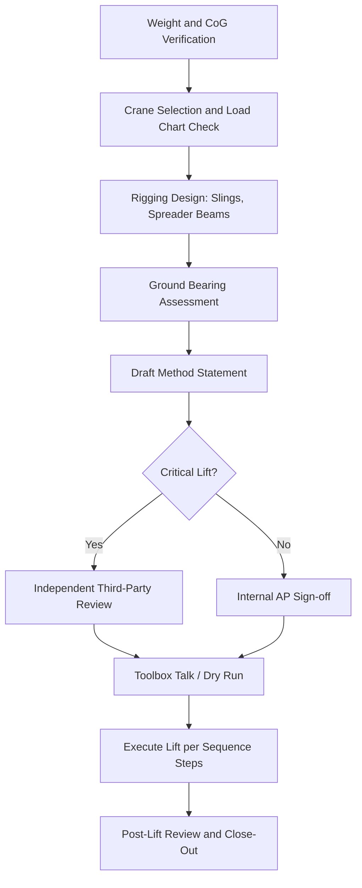

## Method Statements and Transport Manuals

### Definition and Purpose

A **Method Statement** is a controlled document that describes, in sequential detail, how a specific lifting or transport operation will be executed safely, including the plant, personnel, rigging configuration, and control measures involved. A **Transport Manual** (also called a Transport Method Statement or Route Engineering Study) is the equivalent document for the road, marine, or multimodal movement of abnormal indivisible loads (AILs), covering route geometry, vehicle configuration, and axle loading compliance.

Both documents exist to convert an engineering design (crane lift study, trailer configuration study) into an operational instruction that a site team or transport crew can execute repeatably, and that a regulator, client, or auditor can review before authorizing the work.

### Regulatory and Contractual Basis

- In the UK, method statements are typically produced to satisfy the Lifting Operations and Lifting Equipment Regulations (LOLER) 1998 and the Construction (Design and Management) Regulations (CDM) 2015, often combined into a **Lift Plan** per BS 7121.
- In the US, OSHA 1926 Subpart CC (cranes and derricks) does not mandate a "method statement" by that name, but requires a documented lift plan for critical lifts and multi-crane lifts (1926.1400s).
- For abnormal load transport, most jurisdictions (UK STGO, EU exceptional transport permits, US state DOT oversize/overweight permits) require a route survey and, for the highest categories, a formal transport method statement submitted with the permit application.
- Marine heavy-lift (project cargo) method statements typically reference the vessel's cargo securing manual and classification society (DNV, ABS, Lloyd's Register) lashing calculation requirements.

[Inference] The specific document name and required content vary significantly by jurisdiction and client; the structural elements below represent common industry practice rather than a single universal standard.

### Core Structure of a Lift Method Statement

1. **Scope and Description** — item to be lifted, lift ID, location, date window, weight/CoG source (weighbridge, drawing, weight report).
2. **Roles and Responsibilities** — Appointed Person (AP) per BS 7121, lift supervisor, banksman/signaler, crane operator, rigger competency records.
3. **Equipment Schedule** — crane make/model/configuration (boom length, counterweight, outrigger spread), rigging (slings, shackles, spreader beams, lifting beams) with WLL and certification references.
4. **Load Data** — mass, center of gravity (measured or calculated), dimensions, lift points, sling angles.
5. **Ground Conditions** — bearing capacity assessment, matting/cribbing requirements, exclusion zones.
6. **Lift Sequence** — step-by-step narrative synchronized with the crane's load chart, including boom radius at each phase, tailing arrangements for vertical picks, and any tandem-lift load-sharing ratios.
7. **Rigging Diagram** — sling configuration, hook height, headroom clearance.
8. **Environmental Limits** — maximum wind speed (often referenced to sling/load windage area, not just a flat number), visibility, lightning stand-down.
9. **Emergency Procedures** — load-drop contingency, communication failure, crane malfunction, evacuation.
10. **Sign-off** — AP approval, client/third-party checker approval, toolbox talk acknowledgment log.

### Core Structure of a Transport Manual

1. **Load Schedule** — dimensions, weight, axle group distribution (if pre-loaded on trailer), fragile/orientation constraints.
2. **Vehicle/Trailer Configuration** — prime mover, modular trailer axle-line count and configuration (e.g., 2-file vs 3-file, self-propelled modular transporter (SPMT) axle-line count), king-pin or gooseneck arrangement.
3. **Axle Load Compliance Table** — calculated load per axle line against bridge formula/permit limits for each jurisdiction transited.
4. **Route Survey Findings** — bridge weight/height restrictions, overhead clearances (utility lines, gantries), roundabout swept-path analysis, road camber and gradient limits, temporary traffic management requirements.
5. **Swept Path Diagrams** — turning analysis at critical junctions (see diagram below).
6. **Escort and Pilot Vehicle Plan** — police escort triggers, pilot vehicle positioning, communication protocol.
7. **Securing/Lashing Calculation** — per EN 12195 (road) or CSS Code (marine), including lashing angle, MSL (Maximum Securing Load) of chains/straps, and dynamic force assumptions (longitudinal, lateral, vertical g-factors).
8. **Contingency and Breakdown Plan** — recovery equipment on standby, alternate route if primary is blocked.
9. **Permit Cross-Reference** — permit number, validity window, conditions imposed by road authority.

### Weight and Center of Gravity Verification

Before either document is finalized, the load's actual mass and CoG should be verified rather than assumed from drawings, since fabrication variance commonly shifts CoG by measurable margins. A three-point or four-point weighing (load cells under each support point) allows CoG calculation via moment balance:

$$x_{cg} = \frac{\sum_{i=1}^{n} W_i x_i}{\sum_{i=1}^{n} W_i}$$

where $W_i$ is the load cell reading at support point $i$ and $x_i$ is that point's coordinate along the axis of interest. This is repeated for both horizontal axes to fully locate CoG in plan, and a similar moment approach (using tilt tables or trial lifts) establishes vertical CoG height.

### Example: Lashing Capacity Check (Road Transport)

**Example:** A 40-tonne transformer is secured with 4 chains at a 30° angle from horizontal, each rated at 8-tonne MSL. Assuming a longitudinal deceleration factor of 0.8g (typical EU standard for forward securing):

Required securing force:

$$F_{required} = m \times a = 40{,}000 \text{ kg} \times 0.8 \times 9.81 \text{ m/s}^2 \approx 313.9 \text{ kN}$$

Effective restraint per chain (horizontal component):

$$F_{chain} = MSL \times \cos(30°) = 8 \text{ t} \times 9.81 \text{ kN/t} \times 0.866 \approx 67.9 \text{ kN}$$

Total restraint from 4 chains:

$$F_{total} = 4 \times 67.9 \approx 271.6 \text{ kN}$$

Since $271.6 \text{ kN} < 313.9 \text{ kN}$, this configuration is **insufficient**; additional chains, a higher MSL rating, or friction-enhancing measures (e.g., anti-slip matting contributing a friction coefficient) are required to close the gap. [Inference: exact deceleration factors and required safety margins vary by national standard — EN 12195-1 vs. VDI 2700 vs. AS/NZS 4380 — and the applicable one must be confirmed for the transit jurisdiction.]

### Swept Path and Route Clearance Diagram (svg_diagram)

<svg xmlns="http://www.w3.org/2000/svg" viewBox="0 0 700 320">
<text x="350" y="20" text-anchor="middle" font-size="14" font-weight="bold" fill="#222">Swept Path at Junction (svg_diagram)</text>
<rect x="0" y="40" width="700" height="260" fill="#f4f4f4" stroke="none" />
<rect x="0" y="120" width="700" height="80" fill="#cfcfcf" />
<rect x="260" y="40" width="80" height="260" fill="#cfcfcf" />
<line x1="0" y1="160" x2="700" y2="160" stroke="#ffffff" stroke-width="2" stroke-dasharray="10,8" />
<line x1="300" y1="40" x2="300" y2="300" stroke="#ffffff" stroke-width="2" stroke-dasharray="10,8" />
<path d="M 40 200 C 150 200, 250 200, 290 190 C 320 180, 320 130, 320 70" fill="none" stroke="#1a73e8" stroke-width="3" />
<path d="M 40 220 C 170 220, 280 225, 330 195 C 370 170, 370 120, 370 70" fill="none" stroke="#e8711a" stroke-width="3" stroke-dasharray="4,3" />
<rect x="60" y="185" width="50" height="20" fill="#333" />
<text x="85" y="199" text-anchor="middle" font-size="9" fill="#fff">SPMT</text>
<circle cx="240" cy="60" r="4" fill="red" />
<text x="250" y="63" font-size="10" fill="red">Overhead line: 6.2m clearance</text>
<circle cx="420" cy="150" r="4" fill="red" />
<text x="430" y="153" font-size="10" fill="red">Street furniture conflict</text>
<text x="45" y="240" font-size="10" fill="#1a73e8">— Tractor unit path</text>
<text x="45" y="255" font-size="10" fill="#e8711a">- - Trailer rear-axle path</text>
</svg>

### Critical Lift Classification

Most method statement frameworks distinguish standard from critical lifts:

- **Standard lift** — utilizes less than 75-80% of the crane's rated capacity at the working radius, single crane, non-critical load.
- **Critical lift** — exceeds the standard threshold, involves tandem/multi-crane operations, lifts over live infrastructure or occupied areas, or involves a load whose failure poses high consequence (e.g., reactor vessels, occupied personnel baskets).

Critical lifts require additional layers: independent third-party review of the lift plan, a dedicated Appointed Person, and often a full dry-run/toolbox rehearsal.

### Lift Sequence Logic (Mermaid)

### Common Failure Modes in Method Statement Development

- **Generic/templated statements** — reused across dissimilar lifts without re-verifying load chart, radius, or ground conditions for the specific site; a leading cause of lift incidents.
- **CoG assumption error** — using nominal/drawing CoG instead of as-built measured CoG, especially on retrofitted or partially-assembled equipment.
- **Wind loading omitted for large surface-area loads** — sail area effects on tall or broad loads (e.g., wind turbine blades, HRSG modules) can dominate over the rated wind limit of the crane itself.
- **Route survey conducted with inaccurate vehicle envelope** — using nominal trailer width/height rather than the as-configured envelope with cargo overhang.
- **Static permit conditions vs. dynamic site conditions** — permit issued weeks in advance may not reflect current roadworks, temporary signage, or seasonal load restrictions (e.g., spring thaw weight restrictions in some jurisdictions).

### Document Control and Traceability

Both document types are typically version-controlled with:

- Unique document ID and revision number
- Cross-reference to the specific lift/transport plan drawing set
- Distribution log (who received which revision)
- Superseded-document withdrawal record

[Unverified] Whether a digital signature/e-approval system is acceptable in place of wet-ink sign-off depends on client and regulatory jurisdiction; this should be confirmed against project-specific quality procedures rather than assumed.

### Interfaces with Other Engineering Disciplines

- **Geotechnical engineering** — ground bearing pressure calculations feed directly into matting/cribbing specifications within the method statement.
- **Structural engineering** — lift point and spreader beam design must be validated against the load's as-built structural capacity, not just the rigging's rated capacity.
- **Traffic engineering** — swept path and temporary traffic management plans for transport manuals are usually produced or reviewed by a traffic engineering specialist.
- **Marine engineering** — for RO-RO or barge transport legs, the transport manual must interface with the vessel's stability booklet and lashing/securing manual.

**Related Topics:**

- Lift Plan Development per BS 7121 / OSHA 1926 Subpart CC
- Crane Load Chart Interpretation and Radius/Capacity Derating
- Rigging Design: Slings, Shackles, and Spreader Beam Sizing
- Ground Bearing Pressure and Mat/Crib Design for Outrigger Loads
- Abnormal Load Route Surveys and Swept Path Analysis
- Cargo Securing Calculations per EN 12195-1 / CSS Code
- SPMT (Self-Propelled Modular Transporter) Configuration and Axle Load Balancing
- Critical Lift Third-Party Review Processes
- Wind Loading Effects on Large Surface-Area Lifts
- Permit-to-Move Processes for Oversize/Overweight Loads