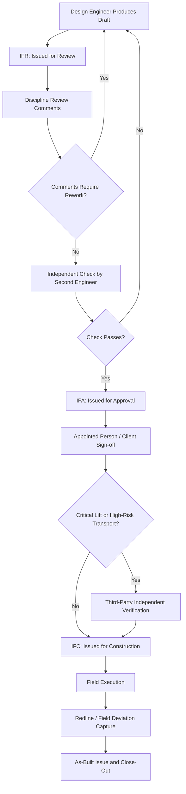

## Engineering Drawing Review and Approval Workflow

### Purpose and Scope

The Engineering Drawing Review and Approval Workflow is the controlled process by which lift studies, rigging arrangements, transport configurations, and structural calculations are checked, verified, and formally authorized before being issued for construction or operational use. In heavy-lift and specialized logistics, this workflow is the primary quality gate preventing an unverified design assumption (incorrect CoG, undersized rigging, an unchecked ground bearing pressure) from reaching the field.

### Document Categories Subject to Review

- **Lift studies/lift plans** — crane selection, load chart verification, rigging arrangement drawings.
- **Rigging general arrangement (GA) drawings** — sling configurations, spreader beam and lifting beam details, shackle/hook schedules.
- **Structural calculations** — lift point capacity checks, spreader beam stress analysis, padeye design verification.
- **Transport configuration drawings** — trailer axle layout, load positioning, tie-down/lashing schematics.
- **Ground bearing and matting layout drawings** — outrigger mat sizing, crane pad design.
- **As-built/redline drawings** — post-execution updates reflecting field deviations from the issued design.

### Standard Review Stages

1. **IFR (Issued for Review)** — initial draft circulated to relevant disciplines and stakeholders for comment; not for construction use.
2. **IFA (Issued for Approval)** — comments incorporated, drawing submitted to the Appointed Person, client representative, or third-party checker for formal sign-off.
3. **IFC (Issued for Construction)** — approved revision released for field execution; this is the only revision status under which work should proceed.
4. **As-Built** — final revision incorporating field changes, closing out the document trail.

[Inference] The exact naming convention (IFR/IFA/IFC vs. alternative labels such as "Draft," "Check," "Approved") varies by company and client procedure; the stage logic itself is broadly consistent across heavy-lift engineering practice.

### Roles in the Review Chain

| Role | Responsibility |
| --- | --- |
| Originator/Design Engineer | Produces initial calculation and drawing |
| Checker | Independently verifies calculations and drawing accuracy (should not be the originator) |
| Discipline Lead/Chief Engineer | Reviews for engineering adequacy and standards compliance |
| Appointed Person (AP) | Approves lift plans specifically for operational safety per BS 7121 or equivalent |
| Client Representative | Reviews against contractual/project specification |
| Third-Party Verifier | Independent review required for critical lifts or high-risk transports |

### Independent Check Requirement

A defining feature of heavy-lift engineering review (distinct from many general engineering workflows) is the **mandatory independent check**: the checker must be someone other than the originator, and for critical lifts, often from outside the originating organization entirely. This addresses the well-documented failure mode where a single engineer's arithmetic or modeling error propagates undetected into a live lift.

The independent check typically re-derives key results from first principles rather than merely reviewing the originator's calculation sheet — for example, independently recalculating sling tension from load geometry rather than checking arithmetic within the originator's spreadsheet.

### Sling Tension Verification Example

**Example:** A 4-leg sling arrangement lifts a 20-tonne load with legs at 60° from horizontal, load evenly distributed. The checker independently verifies leg tension:

$$T_{leg} = \frac{W}{n \times \sin(\theta)} \times k_{load\ factor}$$

where $W$ is total load, $n$ is number of legs assumed to share load (often 3 of 4 legs are assumed load-bearing for a 4-leg sling, due to rigging geometry tolerances), $\theta$ is the sling angle from horizontal, and $k_{load\ factor}$ accounts for uneven load distribution (commonly 1.1-1.25 unless load distribution is precisely known).

$$T_{leg} = \frac{20{,}000 \text{ kg} \times 9.81 \text{ m/s}^2}{3 \times \sin(60°)} \times 1.1 \approx \frac{196{,}200}{2.598} \times 1.1 \approx 83{,}095 \text{ N} \approx 8.47 \text{ t}$$

The checker confirms this figure independently before accepting the originator's sling selection, since an error in the assumed number of load-bearing legs (using 4 instead of 3) would understate leg tension by roughly 25%.

### Workflow Diagram (Mermaid)

### Revision Control Conventions

- **Alphanumeric revision codes** — typically letters (A, B, C...) for pre-IFC drafts and numbers (0, 1, 2...) once IFC status is reached, though conventions vary by company.
- **Title block metadata** — drawing number, revision, date, originator, checker, approver initials, and a revision description table are mandatory fields.
- **Revision clouding** — changed areas on a drawing are marked with a cloud/triangle symbol and revision letter/number so reviewers can quickly locate what changed between revisions without re-checking the entire drawing.
- **Superseded document control** — prior revisions are stamped "SUPERSEDED" or withdrawn from circulation lists to prevent field use of outdated information.

### Drawing Register and Transmittal Tracking

A **Drawing Register** (often maintained in a document control system such as Aconex, ProjectWise, or a structured spreadsheet) tracks:

- Drawing number and title
- Current revision and status (IFR/IFA/IFC/As-Built)
- Originator, checker, approver, and dates for each stage
- Distribution list and transmittal reference numbers
- Comment/response log for each review cycle

This register is the audit trail referenced if an incident investigation later needs to establish which drawing revision was in effect at the time of a lift or transport operation.

### Comment Resolution and Rework Cycle

Review comments are typically classified to drive prioritization:

- **Category 1 (Reject/Major)** — safety-critical or non-compliant issue; drawing cannot proceed to next stage until resolved.
- **Category 2 (Comment/Minor)** — non-critical suggestion or clarification; may be incorporated at originator's discretion or deferred to next revision.
- **Category 3 (Approved as Noted)** — approved with minor annotations the originator must incorporate before IFC issue, without requiring a full re-review cycle.

[Unverified] The specific three-tier categorization above is a common industry convention but is not universally standardized; some clients use two-tier (Reject/Approved) or four-tier schemes, and the applicable scheme should be confirmed against the project's document control procedure.

### Interface with Third-Party Verification Bodies

For critical lifts and high-consequence transports, drawings are often routed to an external verification body (e.g., a classification society for marine heavy-lift, or an independent lift-plan auditor for onshore critical lifts). This external review sits outside the originating organization's internal chain and typically requires:

- Full calculation packages (not just summary drawings)
- Access to underlying load data (weight reports, CoG certificates)
- A formal verification certificate or statement of no-objection before IFC issue

### Common Failure Modes in the Review Workflow

- **Checker fatigue/rubber-stamping** — checker re-reviews originator's work without independently re-deriving results, defeating the purpose of the independent check.
- **Comment loss across revision cycles** — a Category 1 comment from an early review not carried forward and inadvertently dropped in a later revision.
- **Field use of superseded revisions** — site teams working from a printed/cached copy of a drawing that has since been revised, due to inadequate distribution control.
- **Approval bypass under schedule pressure** — informal verbal approval used to start work ahead of formal IFC issue, which removes the traceability the workflow exists to provide.
- **Scope creep between IFR and IFC** — significant design changes introduced after the review cycle has closed, without re-triggering discipline review.

### Digital Document Control Systems

Modern heavy-lift engineering organizations typically use platforms such as ProjectWise, Aconex, or SharePoint-based workflow tools to enforce:

- Automated revision numbering and lock-out of superseded files
- Workflow-gated approval (a drawing cannot be marked IFC until all required approver signatures/digital sign-offs are captured in sequence)
- Full audit trail of who viewed, commented on, or approved each revision

[Inference] The degree of digital workflow enforcement versus reliance on manual/paper-based sign-off varies considerably by company size and project complexity; smaller specialized logistics contractors may still use manual transmittal logs.

**Related Topics:**

- Independent Verification Requirements for Critical Lifts (BS 7121 Part 1)
- Document Control Systems: Aconex, ProjectWise, and Comparable Platforms
- Redline and As-Built Drawing Management
- Third-Party Certification Bodies in Marine Heavy-Lift (DNV, ABS, Lloyd's Register)
- Title Block and Revision Clouding Standards (ISO 7200, company-specific drafting standards)
- Comment Resolution Matrices and Category-Based Prioritization
- Transmittal Logs and Distribution Control
- Field Deviation Capture and Change Management Processes