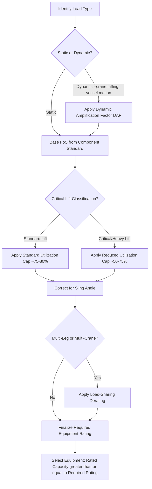

## Factor of Safety Standards in Heavy-Lift Engineering

### Definition and Core Concept

Factor of Safety ($FoS$), also called Safety Factor ($SF$), is the ratio of a component's ultimate (or yield) capacity to the maximum load actually applied to it in service:

$$FoS = \frac{\text{Ultimate Capacity}}{\text{Applied Load}}$$

In heavy-lift and specialized logistics, $FoS$ is not a single universal number — it is a layered set of design and operational margins that account for material variability, dynamic loading, wear, rigging inefficiencies, and human/procedural error. A rigging system engineered to a $5:1$ $FoS$ against Minimum Breaking Load (MBL) is expected to withstand five times its rated Working Load Limit (WLL) before failure — though this margin is a design buffer, not a license to approach it in practice.

### Key Distinctions: WLL, MBL, and SWL

- **Working Load Limit (WLL)**: The maximum load a piece of equipment is designed to lift under normal, controlled conditions. This is the number stamped on the equipment and used for lift planning.
- **Minimum Breaking Load (MBL)**: The load at which the component is certified to fail under laboratory test conditions. $MBL = WLL \times FoS$.
- **Safe Working Load (SWL)**: An older/regional term largely synonymous with WLL, still used in some jurisdictions (notably UK/Commonwealth standards) and in some crane and rigging documentation.

**Key Points**

- $FoS$ is applied *to derive* WLL from MBL, not applied on top of WLL during lift planning.
- Confusing WLL with MBL is one of the most common — and most dangerous — errors in field rigging.

### Standard Factor of Safety Values by Component Type

| Component | Typical FoS (vs. MBL) | Governing Standard(s) |
| --- | --- | --- |
| Wire rope slings | 5:1 | ASME B30.9, EN 13414-1 |
| Synthetic web slings | 5:1 – 7:1 | ASME B30.9, EN 1492-1 |
| Round slings | 7:1 | EN 1492-2 |
| Chain slings (alloy) | 4:1 | ASME B30.9, EN 818-4 |
| Shackles | 5:1 (some rated 6:1) | ASME B30.26, EN 13889 |
| Wire rope (running, on cranes) | 3.5:1 – 5:1 (per DAF, design factor) | ASME B30.5, API 2C |
| Crane structural components | 1.5:1 – 2.25:1 (yield-based) | ASME B30.5, EN 13001 |
| Below-the-hook lifting devices | 3:1 – 5:1 depending on class | ASME BTH-1 |
| Padeyes / lifting lugs (engineered) | 3:1 (yield), 5:1 (ultimate) | DNV-ST-N001, LEEA guidance |
| Spreader bars / lifting beams | 2:1 (yield) minimum, project-specific higher | DNV, ASME BTH-1 |

[Inference] Exact factors vary by manufacturer certification, jurisdiction, and whether the load is static, dynamic, or subject to shock loading — the table above reflects commonly cited industry baselines rather than a single universal code.

### Design Factor vs. Safety Factor

These terms are often used interchangeably but have a technical distinction:

- **Design Factor (DF)**: Applied during the *design* phase, dividing the theoretical ultimate strength by an intended margin to set the rated capacity before manufacturing.
- **Safety Factor (as-tested)**: The *empirical* ratio confirmed by proof testing and destructive testing after manufacture, verifying the design factor was actually achieved in the physical product.

In heavy-lift engineering, both figures should converge closely; a large divergence between them signals either overly conservative design or a manufacturing/testing anomaly requiring investigation.

### Why Heavy-Lift FoS Differs from General Lifting

Standard crane and rigging FoS values (as in general construction) are frequently increased for heavy-lift, superheavy, and critical lifts due to:

1. **Consequence of failure** — heavy-lift loads (transformers, reactors, modules, subsea structures) often carry extreme replacement cost, schedule risk, and life-safety exposure.
2. **Load uncertainty** — irregular geometry, uncertain or estimated center of gravity (CoG), and unverified weight (especially in "as-built" or legacy equipment) reduce confidence in the applied load figure.
3. **Dynamic amplification** — heavy loads under crane luffing, vessel motion (in marine heavy-lift), or wind-induced sway generate dynamic load factors (DLF) that must be added on top of static analysis.
4. **Rigging complexity** — multi-crane lifts, tailing operations, and unequal sling loading (see below) introduce load-sharing uncertainty that erodes the effective margin.

### Critical Lift Practice: Reduced Working Factors

Many heavy-lift operators and standards (e.g., DNV-ST-N001, industry "critical lift" procedures derived from OSHA/ASME guidance) mandate a **reduced utilization** of rated capacity for critical or heavy lifts, independent of the equipment's inherent FoS:

- Standard lift: up to $75\%$–$80\%$ of crane rated capacity commonly used as a planning ceiling.
- Critical/heavy lift: often capped at $50\%$–$75\%$ of rated capacity, sometimes lower for lifts involving personnel, irreplaceable equipment, or hazardous cargo.
- Some marine heavy-lift and offshore standards apply a **Dynamic Amplification Factor (DAF)** multiplier (e.g., $1.10$–$1.30$ depending on sea state and vessel motion) directly to the static load *before* comparing against crane capacity — effectively stacking a second safety layer on top of the equipment's built-in $FoS$.

**Example**

A module weighs 180 t (static). Applying a DAF of 1.15 for marine transport/lift motions:

$$\text{Design Load} = 180 \, t \times 1.15 = 207 \, t$$

If the critical-lift utilization cap is $75\%$ of crane rated capacity, the crane must be rated at minimum:

$$\text{Required Crane Capacity} = \frac{207 \, t}{0.75} = 276 \, t$$

This is separate from, and additional to, the individual sling/shackle FoS values applied when sizing the rigging itself.

### Sling Angle and Effective Capacity Erosion

Factor of safety calculations assume the rated capacity is achieved only under specified conditions — sling angle is a major, frequently mishandled variable. As sling angle from horizontal decreases, tension in each leg increases for the same vertical load:

$$T = \frac{W}{n \times \sin(\theta)}$$

Where $T$ is tension per leg, $W$ is total load, $n$ is number of legs (assuming equal load share), and $\theta$ is the angle from horizontal.

| Angle from Horizontal | Load Multiplier per Leg |
| --- | --- |
| 90° | 1.000 |
| 60° | 1.155 |
| 45° | 1.414 |
| 30° | 2.000 |

At $30°$, each sling leg carries double the tension it would at vertical — a rigger using rated WLL without correcting for angle silently consumes a large portion of the design FoS before the lift even begins.

### Multi-Leg and Multi-Crane Load Sharing

For slings, standards commonly apply a load-sharing derating even at "ideal" symmetric configurations because perfectly equal load distribution across legs cannot be guaranteed in practice:

- **2-leg sling**: rated capacity often calculated assuming only 1.5 legs are effectively sharing load (accounting for the possibility one leg carries more).
- **3-and-4-leg slings**: similarly, only a fraction of the total theoretical capacity (often 3 of 4 legs, conservatively) is credited, since rigid-body statics cannot guarantee equal sharing on a non-rigid or asymmetric load.

For **multi-crane lifts** (tandem or multi-crane picks), an additional load-sharing safety margin is standard practice — many critical-lift procedures require each crane to be rated for a minimum of $110\%$–$125\%$ of its calculated share of the load, since exact real-time load distribution between independently operated cranes cannot be guaranteed and can shift dynamically during the lift.

### Governing Standards Landscape

- **ASME B30 series** (B30.5 – Mobile Cranes, B30.9 – Slings, B30.26 – Rigging Hardware, B30.20/BTH-1 – Below-the-Hook Devices): US-centric prescriptive standards widely referenced globally for FoS baselines.
- **EN 13000 / EN 13001 series**: European crane design standards, covering structural and mechanical FoS via limit-state design methodology rather than a single blanket ratio.
- **DNV-ST-N001** (Marine Operations, General): Widely used in offshore/marine heavy-lift for lift point design, DAF application, and critical lift criteria.
- **LEEA (Lifting Equipment Engineers Association)** guidance: Widely referenced in UK/Commonwealth and international rigging practice, especially for below-the-hook and rigging hardware.
- **API RP 2D**: Offshore pedestal-mounted crane operations, relevant to marine and offshore heavy-lift.
- **OSHA 1926 Subpart CC**: US regulatory floor for crane operations in construction, referencing ASME B30.5 by incorporation.

[Unverified] Exact numeric thresholds in critical-lift utilization percentages vary meaningfully between company internal procedures (e.g., major EPC contractors' lift plan templates) and are not always codified identically across jurisdictions — project-specific lift procedures should be treated as the authoritative source over generic industry figures.

### Factor of Safety Selection Logic (Diagram)

### Common Engineering Pitfalls

- **Conflating WLL with MBL** during quick field capacity checks, effectively erasing the entire design margin.
- **Ignoring sling angle correction**, silently consuming 40–100%+ of the nominal safety margin.
- **Failing to account for CoG uncertainty** on irregular or "as-found" heavy loads, especially decommissioned or legacy equipment lacking reliable weight documentation.
- **Treating DAF and critical-lift utilization caps as optional** on marine or wind-exposed lifts, rather than as independent, stacking requirements on top of component FoS.
- **Using degraded or damaged rigging** at nominal rated capacity — visible wear, corrosion, or prior overload history reduces actual residual capacity below the certified FoS baseline. [Inference] The degree of degradation-driven capacity loss is condition-specific and generally requires inspection-based derating per manufacturer or LEEA guidance rather than a fixed percentage.

### Conclusion

Factor of Safety in heavy-lift engineering functions as a stacked system of margins — component-level design factors, dynamic amplification, critical-lift utilization caps, sling angle correction, and load-sharing derating — rather than a single number applied once. Treating FoS as a static, one-time calculation rather than a compounding chain of corrections is a primary root cause of heavy-lift rigging failures industry-wide.

**Related Topics**

- Dynamic Amplification Factor (DAF) Calculation in Marine Heavy-Lift
- Below-the-Hook Lifting Device Design per ASME BTH-1
- Multi-Crane Lift Planning and Load-Sharing Verification
- Rigging Inspection Criteria and Retirement Thresholds (Wire Rope, Chain, Synthetics)
- Center of Gravity Verification Methods for Irregular Loads
- Critical Lift Plan Documentation Requirements